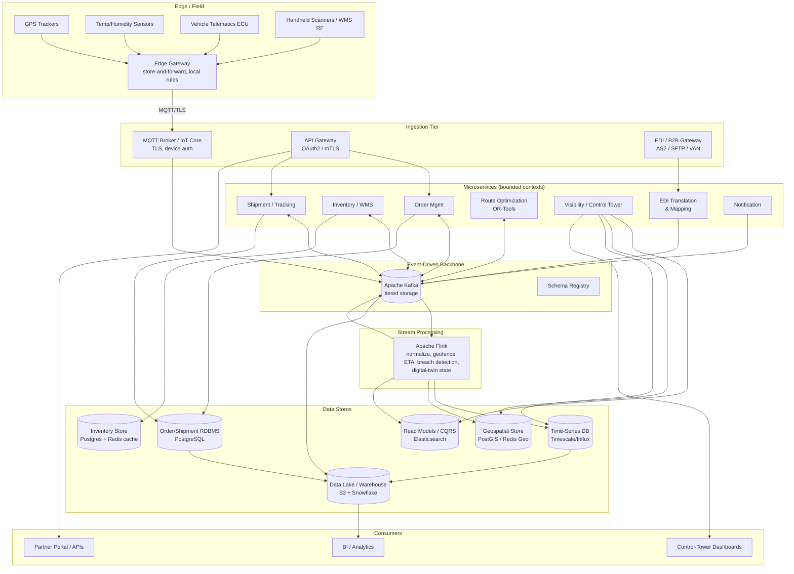
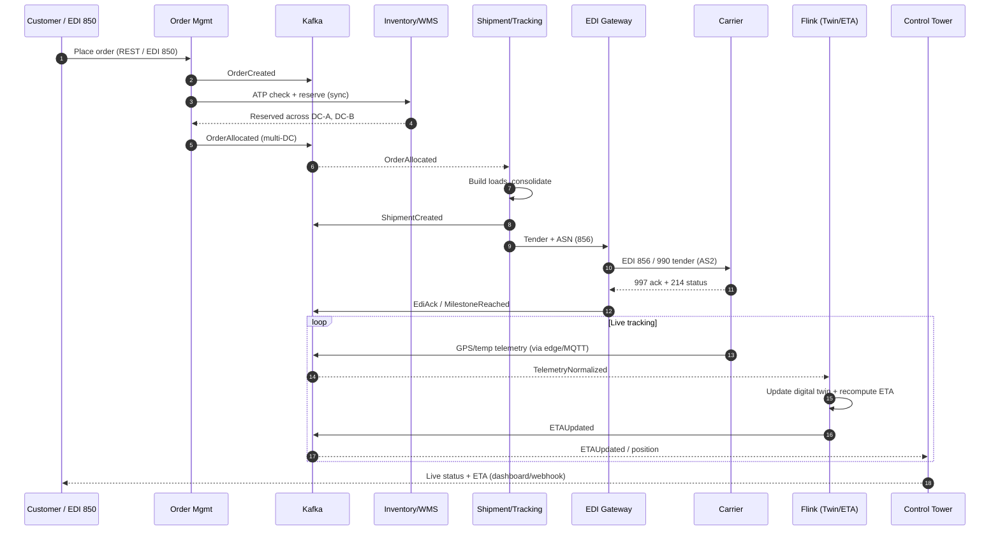
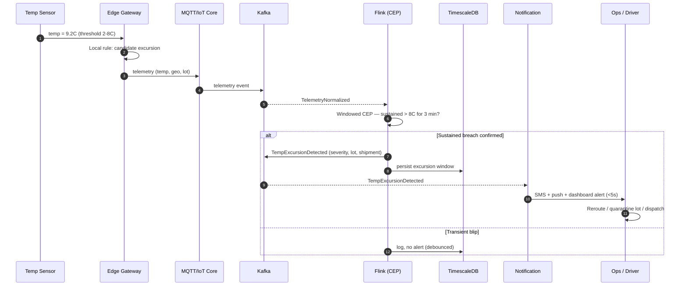

# Enterprise Supply Chain & Logistics Visibility Platform — End-to-End System Design

**Executive Summary.** This document describes the target-state enterprise architecture for a global Supply Chain & Logistics Visibility Platform ("the Platform") operated by a hybrid 3PL/retailer/manufacturer. The Platform unifies multi-warehouse inventory (WMS), order management (OMS), shipment and freight tracking, route optimization, real-time IoT/telemetry ingestion (GPS, temperature, fleet diagnostics), end-to-end supply-chain visibility, and B2B partner integration via EDI (X12/EDIFACT) and modern REST/event APIs. The design is built around an **event-driven backbone** (Apache Kafka) with **stream processing** (Flink) for real-time visibility and **CQRS** for read-optimized dashboards. Telemetry from ~250K IoT devices is ingested via an MQTT/edge tier, normalized, and persisted into a **time-series store** with hot/cold tiering; geospatial state powers live tracking and ETA recalculation, conceptually a **digital twin** of every active shipment. The architecture targets 99.95% availability for core transactional services, sub-second visibility latency, ~50K telemetry events/sec sustained, and regulatory compliance for cold-chain (GDP/FSMA) and trade (customs/EDI). This is intended for review by the architecture review board (ARB) and serves as the controlling reference for downstream domain designs.

---

## Context & Business Requirements

The enterprise operates as a vertically integrated **3PL + retailer + manufacturer**. It manufactures goods (including temperature-sensitive pharmaceutical and food products), warehouses them, fulfills its own retail/e-commerce orders, and provides third-party logistics services to external shippers. This breadth means the Platform must serve internal operations and external customers/partners simultaneously.

**Business actors & scale:**

| Dimension | Scale (target state) |
|---|---|
| Distribution centers / warehouses | 40 DCs across NA, EU, APAC (mix of ambient, refrigerated, frozen) |
| Cross-dock / forward-stocking locations | ~180 |
| Active SKUs | ~2,000,000 |
| Inventory line records (SKU x location x lot) | ~120,000,000 |
| Orders / day (peak) | ~3,000,000 (B2C + B2B + 3PL clients) |
| Shipments / day | ~1,200,000 (consolidated) |
| Owned + contracted fleet vehicles | ~35,000 |
| IoT devices (GPS + temp + telematics + handhelds) | ~250,000 |
| Trading partners (carriers, suppliers, customers) | ~6,500 EDI partners + ~900 API partners |
| Carriers integrated | ~120 (parcel, LTL, FTL, ocean, air) |
| Geographies / time zones | 30+ countries, all major regions |

**Business drivers:**

1. **Real-time visibility** — internal ops and 3PL customers demand "where is my order/truck/pallet right now, and when will it arrive" with live ETA.
2. **Cold-chain integrity** — temperature excursions must be detected within seconds and trigger intervention to avoid spoilage and regulatory non-compliance (Good Distribution Practice, FDA FSMA, EU FMD).
3. **Cost optimization** — route optimization and load consolidation to cut fuel, miles, and detention costs.
4. **Partner interoperability** — legacy partners require EDI X12/EDIFACT; modern partners require REST/webhooks; both must be first-class.
5. **Resilience** — warehouse and on-vehicle operations must degrade gracefully through connectivity loss (edge autonomy).
6. **Auditability** — full event lineage for chargebacks, disputes, customs, and recalls.

**Constraints:** brownfield integration with existing SAP ERP, an incumbent WMS at 12 of 40 DCs, multi-cloud preference (primary AWS, DR secondary), and a 24-month phased rollout.

---

## Functional Requirements

**Inventory / WMS**
- Track on-hand, allocated, in-transit, and available-to-promise (ATP) inventory by SKU, location, lot, serial, and expiry.
- Support receiving, putaway, picking, packing, cycle counts, and inter-DC transfers.
- Multi-warehouse availability aggregation and reservation with optimistic concurrency.

**Order Management (OMS)**
- Capture orders from web, B2B EDI 850, marketplaces, and 3PL client APIs.
- Distributed order promising and sourcing (which DC(s) fulfill which lines).
- Order lifecycle: created → validated → allocated → released → picked → shipped → delivered → closed (with cancel/return paths).

**Shipment & Tracking**
- Create shipments, generate loads, tender to carriers, produce ASN (EDI 856), labels, and BOL.
- Aggregate carrier milestones + own-fleet telemetry into a unified shipment timeline.
- Maintain a live geospatial position and predicted ETA per shipment ("shipment digital twin").

**Route Optimization**
- Daily and dynamic (intra-day) vehicle routing with time windows, capacity, refrigeration constraints, driver hours-of-service.
- Re-optimization on disruption (traffic, breakdown, new urgent order).

**Telemetry / IoT Ingestion**
- Ingest GPS pings, temperature/humidity readings, door open/close, fuel, engine diagnostics (telematics), and handheld scans.
- Edge buffering and store-and-forward through connectivity gaps.

**Visibility / Analytics**
- Real-time control-tower dashboards (KPIs, exceptions, geofence breaches).
- Self-service analytics, demand/lead-time analytics, SLA/chargeback reporting.

**EDI / Partner Integration**
- Inbound/outbound X12 (850, 855, 856, 810, 940, 945, 214, 997) and EDIFACT (ORDERS, DESADV, INVOIC, IFTSTA).
- REST APIs + webhooks + a partner developer portal.

**Notification**
- Multi-channel (email, SMS, push, webhook) alerts for exceptions: temperature breach, delay, exception scans, delivery confirmation.

---

## Non-Functional Requirements

| NFR | Target | Notes |
|---|---|---|
| Core transactional availability (OMS/WMS/Shipment) | 99.95% | ≈ 4.4 h/yr; multi-AZ active-active |
| Visibility/dashboard availability | 99.9% | read-path, CQRS materialized views |
| Telemetry ingestion availability | 99.99% | edge buffering masks cloud outages |
| API p99 latency (read) | < 250 ms | partner & dashboard reads |
| API p99 latency (write/order) | < 600 ms | excludes downstream async work |
| Visibility freshness (telemetry → dashboard) | < 1 s p95, < 3 s p99 | end-to-end stream latency |
| Temperature breach detection latency | < 5 s sensor→alert | regulatory-critical path |
| ETA recompute latency | < 10 s after position update | streaming + model inference |
| Sustained telemetry ingest | 50,000 events/sec | peak burst 120,000/sec |
| Order throughput | 3M orders/day (~35/sec avg, 350/sec peak) | sales/promo spikes |
| EDI processing SLA | inbound 850 acknowledged (997) < 5 min | partner SLA |
| Durability (events) | 99.999999999% | Kafka RF=3 + tiered storage / object store |
| RPO (transactional) | ≤ 1 min | async cross-region replication |
| RTO (transactional) | ≤ 15 min | automated regional failover |
| RPO/RTO (telemetry) | RPO ≤ 0 at edge / RTO ≤ 5 min cloud | edge store-and-forward |
| Compliance | SOC 2 Type II, GDP, FDA FSMA, ISO 27001, GDPR, customs/AES | data residency per region |
| Security | mTLS internal, OAuth2/OIDC external, encryption at rest (KMS), field-level encryption for PII | zero-trust posture |
| Data retention (hot telemetry) | 30 days hot | sub-second query |
| Data retention (cold telemetry) | 7 years cold (compliance) | object store / Parquet |

---

## Capacity / Scale Estimates

**Telemetry ingestion (the dominant load):**

- 250,000 devices. Mix of reporting cadences:
  - ~35,000 vehicles: GPS @ 1 ping/10s + telematics @ 1/30s ≈ 0.13 evt/s each → ~4,600 evt/s.
  - ~120,000 temperature sensors (reefers/totes/pallets): 1 reading/30s → ~4,000 evt/s.
  - ~80,000 handheld/scanner + door/asset sensors: bursty, avg ~0.05 evt/s → ~4,000 evt/s.
  - Headroom / sub-second GPS during active delivery windows pushes sustained design point to **~50,000 evt/s**, with **peak bursts to ~120,000 evt/s** during morning fleet dispatch across overlapping time zones.

- **Event size:** avg ~400 bytes normalized (envelope + payload).
- **Ingest bandwidth:** 50,000 × 400 B ≈ 20 MB/s sustained (~160 Mbps); peak ~48 MB/s.
- **Daily telemetry events:** 50,000 × 86,400 ≈ **4.32 billion events/day**.
- **Raw daily volume:** 4.32B × 400 B ≈ **1.7 TB/day raw**; compressed (~5:1 columnar) ≈ **0.35 TB/day**.
- **Hot tier (30 days):** ~10 TB compressed in time-series store (with downsampled rollups much smaller).
- **Cold tier / year:** ~125 TB/year compressed Parquet in the data lake; **7-year retention ≈ ~0.9 PB** (downsampling for old data reduces this materially).

**Transactional:**

- 3M orders/day → avg 35 orders/s, peak ~350/s. Each order avg 4 lines → ~12M order lines/day.
- 1.2M shipments/day; each shipment emits ~15 milestone/status events → ~18M shipment events/day.
- Inventory mutations: receipts + picks + adjustments ≈ ~25M/day.
- Order/shipment relational storage growth: ~3–5 KB/order incl. lines + history → ~12–18 GB/day → ~5 TB/yr (pre-archival).

**EDI:**

- 6,500 EDI partners; ~2M EDI documents/day (850/855/856/810/214/997 etc.), avg ~6 KB → ~12 GB/day documents.

**Kafka backbone sizing:**

- Total event throughput (telemetry + transactional + EDI-derived) ≈ 55–60K msg/s sustained.
- With RF=3 and 7-day broker retention before tiered offload: ~1.7 TB/day × 3 ≈ 5 TB/day on brokers → cluster sized ~40–60 TB usable, plus tiered storage to S3 for long retention.
- Partitioning: telemetry topics keyed by `device_id` (256–512 partitions) for ordered per-device streams; order/shipment topics keyed by `order_id`/`shipment_id`.

**Compute (stream processing):**

- Flink: ~50K evt/s with stateful keyed processing (geofencing, ETA windows, breach detection). Sized at ~30–50 task slots, scaling to ~120 at burst, with RocksDB state backend (~hundreds of GB keyed state for active shipments/digital twins).

---

## High-Level Architecture



---

## Core Components / Services

The system is decomposed into bounded contexts, each owning its data and communicating asynchronously over Kafka (with synchronous APIs only where a request/response contract is required).

| Bounded Context | Responsibility | Primary Store | Key Events (produced/consumed) | Sync API |
|---|---|---|---|---|
| Inventory / WMS | On-hand, allocated, ATP, lot/expiry, receiving/putaway/pick | PostgreSQL + Redis cache | `InventoryReserved`, `InventoryAdjusted`, `GoodsReceived` | ATP query, reserve |
| Order Management | Order capture, validation, sourcing/promising, lifecycle | PostgreSQL | `OrderCreated`, `OrderAllocated`, `OrderReleased`, `OrderCancelled` | Create/get order |
| Shipment / Tracking | Loads, tendering, ASN, milestone aggregation, live ETA twin | PostgreSQL + Geo + TSDB | `ShipmentCreated`, `ShipmentTendered`, `MilestoneReached`, `ETAUpdated`, `DeliveryConfirmed` | Track shipment |
| Route Optimization | VRP solve (capacity, time windows, HOS, reefer), re-opt | Postgres + in-mem solver | `RoutePlanned`, `RouteReoptimized` | Plan/solve route |
| Telemetry / IoT Ingestion | Device auth, decode, normalize, dedupe, store-and-forward | TSDB (hot), Lake (cold) | `TelemetryNormalized`, `GeofenceBreached`, `TempExcursionDetected` | n/a (stream) |
| Visibility / Analytics | Control tower, exceptions, CQRS read models, KPIs | Elasticsearch + Geo | consumes most events | Search/query |
| EDI / Partner Integration | X12/EDIFACT translate/validate, AS2/VAN/SFTP, partner APIs | Doc store + RDBMS | `EdiReceived`, `EdiTranslated`, `EdiAck(997)` | Partner REST/webhooks |
| Notification | Channel routing, templating, dedupe, escalation | Postgres + queue | consumes exception events | Subscription mgmt |

**Design notes per context:**

- **Inventory/WMS** uses optimistic concurrency + reservation tokens; hot ATP reads served from Redis, authoritative writes in Postgres. Emits events so OMS/visibility stay consistent without synchronous coupling.
- **Shipment/Tracking** maintains the **digital twin**: a stateful Flink keyed-by-`shipment_id` aggregate combining last-known position (geo), temperature profile (TSDB), carrier milestones, and a predicted ETA. The twin is the single source of truth for "where is it / when will it arrive."
- **Route Optimization** is a **buy-leaning-with-build** component: Google OR-Tools for the solver core, wrapped in a domain service that injects business constraints. Long solves run async; results published as events.
- **EDI** isolates the messy B2B world behind an anti-corruption layer: raw documents are archived immutably, translated to canonical domain events, and 997/CONTRL acknowledgments are auto-generated.

---

## Data Architecture

A **polyglot persistence** strategy maps each access pattern to the right store rather than forcing one database to do everything.

| Store | Technology | Why | Access pattern |
|---|---|---|---|
| Inventory store | PostgreSQL + Redis | Strong consistency for reservations; cache for hot ATP | OLTP, high-read |
| Order/Shipment RDBMS | PostgreSQL (partitioned) | Relational integrity, lifecycle, audit | OLTP, range scans by date |
| Time-series DB | TimescaleDB (primary) / InfluxDB (alt) | Massive append-only telemetry, downsampling, retention policies | Time-range, per-device |
| Geospatial store | PostGIS + Redis Geo | Geofencing, nearest-vehicle, live position, spatial joins | Spatial queries, live read |
| Read models (CQRS) | Elasticsearch / OpenSearch | Fast faceted search & dashboards over denormalized views | Search, aggregations |
| Data lake / warehouse | S3 (Parquet) + Snowflake | Cheap long-term storage + analytics/BI/ML | Batch, columnar scans |
| Event log | Kafka (tiered storage) | Durable ordered backbone, replay, event sourcing | Stream |

**Why CQRS:** the write models (OMS, WMS, Shipment) are normalized and consistency-focused; the read side (control tower, partner tracking, KPIs) needs denormalized, query-optimized projections. Flink builds and maintains these projections in Elasticsearch/Geo from the event stream, decoupling read scaling from write scaling.

### Schema sketches

**Order / Shipment (PostgreSQL, partitioned by created_at month):**

```sql
CREATE TABLE orders (
  order_id        BIGINT PRIMARY KEY,
  partner_id      BIGINT,
  channel         TEXT,            -- web|edi850|marketplace|3pl_api
  status          TEXT,            -- created|allocated|released|shipped|delivered|closed
  promised_at     TIMESTAMPTZ,
  created_at      TIMESTAMPTZ NOT NULL
) PARTITION BY RANGE (created_at);

CREATE TABLE order_lines (
  order_id BIGINT, line_no INT, sku TEXT, qty INT,
  source_dc TEXT, lot TEXT, PRIMARY KEY (order_id, line_no)
);

CREATE TABLE shipments (
  shipment_id   BIGINT PRIMARY KEY,
  order_id      BIGINT,
  carrier_scac  TEXT,
  mode          TEXT,              -- parcel|ltl|ftl|ocean|air
  status        TEXT,
  origin_dc     TEXT,
  dest_geohash  TEXT,
  predicted_eta TIMESTAMPTZ,
  created_at    TIMESTAMPTZ
);
```

**Telemetry (TimescaleDB hypertable, partitioned by time + device hash):**

```sql
CREATE TABLE telemetry (
  time        TIMESTAMPTZ   NOT NULL,
  device_id   TEXT          NOT NULL,
  shipment_id BIGINT,
  metric      TEXT          NOT NULL,  -- gps|temp|humidity|door|fuel|rpm
  lat         DOUBLE PRECISION,
  lon         DOUBLE PRECISION,
  value       DOUBLE PRECISION,
  unit        TEXT,
  quality     SMALLINT
);
SELECT create_hypertable('telemetry','time',
  partitioning_column => 'device_id', number_partitions => 64,
  chunk_time_interval => INTERVAL '6 hours');
```

**Inventory (PostgreSQL):**

```sql
CREATE TABLE inventory (
  dc_id TEXT, sku TEXT, lot TEXT, expiry DATE,
  on_hand INT, allocated INT, in_transit INT,
  available INT GENERATED ALWAYS AS (on_hand - allocated) STORED,
  version BIGINT,                       -- optimistic concurrency
  PRIMARY KEY (dc_id, sku, lot)
);
```

### Time-series partitioning, retention & tiering

- **Chunking:** 6-hour hypertable chunks, space-partitioned by `device_id` hash (64 partitions) for parallel writes and pruned reads.
- **Continuous aggregates:** pre-computed 1-min / 1-hour rollups (min/max/avg temp, distance traveled) materialized incrementally — dashboards read rollups, not raw points.
- **Hot tier (30 days):** raw + rollups on fast NVMe, sub-second queries; powers control tower and recent shipment twin history.
- **Warm tier (30–180 days):** compressed columnar chunks, slower queries acceptable.
- **Cold tier (180 days – 7 years):** offloaded to S3 Parquet via the data lake; queried through Snowflake/Athena for compliance, recalls, and ML training. Old raw points are downsampled (e.g., 1 reading/5min) to control cost while preserving excursion fidelity.
- **Retention policies** automate chunk drop on the hot tier after offload is confirmed.

---

## Key Workflows

### Workflow 1 — Order → multi-warehouse allocation → shipment → EDI tender → live tracking → ETA



### Workflow 2 — Cold-chain temperature breach: sensor → detection → alert → intervention



The Flink CEP debounce (sustained breach over a window rather than a single reading) avoids alert storms from door-open transients while still meeting the < 5s detection SLA for genuine excursions.

---

## Cross-Cutting Concerns

**Security (zero-trust):**
- Device identity via X.509 certs + per-device MQTT credentials; rotation and revocation lists.
- Internal service-to-service over **mTLS**; external partner APIs via **OAuth2/OIDC** + scoped tokens; EDI over **AS2** (signed/encrypted) or SFTP.
- Encryption at rest via cloud KMS; **field-level encryption** for PII (consignee details) and tokenization where possible.
- RBAC/ABAC for multi-tenant 3PL isolation — partner data segregation enforced at the read-model and API layers.
- Full audit log of EDI documents and order/shipment state transitions (immutable, append-only).

**HA / DR:**
- Multi-AZ active-active for stateless services; Kafka RF=3 across AZs with `min.insync.replicas=2`.
- Cross-region async replication of RDBMS (logical) and object-store (CRR). **RPO ≤ 1 min, RTO ≤ 15 min** for transactional core.
- Telemetry path: **edge store-and-forward gives RPO ≈ 0** at the device — events buffer locally (hours of capacity) and replay on reconnect; cloud RTO ≤ 5 min.
- DR runbooks automated via IaC; quarterly game-day failover tests.

**Observability:**
- Distributed tracing (OpenTelemetry) across sync + async hops (trace context propagated through Kafka headers).
- Metrics (Prometheus/Grafana) on consumer lag, ingest rate, breach-detection latency, ETA error.
- Centralized logging; SLO dashboards tied directly to the NFR table.
- **Consumer lag** on telemetry topics is a primary health signal — alarms before visibility freshness SLA is at risk.

**Edge / connectivity resilience:**
- Edge gateways run local rules (candidate breach detection, geofencing) so safety-critical detection survives cloud disconnects.
- Store-and-forward with at-least-once delivery + idempotent ingestion (dedupe on `device_id + seq`).

**Stream processing scaling & backpressure:**
- Flink parallelism keyed by `device_id` / `shipment_id`; autoscaling on lag + CPU.
- **Backpressure** handled natively by Flink (credit-based flow control) and absorbed upstream by Kafka's durable log — the broker is the shock absorber. If consumers fall behind, data is retained, not dropped; bursts (120K/s) drain after the spike.
- Telemetry topics partitioned for parallelism; rebalances minimized via sticky assignment.

**Data retention / tiering:** as detailed in Data Architecture — hot (30d) / warm (180d) / cold (7y), with downsampling and compliance holds for recall/audit.

---

## Key Trade-offs & Decisions

| Decision | Chosen Approach | Alternative | Rationale |
|---|---|---|---|
| Processing paradigm | **Stream-first** (Flink) for visibility/ETA/breach; batch for analytics | Pure batch / micro-batch | Sub-second freshness and < 5s breach SLA are unachievable with batch; batch retained where latency is irrelevant (BI). |
| Time-series store | **TimescaleDB** (Postgres ecosystem, SQL, geo via PostGIS) | InfluxDB / Cassandra | SQL + relational joins + PostGIS in one engine; easier hiring; InfluxDB strong but weaker joins/geo. Influx kept as a documented alternative. |
| Edge vs cloud processing | **Hybrid** — safety rules at edge, heavy analytics in cloud | All-cloud | All-cloud fails on connectivity loss and adds latency to breach detection; pure-edge can't do fleet-wide optimization. |
| Partner integration | **Both EDI and API**, behind a canonical event model | EDI-only / API-only | 6,500 legacy partners mandate EDI; modern partners need APIs/webhooks. Anti-corruption layer normalizes both. |
| Route optimization | **Buy core (OR-Tools), build constraints/orchestration** | Full build / full COTS TMS | Solver math is commodity and hard to beat; differentiation is domain constraints + integration, so wrap not replace. |
| Communication style | **Event-driven default**, sync only for must-have request/response (ATP, order create) | Request/response everywhere | Async decoupling enables independent scaling, resilience, replay; sync reserved where the caller truly needs an immediate answer. |
| Read scaling | **CQRS** read models (Elasticsearch/Geo) | Read replicas of OLTP only | Dashboard/search/aggregation patterns differ sharply from OLTP; materialized views scale reads without taxing write stores. |
| Inventory consistency | **Strong (optimistic concurrency) in Postgres**, eventual everywhere else | Eventual consistency for inventory | Overselling is a hard business error; reservations need strong consistency. Visibility tolerates eventual consistency. |
| Delivery guarantee | **At-least-once + idempotent consumers** | Exactly-once everywhere | Exactly-once is costly at 50K/s; idempotency keys give equivalent correctness cheaply for telemetry. EOS used only for financial/EDI paths. |

---

## Tech Stack

| Layer | Technology | Purpose |
|---|---|---|
| Edge / device | MQTT (Sparkplug B), AWS IoT Greengrass / custom edge gateway | Device messaging, store-and-forward, local rules |
| Ingestion | AWS IoT Core / EMQX (MQTT broker), Kong/Apigee API Gateway | Device auth, protocol bridging, API edge |
| B2B / EDI | IBM Sterling / Cleo / OpenText (AS2, VAN), custom mapping svc | X12/EDIFACT translation, partner connectivity |
| Event backbone | Apache Kafka (MSK) + Schema Registry (Avro/Protobuf) + tiered storage | Durable event log, replay, decoupling |
| Stream processing | Apache Flink (managed/Kinesis Data Analytics), Flink CEP | Normalization, geofencing, ETA, breach detection, twin |
| Microservices | Java/Spring Boot + Go, gRPC/REST, Kubernetes (EKS) | Bounded-context services |
| Route optimization | Google OR-Tools (VRP), OSRM/Valhalla for routing/ETA, GraphHopper | Vehicle routing, distance/time matrices |
| Inventory/Order DB | PostgreSQL (Aurora), Redis (ElastiCache) | OLTP + caching |
| Time-series | TimescaleDB (alt: InfluxDB) | Telemetry storage, rollups, retention |
| Geospatial | PostGIS, Redis Geo | Geofencing, live position, spatial queries |
| Read models / search | Elasticsearch / OpenSearch | CQRS projections, dashboards, search |
| Data lake / warehouse | S3 (Parquet) + Snowflake + dbt + Spark/EMR | Analytics, BI, ML feature pipelines |
| Visualization | Grafana (ops), custom React control tower, Mapbox/deck.gl | Dashboards, live maps |
| Notification | Twilio (SMS), FCM/APNs (push), SES, webhook dispatcher | Multi-channel alerts |
| Observability | OpenTelemetry, Prometheus, Grafana, ELK, Jaeger | Tracing, metrics, logs |
| Security / IAM | Keycloak/Okta (OIDC), HashiCorp Vault, AWS KMS, SPIFFE/SPIRE (mTLS identity) | AuthN/Z, secrets, encryption |
| Platform / IaC | Kubernetes (EKS), Terraform, ArgoCD, Istio (service mesh) | Deployment, GitOps, mesh/mTLS |

---

*Document owner: Principal Enterprise Architect. Status: For ARB review. This design is the controlling reference for downstream domain-level designs (WMS, OMS, Telemetry, EDI).*
