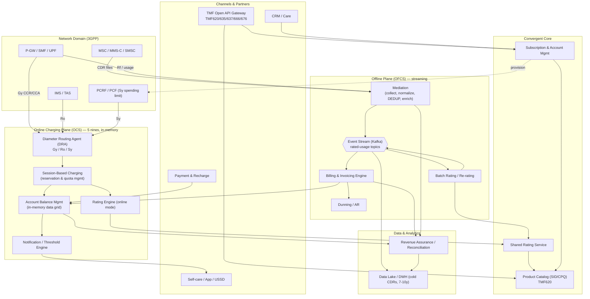
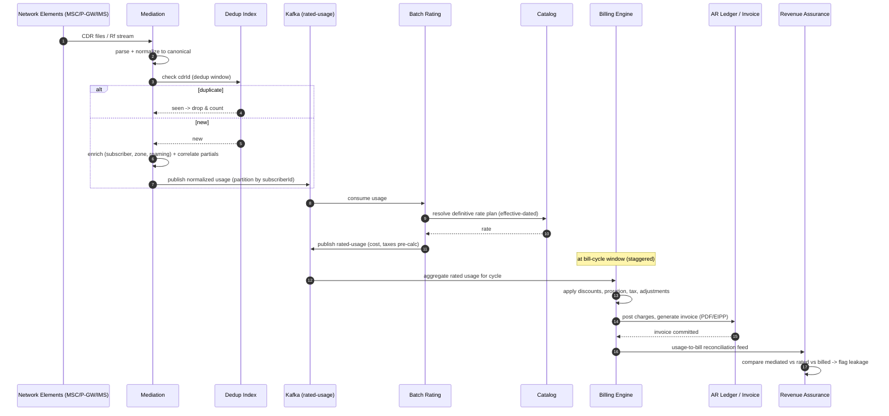

# Enterprise Architecture Scenario: Convergent Telecom Billing & Charging System

> A principal-architect-level, end-to-end reference design for a nationwide **Convergent Charging & Billing platform** serving prepaid (real-time, balance-managed) and postpaid (CDR-mediated, invoiced) subscribers across mobile, fixed, and IoT lines of business. Aligned to **3GPP** charging architecture (OCS/OFCS, Diameter Gy/Ro) and **TM Forum** frameworks (SID, eTOM, Open APIs).

---

## Context & Business Requirements

A Tier-1 mobile network operator ("the Operator") runs two siloed legacy stacks: a vendor prepaid IN (Intelligent Network) platform and a postpaid billing system from a separate vendor. This causes:

- **No convergence**: a subscriber cannot hold one balance usable across prepaid airtime, postpaid data add-ons, and family-shared bundles.
- **Slow product launch**: introducing a new tariff or bundle requires 6–10 weeks of vendor configuration and a release window.
- **Revenue leakage**: CDR mediation gaps, duplicate charging, and reconciliation breaks cost an estimated 1–3% of billed revenue.
- **5G / IoT pressure**: network slicing, edge, and massive IoT device fleets demand per-event, low-latency charging at volumes the legacy IN cannot sustain.

### Business goals

| # | Goal | Success measure |
|---|------|-----------------|
| B1 | **Convergent charging** — single balance & wallet across pre/postpaid | One real-time balance store; cross-product redemption |
| B2 | **Real-time prepaid control** | Sub-50 ms charging decision; zero negative-balance fraud |
| B3 | **Catalog-driven agility** | New product/tariff live in < 1 day, no code deploy |
| B4 | **Accurate postpaid invoicing** | < 0.1% billing dispute rate; auditable rating |
| B5 | **Plug revenue leakage** | End-to-end CDR reconciliation, dedup, < 0.05% loss |
| B6 | **Scale for 5G + IoT** | 100M+ subscribers, 1M+ charging TPS peak |
| B7 | **Carrier-grade availability** | 99.999% for online charging path |

### Stakeholders & reference platforms

Product/Marketing (offer design), Finance/Revenue Assurance, Care/CRM, Network Engineering (PCF/SMF/P-GW, IMS), Regulatory/Compliance, and Security. Commercial reference points for this class of system include **Ericsson Charging (BSCS/ECE)**, **Amdocs Charging / CES**, **Netcracker BSS**, **Oracle BRM (Billing & Revenue Management)**, **Huawei CBS**, and **MATRIXX Digital Commerce** (in-memory convergent charging).

---

## Functional Requirements

| ID | Requirement |
|----|-------------|
| F1 | **Online Charging (OCS)** — real-time authorization, reservation, and debit of units (money/volume/time) via Diameter **Gy** (and Sy for spending limits, Ro for IMS) before/while service is consumed. |
| F2 | **Offline Charging (OFCS)** — collect, mediate, and rate usage records (CDRs) **after** the fact for postpaid invoicing via Diameter **Rf**/file feeds. |
| F3 | **Rating Engine** — convert raw usage (seconds, bytes, events, SMS) into monetary or unit cost using tariffs, rate plans, time-of-day, location/zone, roaming, and discount rules. |
| F4 | **Mediation** — ingest CDRs from network elements (P-GW/SMF, MSC, IMS, MMS-C), normalize, **deduplicate**, enrich, correlate, and filter before rating. |
| F5 | **Balance Management** — multi-bucket wallets (main monetary, promotional, data MB, voice minutes, SMS), validity windows, priorities, rollover, threshold notifications. |
| F6 | **Product Catalog (CPQ)** — offers, products, price plans, bundles, policies; versioning, effective dating, eligibility rules (TM Forum **SID** product/catalog domains). |
| F7 | **Subscription Management** — lifecycle (activate, suspend, resume, plan change, terminate), provisioning hooks to the network (PCRF/PCF, HSS/UDM). |
| F8 | **Invoicing & Billing** — bill cycle runs, charge aggregation, taxes, adjustments, proration, PDF/EIPP generation, dunning. |
| F9 | **Payments & Recharge** — top-ups (voucher, card, wallet, partner), AR posting, payment reconciliation. |
| F10 | **Notifications** — USSD/SMS/push for low balance, threshold breach, recharge confirmation. |
| F11 | **Revenue Assurance & Reconciliation** — usage-to-bill traceability, leakage detection, dispute handling. |
| F12 | **Open APIs** — TM Forum Open APIs (TMF620 Product Catalog, TMF635 Usage, TMF637 Product Inventory, TMF666 Account, TMF676 Payment) for omnichannel/partner consumption. |

## Non-Functional Requirements

| Dimension | Requirement |
|-----------|-------------|
| **Availability** | **99.999%** ("five nines", ~5.3 min/yr downtime) for the online charging (Gy) path; 99.95% for batch invoicing. Active-active multi-DC. |
| **Latency** | Charging authorization decision **p99 < 50 ms**, **p999 < 100 ms** end-to-end at the OCS (excluding network RTT). Catalog lookups served from cache < 5 ms. |
| **Throughput** | **1,000,000+ charging TPS** at peak (Diameter CCR/CCA); mediation ingest **500,000+ CDRs/sec** sustained, 2–3× burst. |
| **Consistency** | Balance debit must be **strongly consistent & idempotent** — no double-charge, no negative balance, exactly-once monetary effect. Catalog/inventory may be eventually consistent. |
| **Durability** | Zero loss of rated/charged events. Every monetary mutation is journaled (write-ahead) and replicated synchronously within a region. |
| **Compliance** | **SOX** (financial controls, audit trail), **PCI-DSS** (card data isolation/tokenization), **GDPR/PII** (data minimization, right-to-erasure on closed accounts), local telecom regulator (lawful intercept boundaries, tariff transparency), **TM Forum** conformance. |
| **Security** | mTLS on all internal Diameter/HTTP; secrets in vault; RBAC + ABAC; tamper-evident audit log; encryption at rest (TDE) and in transit. |
| **Scalability** | Horizontal scale-out of stateless rating/mediation; partitioned (sharded) balance store keyed by subscriber. |
| **Recoverability** | RPO ≤ 0 (sync replication) intra-region for balances; RPO ≤ 5 min cross-region; RTO ≤ 60 s for online path failover. |

---

## Capacity / Scale Estimates

Assumptions for a national operator.

| Parameter | Value |
|-----------|-------|
| Total subscribers | **100,000,000** (60M prepaid, 35M postpaid, 5M IoT/M2M) |
| Active sessions (busy hour) | ~25M concurrent data/voice sessions |
| Avg charging events / subscriber / day | 40 (voice legs, data quota grants, SMS, events) |
| **Daily charging events** | 100M × 40 ≈ **4 billion events/day** |
| Average charging TPS | 4e9 / 86,400 ≈ **~46,000 TPS** |
| **Busy-hour peak multiplier** | ~8× average → **~370,000 TPS sustained**, provision for **1,000,000 TPS** burst headroom |
| Diameter Gy CCR-Update interval | every 60–300 s per active data session → reservation churn dominates volume |
| **CDR mediation volume** | ~6 billion raw CDRs/day → **~70,000 CDRs/sec avg**, **500,000+/sec peak** |
| CDR average size (post-normalization) | ~1.5 KB → ~9 TB/day raw mediation stream |
| Balance store entries | 100M subscribers × ~6 buckets ≈ **600M balance objects**, each updated frequently |
| Balance store hot footprint | ~600M × ~2 KB ≈ **~1.2 TB** in-memory (sharded across grid) |
| Postpaid bill cycles | 30 cycles (daily staggered), ~1.2M bills/cycle, **~35M invoices/month** |
| Catalog objects | ~50k products/offers/prices, versioned; effective-dated |
| Event retention (hot) | 90 days online queryable; 7–10 yrs cold (regulatory/SOX) in object store |
| Peak top-ups | ~3,000 recharges/sec (paydays, promo events) |

**Sizing implication**: the online charging path is the dominant cost driver. The in-memory balance grid must sustain ~1M reads + ~400k writes/sec at peak with single-digit-ms latency, which forces a **partitioned, replicated in-memory data grid** rather than a disk-first RDBMS on the hot path.

---

## High-Level Architecture

The platform separates the **real-time online plane** (latency-critical, in-memory, strongly consistent) from the **offline/batch plane** (high-throughput streaming mediation and invoicing). A shared **Product Catalog** and **Rating Engine** drive both planes ("convergent" — one catalog, one balance, one rater).



---

## Core Components / Services (Bounded Contexts)

| Bounded Context | Responsibility | Plane | Notes |
|-----------------|----------------|-------|-------|
| **Diameter Routing Agent (DRA)** | Front-door for Gy/Ro/Sy; load-balances and routes Diameter Credit-Control to OCS nodes; overload protection | Online | Stateful peer mgmt; sticky routing by Session-Id |
| **Session-Based Charging (SBC)** | Manages charging sessions, **unit reservation** (Multiple-Services-Credit-Control), quota grant/return, session correlation | Online | Holds session state; reservation = "soft hold" against balance |
| **Account & Balance Management (ABM)** | Authoritative balance store; atomic debit/credit; multi-bucket wallets; validity & priority rules | Online | In-memory data grid, sharded by subscriber, sync-replicated |
| **Rating Service (shared)** | Pure rating function: (usage + tariff + context) → cost in units/money; stateless | Both | Used in online (estimate/charge) and batch (definitive) modes |
| **Product Catalog (CPQ)** | Offers, products, price plans, bundles, discounts, eligibility; versioning & effective dating | Core | TM Forum **SID** + TMF620; source of truth for pricing |
| **Subscription & Account Mgmt** | Account hierarchy, subscriptions, lifecycle state machine, provisioning orchestration | Core | Hierarchy: Customer → Account → Subscription → Service |
| **Mediation** | Collect CDRs (file/stream), parse, normalize to canonical model, **dedup**, enrich (subscriber/zone lookup), correlate partial CDRs, filter | Offline | The leakage-prevention chokepoint |
| **Batch Rating / Re-rating** | Apply definitive rates to mediated usage; supports re-rating after tariff corrections | Offline | Idempotent; replayable from Kafka |
| **Billing & Invoicing** | Bill cycle execution, charge aggregation, proration, tax, adjustments, invoice rendering (PDF/EIPP) | Offline | Staggered cycles; AR ledger |
| **Payment & Recharge** | Vouchers, cards (PCI-isolated), wallet, partner top-ups; reconciliation | Both | Triggers balance credit in ABM |
| **Notification Engine** | Threshold/low-balance/recharge events → SMS/USSD/push | Online | Drains from ABM threshold events |
| **Revenue Assurance** | Usage-to-bill reconciliation, dedup audit, leakage analytics, dispute support | Data | Reads all planes; flags breaks |
| **Open API Gateway** | TMF-conformant external surface; auth, throttling, partner contracts | Edge | TMF620/635/637/666/676 |

---

## Data Architecture

Polyglot persistence — the right store per access pattern, because the online and offline planes have opposite characteristics (low-latency point mutations vs. high-throughput append/scan).

| Data | Store | Why |
|------|-------|-----|
| **Live balances / wallets** | **In-memory data grid** (Apache Ignite / GridGain, or MATRIXX in-memory engine) sharded by subscriber, with synchronous backup + write-behind to disk | Single-digit-ms atomic debit/credit at 1M TPS; partitioned affinity keeps a subscriber's buckets + sessions co-located on one node for transactional locality |
| **Charging session state** | Same grid, co-located with the subscriber's balance partition | Reservation logic must atomically read+hold against balance with no cross-node txn |
| **Balance journal (WAL)** | Append-only event log (Kafka topic `balance-mutations`, compacted) + RDBMS journal | Durable, replayable audit of every monetary mutation; basis for recovery & SOX |
| **Mediated & rated usage events** | **Apache Kafka** (partitioned by subscriber/CDR-key), tiered storage | High-throughput durable backbone; dedup via key + log compaction; replay for re-rating |
| **CDR dedup index** | RocksDB / Redis set keyed by globally-unique CDR-ID + sliding window | O(1) duplicate detection at ingest line rate |
| **Product Catalog** | **PostgreSQL** (relational, effective-dated) + Redis read cache | Complex relational pricing model; cache for < 5 ms catalog lookups on hot path |
| **Subscription / Account inventory** | PostgreSQL (or Oracle) with read replicas | Strong relational integrity for account hierarchy & lifecycle |
| **Invoices / AR ledger** | PostgreSQL / Oracle (financial-grade, ACID) | SOX-grade financial records; double-entry AR |
| **Cold CDR archive** | Object store (S3 / MinIO / HDFS) in Parquet, lifecycle to Glacier | 7–10 yr regulatory retention at low cost; queryable via Trino/Athena |
| **Analytics / DWH** | Snowflake / BigQuery / Spark on data lake | Revenue assurance, churn, usage analytics |
| **Card data** | PCI-DSS tokenization vault (isolated CDE) | Card PAN never enters the charging plane; only tokens |

### Schema sketch — balance & wallet (in-memory grid, co-located by subscriber key)

```text
Wallet (partitionKey = subscriberId)
  subscriberId        : string  (affinity / shard key)
  accountId           : string
  status              : ACTIVE | SUSPENDED | CLOSED
  buckets             : [ BalanceBucket ]

BalanceBucket
  bucketId            : string
  type                : MONETARY | DATA_MB | VOICE_MIN | SMS | PROMO
  amount              : decimal           -- current available
  reserved            : decimal           -- soft-held by active sessions
  priority            : int               -- consumption order (promo before main)
  validFrom / validTo : timestamp         -- validity window
  rolloverPolicy      : enum

ChargingSession (co-located with Wallet)
  sessionId           : string  (Diameter Session-Id)
  ratingGroup         : int
  reservedUnits       : long
  grantedQuota        : long
  lastUpdate          : timestamp
  state               : OPEN | TERMINATING
```

### Schema sketch — product catalog (PostgreSQL, effective-dated, TM Forum SID-aligned)

```text
product_offering(id, name, status, valid_from, valid_to, version)
product_spec(id, name, type)               -- e.g. DATA_BUNDLE, VOICE_PLAN
price_plan(id, offering_id, currency, billing_period)
rate(id, price_plan_id, usage_type, unit, tier_from, tier_to,
     unit_price, tod_profile, zone, roaming_flag, valid_from, valid_to)
discount(id, scope, type[PERCENT|FIXED], value, eligibility_rule, priority)
bundle_component(bundle_id, product_spec_id, allowance, validity_days)
eligibility_rule(id, expr)                  -- e.g. segment=YOUTH AND region=NORTH
```

CDR canonical (post-mediation) record carries: `cdrId` (global unique, for dedup), `subscriberId`, `usageType`, `startTime`, `volume/duration`, `servingNode`, `zone`, `roamingPartner`, `correlationId` (to merge partial CDRs), `mediationStatus`.

---

## Key Workflows

### Workflow 1 — Real-time prepaid data charging (Diameter Gy, reservation model)

A prepaid subscriber starts a data session. The OCS authorizes a quota, the subscriber consumes it, and the OCS reconciles on update/termination. Charging is **idempotent** and **strongly consistent** against the in-memory balance.

```mermaid
sequenceDiagram
    autonumber
    participant PGW as P-GW / SMF
    participant DRA as Diameter Routing Agent
    participant SBC as Session-Based Charging
    participant RTR as Rating Service
    participant CAT as Catalog Cache
    participant ABM as Balance Grid (in-mem)
    participant NOT as Notification

    PGW->>DRA: CCR-Initial (Session-Id, RatingGroup, subscriber)
    DRA->>SBC: route (sticky by Session-Id)
    SBC->>RTR: price request (usageType, context)
    RTR->>CAT: lookup tariff (cached < 5ms)
    CAT-->>RTR: rate plan
    RTR-->>SBC: unit price + quota size policy
    SBC->>ABM: RESERVE quota (atomic: amount-reserved >= cost)
    ABM-->>SBC: reservation OK (granted = e.g. 10 MB)
    SBC-->>DRA: CCA-Initial (Granted-Service-Unit = 10MB)
    DRA-->>PGW: CCA-Initial (quota)

    Note over PGW: subscriber consumes quota...

    PGW->>DRA: CCR-Update (Used-Units=10MB, request more)
    DRA->>SBC: route (same node)
    SBC->>ABM: DEBIT used + RESERVE next quota (atomic, idempotent by Session-Id+req#)
    ABM-->>SBC: new balance; threshold crossed?
    SBC-->>DRA: CCA-Update (next quota)
    DRA-->>PGW: CCA-Update
    ABM->>NOT: low-balance threshold event
    NOT-->>PGW: (USSD/SMS) "balance low"

    PGW->>DRA: CCR-Terminate (final Used-Units)
    DRA->>SBC: route
    SBC->>ABM: final DEBIT + RELEASE unused reservation
    ABM-->>SBC: settled
    SBC-->>DRA: CCA-Terminate
    DRA-->>PGW: CCA-Terminate
```

**Key design points**: reservation prevents over-spend across concurrent sessions; `RESERVE` and `DEBIT` are atomic compare-and-set on the co-located partition; idempotency is keyed on `Session-Id + request-number` so a Diameter retransmission never double-charges; on ABM node failure the synchronous backup partition is promoted with full session+reservation state intact.

### Workflow 2 — Postpaid CDR-to-invoice (offline mediation, rating, billing)



**Key design points**: mediation dedup is the primary leakage control; rating is **replayable** (re-rate from Kafka if a tariff was wrong) and **idempotent** (rated-usage keyed by `cdrId`); revenue assurance reconciles the three stages so any drop is detected within hours, not at month-end.

---

## Cross-Cutting Concerns

### Security & Compliance
- **mTLS** on all internal Diameter (over SCTP/TLS or DTLS) and HTTP/gRPC; mutual cert auth between DRA and OCS peers.
- **PCI-DSS**: card data confined to an isolated Cardholder Data Environment; charging/balance planes only ever see **tokens**. Recharge service talks to the vault.
- **SOX**: every monetary mutation written to a tamper-evident, append-only balance journal; segregation of duties on catalog/price changes (maker-checker, effective-dated, versioned).
- **GDPR/PII**: data minimization in CDRs, pseudonymization in analytics, right-to-erasure workflow on closed accounts (with regulatory retention carve-out for billing records).
- **AuthN/Z**: OAuth2/OIDC + RBAC/ABAC on Open APIs and admin consoles; secrets in HashiCorp Vault.
- **Audit**: immutable audit log of catalog changes, adjustments, manual balance credits.

### High Availability / DR
- **Active-active multi-DC** for the online plane; DRA steers traffic; balance grid replicated synchronously within a region (RPO 0), asynchronously cross-region (RPO ≤ 5 min).
- **Five-nines** via N+1 stateless rating/mediation nodes, redundant DRA peers, and grid partition backups.
- **Overload protection**: DRA sheds load and applies Diameter result-code `DIAMETER_TOO_BUSY`; graceful degradation grants conservative default quotas if rating is briefly unavailable.
- **DR drills**: regular regional failover game-days; RTO ≤ 60 s for online path.
- Kafka with rack-aware replication (RF=3, min-ISR=2) so the offline backbone survives broker/AZ loss with no event loss.

### Observability
- **Metrics**: per-node TPS, CCR latency histograms (p50/p99/p999), reservation hit/miss, balance-grid partition health, mediation lag, dedup drop rate, Kafka consumer lag.
- **Distributed tracing** (OpenTelemetry) across Diameter→SBC→Rating→ABM and mediation→rating→billing; trace `Session-Id`/`cdrId` end to end.
- **Logging**: structured logs to ELK/Loki; **business KPIs**: revenue-per-second, charging error rate, bill-run success, leakage delta.
- **SLO dashboards & alerting** (Prometheus + Grafana / Datadog): page on p99 charging latency or five-nines budget burn.

### Scaling
- Stateless services (rating, mediation, API GW) scale horizontally behind autoscalers.
- Balance grid scales by adding partitions/nodes; consistent-hash rebalancing with affinity to keep wallet+session together.
- Kafka scales by partition count (partition by subscriberId for ordering and per-subscriber parallelism).
- Bill cycles **staggered** across the month (30 daily cohorts) to flatten batch load.

---

## Key Trade-offs & Decisions

| Decision | Chosen | Alternative | Rationale |
|----------|--------|-------------|-----------|
| Balance store on hot path | **In-memory data grid** (sharded, sync-replicated) | Disk-first RDBMS | Only in-memory meets sub-50 ms at 1M TPS; durability via WAL journal + write-behind |
| Charging model | **Reservation / quota (MSCC)** | Charge-per-byte real-time | Reservation drastically cuts Diameter round-trips and balance contention at scale |
| Online vs offline planes | **Separate planes, shared catalog+rater** | Single unified engine for all | Opposite NFRs (latency vs throughput); convergence preserved via shared catalog & balance |
| Mediation backbone | **Kafka stream** | Traditional file-batch ETL | Replayability (re-rating), dedup via compaction, real-time RA, decoupling |
| Consistency on balances | **Strong + idempotent** | Eventual consistency | Money cannot double-charge or go negative; idempotency keyed on Session-Id+req# |
| Catalog store | **RDBMS + cache** | NoSQL document | Pricing is deeply relational/effective-dated; cache satisfies hot-path latency |
| Build vs buy | **Buy COTS convergent core (MATRIXX/ECE/BRM) + custom edge/mediation** | Full in-house | Carrier-grade charging is high-risk to build; differentiate at catalog agility & integration |
| Dedup placement | **At mediation ingest** (early) | At billing (late) | Early dedup prevents leakage and wasted rating compute downstream |
| 5G readiness | **Converged Charging Function (CHF) via Nchf (HTTP/2)** alongside Diameter Gy | Diameter-only | 5G SBA uses CHF/Nchf; coexist with 4G Gy during migration |

---

## Tech Stack

| Layer | Technology |
|-------|------------|
| **Convergent charging core** | MATRIXX Digital Commerce / Ericsson ECE / Oracle BRM / Amdocs CES (reference COTS); custom rating microservices in **Java (Quarkus)** or **Go** for extensions |
| **Diameter / signaling** | Diameter Gy/Ro/Sy over SCTP; **5G CHF** exposing **Nchf** (HTTP/2); DRA (e.g. Oracle DSR, F5/Diametriq) |
| **In-memory balance grid** | Apache Ignite / GridGain (or vendor in-memory engine); Redis Enterprise for caches |
| **Streaming / mediation backbone** | Apache Kafka (tiered storage), Kafka Streams / Apache Flink for mediation & dedup |
| **Relational stores** | PostgreSQL (catalog, subscription) and Oracle DB (AR/invoice, where mandated) |
| **Cold archive / lake** | Amazon S3 / MinIO / HDFS in Parquet; Trino / Athena for query |
| **Analytics / DWH** | Snowflake / BigQuery; Apache Spark for RA batch |
| **API & integration** | TM Forum Open APIs (TMF620/635/637/666/676); Kong / Apigee gateway; gRPC + REST |
| **Orchestration / runtime** | Kubernetes (OpenShift) with HPA; service mesh (Istio) for mTLS |
| **Observability** | Prometheus + Grafana / Datadog; OpenTelemetry tracing; ELK / Loki logging |
| **Security** | HashiCorp Vault; OAuth2/OIDC (Keycloak); PCI tokenization vault; TDE at rest |
| **CI/CD & IaC** | GitLab CI / ArgoCD; Terraform; Helm |
| **Frameworks** | eTOM (operations), SID (information model), TM Forum ODA (architecture), 3GPP TS 32.240/32.299 (charging) |

---

*Frameworks referenced: 3GPP charging architecture (OCS/OFCS, TS 32.240, Diameter credit-control TS 32.299, Gy/Ro/Sy, 5G CHF/Nchf), TM Forum (SID, eTOM, ODA, Open APIs). Commercial reference platforms cited for context only.*
