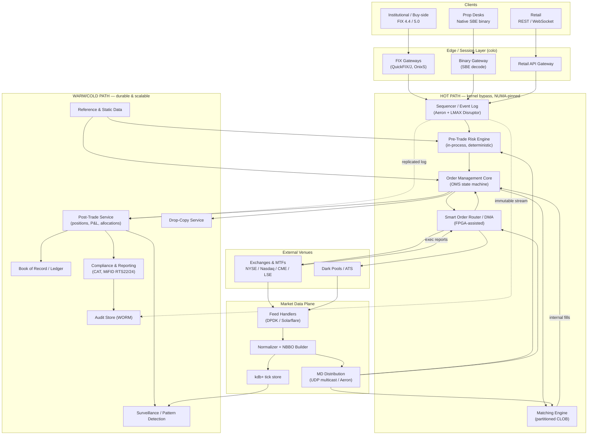
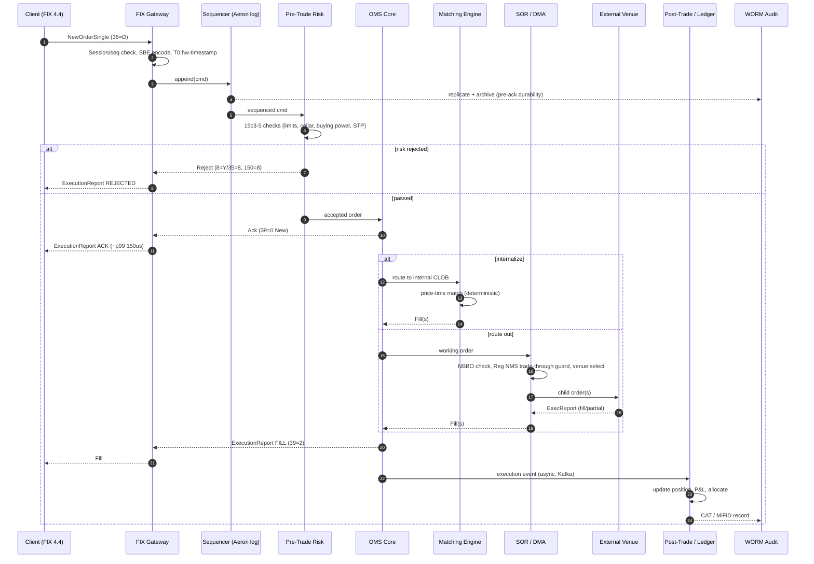
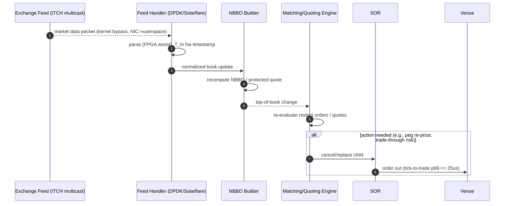

# Low-Latency Electronic Trading & Brokerage Platform — Enterprise Architecture Scenario

> Principal-architect-level, end-to-end reference design for a multi-asset electronic trading and brokerage platform supporting direct market access (DMA), smart order routing (SOR), an internal matching engine (dark pool / internalizer), and a regulated brokerage book of record. Targets ultra-low latency on the critical order path with strict consistency, full audit, and MiFID II / SEC Reg NMS / FINRA compliance.

---

## Context & Business Requirements

We operate a regulated broker-dealer offering electronic trading across **equities, listed options, and FX**, serving institutional clients (buy-side desks, hedge funds), proprietary trading desks, and a smaller retail flow channel. Clients connect via **FIX 4.2/4.4/5.0 (FIXT 1.1)**, a binary native API (SBE-encoded), and a REST/WebSocket gateway for retail.

The platform must:

- Accept and risk-check client orders, then either route them to external venues (NYSE, Nasdaq, CME, LSE, MTFs, dark pools) via DMA/SOR, or match them internally on our own continuous limit order book (CLOB) and internalizer.
- Provide a **single, authoritative book of record** for positions, balances, and executions that satisfies the regulatory audit trail.
- Maintain **best execution** obligations (Reg NMS Order Protection Rule / Rule 611, MiFID II RTS 27/28 reporting) and **pre-trade risk controls** (SEC Rule 15c3-5 — the "Market Access Rule").
- Operate during defined market hours with **near-zero unplanned downtime** during the trading day and rapid recovery within the same session.

**Key business drivers**

| Driver | Implication |
|---|---|
| Latency is alpha | Microsecond-level tick-to-trade on the hot path directly affects fill quality and client retention. |
| Regulatory exposure | A single missing or unsequenced audit record (CAT, MiFID transaction report) is a reportable breach. |
| Capital at risk | A runaway algo or fat-finger order can lose millions in seconds; pre-trade risk must be deterministic and fast. |
| Client SLAs | Institutional clients negotiate latency, uptime, and reject-rate SLAs into contracts. |

**Explicitly out of scope** for this document: clearing/settlement engine internals (DTCC/NSCC integration is treated as a downstream interface), the quant research platform, and the client-facing portal UX.

---

## Functional Requirements

1. **Order entry & lifecycle** — Accept New, Cancel, Cancel/Replace, and Mass-Cancel via FIX and native binary; support market, limit, stop, IOC, FOK, peg, iceberg, and TWAP/VWAP parent orders.
2. **Pre-trade risk** — Per-order and aggregate checks: notional limits, max order size, fat-finger price collars, position limits, buying-power/margin, restricted-symbol lists, self-trade prevention, message-rate throttles (Rule 15c3-5).
3. **Order routing (SOR/DMA)** — Route child orders to the best venue based on price, liquidity, fees, and latency; honor Reg NMS protected quotes (NBBO) and trade-through prevention.
4. **Internal matching engine** — Deterministic price-time priority CLOB for internalized flow and a dark-pool crossing book.
5. **Market-data ingestion** — Normalize and distribute Level 1/Level 2/Level 3 feeds (e.g., Nasdaq TotalView-ITCH, NYSE Integrated, OPRA, CME MDP 3.0), build the NBBO/consolidated book.
6. **Post-trade** — Execution capture, drop-copy, allocation, position keeping, P&L, trade enrichment, and handoff to clearing.
7. **Compliance & reporting** — Immutable audit trail; CAT (Consolidated Audit Trail), OATS-successor, MiFID II transaction & order-record reporting (RTS 22/24), trade & transaction reporting.
8. **Surveillance** — Near-real-time pattern detection (spoofing, layering, wash trades, marking the close).
9. **Reference & static data** — Symbology, corporate actions, trading calendars, venue config, fee schedules.

## Non-Functional Requirements

| Category | Requirement |
|---|---|
| **Latency** | Tick-to-trade (market data in → order out) p50 ≤ 8 µs, p99 ≤ 25 µs at the matching/SOR layer (kernel-bypass NIC to NIC). Client gateway round-trip (FIX in → ack out) p99 ≤ 150 µs. End-to-end risk decision ≤ 5 µs on the hot path. |
| **Throughput** | Sustain 1.5M orders/sec aggregate ingress at peak; matching engine 4–6M order-book operations/sec per partition; market-data normalization 25M msgs/sec at open. |
| **Availability** | 99.99% during trading session (≈ < 26 s/session). Hot-hot within a region; warm standby cross-region. |
| **Consistency** | Strict sequential consistency on the order book and ledger (single-writer per partition). No lost or reordered executions. Exactly-once application of order events. |
| **Durability** | Every inbound message and every state transition persisted to a sequenced, WORM-backed log before acknowledgement (no ack before fsync/replication quorum). RPO = 0 for executed trades. |
| **Recovery** | RTO ≤ 30 s intra-region (failover to hot replica via deterministic state-machine replay). Cross-region RTO ≤ 5 min. |
| **Compliance** | Synchronized clocks to UTC within 100 µs of UTC (MiFID II RTS 25 requires ≤ 100 µs for HFT). Full, time-ordered, immutable audit trail retained 7 years (WORM). |
| **Security** | mTLS on all external sessions, per-client entitlements, HSM-backed key custody, segregation of client funds data, full PII/MNPI controls. |
| **Determinism** | Matching engine and risk engine are deterministic state machines: identical input log → identical output. Enables replay-based recovery and "what-if" reconstruction for regulators. |

---

## Capacity / Scale Estimates

Assumptions: US equities + options + FX, ~9,000 active symbols, peak concentrated at market open (09:30 ET) and close.

| Dimension | Estimate | Notes |
|---|---|---|
| Inbound market-data messages | **20–25M msgs/sec** peak (ITCH + OPRA dominate; OPRA alone can exceed 15M msg/s) | Burst at open; sized for 1.5× headroom. |
| Client order ingress | **1.5M orders/sec** peak; ~3B order events/day | Includes new/cancel/replace. |
| Matching ops | **4–6M ops/sec per partition**, 16 partitions | Sharded by symbol. |
| Executions (fills) | ~150–300M fills/day | Drives post-trade & clearing volume. |
| Audit log write rate | ~5–8 GB/min at peak; **~40–60 TB/day** raw | Compressed + tiered to WORM. |
| Hot-path memory footprint | Order book per partition pinned in RAM; ~64–128 GB/matching node | NUMA-pinned, huge pages. |
| Network | 10/25/100 GbE; multicast for market data; per-venue cross-connects in colo (NY4/NY5, Mahwah, Carteret, CME Aurora) | |
| Clock sync | PTP (IEEE 1588) grandmaster + GPS, < 100 µs to UTC, typically < 1 µs | RTS 25 compliance. |

Back-of-envelope for risk-engine sizing: at 1.5M orders/sec × ~12 risk checks each = **18M risk evaluations/sec**; each check is an in-memory lookup/compare, budgeted at < 100 ns, so ≈ 2 ns aggregate per check across vectorized batches — achievable only with in-process, cache-resident state (no network/DB call on hot path).

---

## High-Level Architecture

The platform is split into a **hot path** (latency-critical, kernel-bypass, single-process colocated services) and a **warm/cold path** (durable, scalable, eventually-consistent services for post-trade, reporting, surveillance). The dividing principle: nothing on the hot path makes a synchronous network or disk call; durability is achieved by appending to a replicated in-memory sequenced log (Aeron) whose archive is fsynced asynchronously but *before* external acknowledgement.



**Design tenets**

- **Single-writer per partition.** Each symbol partition has exactly one matching-engine thread; the order book is mutated only by that thread. This eliminates locks and gives deterministic price-time priority.
- **The log is the source of truth.** Every command is sequenced before processing (event sourcing). State is a deterministic fold over the log; recovery = replay.
- **Mechanical sympathy.** LMAX Disruptor ring buffers, cache-line padding, busy-spin polling, NUMA pinning, huge pages, kernel-bypass NICs (Solarflare Onload / DPDK), and FPGA offload for the very hottest functions (feed parsing, risk gates).

---

## Core Components / Services (Bounded Contexts)

| Bounded Context | Responsibility | Path | Key tech |
|---|---|---|---|
| **Session / Gateway** | FIX & binary session management, sequence-number recovery, auth, throttling, SBE decode | Hot edge | QuickFIX/J, OnixS, Chronicle Queue, SBE |
| **Sequencer** | Globally orders all inbound commands into a durable, replicated log | Hot | Aeron Cluster (Raft), LMAX Disruptor |
| **Pre-Trade Risk** | Deterministic 15c3-5 checks: limits, collars, buying power, self-trade prevention, kill-switch | Hot, in-process | C++/Java + off-heap state |
| **Order Management Core (OMS)** | Order state machine, parent/child decomposition, working-order book, exec aggregation | Hot | Custom state machine on Disruptor |
| **Matching Engine** | Partitioned CLOB, price-time priority, dark crossing, auction handling | Hot, single-writer | Custom; LMAX-style |
| **Smart Order Router / DMA** | Venue selection, Reg NMS trade-through prevention, child slicing, exchange protocol adapters | Hot | FPGA-assisted, per-venue FIX/native adapters |
| **Market Data** | Feed handlers, normalization, NBBO construction, conflation, distribution | Hot/MD plane | DPDK, Solarflare, kdb+, Aeron |
| **Post-Trade** | Execution capture, positions, real-time P&L, allocations, average pricing | Warm | Kafka, Flink, Postgres/Cockroach |
| **Book of Record / Ledger** | Authoritative double-entry ledger of positions, cash, executions | Warm | Strongly-consistent SQL (Cockroach/Spanner) |
| **Drop-Copy** | Real-time copy of all executions to clients/compliance | Warm | FIX drop-copy sessions |
| **Compliance & Reporting** | CAT, MiFID RTS 22/24/27/28, trade reporting, clock-sync attestations | Cold | Kafka, Spark, object store |
| **Surveillance** | Spoofing/layering/wash detection, alerting | Cold/near-RT | Flink/CEP, ML scoring |
| **Reference & Static Data** | Symbology, calendars, venue config, fee schedules, corporate actions | Supporting | Postgres + cache, distributed at SOD |

---

## Data Architecture (Stores & Why)

| Store | Purpose | Why this choice |
|---|---|---|
| **Aeron Archive / Chronicle Queue (sequenced event log)** | Source-of-truth command & event log on the hot path | Append-only, replicated, fsync-backed, replayable; nanosecond-class writes; gives event sourcing + RPO 0. |
| **In-memory order book (off-heap / arena allocated)** | Live CLOB per partition | Must be cache-resident; arrays-of-structs keyed by price level for O(1) best-bid/offer; no GC pressure. |
| **kdb+/q tick store** | Time-series market data, TCA, backtesting, surveillance | Industry standard for columnar tick data; extreme ingest + time-window query performance. |
| **CockroachDB / Spanner (or strongly-consistent SQL)** | Book of record / ledger, positions, balances | Needs serializable isolation, multi-region survivability, and ACID for money. |
| **PostgreSQL** | Reference/static data, entitlements, venue config | Relational, mature, distributed at start-of-day to hot-path caches. |
| **Apache Kafka** | Durable backbone for warm/cold path (post-trade, surveillance, reporting fan-out) | High-throughput, ordered partitions, replayable; decouples hot path from analytics. |
| **WORM object storage (S3 Object Lock / AWS Glacier / dedicated WORM appliance)** | Immutable 7-year audit & regulatory archive | Compliance/legal-hold requires write-once-read-many, tamper-evident retention. |
| **Redis / in-mem cache** | Hot reference lookups, session state | Sub-ms entitlement/symbology lookups off the critical hot path. |

### Schema sketch — order & execution (warm path / ledger)

```sql
-- Append-only order events (event-sourced; mirrors the hot-path log)
CREATE TABLE order_event (
  seq_no        BIGINT      PRIMARY KEY,        -- global sequence from sequencer
  ts_utc        TIMESTAMP   NOT NULL,           -- PTP-synced, <100us to UTC (RTS 25)
  client_id     BIGINT      NOT NULL,
  order_id      UUID        NOT NULL,
  parent_id     UUID,                            -- for SOR child orders
  symbol        VARCHAR(16) NOT NULL,
  side          CHAR(1)     NOT NULL,            -- B/S
  event_type    VARCHAR(16) NOT NULL,           -- NEW/CXL/REPLACE/ACK/REJECT/FILL/PFILL
  qty           BIGINT,
  price         DECIMAL(18,6),
  tif           VARCHAR(8),                      -- DAY/IOC/FOK/GTC
  venue         VARCHAR(16),                     -- internal or external MIC
  risk_decision VARCHAR(16),                     -- PASS/REJECT(reason)
  fix_msg_hash  BYTEA                            -- integrity link to raw message
);

CREATE TABLE execution (
  exec_id       UUID        PRIMARY KEY,
  order_id      UUID        NOT NULL REFERENCES ... ,
  ts_utc        TIMESTAMP   NOT NULL,
  symbol        VARCHAR(16) NOT NULL,
  qty           BIGINT      NOT NULL,
  price         DECIMAL(18,6) NOT NULL,
  liquidity     CHAR(1),                          -- A(dded)/R(emoved)
  venue_mic     VARCHAR(16) NOT NULL,
  contra        VARCHAR(32),                      -- counterparty / internal
  nbbo_bid      DECIMAL(18,6),                    -- captured NBBO at exec (best-ex evidence)
  nbbo_ask      DECIMAL(18,6),
  cat_event_id  VARCHAR(40)                       -- Consolidated Audit Trail linkage
);

CREATE TABLE position (
  client_id   BIGINT,
  symbol      VARCHAR(16),
  net_qty     BIGINT,
  avg_px      DECIMAL(18,6),
  realized_pl DECIMAL(18,4),
  updated_seq BIGINT,
  PRIMARY KEY (client_id, symbol)
);
```

### In-memory order book layout (conceptual)

```
PriceLevel[]  (sorted, dense array indexed by tick offset from a reference price)
  └── each level: total_qty, order_count, head/tail of intrusive FIFO list (time priority)
Order pool: pre-allocated, object-reuse, no per-order malloc on hot path
Index:  order_id -> Order*  (open-addressing hash, cache-friendly)
```

---

## Key Workflows

### Workflow 1 — Order lifecycle (entry → risk → match/route → execution → post-trade)



### Workflow 2 — Market-data-driven re-pricing on the hot path (tick-to-trade)



---

## Cross-Cutting Concerns

### Security & Compliance
- **Transport & identity:** mTLS for all external sessions; per-client entitlements enforced at the gateway; FIX comp-id/sub-id mapping to entitlement profiles. HSM-backed key custody.
- **Market Access Rule (15c3-5):** Pre-trade risk is mandatory, broker-controlled (not bypassable by the client), and includes a **hardware/software kill-switch** to drop a client or the whole firm in < 1 ms.
- **Audit trail:** Every inbound message, sequenced command, state transition, and outbound report is written to an immutable, time-ordered WORM store, hash-chained for tamper evidence. Retained 7 years.
- **Clock sync (MiFID II RTS 25):** PTP grandmaster disciplined by GPS; all timestamps traceable to UTC within 100 µs (HFT) / 1 ms; drift monitored and attested.
- **Regulatory reporting:** CAT (US), MiFID II RTS 22 (transaction reporting) and RTS 24 (order record keeping), RTS 27/28 best-execution reports; trade reporting to TRF/APA.
- **MNPI / data segregation:** Surveillance and research data segregated; client confidential data access logged.

### High Availability / Disaster Recovery
- **Hot-hot in region:** The sequenced log is replicated via **Aeron Cluster (Raft consensus)** across ≥ 3 nodes; matching/risk/OMS are deterministic state machines replaying the same log, so a standby can take over by replaying from the last committed sequence.
- **Failover:** Leader election on sequencer; downstream deterministic services rebuild state from the log. RTO ≤ 30 s intra-region.
- **Cross-region:** Asynchronous log shipping + Kafka mirroring to a warm DR site (different colo / cloud region); cross-region RTO ≤ 5 min, with reconciliation against venue drop-copies.
- **Gap recovery:** FIX resend (ResendRequest/SequenceReset) and venue drop-copy reconciliation guarantee no execution is lost or double-counted.

### Observability
- **Latency telemetry:** Hardware timestamps at every hop (NIC, gateway, sequencer, risk, match, SOR, venue); per-message latency histograms (HdrHistogram) with p50/p99/p99.9. Span-style correlation via the global sequence number.
- **Metrics/logging/tracing:** Prometheus + Grafana for system metrics; high-rate metrics off the hot path via shared-memory counters scraped by a sidecar (no logging on the hot path itself — log later from the event stream). ELK/OpenSearch for warm-path logs.
- **Business KPIs:** reject rate, fill rate, venue toxicity, slippage vs NBBO, message-rate-by-client (throttle health).

### Scaling
- **Symbol partitioning (sharding):** Order books partitioned by symbol across matching nodes; capacity grows by adding partitions. Single-writer per partition preserves determinism.
- **Gateway horizontal scale:** Stateless-ish FIX gateways scale out behind venue/client cross-connects; all funnel into the sequencer.
- **Warm/cold path:** Kafka partitions + Flink/Spark scale independently of the hot path; back-pressure never reaches the hot path because durability is satisfied by the log, not by downstream consumers.

---

## Key Trade-offs & Decisions

| Decision | Alternative | Why we chose it | Cost |
|---|---|---|---|
| **Single-writer, partitioned, in-process matching** | Distributed/locked shared book | Determinism, no locks, microsecond latency | Per-partition vertical limits; partition = blast radius |
| **Event-sourced sequenced log as source of truth** | Mutable DB as source of truth | RPO 0, replay-based recovery, perfect audit, deterministic | Replay/storage cost; engineering complexity |
| **Kernel bypass (Solarflare Onload / DPDK) + busy-spin** | Standard kernel TCP, epoll | 10–100× latency reduction, predictable tails | Burns CPU cores; harder to operate/debug |
| **FPGA for feed parsing & risk gates** | Pure software | Deterministic sub-µs, offloads CPU | High dev cost, long iteration cycles, niche skills |
| **Hot path makes no network/DB calls** | Synchronous risk DB lookups | Removes tail-latency from I/O | Must distribute all reference/risk state in-memory at SOD and update via stream |
| **Aeron Cluster (Raft) for replication** | Async-only replication | Strong consistency + HA on the critical path | Consensus adds a few µs vs single node |
| **kdb+ for tick data** | Generic TSDB (Influx/Timescale) | Proven extreme-scale market-data performance | Licensing cost, specialized q language |
| **Internalize then route (SOR)** | Always route to lit venues | Price improvement, lower fees, capture spread | Best-ex scrutiny; ATS/dark-pool regulatory obligations |
| **C++/Java hybrid** | Single language | C++ on hottest path; Java (Aeron/Disruptor, zero-GC patterns) where productivity matters | Two toolchains, ABI boundaries |

---

## Tech Stack

| Layer | Technology |
|---|---|
| **Connectivity / protocols** | FIX 4.2/4.4/5.0 over FIXT 1.1; Simple Binary Encoding (SBE); native exchange protocols (ITCH/OUCH, CME iLink/MDP 3.0, Nasdaq); REST/WebSocket for retail |
| **FIX engines** | QuickFIX/J, OnixS, custom SBE codecs |
| **Hot-path runtime** | C++17/20 (matching, feed handlers, FPGA host); Java with LMAX Disruptor + Aeron (sequencer, OMS) using zero-allocation / off-heap patterns; Agrona |
| **Messaging / transport** | Aeron (UDP unicast/multicast + Aeron Cluster/Raft), Chronicle Queue, Apache Kafka (warm/cold path) |
| **Network / hardware** | Solarflare/Xilinx NICs with Onload, Intel DPDK, FPGA (Xilinx/AMD) for feed parse & risk gates, PTP (IEEE 1588) grandmaster + GPS, 10/25/100 GbE, colocation (NY4/NY5, Mahwah, Carteret, CME Aurora) |
| **Market data store** | kdb+/q |
| **Ledger / book of record** | CockroachDB or Google Spanner (serializable, multi-region) |
| **Reference / OLTP** | PostgreSQL, Redis |
| **Stream processing** | Apache Flink (surveillance/CEP, real-time positions), Apache Spark (batch reporting) |
| **Audit / archive** | WORM object storage (S3 Object Lock / dedicated WORM appliance), hash-chained immutable log |
| **Observability** | Prometheus + Grafana, HdrHistogram, OpenTelemetry (warm path), ELK/OpenSearch |
| **Compliance** | CAT reporting pipeline, MiFID II RTS 22/24/27/28 generators, TRF/APA connectors |
| **Infra / orchestration** | Bare-metal for hot path (no virtualization on critical nodes); Kubernetes for warm/cold services; Terraform/Ansible IaC; cross-region cloud DR |

---

*This document is a reference scenario. Real production parameters (latency budgets, venue lists, partition counts) must be validated against current exchange specs, regulatory text, and load tests.*
