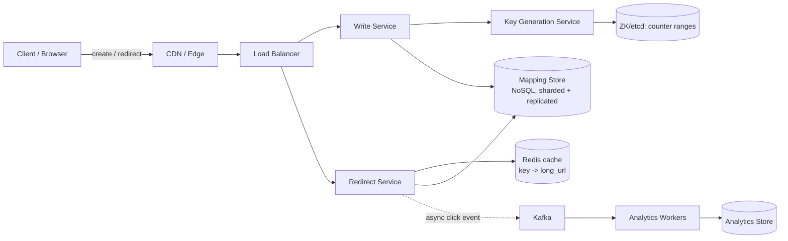

# 01 — URL Shortener (TinyURL / bit.ly)

## Problem & Clarifications
Design a service that turns a long URL into a short one (e.g.
`https://tinyurl.com/3ad4f2`) and redirects from the short URL back to the
original. Questions to ask the interviewer:
- **Traffic shape?** Heavily read-skewed — far more redirects than creations.
- **Short link length / charset?** As short as possible; alphanumeric.
- **Custom aliases?** Yes, optional vanity URLs.
- **Expiration?** Optional TTL; links can expire.
- **Analytics?** Click counts, referrer, geo — async, eventual is fine.
- **Scale & horizon?** Plan for ~100M new URLs/day, multi-year retention.

## Functional Requirements
1. Create a short URL from a long URL (optionally a custom alias and TTL).
2. Redirect a short URL to its original long URL.
3. Support custom/vanity aliases (must be unique).
4. Track basic click analytics (count, time, referrer, geo).
5. Optional link expiration and deletion.

## Non-Functional Requirements
- **Availability**: redirects are critical — target 99.99%. Reads must not fail.
- **Latency**: p99 redirect < 100 ms (it's on the user's critical path).
- **Read:write ratio**: assume **100:1** (read-heavy).
- **Consistency**: short→long mapping is immutable once created → eventual
  consistency is fine for reads; uniqueness of keys must be guaranteed.
- **Durability**: never lose a mapping. Non-guessable (don't leak sequence).

## Capacity Estimation
Assume **100M new URLs/day**.
- **Write QPS** = 100M / 10^5 s ≈ **1,000 writes/s** (peak ~2–3k/s).
- **Read QPS** = 100:1 → **100,000 reads/s** (peak ~200–300k/s).
- **Storage/row** ≈ short key (7 B) + long URL (~500 B) + metadata (~100 B) ≈ **~1 KB**.
- **Storage/year** = 100M/day × 365 × 1 KB ≈ **~36 TB/year** (× replication ×3 ≈ 110 TB).
- **5-year total** ≈ 180 TB raw → comfortably NoSQL territory.
- **Key space**: base62 with 7 chars = 62^7 ≈ **3.5 trillion** keys → enough for
  100M/day × ~95 years. 6 chars (56B) is tighter; **7 chars** is the safe default.
- **Cache**: hot 20% of reads → cache ~20M hottest mappings × ~0.5 KB ≈ **~10 GB**
  per Redis cluster (easily fits in memory).

## API Design
REST over HTTPS.

```
POST /api/v1/urls
  body: { "long_url": "...", "custom_alias": "promo" (opt), "ttl_days": 30 (opt) }
  201 → { "short_url": "https://tiny.url/3ad4f2", "key": "3ad4f2", "expires_at": ... }
  409 → custom_alias already taken

GET /{key}
  302 → Location: <long_url>     (default; see 301 vs 302 deep dive)
  404 → unknown/expired key

GET /api/v1/urls/{key}/stats
  200 → { "key": "3ad4f2", "clicks": 12044, "created_at": ..., "top_referrers": [...] }

DELETE /api/v1/urls/{key}      (auth required, owner only)
```
Write endpoints require auth + are rate-limited; creates use the user/long_url as
an optional idempotency hint to dedupe retries.

## Data Model / Schema
NoSQL (DynamoDB/Cassandra) keyed by the short key — single-key lookups, no joins,
massive scale. Relational works too at smaller scale; shown here as SQL for clarity.

```sql
CREATE TABLE urls (
    short_key    VARCHAR(10)  PRIMARY KEY,   -- base62, the partition key in NoSQL
    long_url     TEXT         NOT NULL,
    creator_id   BIGINT,
    created_at   TIMESTAMP    NOT NULL DEFAULT now(),
    expires_at   TIMESTAMP,                  -- NULL = never; TTL index in NoSQL
    is_custom    BOOLEAN      NOT NULL DEFAULT FALSE
);
CREATE INDEX idx_urls_creator ON urls (creator_id);

-- Analytics kept separate (write-heavy, append-only, aggregated async).
CREATE TABLE click_events (
    event_id     UUID         PRIMARY KEY,
    short_key    VARCHAR(10)  NOT NULL,
    clicked_at   TIMESTAMP    NOT NULL,
    referrer     TEXT,
    country      CHAR(2),
    user_agent   TEXT
);
```
**Shard key = `short_key`** (high cardinality, uniform via hashing) → even load.

## High-Level Design


- **Redirect path** is the hot path: cache-first, DB fallback, no synchronous
  analytics (fire click events to Kafka and return immediately).
- **KGS** pre-generates/hands out unique keys so writes never collide.

## Deep Dives

### 1. Encoding: counter vs. hash vs. KGS
- **Hash-based** (e.g., MD5/SHA of the URL, take first 7 chars, base62): simple
  and stateless, but **collisions** require retries, and the same URL always maps
  to the same key (may be undesirable). Need a uniqueness check on every write.
- **Counter + base62**: maintain a global 64-bit counter, base62-encode it →
  guaranteed unique, no collision check. But a single counter is a bottleneck/SPOF
  and keys are **sequential/guessable** (enumerable, leaks volume).
- **Key Generation Service (KGS)** *(recommended)*: a service hands out unique keys
  from pre-allocated **ranges**. Each app server grabs a range (e.g. 1,000 IDs)
  from a coordinator (ZooKeeper/etcd) and serves locally → no per-write coordination,
  no collisions, survives restarts. To avoid guessable sequences, **base62-encode
  the counter then optionally permute/scramble** the bits, or interleave digits.

We use **counter ranges via KGS** for guaranteed uniqueness + horizontal scale, and
scramble to reduce enumeration.

### 2. Collision handling
- With counter/KGS: **none** — IDs are unique by construction.
- With hashing: on insert, do a **conditional write** ("put if absent"). On
  collision, append a salt / increment and rehash, retry. Bound retries; the
  probability is tiny once the key space (62^7) dwarfs the populated set.

### 3. Redirect: 301 vs 302
- **301 Permanent**: browsers/proxies cache it → future hits skip your server.
  Great for load reduction, **bad for analytics** (you stop seeing clicks) and you
  can't change/expire the target.
- **302 Found (temporary)** *(recommended)*: every click hits your service → you
  capture analytics and retain control to expire/rotate. Costs more traffic, which
  the cache absorbs. Use `Cache-Control: no-cache` to prevent stale caching.

### 4. Analytics
Redirect service emits a click event to **Kafka** and returns the 302 immediately
(don't block the user). Stream processors aggregate counts (per key, per hour, geo,
referrer) into an analytics store / OLAP system. This keeps the hot path fast and
lets analytics be **eventually consistent**.

### 5. Custom aliases
Treat the alias as the `short_key` directly. Insert with **"put if absent"**; return
**409** if taken. Reserve a namespace or prefix to prevent collisions with
auto-generated keys (e.g., generated keys are always 7 chars; custom can be other
lengths, or use a separate keyspace flag).

### 6. Scaling reads
- **Cache-aside with Redis** in front of the DB; ~95%+ hit rate given 80/20 skew.
- Mappings are **immutable**, so cache entries never go stale (only expire by TTL)
  → no invalidation complexity.
- Put the redirect service behind a **CDN/edge**; even short-TTL edge caching cuts
  origin load dramatically.
- DB is **sharded by `short_key`** and read-replicated. Stateless redirect tier
  scales horizontally behind the LB.

## Bottlenecks & Trade-offs
- **Global counter SPOF** → solved by KGS range allocation (local, lock-free).
- **Cache stampede** on a viral link → request coalescing / single-flight, plus the
  link being immutable means one DB read repopulates everyone.
- **Hot key** (one viral URL) → CDN + Redis absorb it; it's a read of one tiny value.
- **301 vs 302**: trading server load for analytics + control — we chose 302.
- **NoSQL vs SQL**: chose NoSQL for write/read scale and simple key access, giving
  up joins/transactions we don't need here.
- **Guessable keys**: scrambling adds a little complexity to gain non-enumerability.

## Code
Base62 encode/decode plus the core shortening logic with KGS range allocation.

```python
import string
import threading

ALPHABET = string.digits + string.ascii_lowercase + string.ascii_uppercase  # 62
BASE = len(ALPHABET)
_INDEX = {c: i for i, c in enumerate(ALPHABET)}


def encode(num: int) -> str:
    """Base62-encode a non-negative integer. 0 -> '0'."""
    if num < 0:
        raise ValueError("num must be non-negative")
    if num == 0:
        return ALPHABET[0]
    chars = []
    while num:
        num, rem = divmod(num, BASE)
        chars.append(ALPHABET[rem])
    return "".join(reversed(chars))


def decode(key: str) -> int:
    """Inverse of encode()."""
    num = 0
    for ch in key:
        num = num * BASE + _INDEX[ch]
    return num


class KeyGenerationService:
    """Hands out unique counter values in pre-allocated ranges.

    In production the 'range_start' is fetched atomically from a coordinator
    (ZooKeeper/etcd or a SQL row with SELECT ... FOR UPDATE). Each app server
    caches a range locally and serves IDs lock-free until it's exhausted.
    """

    def __init__(self, allocator, batch_size: int = 1000):
        self._allocator = allocator          # callable -> next range_start
        self._batch = batch_size
        self._next = 0
        self._limit = 0
        self._lock = threading.Lock()

    def next_id(self) -> int:
        with self._lock:
            if self._next >= self._limit:
                start = self._allocator(self._batch)   # atomic, e.g. INCR by batch
                self._next, self._limit = start, start + self._batch
            val = self._next
            self._next += 1
            return val


# A simple deterministic scramble so sequential counters don't produce
# sequential (enumerable) keys. Uses a fixed odd multiplier mod 2^41. We pick
# 2^41 (~2.2e12) because it is < 62^7 (~3.5e12), so every scrambled value still
# fits in 7 base62 chars. ~2.2 trillion keys = decades at 100M/day. Reversible.
_MOD = 1 << 41
_MULT = 2_654_435_761            # odd -> coprime with 2^41 -> bijective
_MULT_INV = pow(_MULT, -1, _MOD)


def scramble(n: int) -> int:
    return (n * _MULT) % _MOD


def unscramble(n: int) -> int:
    return (n * _MULT_INV) % _MOD


class ShortenerService:
    def __init__(self, kgs, store, cache):
        self.kgs = kgs        # KeyGenerationService
        self.store = store    # mapping store: get/put_if_absent
        self.cache = cache    # redis-like: get/set

    def shorten(self, long_url: str, custom_alias: str | None = None,
                ttl_days: int | None = None) -> str:
        if custom_alias:
            if not self.store.put_if_absent(custom_alias, long_url, ttl_days):
                raise ValueError("alias already taken")  # -> HTTP 409
            return custom_alias
        # Generated path: unique counter -> scramble -> base62. No collision check.
        key = encode(scramble(self.kgs.next_id()))
        self.store.put_if_absent(key, long_url, ttl_days)
        return key

    def resolve(self, key: str) -> str | None:
        """Hot path: cache-first, DB fallback. Mappings are immutable -> safe to cache."""
        url = self.cache.get(key)
        if url is not None:
            return url
        url = self.store.get(key)            # returns None if missing/expired
        if url is not None:
            self.cache.set(key, url)         # repopulate (optionally with TTL)
        return url
```

```sql
-- Atomic range allocation backing the KGS, if using SQL as the coordinator:
UPDATE id_allocator
   SET current = current + :batch
 WHERE name = 'urls'
RETURNING current - :batch AS range_start;   -- single round trip, row-locked
```

## Summary
A read-heavy service whose signature challenge is **unique key generation**. We use
a **KGS handing out base62-encoded counter ranges** (unique by construction, no
collision checks, lock-free at the app tier) with optional scrambling to avoid
enumerable keys. Redirects use **302** to retain analytics + control, are served
**cache-first** from Redis behind a CDN (mappings are immutable → trivial caching),
and the mapping store is **NoSQL sharded by `short_key`**. Analytics are decoupled
via **Kafka** so the redirect stays sub-100 ms. Trade-offs centered on
301-vs-302 (load vs. control) and counter-vs-hash (uniqueness vs. statelessness).
