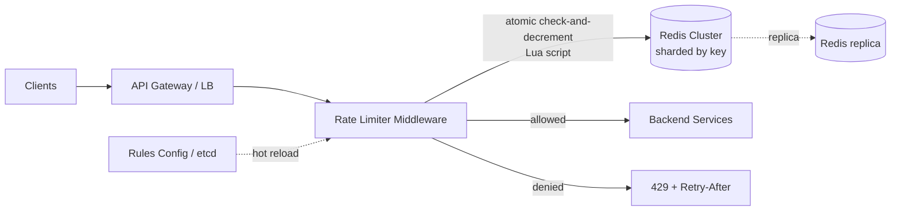

# 02 — Distributed Rate Limiter

## Problem & Clarifications
Design a rate limiter that throttles client requests to protect services from
abuse, accidental floods, and noisy neighbors — and works across a fleet of
servers, not just one box. Questions to ask:
- **Client vs. server side?** Server-side (or gateway) — clients can't be trusted.
- **Granularity / key?** Per user ID, per API key, per IP, or per endpoint? Often
  several rules layered (e.g., 10/s per IP **and** 1000/day per API key).
- **What happens on limit?** Reject with **HTTP 429** (or queue/throttle)?
- **Hard or soft limits?** Strict cap vs. allow bursts.
- **Accuracy vs. performance?** Exact counting is costly at scale; some apps accept
  small over-allowance for speed.
- **Scale?** Assume a large public API: millions of users, ~1M QPS aggregate.

## Functional Requirements
1. Allow or deny each request based on configurable rules (limit + window).
2. Limit by flexible keys: user, API key, IP, endpoint, or combinations.
3. Work consistently across a distributed fleet (shared state).
4. Return clear feedback: `429` + `Retry-After` / rate-limit headers.
5. Rules are configurable/hot-reloadable without redeploy.

## Non-Functional Requirements
- **Low latency**: adds < ~1 ms to each request (it's on every request's path).
- **High availability**: must not become a SPOF; **fail-open** is usually safer
  than failing-closed (don't take down the API because the limiter is down).
- **Scalable**: handle the full request volume of the protected services.
- **Reasonably accurate**: small over-counting under race is acceptable for most
  APIs; some need exactness (configurable).
- **Memory-efficient**: millions of distinct keys.

## Capacity Estimation
- Aggregate **1M QPS** across the fleet, each request → 1 limiter check.
- Counters live in **Redis**: ~100k+ ops/s per node → shard across ~10–20 Redis
  nodes (consistent hashing by limiter key) to handle 1M ops/s with headroom.
- **Memory**: per key store a counter/timestamp (~50–100 B). 10M active keys ×
  100 B ≈ **~1 GB** → trivially fits; sliding-window-log is heavier (store
  timestamps) so prefer counters at this scale.
- Limiter check budget: a Redis round trip in-DC ≈ 0.5 ms → fits the <1 ms goal.

## API Design
The limiter is usually middleware, not a public API. Internally:

```
allow(key, rule) -> Decision { allowed: bool, remaining: int, retry_after_s: int }
```

On the protected API, a denied request returns:
```
HTTP 429 Too Many Requests
Retry-After: 2                       # seconds until the client may retry
X-RateLimit-Limit: 100               # cap for the window
X-RateLimit-Remaining: 0             # tokens/requests left
X-RateLimit-Reset: 1719100000        # epoch when the window resets
```
Allowed requests also echo `X-RateLimit-Remaining` so clients can self-throttle.

## Data Model / Schema
No relational schema — state is ephemeral counters in Redis.

```
# Token bucket per key:
HSET rl:{key} tokens 42 last_refill 1719099999.812   # hash; or two keys
EXPIRE rl:{key} <ttl>                                  # auto-evict idle keys

# Fixed/sliding window counter per key+window:
INCR rl:{key}:{window_id}      # integer counter
EXPIRE rl:{key}:{window_id} <2 * window_seconds>

# Rules config (loaded into memory, hot-reloadable):
{ "key_type": "api_key", "endpoint": "/search", "limit": 100, "window_s": 60,
  "burst": 20, "algorithm": "token_bucket" }
```

## High-Level Design


Place the limiter at the **API gateway / edge** so bad traffic is rejected before
it touches backends. The shared counter state lives in a **Redis cluster** so all
fleet nodes see the same counts.

## Deep Dives

### 1. Algorithms
- **Token bucket** *(recommended default)*: a bucket holds up to `capacity` tokens,
  refilled at `rate` tokens/sec. Each request consumes one. **Allows bursts** up to
  capacity, smooths thereafter. Memory: 2 numbers/key. Used by AWS, Stripe.
- **Leaky bucket**: requests enter a fixed-size queue drained at a constant rate →
  smooths output, no bursts. Good for shaping; adds queueing latency.
- **Fixed window counter**: count per wall-clock window (e.g., per minute). Simple,
  but allows **2× burst at window boundaries** (end of one window + start of next).
- **Sliding window log**: store a timestamp per request, count those within the
  window. **Exact**, but memory-heavy (one entry per request).
- **Sliding window counter** *(recommended when boundary bursts matter)*: weight the
  previous window's count by overlap → approximates the sliding log with O(1) memory.
  Smooths the fixed-window boundary problem cheaply.

### 2. Where to place it
- **At the gateway/edge** (chosen): rejects abuse early, centralizes policy,
  language-agnostic. Adds a hop.
- **In a middleware library** in each service: no extra hop, but duplicated logic
  and per-service deploys.
- **As a sidecar** (Envoy + a global rate-limit service): common in service meshes.

### 3. Distributed counters with Redis
All fleet nodes share counters in Redis so the limit is **global**, not per-node.
The read-modify-write (get count → compare → increment) **must be atomic**, or
concurrent requests race. Solve with a **Redis Lua script** (runs atomically on the
server) or `INCR`+`EXPIRE`. Shard keys across the cluster via consistent hashing;
each key's state lives on one shard so its operations stay atomic.

### 4. Race conditions
The classic bug: two nodes both read `count=99`, both see `<100`, both allow →
`count=101`. Fixes:
- **Atomic Lua script** doing check-and-decrement in one round trip (used below).
- `INCR` first (atomic) then compare — but you must handle the "first INCR in a
  window" TTL set, and over-count slightly on the deny path.
- A small over-allowance is acceptable for most APIs; use the Lua approach when it
  isn't.

### 5. Headers & client experience
Return `429` with **`Retry-After`** (seconds) so well-behaved clients back off
instead of hammering. Always emit `X-RateLimit-{Limit,Remaining,Reset}` so SDKs
can self-pace. Encourage **exponential backoff + jitter** on the client.

### 6. Availability / fail-open
If Redis is unreachable, **fail open** (allow the request) for most APIs — a limiter
outage shouldn't cause an API outage. Use local in-process fallback limits and short
Redis timeouts. For abuse-critical paths (login, payments) you may **fail closed**.

## Bottlenecks & Trade-offs
- **Redis as SPOF/hot shard** → cluster + replicas; consistent hashing spreads keys;
  a single very hot key can still hotspot one shard (mitigate with local pre-checks
  or key sharding for that one key).
- **Extra network hop** at the gateway vs. exactness of global counting — accepted.
- **Accuracy vs. latency**: exact sliding-log is costly; sliding-window-**counter**
  gives ~99% accuracy at O(1) memory.
- **Fail-open vs. fail-closed**: availability vs. protection — choose per endpoint.
- **Clock skew** across nodes affects window math → use the Redis server's clock
  (single source) inside the Lua script.

## Code
Token bucket (single-node reference) and a sliding-window-counter, plus the
production Redis-Lua pattern that makes the check atomic across the fleet.

```python
import time


class TokenBucket:
    """Allows bursts up to `capacity`, refills at `rate` tokens/sec.
    Single-node reference; in production the state lives in Redis (see Lua below).
    """

    def __init__(self, capacity: int, refill_rate: float):
        self.capacity = capacity
        self.refill_rate = refill_rate          # tokens per second
        self.tokens = float(capacity)
        self.last = time.monotonic()

    def allow(self, cost: int = 1) -> bool:
        now = time.monotonic()
        # Refill based on elapsed time, capped at capacity.
        self.tokens = min(self.capacity,
                          self.tokens + (now - self.last) * self.refill_rate)
        self.last = now
        if self.tokens >= cost:
            self.tokens -= cost
            return True
        return False

    def retry_after(self, cost: int = 1) -> float:
        """Seconds until enough tokens exist (for the Retry-After header)."""
        deficit = cost - self.tokens
        return max(0.0, deficit / self.refill_rate)


class SlidingWindowCounter:
    """Approximates a sliding window using current + previous fixed windows,
    weighting the previous window by how much of it still overlaps. O(1) memory,
    avoids the fixed-window boundary burst.
    """

    def __init__(self, limit: int, window_s: float):
        self.limit = limit
        self.window = window_s
        self.cur_start = self._win(time.time())
        self.cur_count = 0
        self.prev_count = 0

    def _win(self, ts: float) -> float:
        return ts - (ts % self.window)

    def _roll(self, now: float) -> None:
        start = self._win(now)
        if start == self.cur_start:
            return
        if start == self.cur_start + self.window:
            self.prev_count, self.cur_count = self.cur_count, 0   # advanced one window
        else:
            self.prev_count, self.cur_count = 0, 0                # idle gap, reset
        self.cur_start = start

    def allow(self) -> bool:
        now = time.time()
        self._roll(now)
        elapsed = now - self.cur_start
        overlap = max(0.0, (self.window - elapsed) / self.window)  # fraction of prev still in view
        estimate = self.prev_count * overlap + self.cur_count
        if estimate < self.limit:
            self.cur_count += 1
            return True
        return False
```

```python
# --- Production pattern: atomic token bucket in Redis via Lua ---------------
# The whole read-modify-write runs atomically on the Redis server in one round
# trip, eliminating the multi-node race condition. KEYS[1] = "rl:{user}".
TOKEN_BUCKET_LUA = """
local tokens_key = KEYS[1] .. ':tokens'
local ts_key     = KEYS[1] .. ':ts'
local rate     = tonumber(ARGV[1])   -- tokens per second
local capacity = tonumber(ARGV[2])
local now      = tonumber(ARGV[3])   -- server time, passed in
local cost     = tonumber(ARGV[4])

local tokens = tonumber(redis.call('get', tokens_key))
local last   = tonumber(redis.call('get', ts_key))
if tokens == nil then tokens = capacity; last = now end

local filled = math.min(capacity, tokens + (now - last) * rate)
local allowed = filled >= cost
if allowed then filled = filled - cost end

local ttl = math.ceil(capacity / rate) * 2
redis.call('set', tokens_key, filled, 'EX', ttl)
redis.call('set', ts_key, now, 'EX', ttl)
-- returns {allowed(1/0), remaining tokens}
return { allowed and 1 or 0, math.floor(filled) }
"""

# Example call (redis-py):
#   allowed, remaining = redis.eval(TOKEN_BUCKET_LUA, 1, f"rl:{user_id}",
#                                   rate, capacity, time.time(), 1)
#   if not allowed:
#       resp.status = 429
#       resp.headers["Retry-After"] = "1"
#       resp.headers["X-RateLimit-Remaining"] = "0"
```

## Summary
Place the limiter at the **gateway** and keep shared counters in a **sharded Redis
cluster** so the limit is global across the fleet. Default to **token bucket** (cheap,
burst-friendly); use a **sliding-window counter** when boundary bursts matter and
exactness when required. The crux is the **race condition** on the shared counter —
solved with an **atomic Lua script** (check-and-decrement in one round trip). Return
**429 + Retry-After** and `X-RateLimit-*` headers, and **fail open** on Redis outages
so the limiter never becomes the thing that takes the API down.
