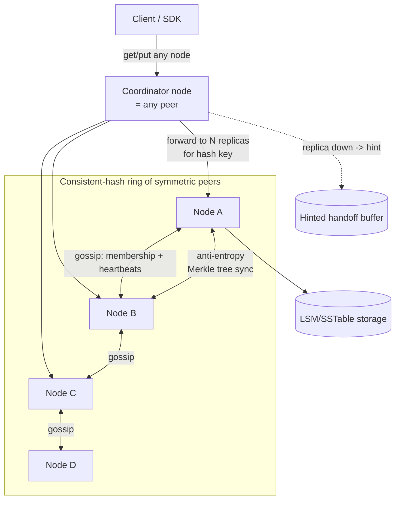

# 03 — Distributed Key-Value Store (Dynamo-style)

## Problem & Clarifications
Design a highly available, horizontally scalable key-value store in the spirit of
Amazon Dynamo / Cassandra / Riak. Questions to ask:
- **Data shape?** Opaque values addressed by key; small values (KB-scale).
- **Consistency requirement?** Dynamo prioritizes **availability** with **tunable**
  (eventual) consistency — "always writeable" shopping cart, not a bank ledger.
- **Operations?** `get(key)` / `put(key, value)`. No range scans/joins/transactions.
- **Scale?** Petabytes across thousands of commodity nodes, multi-datacenter.
- **Failure model?** Nodes and networks fail constantly — must tolerate that
  *without* losing availability (CAP: choose **AP**, tune toward C as needed).

## Functional Requirements
1. `put(key, value)` and `get(key)` with consistent hashing for placement.
2. Configurable replication factor `N`.
3. Tunable consistency via quorum knobs `R` (read) and `W` (write).
4. Tolerate node/network failures without losing reads or writes (always writeable).
5. Automatic data redistribution when nodes join/leave.
6. Detect and reconcile conflicting versions of a value.

## Non-Functional Requirements
- **High availability** (esp. for writes) — target 99.99%+; "always writeable".
- **Partition tolerance** — must keep operating during network splits (AP system).
- **Tunable consistency** — eventual by default; strong achievable via quorum.
- **Low latency** at p99 — service from memory/SSD, local quorum.
- **Incremental scalability** — add nodes one at a time, minimal data movement.
- **Decentralized** — no master/SPOF; symmetric peer nodes (gossip).
- **Durability** — replicate; survive disk loss.

## Capacity Estimation
- Target **1 PB** logical data, replication **N=3** → **3 PB** physical.
- Commodity node ~ 10 TB usable → **~300 nodes** (round up for headroom/growth).
- Suppose **1M ops/s** aggregate; with N=3 and W=2/R=2, each op touches 2–3 nodes →
  ~2–3M internal RPCs/s spread across 300 nodes ≈ ~10k internal ops/s/node — fine.
- **Virtual nodes**: ~100–256 vnodes per physical node → ~30k–75k tokens on the ring
  for smooth load balancing and fast rebalancing.
- **Metadata/gossip**: O(nodes) membership state per node, exchanged periodically —
  negligible bandwidth at 300 nodes.

## API Design
Minimal client API; everything else is internal coordination.

```
get(key, [consistency]) -> { value(s), context }
    # may return multiple sibling values if there are unreconciled conflicts;
    # `context` carries the vector clock (opaque to client, echoed back on put)

put(key, value, context) -> ack
    # `context` is the vector clock returned by a prior get; lets the store
    # know which version this write supersedes

# consistency hint: ONE | QUORUM | ALL  (maps to R/W counts)
```
The **context/vector clock is opaque** to the client — it's read on `get`, echoed on
`put`, exactly like Dynamo's `context`.

## Data Model / Schema
No schema. Per key, a node stores one or more **versioned** values:

```
key  ->  [ { value: <bytes>, vector_clock: { nodeA: 3, nodeC: 1 } },
           { value: <bytes>, vector_clock: { nodeB: 2 } } ]   # siblings (conflict)
```
On-disk, each node uses an **LSM-tree / SSTable** engine (memtable → flush →
compaction) for write-optimized throughput. Coordination metadata:
- **Ring**: token → node mapping (consistent hashing with virtual nodes).
- **Membership/health**: gossiped per-node state (up/down, heartbeat counter).
- **Hint store**: temporary writes destined for currently-down replicas.

## High-Level Design


Every node is identical and can act as **coordinator** for a request. The
coordinator hashes the key, finds the **N** preference-list replicas on the ring,
and orchestrates the quorum.

## Deep Dives

### 1. Consistent hashing (+ virtual nodes)
Hash both keys and nodes onto a ring (e.g., 0..2^64). A key is owned by the first
node clockwise; its **N** replicas are the next N distinct physical nodes (the
**preference list**). Adding/removing a node only remaps keys between **adjacent**
positions → ~1/N data moves, not everything.
**Problem**: naive placement is uneven and a node leaving dumps all its load on one
neighbor. **Fix**: each physical node owns many **virtual nodes** (random tokens)
spread around the ring → smooth distribution and load spread on failure.

### 2. Replication
The coordinator writes each key to the **N** healthy nodes in the preference list
(skipping down nodes, walking the ring). Spreading replicas across **racks /
datacenters** survives correlated failures.

### 3. Quorum (R / W / N)
Tunable consistency via three knobs:
- `N` = replicas per key.
- `W` = replicas that must ack a write.
- `R` = replicas that must respond to a read.
If **R + W > N**, read and write quorums overlap → a read sees the latest write
(**strong-ish** consistency). Common: `N=3, W=2, R=2`.
- Favor **write availability**: `W=1` (ack as soon as one replica has it).
- Favor **read consistency**: `R=N`.
- It's a latency/consistency/availability dial, set per use case.

### 4. Versioning / vector clocks
With concurrent writes to different replicas, "latest" is ambiguous. A **vector
clock** `{node: counter}` captures causality: clock A *descends from* B if every
counter in A ≥ B's. On `put`, the coordinator increments its entry. On `get`:
- If one version descends from all others → return it (newest).
- If versions are **concurrent** (neither descends) → return **siblings** for the
  client/app to reconcile. Simpler alternative: **Last-Write-Wins (LWW)** by
  timestamp — cheap but silently drops concurrent writes (Cassandra's default).

### 5. Conflict resolution
- **Syntactic** (vector clock dominance) resolves causal updates automatically.
- **Semantic** reconciliation for true conflicts — pushed to the application
  (Dynamo's shopping cart **merges** carts by union, never losing an add).
- **LWW** as a low-effort default when occasional loss is acceptable.

### 6. Hinted handoff
If a target replica is down at write time, the coordinator writes to the **next
healthy** node with a *hint* ("this really belongs to node C"). When C recovers,
the holder hands the data back. Keeps the system **always writeable** during
transient failures without sacrificing durability.

### 7. Gossip & failure detection
No central registry. Nodes **gossip** membership and heartbeat counters peer-to-peer;
state converges in O(log n) rounds. A node not heard from (per a **φ-accrual** /
suspicion mechanism) is marked down — locally, to avoid flapping on transient blips.

### 8. Anti-entropy (Merkle trees)
Hinted handoff covers transient downtime; for **permanent** divergence, replicas
periodically compare **Merkle trees** of their key ranges. Only mismatched subtrees
are exchanged → repairs replicas with minimal data transfer.

### 9. Storage engine: LSM/SSTable vs. B-tree
- **LSM-tree (SSTables)** *(chosen)*: buffer writes in a memtable, flush to immutable
  sorted files, compact in background. **Write-optimized** (sequential I/O),
  great for write-heavy + SSD. Cost: read amplification (check several SSTables →
  mitigated by bloom filters) and compaction overhead. Used by Cassandra/RocksDB.
- **B-tree**: read-optimized, in-place updates → random writes, more write
  amplification. Better for read-heavy/transactional stores (most SQL DBs).
We pick **LSM** to match the high write throughput and append-friendly model.

## Bottlenecks & Trade-offs
- **CAP: AP over CP** — we keep serving during partitions and accept eventual
  consistency, tuning toward C with `R+W>N` when needed.
- **Hot keys** still hotspot their N replicas → application-level sharding of the
  key, or caching, for celebrities.
- **Vector clocks can grow** with many coordinators → prune oldest entries (with a
  small risk of false conflicts), like Dynamo.
- **LWW simplicity vs. lost writes** — vector clocks preserve correctness at the
  cost of client-side merge logic.
- **Compaction** competes with foreground I/O → throttle, schedule off-peak.
- **Rebalancing** on membership change moves data → vnodes keep it incremental.

## Code
A consistent-hash ring with virtual nodes, plus a coordinator-side quorum
read/write skeleton and a tiny vector-clock implementation.

```python
import bisect
import hashlib
from collections import defaultdict


class ConsistentHashRing:
    """Consistent hashing with virtual nodes (vnodes) for even load + cheap
    rebalancing. Returns the ordered, de-duplicated preference list for a key."""

    def __init__(self, vnodes: int = 128):
        self.vnodes = vnodes
        self._ring: dict[int, str] = {}     # token -> physical node id
        self._sorted: list[int] = []        # sorted tokens for bisect

    @staticmethod
    def _hash(value: str) -> int:
        return int(hashlib.md5(value.encode()).hexdigest(), 16)

    def add_node(self, node: str) -> None:
        for v in range(self.vnodes):
            token = self._hash(f"{node}#{v}")
            self._ring[token] = node
            bisect.insort(self._sorted, token)

    def remove_node(self, node: str) -> None:
        for v in range(self.vnodes):
            token = self._hash(f"{node}#{v}")
            del self._ring[token]
            self._sorted.remove(token)

    def preference_list(self, key: str, n: int) -> list[str]:
        """First N *distinct* physical nodes clockwise from the key's token."""
        if not self._sorted:
            return []
        idx = bisect.bisect(self._sorted, self._hash(key)) % len(self._sorted)
        result, seen = [], set()
        for i in range(len(self._sorted)):
            node = self._ring[self._sorted[(idx + i) % len(self._sorted)]]
            if node not in seen:
                seen.add(node)
                result.append(node)
                if len(result) == n:
                    break
        return result


class VectorClock:
    """{node_id: counter}. Causality via per-entry dominance."""

    def __init__(self, clock: dict[str, int] | None = None):
        self.clock = defaultdict(int, clock or {})

    def increment(self, node: str) -> "VectorClock":
        c = dict(self.clock)
        c[node] = c.get(node, 0) + 1
        return VectorClock(c)

    def descends_from(self, other: "VectorClock") -> bool:
        """True if self is causally >= other (knows everything other knows)."""
        return all(self.clock.get(n, 0) >= v for n, v in other.clock.items())

    def concurrent_with(self, other: "VectorClock") -> bool:
        return not self.descends_from(other) and not other.descends_from(self)


class Coordinator:
    """Coordinates quorum reads/writes for keys it (or any peer) receives.
    `transport.send(node, op, ...)` performs the per-replica RPC."""

    def __init__(self, node_id, ring: ConsistentHashRing, transport,
                 n=3, r=2, w=2):
        self.node_id = node_id
        self.ring = ring
        self.transport = transport
        self.N, self.R, self.W = n, r, w

    def put(self, key, value, context: VectorClock | None = None):
        vc = (context or VectorClock()).increment(self.node_id)
        replicas = self.ring.preference_list(key, self.N)
        acks, hints = 0, []
        for node in replicas:
            try:
                self.transport.send(node, "store", key, value, vc.clock)
                acks += 1
            except NodeDownError:
                hints.append(node)                       # hinted handoff target
            if acks >= self.W:
                break
        if acks < self.W:                                # backfill from healthy nodes
            self._hinted_handoff(key, value, vc, hints)
            if acks < self.W:
                raise QuorumNotMetError(f"got {acks} acks, need {self.W}")
        return vc                                        # client echoes this on next put

    def get(self, key):
        replicas = self.ring.preference_list(key, self.N)
        versions, responses = [], 0
        for node in replicas:
            try:
                val, clock = self.transport.send(node, "fetch", key)
                versions.append((val, VectorClock(clock)))
                responses += 1
            except NodeDownError:
                continue
            if responses >= self.R:
                break
        if responses < self.R:
            raise QuorumNotMetError(f"got {responses} reads, need {self.R}")
        return self._reconcile(versions)                 # newest, or siblings

    def _reconcile(self, versions):
        """Drop versions that are causally dominated; return the survivor(s).
        Multiple survivors => concurrent conflict => return siblings to client."""
        survivors = []
        for val, vc in versions:
            if any(other_vc.descends_from(vc) and other_vc.concurrent_with(vc) is False
                   and (val, vc) != (oval, other_vc)
                   for oval, other_vc in versions):
                continue
            survivors.append((val, vc))
        # de-dup dominated ones
        keep = []
        for v in survivors:
            if not any(o[1].descends_from(v[1]) and o is not v for o in survivors):
                keep.append(v)
        return keep if len(keep) > 1 else (keep[0] if keep else None)

    def _hinted_handoff(self, key, value, vc, down_nodes):
        for _ in down_nodes:
            healthy = next((nd for nd in self.ring.preference_list(key, self.N + len(down_nodes))
                            if nd not in down_nodes), None)
            if healthy:
                self.transport.send(healthy, "store_hint", key, value, vc.clock)


class NodeDownError(Exception): ...
class QuorumNotMetError(Exception): ...
```

## Summary
A decentralized, **AP** key-value store: keys are placed via **consistent hashing
with virtual nodes**, replicated to **N** nodes, and read/written under a **tunable
quorum (`R+W>N` for strong-ish reads)**. It stays **always writeable** through
**hinted handoff**, detects failures via **gossip**, and repairs divergence with
**Merkle-tree anti-entropy**. Concurrent writes are tracked with **vector clocks**
and reconciled syntactically (dominance) or semantically by the app (or LWW as a
cheap default). Storage is an **LSM/SSTable** engine to match write-heavy load. The
central trade-off is **availability + partition tolerance over strong consistency**,
with the quorum knobs giving the operator a per-workload dial.
