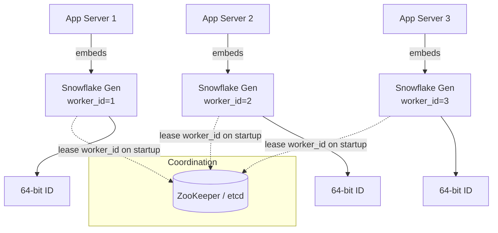

# Distributed Unique ID Generator

## Problem & Clarifications

Design a service that generates unique IDs in a distributed system (e.g., for tweets, orders, messages).

Clarifying questions and assumed answers:

- **Uniqueness?** IDs must be globally unique across the whole fleet.
- **Numeric or string?** 64-bit integer (`long`). Compact, indexes well in B-trees, fits a single DB column.
- **Sortable?** Yes — roughly **time-ordered** (k-sortable). New IDs > old IDs. This helps with range scans, cursor pagination, and clustered-index locality.
- **Throughput?** ~10,000 IDs/sec per node, with headroom to burst.
- **Latency?** Sub-millisecond, generated locally (no network round trip on the hot path).
- **Can IDs be guessable/sequential?** Strict monotonic global sequence is NOT required; we accept "roughly sorted." (If unguessability were required, we'd avoid embedding timestamps.)

## Functional Requirements

- Generate unique 64-bit IDs.
- IDs are sortable by creation time (time component is the high-order bits).
- High availability — generation must not depend on a single coordinator on the hot path.

## Non-Functional Requirements

- **Uniqueness:** zero collisions.
- **Availability:** 99.99%; no single point of failure.
- **Latency:** p99 < 1 ms (in-process generation preferred).
- **Throughput:** > 10k IDs/sec/node, scalable horizontally.
- **Sortability:** monotonic within a node, k-sorted globally.

## Capacity Estimation

- Target: 1,000,000 IDs/sec system-wide at peak.
- Snowflake sequence field = 12 bits = **4096 IDs per millisecond per node** = ~4.09M/sec/node. One node already covers the target, but we run several for HA.
- 10 bits of machine ID = **1024 nodes** maximum.
- Timestamp 41 bits in milliseconds = 2^41 ms ≈ 69.7 years from a custom epoch. Set epoch to e.g. 2024-01-01 → IDs valid until ~2093.
- Storage of an ID = 8 bytes. 1M IDs/sec × 8 bytes = 8 MB/sec of raw ID data (negligible; IDs are usually inlined into rows).

## API Design

The generator is typically an embedded library, but can be exposed as a thin RPC service:

```
POST /v1/ids            -> { "id": 7234187631045672960 }
POST /v1/ids:batch      Body { "count": 100 }
                        -> { "ids": [ ... 100 ids ... ] }
GET  /v1/ids/decode/{id} -> { "timestamp": "...", "machineId": 42, "sequence": 7 }
```

No request body needed for single generation. Batch endpoint amortizes RPC overhead when used as a service.

## Data Model / Schema

There is no persistent store for the IDs themselves. The only persisted state is **machine-ID assignment**, used to guarantee each node gets a unique worker ID.

```sql
-- ZooKeeper / etcd is preferred, but a DB table also works:
CREATE TABLE worker_assignment (
    worker_id     SMALLINT     PRIMARY KEY,   -- 0..1023
    host          VARCHAR(255) NOT NULL,
    lease_expiry  TIMESTAMP    NOT NULL,       -- renewed via heartbeat
    UNIQUE (host)
);
```

For the **DB ticket-server** alternative approach:

```sql
CREATE TABLE id_ticket (
    stub CHAR(1) NOT NULL DEFAULT 'a',
    id   BIGINT  NOT NULL AUTO_INCREMENT,
    PRIMARY KEY (id),
    UNIQUE KEY (stub)
);
-- REPLACE INTO id_ticket (stub) VALUES ('a'); SELECT LAST_INSERT_ID();
```

## High-Level Design



Each generator runs in-process. The only shared dependency (ZooKeeper) is touched once at startup to claim a worker ID, not on the hot path.

## Deep Dives

### Requirements recap: unique, sortable, 64-bit

A 64-bit signed long has 63 usable bits (sign bit kept 0 so IDs stay positive and sort correctly as signed integers). We partition those 63 bits across time, machine, and sequence.

### Approaches and trade-offs

**1. UUID (v4):** 128-bit, generated locally, no coordination. Simple and collision-free in practice.
- ✗ 128-bit (too big for our 64-bit requirement), not sortable (random), poor index locality → page splits in clustered indexes.
- UUIDv7 fixes sortability (time-ordered) but is still 128-bit.

**2. DB auto-increment / ticket server:** single MySQL with `AUTO_INCREMENT`.
- ✓ Simple, sorted, 64-bit.
- ✗ Single point of failure, write throughput bottleneck. Can shard with offset+step (server A: 1,3,5...; server B: 2,4,6...) but adding servers is painful and IDs aren't time-sortable across servers.

**3. Range / segment allocation:** a central service hands out blocks (e.g., 1000 IDs) to each node; nodes consume locally and fetch a new block when exhausted.
- ✓ Reduces coordinator load by 1000x, locally fast.
- ✗ IDs not strictly time-sorted; wasted IDs on restart; coordinator still needed periodically. (This is what Flickr / Leaf-segment do.)

**4. Snowflake (chosen):** in-process, time-sortable, 64-bit, coordination only at startup. Best fit for all requirements.

### Structure of a Snowflake ID (64 bits)

```
 0 | 0000000 00000000 00000000 00000000 00000000 0 | 00000 00000 | 0000 00000000
sign|------------ 41-bit timestamp (ms) ------------|--10-bit id--|--12-bit seq--
```

| Field      | Bits | Range / meaning                                            |
|------------|------|------------------------------------------------------------|
| Sign       | 1    | Always 0 (keeps the long positive & sortable)              |
| Timestamp  | 41   | Milliseconds since a **custom epoch** (~69 years of range) |
| Machine ID | 10   | Datacenter (5) + worker (5), or flat 0..1023               |
| Sequence   | 12   | Counter within the same millisecond, 0..4095               |

Because the timestamp occupies the high bits, IDs sort chronologically. Within one millisecond, the sequence breaks ties; across nodes, ordering is approximate (k-sorted) since clocks differ slightly.

### Clock skew & clock going backwards

This is the hardest part of Snowflake. The generator records `last_timestamp`. If the current wall clock is **less** than `last_timestamp` (NTP correction, VM pause, leap second), generating an ID would risk a collision or non-monotonic IDs.

Strategies:
- **Reject & wait (small drift):** if `now < last_timestamp` but the gap is tiny (e.g., < a few ms), busy-wait until `now >= last_timestamp`.
- **Throw (large drift):** if the clock jumped far backwards, fail loudly rather than emit a duplicate; alert ops. Better to error than corrupt.
- **Disable NTP step adjustments**; use `slew` mode (`ntpd -x`) so the clock only ever speeds up/slows down, never jumps back.
- **Monotonic clock source** where the language provides one for the "has time advanced" check.

### Sequence rollover

If more than 4096 IDs are requested in a single millisecond, the sequence overflows. The generator then spins (busy-waits) until the next millisecond and resets the sequence to 0. This caps a single node at ~4.09M IDs/sec — well above typical needs.

### Machine ID assignment

Each node must own a unique 10-bit worker ID. Options:
- **ZooKeeper/etcd:** ephemeral sequential node → automatic, releases on crash.
- **Config/IP-derived:** derive from last bits of the IP or a static config (simpler, but risk of clash on re-IP).
- **DB lease table** (shown above) with heartbeat renewal.

## Bottlenecks & Trade-offs

- **Clock dependency:** correctness hinges on monotonic, well-synced clocks. The main operational risk.
- **1024-node ceiling:** the 10-bit machine field caps the fleet. Re-partition bits if more nodes are needed (steal from sequence).
- **Not strictly globally monotonic:** only k-sorted. Fine for feeds/pagination; not a substitute for a global logical clock.
- **Guessability:** embedded timestamps leak creation time and approximate volume. If that's sensitive, encrypt the external representation or use a different scheme.
- **Snowflake vs segment:** Snowflake = best sortability + no hot-path coordination. Segment = simpler clock story but burns IDs and isn't time-ordered.

## Code

A working, thread-safe Python Snowflake generator.

```python
import time
import threading


class SnowflakeGenerator:
    """Twitter-style 64-bit Snowflake ID generator.

    Layout (high -> low bits):
        1  bit  : sign (always 0)
        41 bits : milliseconds since custom epoch
        10 bits : machine id (0..1023)
        12 bits : per-ms sequence (0..4095)
    """

    EPOCH_MS = 1_704_067_200_000  # 2024-01-01T00:00:00Z

    MACHINE_ID_BITS = 10
    SEQUENCE_BITS = 12

    MAX_MACHINE_ID = (1 << MACHINE_ID_BITS) - 1   # 1023
    MAX_SEQUENCE = (1 << SEQUENCE_BITS) - 1        # 4095

    MACHINE_ID_SHIFT = SEQUENCE_BITS               # 12
    TIMESTAMP_SHIFT = SEQUENCE_BITS + MACHINE_ID_BITS  # 22

    def __init__(self, machine_id: int):
        if not (0 <= machine_id <= self.MAX_MACHINE_ID):
            raise ValueError(f"machine_id must be 0..{self.MAX_MACHINE_ID}")
        self.machine_id = machine_id
        self._lock = threading.Lock()
        self._last_ts = -1
        self._sequence = 0

    @staticmethod
    def _now_ms() -> int:
        return int(time.time() * 1000)

    def _wait_next_ms(self, last_ts: int) -> int:
        ts = self._now_ms()
        while ts <= last_ts:
            ts = self._now_ms()
        return ts

    def next_id(self) -> int:
        with self._lock:
            ts = self._now_ms()

            if ts < self._last_ts:
                # Clock moved backwards.
                drift = self._last_ts - ts
                if drift <= 5:
                    # Small NTP correction: wait it out.
                    ts = self._wait_next_ms(self._last_ts)
                else:
                    raise RuntimeError(
                        f"Clock moved backwards by {drift} ms; refusing to generate ID"
                    )

            if ts == self._last_ts:
                # Same millisecond -> bump sequence.
                self._sequence = (self._sequence + 1) & self.MAX_SEQUENCE
                if self._sequence == 0:
                    # Sequence exhausted for this ms -> spin to next ms.
                    ts = self._wait_next_ms(self._last_ts)
            else:
                # New millisecond -> reset sequence.
                self._sequence = 0

            self._last_ts = ts

            return (
                ((ts - self.EPOCH_MS) << self.TIMESTAMP_SHIFT)
                | (self.machine_id << self.MACHINE_ID_SHIFT)
                | self._sequence
            )

    @classmethod
    def decode(cls, snowflake_id: int) -> dict:
        sequence = snowflake_id & cls.MAX_SEQUENCE
        machine_id = (snowflake_id >> cls.MACHINE_ID_SHIFT) & cls.MAX_MACHINE_ID
        ts = (snowflake_id >> cls.TIMESTAMP_SHIFT) + cls.EPOCH_MS
        return {
            "timestamp_ms": ts,
            "datetime": time.strftime("%Y-%m-%d %H:%M:%S", time.gmtime(ts / 1000)),
            "machine_id": machine_id,
            "sequence": sequence,
        }


if __name__ == "__main__":
    gen = SnowflakeGenerator(machine_id=42)
    ids = [gen.next_id() for _ in range(5)]
    for i in ids:
        print(i, gen.decode(i))
    # IDs are strictly increasing and decode back to machine_id=42.
    assert ids == sorted(ids)
    assert len(set(ids)) == len(ids)
    print("OK: monotonic and unique")
```

## Summary

- Use **Snowflake**: a 64-bit, time-sortable ID built from a 41-bit timestamp, 10-bit machine ID, and 12-bit sequence.
- IDs are generated **in-process** (sub-ms, no hot-path coordination); ZooKeeper/etcd only assigns the machine ID at startup.
- One node yields ~4M IDs/sec; the design caps at 1024 nodes and ~69 years of timestamp range.
- The central operational risk is **clock skew** — guard against backward clock jumps (wait on small drift, fail on large drift; run NTP in slew mode).
- Alternatives: UUID (too big, unsorted), DB ticket server (SPOF/bottleneck), segment allocation (simpler clock story but burns IDs and isn't time-ordered).
