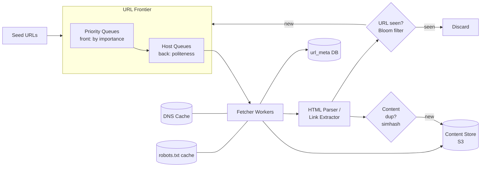

# Scalable Web Crawler

## Problem & Clarifications

Design a web crawler that downloads web pages starting from a set of seed URLs, used to build a search index / corpus.

Clarifying questions and assumed answers:

- **Purpose?** Build a search-engine index. (Could also be: copyright detection, training corpus, monitoring — affects content processing only.)
- **Scope?** HTML pages primarily; we record but don't deeply parse images/video/PDF.
- **Scale?** ~1 billion pages/month.
- **Freshness?** Re-crawl periodically; high-change pages (news) more often than static pages.
- **Politeness?** Must respect `robots.txt` and not overload any single host.
- **Duplicate handling?** Both URL dedup (don't fetch the same URL twice) and content dedup (don't store the same content twice).

## Functional Requirements

- Start from seed URLs, fetch pages, extract links, recurse (BFS).
- Respect `robots.txt` and crawl-delay / politeness per host.
- Avoid duplicate URLs and duplicate content.
- Prioritize URLs (e.g., PageRank, freshness, domain importance).
- Be extensible (new content types, new parsers).

## Non-Functional Requirements

- **Scalability:** horizontally scalable to billions of pages.
- **Politeness:** never hammer a single host; respect crawl-delay.
- **Robustness:** survive malformed HTML, crawler traps, slow servers, crashes (resumable).
- **Freshness:** re-crawl to keep the corpus current.
- **Extensibility:** pluggable modules.

## Capacity Estimation

- Target: **1 billion pages/month** = ~400 pages/sec average; provision for ~4000 pages/sec peak (10x).
- Average page size: 500 KB (HTML + inline). Storage = 1e9 × 500 KB = **500 TB/month** raw; with compression (~5:1 for HTML text) ≈ **100 TB/month**.
- Metadata per URL (URL, status, hash, timestamps) ≈ 1 KB → 1e9 × 1 KB = **1 TB/month** of metadata.
- Seen-URL set: ~1e9 distinct URLs. A Bloom filter at 10 bits/element ≈ 1.25 GB — fits in memory. (Exact set in a DB would be ~ hundreds of GB.)
- DNS: ~1 lookup per new host; cache aggressively (hit rate > 95%).

## API Design

Internal control-plane APIs (the crawler is a pipeline, not a public service):

```
POST /v1/seeds              Body { "urls": [ ... ] }      -> enqueue seeds
GET  /v1/status             -> { pagesCrawled, queueDepth, qps }
POST /v1/recrawl            Body { "domain": "x.com" }    -> force refresh
GET  /v1/page?url=...       -> { status, contentHash, lastCrawled, storagePath }
```

## Data Model / Schema

```sql
-- URL metadata / crawl state
CREATE TABLE url_meta (
    url_hash      BIGINT      PRIMARY KEY,   -- 64-bit hash of normalized URL
    url           TEXT        NOT NULL,
    host          VARCHAR(255) NOT NULL,
    status        SMALLINT    NOT NULL,       -- last HTTP status
    content_hash  BIGINT,                     -- simhash / md5 of body
    priority      INT         NOT NULL DEFAULT 0,
    first_seen    TIMESTAMP   NOT NULL,
    last_crawled  TIMESTAMP,
    next_crawl_at TIMESTAMP,                   -- for freshness scheduling
    fetch_count   INT         NOT NULL DEFAULT 0
);
CREATE INDEX idx_next_crawl ON url_meta (next_crawl_at);
CREATE INDEX idx_host       ON url_meta (host);

-- Per-host politeness state
CREATE TABLE host_policy (
    host          VARCHAR(255) PRIMARY KEY,
    crawl_delay_s FLOAT        NOT NULL DEFAULT 1.0,  -- from robots.txt
    robots_txt    TEXT,
    robots_fetched_at TIMESTAMP,
    last_access_at    TIMESTAMP
);

-- Content store is object storage (S3); table just tracks the pointer
CREATE TABLE content_blob (
    content_hash  BIGINT      PRIMARY KEY,
    storage_path  TEXT        NOT NULL,         -- s3://corpus/ab/cd/<hash>
    size_bytes    BIGINT,
    fetched_at    TIMESTAMP
);
```

## High-Level Design



The classic Mercator design: a **URL Frontier** with a front (priority selection) and back (per-host politeness) set of queues feeds a pool of fetcher workers; extracted links are deduped and fed back into the frontier.

## Deep Dives

### BFS traversal & the frontier

The web is a graph; crawling is a graph traversal, almost always **BFS** (FIFO-ish), because BFS naturally spreads load across hosts and surfaces high-value pages (which tend to be shallow). Pure DFS would dive deep into one host and violate politeness. The "queue" is the **URL Frontier**.

### URL Frontier: politeness + priority

A naive single FIFO queue can't enforce both priority and politeness. The Mercator two-stage design:

- **Front queues (prioritization):** N queues, one per priority level. A prioritizer assigns each URL a priority (PageRank, freshness need, domain importance) and routes it to the matching queue. A biased selector picks higher-priority queues more often.
- **Back queues (politeness):** M queues, each mapped to exactly one host at a time. A worker reading a back queue waits `crawl_delay` between requests to that host. A min-heap of `(next_allowed_time, queue_id)` tells workers which host is ready next.

This guarantees: at most one in-flight request per host, spaced by crawl-delay, while still honoring priority.

### DNS resolution

DNS is often the slowest step (tens of ms, sometimes synchronous/blocking in libraries). Mitigations:
- **DNS cache** with TTL respect, plus a custom async resolver to avoid blocking worker threads.
- Pre-resolve hosts when a URL enters the frontier.

### URL dedup — seen-URL set (Bloom filter)

Before adding a URL to the frontier, check if it's already seen. With ~1e9 URLs, an exact in-memory set is large. A **Bloom filter** gives O(1) membership with ~1.25 GB at 10 bits/elem and a small false-positive rate (≈1%).

- **False positive** → we skip a URL we haven't actually crawled (acceptable, small loss of coverage).
- **No false negatives** → we never re-crawl a seen URL erroneously.
- Normalize URLs first (lowercase host, strip fragments `#...`, sort query params, resolve `.`/`..`) so trivially-different URLs map to the same key.
- For exactness at scale, back the filter with a sharded key-value store of url_hashes.

### robots.txt

Before crawling a host, fetch and cache `https://host/robots.txt`. Honor `Disallow` rules and `Crawl-delay`. Cache the parsed rules per host (e.g., 24h TTL) to avoid re-fetching on every URL.

### Content dedup — hashing / simhash

Many URLs serve identical or near-identical content (mirrors, session IDs in URLs, syndicated articles).
- **Exact dup:** MD5/SHA of the normalized body; if the hash exists in `content_blob`, skip storing.
- **Near dup:** **SimHash** — produce a 64-bit fingerprint where similar documents have small Hamming distance. Compare against stored fingerprints (within Hamming distance ≤ 3 → near-duplicate). Detects boilerplate-only differences. SimHash is locality-sensitive, so it can be indexed by banding for sub-linear lookup.

### Crawler traps & freshness

- **Traps:** infinite calendars, dynamically generated infinite link spaces, very deep paths. Defenses: max URL length, max path depth, max pages per host, blacklist known traps, detect cycles via the seen-set.
- **Freshness:** store `next_crawl_at` per URL. Pages that change frequently (estimated from observed change rate) get shorter re-crawl intervals; static pages longer. A scheduler re-enqueues URLs whose `next_crawl_at` has passed.

### Distributed coordination

- **Sharding by host:** hash(host) → worker shard, so all URLs of a host are handled by one node — naturally enforces per-host politeness and localizes robots/DNS caches.
- **Frontier as a distributed queue** (Kafka / a sharded Redis) so workers are stateless and the queue survives restarts.
- **Checkpointing:** persist frontier + seen-set so a crash doesn't lose progress (resumable).

## Bottlenecks & Trade-offs

- **Politeness vs throughput:** crawl-delay caps per-host rate; total throughput comes from breadth (many hosts in parallel), not depth.
- **Bloom filter:** memory-efficient but probabilistic — tune size vs false-positive rate; lose a tiny fraction of pages.
- **SimHash threshold:** too strict → store dups; too loose → drop distinct pages. Tune Hamming distance.
- **DNS** can dominate latency; caching is essential.
- **Storage cost:** 100 TB/month compressed — content dedup directly reduces this.
- **Push vs pull frontier:** centralized frontier is simpler to prioritize but a scaling chokepoint; sharded-by-host scales but complicates global priority.

## Code

URL frontier (priority + per-host politeness) + Bloom-filter dedup + worker loop.

```python
import hashlib
import heapq
import time
import threading
from collections import defaultdict, deque
from urllib.parse import urlsplit, urlunsplit


# ---------- URL normalization & dedup ----------

class BloomFilter:
    """Simple Bloom filter for the 'seen URLs' set."""

    def __init__(self, n_bits: int = 1 << 24, n_hashes: int = 7):
        self.n_bits = n_bits
        self.n_hashes = n_hashes
        self.bits = bytearray(n_bits // 8)

    def _hashes(self, item: str):
        data = item.encode("utf-8")
        for i in range(self.n_hashes):
            h = hashlib.md5(data + i.to_bytes(2, "big")).digest()
            yield int.from_bytes(h[:8], "big") % self.n_bits

    def add(self, item: str) -> None:
        for pos in self._hashes(item):
            self.bits[pos // 8] |= 1 << (pos % 8)

    def __contains__(self, item: str) -> bool:
        return all(self.bits[pos // 8] & (1 << (pos % 8)) for pos in self._hashes(item))


def normalize_url(url: str) -> str:
    parts = urlsplit(url)
    scheme = parts.scheme.lower() or "http"
    netloc = parts.netloc.lower()
    path = parts.path or "/"
    # drop fragment, keep sorted query
    query = "&".join(sorted(parts.query.split("&"))) if parts.query else ""
    return urlunsplit((scheme, netloc, path, query, ""))


# ---------- URL Frontier ----------

class URLFrontier:
    """Mercator-style frontier: priority front + per-host politeness back."""

    def __init__(self, default_delay: float = 1.0):
        self.default_delay = default_delay
        self.lock = threading.Lock()
        # front: priority -> deque of urls (lower number = higher priority)
        self.front = defaultdict(deque)
        # back: host -> deque of urls
        self.host_queues = defaultdict(deque)
        # min-heap of (next_allowed_time, host) for ready hosts
        self.ready_heap = []
        self.seen = BloomFilter()

    def add_url(self, url: str, priority: int = 5) -> None:
        url = normalize_url(url)
        with self.lock:
            if url in self.seen:
                return
            self.seen.add(url)
            self.front[priority].append(url)

    def _route_to_host_queues(self) -> None:
        # Move URLs from priority front queues into per-host back queues.
        for prio in sorted(self.front):
            q = self.front[prio]
            while q:
                url = q.popleft()
                host = urlsplit(url).netloc
                was_empty = not self.host_queues[host]
                self.host_queues[host].append(url)
                if was_empty:
                    heapq.heappush(self.ready_heap, (time.time(), host))

    def next_url(self):
        """Return (url, host) that is polite to fetch now, else None."""
        with self.lock:
            self._route_to_host_queues()
            if not self.ready_heap:
                return None
            ready_time, host = self.ready_heap[0]
            if ready_time > time.time():
                return None  # nothing polite to fetch yet
            heapq.heappop(self.ready_heap)
            if not self.host_queues[host]:
                return None
            url = self.host_queues[host].popleft()
            return url, host

    def mark_done(self, host: str, crawl_delay: float = None) -> None:
        delay = crawl_delay if crawl_delay is not None else self.default_delay
        with self.lock:
            if self.host_queues[host]:
                # re-arm this host after the politeness delay
                heapq.heappush(self.ready_heap, (time.time() + delay, host))


# ---------- Content dedup ----------

class ContentDedup:
    def __init__(self):
        self.hashes = set()

    def is_duplicate(self, body: bytes) -> bool:
        h = hashlib.md5(body).hexdigest()
        if h in self.hashes:
            return True
        self.hashes.add(h)
        return False


# ---------- Worker loop (sketch) ----------

def fetch(url: str):
    """Stub fetcher. Returns (status, body, links). Replace with real HTTP."""
    body = f"<html>page for {url} <a href='{url}/next'>n</a></html>".encode()
    links = [url + "/next"]
    return 200, body, links


def worker_loop(frontier: URLFrontier, dedup: ContentDedup,
                store_fn, max_pages: int):
    crawled = 0
    while crawled < max_pages:
        item = frontier.next_url()
        if item is None:
            time.sleep(0.05)  # backoff: nothing polite to fetch
            continue
        url, host = item

        # (Real impl: check robots.txt for host before fetching.)
        status, body, links = fetch(url)

        if status == 200 and not dedup.is_duplicate(body):
            store_fn(url, body)
            crawled += 1
            for link in links:
                frontier.add_url(link, priority=5)

        frontier.mark_done(host, crawl_delay=0.0)  # 0 for demo; use real delay
    return crawled


if __name__ == "__main__":
    frontier = URLFrontier()
    dedup = ContentDedup()
    for seed in ["http://a.com", "http://b.com"]:
        frontier.add_url(seed, priority=1)

    stored = []
    n = worker_loop(frontier, dedup, lambda u, b: stored.append(u), max_pages=6)
    print(f"crawled {n} pages:", stored)
```

## Summary

- Model crawling as **BFS over a URL Frontier**: a Mercator-style front (priority) + back (per-host politeness) queue.
- **Dedup at two layers:** URL-level via a Bloom filter (memory-efficient, tiny false-positive rate) and content-level via MD5 (exact) + SimHash (near-dup).
- **Politeness** is enforced per host with crawl-delay and one in-flight request per host; throughput comes from breadth across many hosts.
- Cache **DNS** and **robots.txt** aggressively; shard work by host for locality and resumability.
- Handle **traps** (depth/page limits) and **freshness** (`next_crawl_at` scheduling by observed change rate).
- ~1B pages/month ≈ 400 pages/sec average, ~100 TB/month compressed storage after content dedup.
