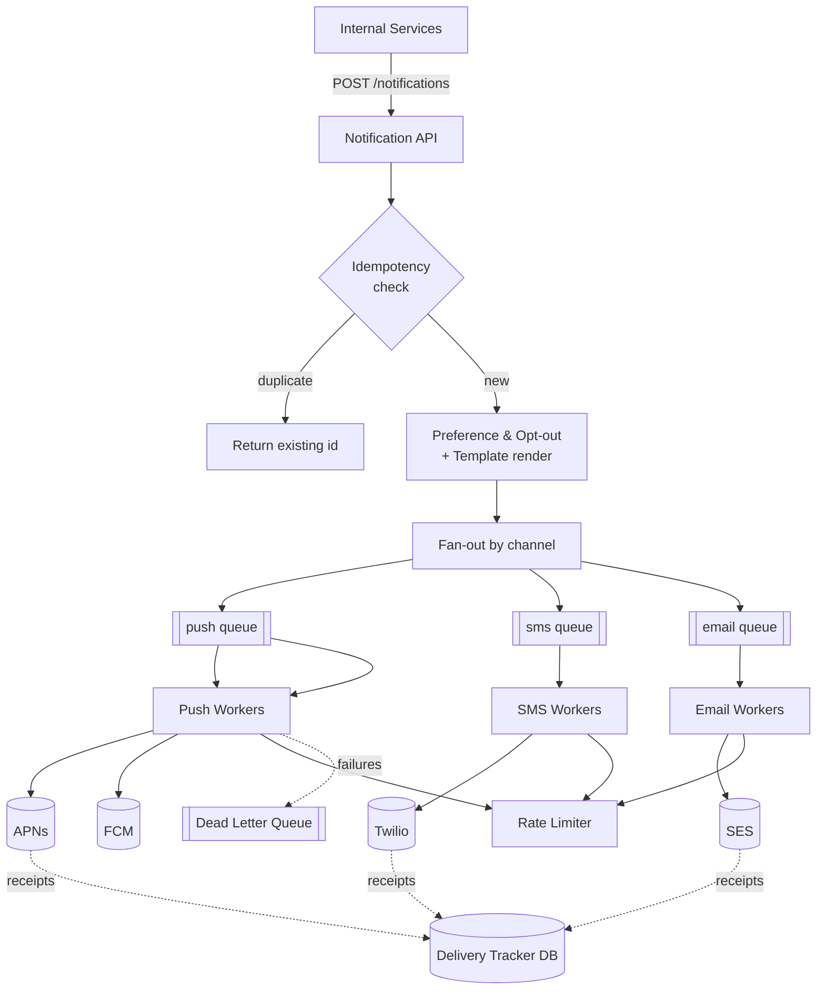

# Notification System (Push / SMS / Email)

## Problem & Clarifications

Design a system that sends notifications to users across multiple channels: mobile push, SMS, and email.

Clarifying questions and assumed answers:

- **Channels?** iOS push (APNs), Android push (FCM), SMS, email.
- **Who triggers notifications?** Internal services (e.g., "order shipped", "new follower") and scheduled jobs. Soft real-time delivery.
- **Volume?** ~10 million notifications/day, peaking ~50M on campaign days.
- **Reliability?** At-least-once delivery with **idempotency** so retries don't double-send.
- **User control?** Per-channel opt-out and quiet hours / preferences.
- **Templating?** Yes — templated content with localization.
- **Ordering?** Best-effort; strict ordering not required.

## Functional Requirements

- Accept notification requests from internal services via API/queue.
- Fan out to the right channels per user preference.
- Integrate with external providers: APNs, FCM, SMS gateway (Twilio), email (SES).
- Render templates with variables and localization.
- Respect user opt-out, preferences, and rate limits.
- Retry transient failures; dedupe; track delivery status.

## Non-Functional Requirements

- **Reliability:** at-least-once + idempotent (no duplicate sends on retry).
- **Scalability:** 50M/day peak (~580/sec avg, design for ~5000/sec peak).
- **Availability:** 99.9%; a down provider must not block other channels.
- **Latency:** soft real-time, p99 < a few seconds end-to-end (non-campaign).
- **Decoupling:** producers don't know about providers.

## Capacity Estimation

- Avg: 10M/day = ~116/sec. Peak campaign: 50M/day spread over hours, bursting to ~5000/sec.
- Channel mix (assume): 60% push, 25% email, 15% SMS.
- SMS cost-sensitive: 15% × 50M = 7.5M SMS on a campaign day (cost & rate-limit driver).
- Notification record ~1 KB. 50M/day × 1 KB = **50 GB/day** of event/log data → tiered to cold storage after 30 days.
- Queue throughput: must absorb 5000 msgs/sec; Kafka partition at ~10k msg/sec/partition → a handful of partitions per channel.

## API Design

```
POST /v1/notifications
Headers: Idempotency-Key: <uuid>          # dedup key from caller
Body: {
  "userId": "u_123",
  "templateId": "ORDER_SHIPPED",
  "channels": ["push", "email"],          # optional; default = user prefs
  "data": { "orderId": "A1", "eta": "Tue" },
  "priority": "high"                        # high | normal | low
}
-> 202 Accepted { "notificationId": "n_789", "status": "QUEUED" }

GET  /v1/notifications/{id}     -> { status, perChannel: [...] }
GET  /v1/users/{id}/preferences
PUT  /v1/users/{id}/preferences Body { push:true, sms:false, quietHours:[22,7] }
```

`202 Accepted` because delivery is asynchronous. The `Idempotency-Key` is the dedup contract.

## Data Model / Schema

```sql
CREATE TABLE notification (
    id              BIGINT      PRIMARY KEY,       -- snowflake id
    idempotency_key VARCHAR(64) NOT NULL,
    user_id         VARCHAR(64) NOT NULL,
    template_id     VARCHAR(64) NOT NULL,
    payload         JSONB       NOT NULL,
    priority        SMALLINT    NOT NULL,
    created_at      TIMESTAMP   NOT NULL,
    UNIQUE (idempotency_key)                       -- enforces dedup
);

CREATE TABLE delivery_attempt (
    id              BIGINT      PRIMARY KEY,
    notification_id BIGINT      NOT NULL REFERENCES notification(id),
    channel         VARCHAR(16) NOT NULL,          -- push|sms|email
    provider        VARCHAR(32) NOT NULL,          -- apns|fcm|twilio|ses
    status          VARCHAR(16) NOT NULL,          -- queued|sent|delivered|failed
    attempt_no      SMALLINT    NOT NULL,
    provider_msg_id VARCHAR(128),                  -- for delivery receipts
    error           TEXT,
    updated_at      TIMESTAMP   NOT NULL
);
CREATE INDEX idx_da_notif ON delivery_attempt (notification_id);

CREATE TABLE user_preference (
    user_id     VARCHAR(64) PRIMARY KEY,
    push_opt_in BOOLEAN NOT NULL DEFAULT TRUE,
    sms_opt_in  BOOLEAN NOT NULL DEFAULT TRUE,
    email_opt_in BOOLEAN NOT NULL DEFAULT TRUE,
    quiet_start SMALLINT,                           -- hour 0..23
    quiet_end   SMALLINT,
    locale      VARCHAR(8) NOT NULL DEFAULT 'en'
);

CREATE TABLE device_token (
    user_id  VARCHAR(64) NOT NULL,
    platform VARCHAR(8)  NOT NULL,                  -- ios|android
    token    VARCHAR(256) NOT NULL,
    active    BOOLEAN     NOT NULL DEFAULT TRUE,
    PRIMARY KEY (user_id, token)
);
```

## High-Level Design



Producers hit a thin API; the system fans out into per-channel queues; channel-specific workers call providers, rate-limit, retry, and record delivery status. Per-channel queues isolate failures (a down SMS provider doesn't block push).

## Deep Dives

### Fan-out

The API resolves the user's enabled channels and devices, then publishes one message per (channel, device) to the channel's queue. Per-channel queues let each channel scale independently and fail in isolation. For broadcast/campaigns, a separate batch fan-out service expands an audience segment into millions of per-user messages, throttled to protect downstream providers.

### Provider integration (APNs / FCM / SMS / email)

- **APNs (iOS):** HTTP/2 with a JWT/cert, per-device token, handles `BadDeviceToken` → mark token inactive.
- **FCM (Android):** HTTP API with server key, batch send up to 500 tokens.
- **SMS (Twilio):** REST send; handle carrier errors, opt-out keywords (STOP), cost per segment.
- **Email (SES/SendGrid):** SMTP/API; handle bounces & complaints (suppression list).

Each is wrapped behind a common `ChannelProvider` interface so workers are provider-agnostic and providers are swappable/multi-homed (failover to a secondary SMS vendor).

### Queues & retries

Use durable queues (Kafka / SQS). Workers consume, attempt delivery, and:
- **Transient failure** (5xx, timeout, throttled) → retry with **exponential backoff + jitter** (e.g., 1s, 2s, 4s, ... capped), up to N attempts.
- **Permanent failure** (bad token, invalid number) → no retry; mark token inactive / suppress.
- After max retries → push to a **Dead Letter Queue** for inspection/alerting.

### Rate limiting

Two levels:
- **Provider limits:** APNs/Twilio/SES impose QPS caps. A distributed **token-bucket** (in Redis) per provider throttles workers to stay under quota.
- **Per-user limits:** avoid spamming a user (e.g., max 5 push/hour). Also a token bucket keyed by user.

### Deduplication & idempotency

- **Caller-supplied `Idempotency-Key`** stored with a UNIQUE constraint; a retried request with the same key returns the original notification (no re-enqueue).
- **Worker-level idempotency:** before calling a provider, check/set a key like `sent:{notificationId}:{channel}:{deviceToken}` in Redis (with TTL). If already set, skip — prevents double-send when a message is redelivered by the queue (at-least-once delivery).

### User preferences / opt-out / quiet hours

Before fan-out, load preferences: drop disabled channels, suppress during quiet hours (or defer to after quiet hours), honor global opt-out and unsubscribe lists. Transactional notifications (password reset) may bypass marketing opt-outs per policy.

### Templating

Templates stored centrally with placeholders and per-locale variants. The render step merges `data` into the localized template (subject/body/push title) before enqueueing, so workers send fully-rendered payloads. Versioned templates allow safe edits.

### Delivery tracking

Providers send asynchronous **delivery receipts** (webhooks for SMS/email, feedback for push). A tracker service consumes these and updates `delivery_attempt.status` (sent → delivered / bounced / failed). Powers dashboards, retries, and suppression-list updates.

## Bottlenecks & Trade-offs

- **At-least-once vs exactly-once:** queues give at-least-once; we layer idempotency keys to approximate exactly-once. True exactly-once is impractical with external providers.
- **Provider as bottleneck/SPOF:** mitigate with rate limiting, multi-vendor failover, and per-channel isolation.
- **Hot campaigns:** a 50M burst can overwhelm providers and the DB — use a batch fan-out throttle and priority queues (transactional > marketing).
- **Storage growth:** 50 GB/day of delivery logs → TTL/tiering.
- **Preference lookups** on the hot path — cache preferences and device tokens in Redis.
- **Ordering** is best-effort; per-channel partitioning by user can give per-user ordering if needed.

## Code

A queue-based dispatcher with retries, backoff, and idempotency.

```python
import time
import random
import uuid
import threading
import queue
from dataclasses import dataclass, field
from typing import Callable


@dataclass
class Notification:
    notification_id: str
    user_id: str
    channel: str            # push | sms | email
    device_token: str
    rendered_body: str
    idempotency_key: str
    attempt: int = 0


class IdempotencyStore:
    """Stands in for Redis SET NX with TTL."""

    def __init__(self):
        self._seen = set()
        self._lock = threading.Lock()

    def mark_if_new(self, key: str) -> bool:
        """Return True if this key is new (i.e., we should send)."""
        with self._lock:
            if key in self._seen:
                return False
            self._seen.add(key)
            return True


class TokenBucket:
    """Simple per-provider rate limiter."""

    def __init__(self, rate_per_sec: float, capacity: float):
        self.rate = rate_per_sec
        self.capacity = capacity
        self.tokens = capacity
        self.last = time.monotonic()
        self.lock = threading.Lock()

    def acquire(self) -> bool:
        with self.lock:
            now = time.monotonic()
            self.tokens = min(self.capacity, self.tokens + (now - self.last) * self.rate)
            self.last = now
            if self.tokens >= 1:
                self.tokens -= 1
                return True
            return False


class TransientError(Exception):
    pass


class PermanentError(Exception):
    pass


class NotificationDispatcher:
    MAX_ATTEMPTS = 5
    BASE_BACKOFF = 0.5  # seconds

    def __init__(self, provider_send: Callable[[Notification], str],
                 rate_limiter: TokenBucket):
        self.in_q: "queue.Queue[Notification]" = queue.Queue()
        self.dlq: list[Notification] = []
        self.provider_send = provider_send
        self.rate_limiter = rate_limiter
        self.idem = IdempotencyStore()
        self.delivery_log: list[tuple] = []

    def enqueue(self, n: Notification) -> None:
        self.in_q.put(n)

    def _backoff(self, attempt: int) -> float:
        # exponential backoff with full jitter
        return random.uniform(0, self.BASE_BACKOFF * (2 ** attempt))

    def _idem_key(self, n: Notification) -> str:
        return f"sent:{n.notification_id}:{n.channel}:{n.device_token}"

    def process_one(self, n: Notification) -> None:
        # Idempotency: skip if this exact send already happened (queue redelivery).
        if not self.idem.mark_if_new(self._idem_key(n)):
            self.delivery_log.append((n.notification_id, n.channel, "skipped_duplicate"))
            return

        # Rate limit against the provider quota.
        while not self.rate_limiter.acquire():
            time.sleep(0.01)

        try:
            provider_msg_id = self.provider_send(n)
            self.delivery_log.append((n.notification_id, n.channel, "sent", provider_msg_id))
        except PermanentError as e:
            self.delivery_log.append((n.notification_id, n.channel, f"failed_permanent:{e}"))
        except TransientError as e:
            n.attempt += 1
            if n.attempt >= self.MAX_ATTEMPTS:
                self.dlq.append(n)
                self.delivery_log.append((n.notification_id, n.channel, "dead_letter"))
            else:
                # On retry, allow the idempotency key again so the retry can proceed.
                self.idem._seen.discard(self._idem_key(n))
                delay = self._backoff(n.attempt)
                threading.Timer(delay, self.in_q.put, args=(n,)).start()
                self.delivery_log.append(
                    (n.notification_id, n.channel, f"retry#{n.attempt}_in_{delay:.2f}s"))

    def run(self, max_messages: int) -> None:
        processed = 0
        while processed < max_messages:
            try:
                n = self.in_q.get(timeout=2)
            except queue.Empty:
                break
            self.process_one(n)
            processed += 1


# ---------- demo ----------

def flaky_provider(n: Notification) -> str:
    """Fails transiently ~40% of the time, else returns a provider message id."""
    if random.random() < 0.4:
        raise TransientError("provider 503")
    return f"apns-{uuid.uuid4().hex[:8]}"


if __name__ == "__main__":
    random.seed(1)
    dispatcher = NotificationDispatcher(
        provider_send=flaky_provider,
        rate_limiter=TokenBucket(rate_per_sec=1000, capacity=1000),
    )
    for i in range(3):
        dispatcher.enqueue(Notification(
            notification_id=f"n_{i}",
            user_id=f"u_{i}",
            channel="push",
            device_token=f"tok_{i}",
            rendered_body="Your order shipped!",
            idempotency_key=str(uuid.uuid4()),
        ))
    dispatcher.run(max_messages=50)
    for row in dispatcher.delivery_log:
        print(row)
    print("DLQ:", [n.notification_id for n in dispatcher.dlq])
```

## Summary

- A thin **async API** (`202 Accepted`) accepts requests with an **Idempotency-Key**, resolves preferences, renders templates, and **fans out into per-channel queues**.
- **Per-channel workers** call providers (APNs/FCM/Twilio/SES) behind a common interface, with **token-bucket rate limiting**, **exponential backoff retries**, and a **Dead Letter Queue**.
- **At-least-once + idempotency keys** (caller-level UNIQUE + worker-level Redis SET NX) prevent duplicate sends.
- **Preferences/opt-out/quiet-hours** and **templating/localization** are applied before fan-out; **delivery receipts** update tracking and suppression lists.
- Per-channel isolation means a single failing provider degrades only its channel; scale each channel independently to handle ~5000/sec campaign peaks.
