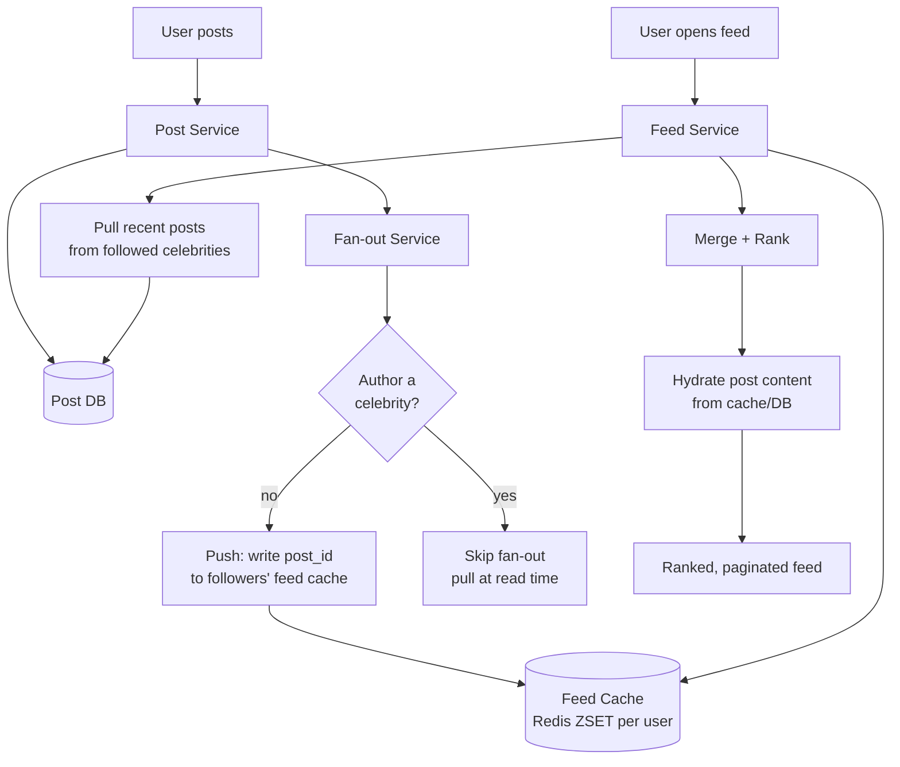

# Social News Feed (Fan-out)

## Problem & Clarifications

Design the news feed for a social network (think Twitter/Instagram home timeline): when a user opens the app, they see a ranked list of recent posts from accounts they follow.

Clarifying questions and assumed answers:

- **What is in the feed?** Posts from accounts the user follows, most-relevant/recent first.
- **Read or write heavy?** Heavily **read-heavy** (users scroll far more than they post).
- **Ordering?** Ranked (relevance + recency), not strictly chronological.
- **Scale?** 500M DAU, ~300 follows per user on average, with some celebrities followed by tens of millions.
- **Latency?** Feed load p99 < 200 ms.
- **Real-time?** Near real-time — new posts should appear within seconds.

## Functional Requirements

- Publish a post.
- Build a user's home feed from accounts they follow.
- Rank the feed (not purely chronological).
- Paginate (infinite scroll).

## Non-Functional Requirements

- **Read latency:** p99 < 200 ms for feed fetch.
- **Scalability:** 500M DAU; fan-out must handle celebrities (high follower counts).
- **Availability:** 99.99%; stale-but-available beats unavailable.
- **Eventual consistency** is acceptable (a post may take a few seconds to appear).
- **Freshness:** posts visible within seconds.

## Capacity Estimation

- 500M DAU. Assume each user loads the feed ~10×/day → **5B feed reads/day** ≈ 58k reads/sec avg, ~300k/sec peak.
- Assume each user posts ~2×/day → **1B posts/day** ≈ 11.6k writes/sec avg.
- Avg fan-out (push model): 1B posts × 300 followers = **300B feed writes/day** ≈ 3.5M writes/sec — huge; this is why hybrid exists.
- Feed cache: store ~500 post IDs per active user. 500M × 500 × 8 bytes = **2 TB** of feed-ID cache (fits in a Redis cluster).
- Post storage: 1B posts/day × 1 KB ≈ **1 TB/day** of post metadata.

## API Design

```
POST /v1/posts                Body { "text": "...", "mediaIds": [...] }
                              -> { "postId": "p_123", "createdAt": "..." }

GET  /v1/feed?limit=20&cursor=<opaque>
                              -> { "items": [ {postId, author, text, score, ...} ],
                                   "nextCursor": "<opaque>" }

POST /v1/follow               Body { "targetUserId": "u_9" }
DELETE /v1/follow/{targetUserId}
```

The feed cursor is opaque (encodes the last score/ID seen) for stable pagination.

## Data Model / Schema

```sql
-- Posts (source of truth)
CREATE TABLE post (
    id          BIGINT      PRIMARY KEY,        -- snowflake (time-sortable!)
    author_id   BIGINT      NOT NULL,
    text        TEXT,
    media_ids   JSONB,
    created_at  TIMESTAMP   NOT NULL
);
CREATE INDEX idx_post_author ON post (author_id, id DESC);

-- Social graph
CREATE TABLE follow (
    follower_id  BIGINT NOT NULL,
    followee_id  BIGINT NOT NULL,
    created_at   TIMESTAMP NOT NULL,
    PRIMARY KEY (follower_id, followee_id)
);
CREATE INDEX idx_followers ON follow (followee_id);   -- "who follows X" (for fan-out)

-- Precomputed feed (push model) -- typically Redis, shown as SQL for clarity
CREATE TABLE user_feed (
    user_id  BIGINT NOT NULL,
    post_id  BIGINT NOT NULL,
    score    DOUBLE NOT NULL,         -- ranking score
    PRIMARY KEY (user_id, post_id)
);
-- In Redis: ZSET key=feed:{user_id}, member=post_id, score=rank_score
```

## High-Level Design



This is the **hybrid** model: push for normal users, pull for celebrities, merged at read time.

## Deep Dives

### Fan-out on write (push) vs read (pull) vs hybrid

**Fan-out on write (push):** when a user posts, immediately write the post ID into the feed cache (a Redis ZSET) of every follower.
- ✓ Reads are O(1) — feed is precomputed; great read latency.
- ✗ Writes are expensive (one post → N follower writes); a celebrity with 50M followers triggers 50M writes ("fan-out storm"). Wastes work for inactive followers.

**Fan-out on read (pull):** store only the author's own posts; at read time, gather posts from everyone the user follows, merge, and rank.
- ✓ Cheap writes; no wasted work; always fresh.
- ✗ Expensive reads (must query hundreds of followees and merge every load) → high read latency at scale.

**Hybrid (chosen):**
- Use **push** for the vast majority (normal users) so reads stay fast.
- Use **pull** for **celebrities** (followers above a threshold, e.g., > 100k): do NOT fan their posts out; instead, at read time, fetch the followed celebrities' recent posts and merge into the pushed feed.
- This bounds write amplification while keeping reads fast for everyone.

### The celebrity (hot key) problem

Without the hybrid split, a single celebrity post causes tens of millions of feed writes within seconds — a write storm that delays delivery and overloads the cache. Solution: mark high-follower accounts as "pull" accounts. Their followers' feeds are assembled by merging:
1. The precomputed pushed feed (from normal followees), plus
2. A small live query for recent posts from the handful of celebrities they follow.

The merge cost is bounded because a user follows only a few celebrities even if they follow many people.

### Feed ranking

Pure recency is simple but low-quality. A ranking score blends signals. A common form:

```
score = w_recency * recency_decay(age)
      + w_affinity * affinity(viewer, author)
      + w_engagement * engagement_rate(post)
      + w_type * content_type_boost
```

- **recency_decay** uses exponential time decay (e.g., `0.5 ** (age_hours / half_life)`).
- **affinity** = how much the viewer interacts with that author (likes, DMs, profile visits).
- **engagement** = early like/comment velocity (EdgeRank-style).
- ML models (gradient-boosted trees / DNNs) increasingly produce the score; the heuristic is a strong baseline and fallback.

The score is stored in the ZSET so the feed is already sorted; re-ranking can happen at read time for freshness signals.

### Caching

- **Feed cache:** Redis ZSET per user holding ~500 recent post IDs (score = rank). Truncate beyond 500 to bound memory.
- **Post (content) cache:** hot posts cached separately; the feed stores only IDs, then a **hydration** step fetches content in bulk (multi-get) — avoids duplicating post bodies across millions of feeds.
- **Social-graph cache:** follower lists cached for fan-out.

### Pagination

Use **cursor-based** pagination, not OFFSET. The cursor encodes the last `(score, post_id)` seen; the next page fetches items below that score. Stable under inserts and O(1) per page (vs OFFSET's O(n) skip). Snowflake post IDs being time-sortable helps tie-breaking.

### Storage

- **Posts:** sharded relational/wide-column store (e.g., by post ID), source of truth.
- **Feeds:** Redis (ephemeral, rebuildable from posts + graph if lost).
- **Graph:** dedicated store; index both directions (followers and followees).

## Bottlenecks & Trade-offs

- **Push vs pull:** push optimizes reads at the cost of write amplification; pull the reverse. Hybrid balances them but adds merge complexity at read time.
- **Celebrity threshold tuning:** too low → too many pull users (slow reads); too high → write storms persist.
- **Fan-out lag:** push to inactive users wastes resources; some systems only fan out to recently-active followers and lazily build feeds for the rest.
- **Consistency:** feed is eventually consistent; a brief delay before a post appears is acceptable.
- **Hot post hydration:** popular posts are read from millions of feeds — cache content aggressively to avoid hot keys on the post DB.
- **Memory cost:** ~2 TB of feed-ID cache; bounded by truncating each feed to ~500 entries.

## Code

Push & pull feed generation plus a ranking score function.

```python
import time
import heapq
import math
from collections import defaultdict
from dataclasses import dataclass


@dataclass
class Post:
    post_id: int          # snowflake-style, time-sortable
    author_id: int
    created_at: float     # epoch seconds


# ---------- Ranking ----------

def recency_decay(age_seconds: float, half_life_hours: float = 6.0) -> float:
    age_hours = age_seconds / 3600.0
    return 0.5 ** (age_hours / half_life_hours)


def rank_score(post: Post, viewer_id: int, now: float,
               affinity: dict, engagement: dict) -> float:
    """Blend recency, viewer<->author affinity, and engagement."""
    w_recency, w_affinity, w_engagement = 1.0, 2.0, 1.5
    rec = recency_decay(now - post.created_at)
    aff = affinity.get((viewer_id, post.author_id), 0.0)
    eng = engagement.get(post.post_id, 0.0)
    return w_recency * rec + w_affinity * aff + w_engagement * eng


# ---------- Storage stubs ----------

class FeedStore:
    """Per-user feed cache (Redis ZSET analog): user_id -> {post_id: score}."""

    def __init__(self):
        self.feeds = defaultdict(dict)
        self.MAX = 500

    def push(self, user_id: int, post_id: int, score: float) -> None:
        f = self.feeds[user_id]
        f[post_id] = score
        if len(f) > self.MAX:
            # keep top-MAX by score
            keep = heapq.nlargest(self.MAX, f.items(), key=lambda kv: kv[1])
            self.feeds[user_id] = dict(keep)

    def top(self, user_id: int, limit: int):
        return heapq.nlargest(limit, self.feeds[user_id].items(), key=lambda kv: kv[1])


# ---------- Fan-out on WRITE (push) ----------

CELEBRITY_THRESHOLD = 100_000

def fan_out_on_write(post: Post, followers_of: dict, follower_count: dict,
                     feed_store: FeedStore, affinity, engagement, now):
    """Push the post into each follower's feed cache — unless author is a celebrity."""
    if follower_count.get(post.author_id, 0) >= CELEBRITY_THRESHOLD:
        return  # celebrity: pulled at read time instead
    for follower in followers_of.get(post.author_id, []):
        score = rank_score(post, follower, now, affinity, engagement)
        feed_store.push(follower, post.post_id, score)


# ---------- Fan-out on READ (pull) for celebrities + merge (hybrid) ----------

def build_feed(viewer_id: int, following: dict, follower_count: dict,
               posts_by_author: dict, feed_store: FeedStore,
               affinity, engagement, now, limit: int = 20):
    """Hybrid read: precomputed push feed + live pull of celebrity posts, merged."""
    candidates = dict(feed_store.top(viewer_id, limit * 3))  # post_id -> score

    # Pull recent posts from followed celebrities (not fanned out on write).
    for followee in following.get(viewer_id, []):
        if follower_count.get(followee, 0) >= CELEBRITY_THRESHOLD:
            for post in posts_by_author.get(followee, [])[-20:]:
                candidates[post.post_id] = rank_score(post, viewer_id, now,
                                                       affinity, engagement)

    ranked = heapq.nlargest(limit, candidates.items(), key=lambda kv: kv[1])
    return [pid for pid, _ in ranked]   # post_ids; hydrate content separately


if __name__ == "__main__":
    now = time.time()
    # graph: alice & bob normal; star is a celebrity. viewer follows all three.
    followers_of = {1: [10], 2: [10], 3: [10]}          # author -> followers
    following = {10: [1, 2, 3]}                          # viewer -> followees
    follower_count = {1: 50, 2: 50, 3: 5_000_000}        # star is a celebrity
    posts_by_author = defaultdict(list)
    affinity = {(10, 1): 0.9, (10, 3): 0.3}
    engagement = {}

    store = FeedStore()
    # alice and bob posts get pushed; star's post is pulled at read time.
    for pid, author, age in [(101, 1, 60), (102, 2, 3600), (103, 3, 30)]:
        p = Post(pid, author, now - age)
        posts_by_author[author].append(p)
        fan_out_on_write(p, followers_of, follower_count, store,
                         affinity, engagement, now)

    feed = build_feed(10, following, follower_count, posts_by_author,
                      store, affinity, engagement, now)
    print("viewer 10 feed (ranked post ids):", feed)
    # star's post (103) appears via pull even though it was never fanned out.
    assert 103 in feed
```

## Summary

- The home feed is a **read-heavy, ranked** aggregation of followed accounts' posts.
- Use a **hybrid fan-out**: **push** (precompute into a per-user Redis ZSET) for normal users → O(1) reads; **pull** (query at read time) for **celebrities** → avoids the fan-out write storm.
- **Rank** by blending recency decay, viewer-author affinity, and engagement (heuristic baseline, often ML in production); store IDs in the feed and **hydrate** content separately.
- **Cursor-based pagination** (not OFFSET) and time-sortable Snowflake post IDs give stable, O(1)-per-page scrolling.
- Feeds are **eventually consistent** and rebuildable from posts + graph; ~2 TB feed-ID cache, ~300k feed reads/sec peak at 500M DAU.
