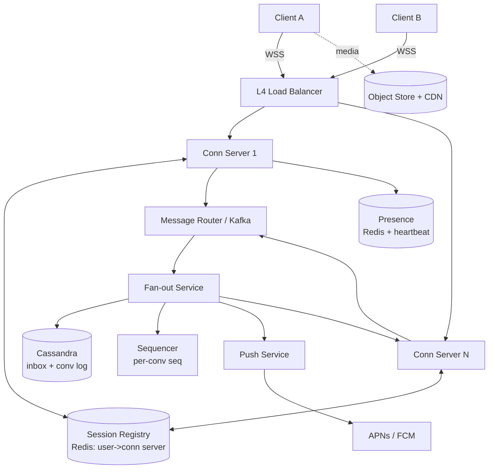

# Chat System (WhatsApp / Messenger)

## Problem & Clarifications

Design a real-time messaging system supporting 1:1 and group chats with delivery
guarantees, presence, and push notifications.

**Clarifying questions (and assumed answers):**
- 1:1 and group chat? **Yes**, groups up to 500 members.
- Delivery/read receipts? **Yes** (sent / delivered / read — the WhatsApp double-tick model).
- Media (images/video/voice)? **Yes**, but transferred out-of-band via object storage; chat carries a URL.
- End-to-end encryption? **Yes**, server stores ciphertext only (Signal protocol). Server cannot read content.
- Message history retention? Persist indefinitely; client is source of truth for E2EE keys.
- Scale target? ~500M DAU, ~1M concurrent connections per region cluster.

## Functional Requirements

- Send/receive messages in real time (1:1 and group).
- Delivery state machine: `sent → delivered → read`.
- Online/offline presence and "last seen".
- Offline message queueing; deliver on reconnect.
- Push notifications when the app is backgrounded/offline.
- Ordered message delivery within a conversation.

## Non-Functional Requirements

- **Low latency**: p99 end-to-end delivery < 500 ms for online users.
- **High availability**: 99.99%; messaging is the core product.
- **Durability**: no acknowledged message is ever lost.
- **Scalability**: tens of millions of concurrent WebSocket connections.
- **Consistency**: per-conversation ordering; eventual consistency across devices.

## Capacity Estimation

| Metric | Value | Derivation |
|---|---|---|
| DAU | 500M | given |
| Messages/user/day | 40 | assumption |
| Messages/day | 20B | 500M × 40 |
| Avg write QPS | ~230K | 20B / 86400 |
| Peak write QPS | ~700K | 3× average |
| Concurrent connections | ~50M | ~10% of DAU online |
| Avg message size (ciphertext) | 1 KB | text + metadata |
| Daily message storage | 20 TB/day | 20B × 1 KB |
| Yearly storage | ~7 PB/yr | 20 TB × 365 |
| Conn server capacity | 100K conns/box | C10M-class, epoll/event-loop |
| Connection servers needed | ~500 | 50M / 100K |

## API Design

WebSocket for the live channel; REST/gRPC for history and metadata.

```
# WebSocket frames (client <-> connection server), JSON over WSS
-> SEND     { "type":"SEND", "client_msg_id":"uuid", "conv_id":"c123", "ciphertext":"...", "ts":169... }
<- ACK      { "type":"ACK", "client_msg_id":"uuid", "server_msg_id":"s456", "seq": 9001 }
<- MESSAGE  { "type":"MESSAGE", "server_msg_id":"s456", "conv_id":"c123", "sender":"u1", "ciphertext":"...", "seq":9001 }
-> RECEIPT  { "type":"RECEIPT", "server_msg_id":"s456", "state":"delivered|read" }
<- PRESENCE { "type":"PRESENCE", "user_id":"u2", "state":"online|offline", "last_seen":169... }

# REST
POST /v1/conversations                 -> create group
GET  /v1/conversations/{id}/messages?before_seq=&limit=50
GET  /v1/users/{id}/presence
POST /v1/devices                       -> register device + push token + prekeys
```

## Data Model / Schema

Use a wide-column store (Cassandra/ScyllaDB) for messages, partitioned for
per-user inbox fan-out. Metadata in a relational store / Vitess.

```sql
-- Conversations (group metadata)
CREATE TABLE conversations (
  conv_id      UUID PRIMARY KEY,
  type         TEXT,                 -- 'direct' | 'group'
  title        TEXT,
  created_at   TIMESTAMP
);

CREATE TABLE conversation_members (
  conv_id   UUID,
  user_id   BIGINT,
  joined_at TIMESTAMP,
  role      TEXT,                    -- 'member' | 'admin'
  PRIMARY KEY (conv_id, user_id)
);

-- Per-user inbox (Cassandra): the fan-out target. Partition = user, so each
-- recipient reads their own ordered timeline cheaply.
CREATE TABLE user_inbox (
  user_id     BIGINT,
  seq         BIGINT,        -- monotonic per (user_id) for client sync cursor
  conv_id     UUID,
  msg_id      TIMEUUID,
  sender_id   BIGINT,
  ciphertext  BLOB,
  state       TEXT,          -- 'delivered'|'read' from this user's perspective
  created_at  TIMESTAMP,
  PRIMARY KEY (user_id, seq)
) WITH CLUSTERING ORDER BY (seq DESC);

-- Conversation log (source of ordering for the conversation itself)
CREATE TABLE conversation_messages (
  conv_id     UUID,
  conv_seq    BIGINT,        -- monotonic per conversation -> defines ordering
  msg_id      TIMEUUID,
  sender_id   BIGINT,
  ciphertext  BLOB,
  created_at  TIMESTAMP,
  PRIMARY KEY (conv_id, conv_seq)
) WITH CLUSTERING ORDER BY (conv_seq DESC);
```

## High-Level Design



**Flow:** Client A's `SEND` lands on its connection server → published to Kafka →
Fan-out service assigns a `conv_seq` from the Sequencer, persists to the
conversation log and each member's `user_inbox` → looks up each recipient's
connection server in the Session Registry → forwards `MESSAGE`. If a recipient
is offline, the message stays in their inbox and a push notification is queued.

## Deep Dives

### WebSocket connection servers & presence
- **Stateful connections**: each client holds a long-lived WSS connection. A
  **Session Registry** (Redis hash `user_id -> {conn_server, conn_id}`) maps users
  to the server holding their socket so the router knows where to forward.
- **Presence** via heartbeats: client pings every 30 s; conn server refreshes a
  Redis key `presence:{user_id}` with TTL 60 s. Missing heartbeat → key expires →
  user marked offline; "last seen" = last heartbeat timestamp. Presence changes
  are published only to subscribers (contacts in an open chat) to avoid an
  O(contacts) broadcast storm.

### Message delivery (1:1 & group)
- **1:1**: fan-out to two inboxes (sender's own copy + recipient's).
- **Group**: fan-out service writes to all N member inboxes. For very large groups
  this is the dominant cost; cap group size (500) and batch the writes. Optionally
  use **fan-out-on-read** for huge groups (store once in conv log, members pull).

### Online/offline & delivery receipts
State machine driven by client acks:
- `sent`: server persisted (returns ACK with `server_msg_id` + `seq`).
- `delivered`: recipient's device received the `MESSAGE` and sent `RECEIPT:delivered`.
- `read`: recipient opened the chat → `RECEIPT:read`.
Receipts are themselves small messages routed back to the original sender.

### Message storage (per-user inbox)
Each recipient gets a row in `user_inbox` keyed by `(user_id, seq)`. Clients sync
incrementally with a cursor: `GET messages where seq > last_synced_seq`. This makes
multi-device sync and reconnect cheap — one partition read per user.

### Ordering
- **Per-conversation order** is the guarantee users perceive. A **Sequencer**
  (Redis `INCR conv_seq:{conv_id}`, or a sharded ID generator) assigns a strictly
  increasing `conv_seq`. Clients sort by `conv_seq`, not by wall-clock `ts`
  (clocks are unreliable). The Kafka partition key = `conv_id` so all messages of a
  conversation are processed by one consumer, preserving order.

### Push notifications
When a recipient is offline (no presence key / no socket), the Push Service sends
the envelope (sender name, "New message", **not** plaintext for E2EE) via **APNs**
(iOS) / **FCM** (Android). Token registered at device login.

### End-to-end encryption (note)
Signal protocol (X3DH + Double Ratchet). The server stores **prekey bundles** and
relays **ciphertext** only; it never has private keys. Group messaging uses
**Sender Keys**. Delivery receipts and presence are metadata the server can see;
message bodies are opaque blobs.

### Scaling connection servers
- L4 LB (consistent hashing on `user_id`) so reconnects tend to land on a known
  server. Horizontal scale to ~500 boxes for 50M conns.
- Graceful drain on deploy: signal clients to reconnect, move sessions, deregister
  from Session Registry. Use a **gossip/sticky** scheme so the router survives
  conn-server churn.

## Bottlenecks & Trade-offs

| Bottleneck | Mitigation | Trade-off |
|---|---|---|
| Large-group fan-out write amplification | Fan-out-on-read for big groups | Higher read cost, more complex client merge |
| Session Registry hotspot | Shard Redis by user; local cache | Stale routing on failover (retry) |
| Sequencer as SPOF | Sharded per-conversation counters | More moving parts |
| Presence broadcast storm | Subscribe only to open chats | Slightly stale presence |
| Connection server failover | Client auto-reconnect + resume cursor | Brief reconnect latency |

## Code

### WebSocket message routing + per-user store (Python, asyncio)

```python
import asyncio, json, time, uuid
from dataclasses import dataclass

# --- Session Registry (Redis-backed in prod; dict here) ---------------------
class SessionRegistry:
    def __init__(self):
        self._user_to_server = {}        # user_id -> conn_server_id
        self._local_sockets = {}         # user_id -> websocket (this server only)

    def bind(self, user_id, server_id, ws):
        self._user_to_server[user_id] = server_id
        self._local_sockets[user_id] = ws

    def unbind(self, user_id):
        self._user_to_server.pop(user_id, None)
        self._local_sockets.pop(user_id, None)

    def server_for(self, user_id):
        return self._user_to_server.get(user_id)

    def local_socket(self, user_id):
        return self._local_sockets.get(user_id)


# --- Per-conversation sequencer (Redis INCR in prod) ------------------------
class Sequencer:
    def __init__(self):
        self._seq = {}

    def next(self, conv_id):
        self._seq[conv_id] = self._seq.get(conv_id, 0) + 1
        return self._seq[conv_id]


# --- Per-user inbox store (Cassandra in prod) -------------------------------
class InboxStore:
    def __init__(self):
        self._inbox = {}                  # user_id -> list[dict] ordered by seq
        self._user_seq = {}               # user_id -> monotonic cursor

    def append(self, user_id, msg):
        self._user_seq[user_id] = self._user_seq.get(user_id, 0) + 1
        row = {**msg, "seq": self._user_seq[user_id], "state": "stored"}
        self._inbox.setdefault(user_id, []).append(row)
        return row

    def since(self, user_id, after_seq):
        return [m for m in self._inbox.get(user_id, []) if m["seq"] > after_seq]

    def mark(self, user_id, server_msg_id, state):
        for m in self._inbox.get(user_id, []):
            if m["server_msg_id"] == server_msg_id:
                m["state"] = state


@dataclass
class Membership:
    members: dict                          # conv_id -> set[user_id]
    def of(self, conv_id):
        return self.members.get(conv_id, set())


class ChatRouter:
    """Routes a SEND to all conversation members' inboxes and live sockets."""
    def __init__(self, registry, sequencer, inboxes, membership, push):
        self.reg, self.seq, self.box = registry, sequencer, inboxes
        self.mem, self.push = membership, push

    async def handle_send(self, sender_id, frame):
        conv_id = frame["conv_id"]
        server_msg_id = "s" + uuid.uuid4().hex[:12]
        conv_seq = self.seq.next(conv_id)            # per-conversation ordering
        envelope = {
            "type": "MESSAGE",
            "server_msg_id": server_msg_id,
            "conv_id": conv_id,
            "sender": sender_id,
            "ciphertext": frame["ciphertext"],       # server never decrypts
            "conv_seq": conv_seq,
            "ts": time.time(),
        }
        # Fan-out to every member (including sender's own device copy).
        for uid in self.mem.of(conv_id):
            self.box.append(uid, envelope)           # durable per-user inbox
            ws = self.reg.local_socket(uid)
            if ws is not None:                        # online -> push live
                await ws.send(json.dumps(envelope))
            elif uid != sender_id:                    # offline -> notify
                self.push.notify(uid, conv_id)
        # ACK the sender so the client can show the single tick.
        return {"type": "ACK", "client_msg_id": frame["client_msg_id"],
                "server_msg_id": server_msg_id, "seq": conv_seq}

    async def handle_receipt(self, user_id, frame):
        # delivered/read receipts are routed back to original sender's inbox view
        self.box.mark(user_id, frame["server_msg_id"], frame["state"])


class PushService:
    def notify(self, user_id, conv_id):
        # Real impl: lookup device token, POST to APNs/FCM (no plaintext for E2EE)
        print(f"[push] -> {user_id}: new message in {conv_id}")


# --- Demo -------------------------------------------------------------------
class FakeWS:
    def __init__(self, name): self.name, self.sent = name, []
    async def send(self, data): self.sent.append(json.loads(data))

async def demo():
    reg, seq = SessionRegistry(), Sequencer()
    box = InboxStore()
    mem = Membership({"c1": {"alice", "bob", "carol"}})
    router = ChatRouter(reg, seq, box, mem, PushService())

    a_ws, b_ws = FakeWS("alice"), FakeWS("bob")   # carol is offline
    reg.bind("alice", "cs1", a_ws)
    reg.bind("bob", "cs1", b_ws)

    ack = await router.handle_send("alice", {
        "client_msg_id": "cm1", "conv_id": "c1", "ciphertext": b"<enc>".hex()})
    print("ACK:", ack)
    print("bob received:", b_ws.sent[0]["conv_seq"])
    print("carol inbox (offline):", box.since("carol", 0)[0]["state"])

    await router.handle_receipt("bob", {"server_msg_id": ack["server_msg_id"],
                                        "state": "read"})

asyncio.run(demo())
```

## Summary

A chat system is fundamentally a **routing + durable-inbox** problem layered on
stateful WebSocket connections. The core pieces: a **Session Registry** to find
which connection server holds each socket, a **Sequencer** for per-conversation
ordering, **per-user inboxes** for offline delivery and multi-device sync, and a
**push service** for backgrounded clients. E2EE keeps message bodies opaque to the
server, so all server-side features operate on metadata and ciphertext. The main
scaling challenges are connection-server fan-out, large-group write amplification,
and presence broadcast cost.
