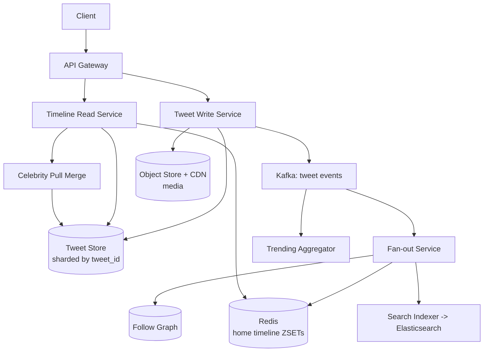

# Twitter / X

## Problem & Clarifications

Design a microblogging service: users post short tweets, follow others, and read a
home timeline aggregating tweets from the people they follow.

**Clarifying questions (and assumed answers):**
- Read or write heavy? **Read heavy** (~100:1). Timeline reads dominate.
- Timeline freshness? Near-real-time (seconds), eventual consistency acceptable.
- Tweet length / media? 280 chars + optional images/video (out-of-band).
- Celebrities with 100M+ followers? **Yes** — must handle the fan-out problem.
- Need search and trending? **Yes**.
- Ordering? Reverse-chronological baseline; ranking is a later layer.

## Functional Requirements

- Post a tweet (text + media + mentions/hashtags).
- Follow/unfollow users (directed graph).
- Home timeline: merged feed of followed users.
- User timeline: a single user's own tweets.
- Search tweets; trending topics.
- Likes, retweets, replies.

## Non-Functional Requirements

- **Read latency**: p99 home timeline < 200 ms.
- **Availability** over strong consistency (a slightly stale timeline is fine).
- **Scalability**: hundreds of millions of users, hot celebrity accounts.
- **Durability**: tweets are never lost once acknowledged.

## Capacity Estimation

| Metric | Value | Derivation |
|---|---|---|
| DAU | 250M | given |
| Tweets/day | 500M | ~2 tweets/active user |
| Write QPS (avg) | ~6K | 500M / 86400 |
| Write QPS (peak) | ~30K | events/spikes |
| Timeline reads/day | 50B | ~200 reads/user |
| Read QPS (avg) | ~600K | 50B / 86400 |
| Tweet size | 300 B | text + metadata |
| Daily tweet storage | ~150 GB/day | 500M × 300 B |
| Media | separate object store + CDN | photos/video |
| Avg followers | ~200 | long tail + celebrities |
| Celebrity max followers | 100M+ | fan-out hotspot |

## API Design

```
POST   /v1/tweets                 {text, media_ids[], reply_to?}      -> tweet_id
GET    /v1/timeline/home?cursor=&limit=50
GET    /v1/timeline/user/{id}?cursor=&limit=50
POST   /v1/follows                {followee_id}
DELETE /v1/follows/{followee_id}
POST   /v1/tweets/{id}/like
POST   /v1/tweets/{id}/retweet
GET    /v1/search?q=&cursor=
GET    /v1/trends?location=
```

Cursor = encoded `(tweet_id)` for keyset pagination (no OFFSET).

## Data Model / Schema

```sql
-- Tweets: sharded by tweet_id (Snowflake ID = time-sortable)
CREATE TABLE tweets (
  tweet_id    BIGINT PRIMARY KEY,   -- Snowflake: 41-bit ms ts | worker | seq
  author_id   BIGINT NOT NULL,
  text        VARCHAR(280),
  media_ids   JSON,
  reply_to    BIGINT,
  created_at  TIMESTAMP,
  INDEX (author_id, tweet_id)       -- user timeline
);

-- Follow graph: two directions for cheap reads both ways
CREATE TABLE follows (
  follower_id BIGINT,
  followee_id BIGINT,
  created_at  TIMESTAMP,
  PRIMARY KEY (follower_id, followee_id)
);
CREATE TABLE followers (              -- inverted, for fan-out
  followee_id BIGINT,
  follower_id BIGINT,
  PRIMARY KEY (followee_id, follower_id)
);

-- Precomputed home timeline cache (Redis): per user, a capped list of tweet_ids
-- KEY home:{user_id} -> ZSET(score=tweet_id, member=tweet_id), capped ~800

CREATE TABLE likes (
  tweet_id BIGINT, user_id BIGINT, created_at TIMESTAMP,
  PRIMARY KEY (tweet_id, user_id)
);
```

## High-Level Design



## Deep Dives

### Tweet posting
Write service assigns a **Snowflake ID** (time-sortable 64-bit), persists to the
sharded tweet store, uploads media to object storage, and emits a `tweet_created`
event to Kafka. The event drives fan-out, search indexing, and trend counting
asynchronously — the write path stays fast.

### Timeline: home vs user
- **User timeline**: just `SELECT ... WHERE author_id = ? ORDER BY tweet_id DESC` —
  one shard, cheap, computed on read.
- **Home timeline**: merge of all followees' tweets — expensive to compute on read
  for users following thousands. Solved with **fan-out**.

### Fan-out (push / pull / hybrid)
- **Push (fan-out-on-write)**: on each tweet, insert the `tweet_id` into every
  follower's `home:{follower_id}` ZSET in Redis. Reads are O(1) — just read the
  ZSET. Great for the common case. **Problem**: a celebrity with 100M followers
  triggers 100M writes per tweet → write amplification disaster.
- **Pull (fan-out-on-read)**: store nothing; at read time fetch recent tweets from
  each followee and merge. Cheap writes, **expensive reads** for users following
  many.
- **Hybrid (the real answer)**: push for normal accounts; for **celebrity**
  accounts (followers > ~10K) do NOT fan out. At read time, the Read Service merges
  the user's cached push timeline with a freshly **pulled** set of recent tweets
  from the celebrities they follow. Best of both worlds.

```
home_timeline = merge(
   redis.ZREVRANGE(home:{u}, 0, 50),                 # pushed (normal authors)
   [recent_tweets(c) for c in celebrities_followed(u)] # pulled (celebrities)
)
```

### Trending topics
Kafka consumers count hashtag/term frequency in sliding windows (e.g. 5-min and
1-hour) using **count-min sketch** for memory efficiency, compute a velocity score
(rate of change vs baseline), and publish top-N per region. Decay older counts.

### Search
Index tweets into **Elasticsearch** asynchronously from the Kafka stream. Support
full-text, hashtag, and user queries. Recency-boosted ranking; separate "top" and
"latest" tabs.

### Media
Images/video go to **object storage (S3)** fronted by a **CDN**. Tweets store only
`media_id` references and CDN URLs. Video gets a transcoding pipeline (see the
video-streaming design).

### Follow graph
Stored bidirectionally (`follows` + `followers`) so both "who I follow" and "who
follows me" (needed for fan-out) are single-shard reads. For very large graphs, a
dedicated graph store or adjacency-list sharding by user.

## Bottlenecks & Trade-offs

| Bottleneck | Mitigation | Trade-off |
|---|---|---|
| Celebrity fan-out (100M writes/tweet) | Hybrid: pull celebrities at read | Read-time merge complexity |
| Redis timeline memory | Cap to ~800 ids/user; rehydrate from DB | Cold reads on overflow |
| Hot tweet (viral) read load | CDN + cache the tweet object | Stale counts briefly |
| Like/retweet counter contention | Sharded counters / approximate counts | Eventually consistent counts |
| Thundering herd on celebrity tweet | Cache pulled celebrity tweets | Slight staleness |

## Code

### Hybrid fan-out + tweet store (Python)

```python
import time, heapq
from collections import defaultdict

CELEBRITY_THRESHOLD = 10_000   # followers above this are pulled, not pushed

class Snowflake:
    """Time-sortable 64-bit IDs: higher id == newer tweet."""
    def __init__(self, worker=1):
        self.worker, self.seq, self.last_ms = worker, 0, 0
    def next(self):
        ms = int(time.time() * 1000)
        if ms == self.last_ms:
            self.seq += 1
        else:
            self.seq, self.last_ms = 0, ms
        return (ms << 22) | (self.worker << 12) | (self.seq & 0xFFF)


class TweetStore:
    def __init__(self):
        self.by_id = {}                       # tweet_id -> tweet
        self.by_author = defaultdict(list)    # author_id -> [tweet_id] (sorted)
    def put(self, t):
        self.by_id[t["id"]] = t
        self.by_author[t["author_id"]].append(t["id"])
    def user_timeline(self, author_id, limit=50):
        ids = sorted(self.by_author[author_id], reverse=True)[:limit]
        return [self.by_id[i] for i in ids]
    def recent_by(self, author_id, limit=20):
        return self.user_timeline(author_id, limit)


class HomeTimelineCache:
    """Redis ZSET per user, capped. Here: dict[user] -> sorted list of ids."""
    CAP = 800
    def __init__(self):
        self.z = defaultdict(list)
    def push(self, user_id, tweet_id):
        lst = self.z[user_id]
        lst.append(tweet_id)
        lst.sort(reverse=True)
        del lst[self.CAP:]                    # cap memory
    def read(self, user_id, limit=50):
        return self.z[user_id][:limit]


class FollowGraph:
    def __init__(self):
        self.followers = defaultdict(set)     # followee -> {followers}
        self.following = defaultdict(set)      # follower -> {followees}
    def follow(self, follower, followee):
        self.followers[followee].add(follower)
        self.following[follower].add(followee)
    def follower_count(self, user):
        return len(self.followers[user])
    def is_celebrity(self, user):
        return self.follower_count(user) >= CELEBRITY_THRESHOLD


class TimelineService:
    def __init__(self, store, cache, graph, idgen):
        self.store, self.cache, self.graph, self.id = store, cache, graph, idgen

    def post_tweet(self, author_id, text):
        tweet = {"id": self.id.next(), "author_id": author_id,
                 "text": text, "created_at": time.time()}
        self.store.put(tweet)
        # HYBRID: only fan out on write for non-celebrity authors.
        if not self.graph.is_celebrity(author_id):
            for follower in self.graph.followers[author_id]:
                self.cache.push(follower, tweet["id"])
        return tweet

    def home_timeline(self, user_id, limit=50):
        # 1) pushed tweets (normal authors) from cache
        pushed_ids = self.cache.read(user_id, limit)
        merged = [self.store.by_id[i] for i in pushed_ids]
        # 2) pulled tweets from celebrities this user follows
        for followee in self.graph.following[user_id]:
            if self.graph.is_celebrity(followee):
                merged.extend(self.store.recent_by(followee, 20))
        # 3) merge by id (time-sortable) desc, dedup, take limit
        seen, out = set(), []
        for t in heapq.nlargest(limit * 2, merged, key=lambda x: x["id"]):
            if t["id"] not in seen:
                seen.add(t["id"]); out.append(t)
            if len(out) == limit:
                break
        return out


# --- Demo -------------------------------------------------------------------
store, cache, graph = TweetStore(), HomeTimelineCache(), FollowGraph()
svc = TimelineService(store, cache, graph, Snowflake())

# alice follows bob (normal) and "celeb"
graph.follow("alice", "bob")
graph.follow("alice", "celeb")
# make celeb a celebrity
for i in range(CELEBRITY_THRESHOLD):
    graph.follow(f"fan{i}", "celeb")

svc.post_tweet("bob", "hello from bob")        # pushed into alice's cache
svc.post_tweet("celeb", "huge announcement")   # NOT pushed (pulled on read)

tl = svc.home_timeline("alice")
print([f'{t["author_id"]}: {t["text"]}' for t in tl])
# -> celeb tweet (pulled) merged with bob tweet (pushed), newest first
```

## Summary

Twitter is a **read-heavy fan-out** problem. The defining design decision is the
**hybrid fan-out**: push tweets into precomputed per-follower Redis timelines for
normal accounts (cheap reads), but pull tweets from **celebrities** at read time to
avoid catastrophic write amplification. Snowflake IDs give time-sortable ordering
for free, Kafka decouples writes from fan-out / search / trending, and media plus
search live in dedicated systems (object store/CDN, Elasticsearch).
