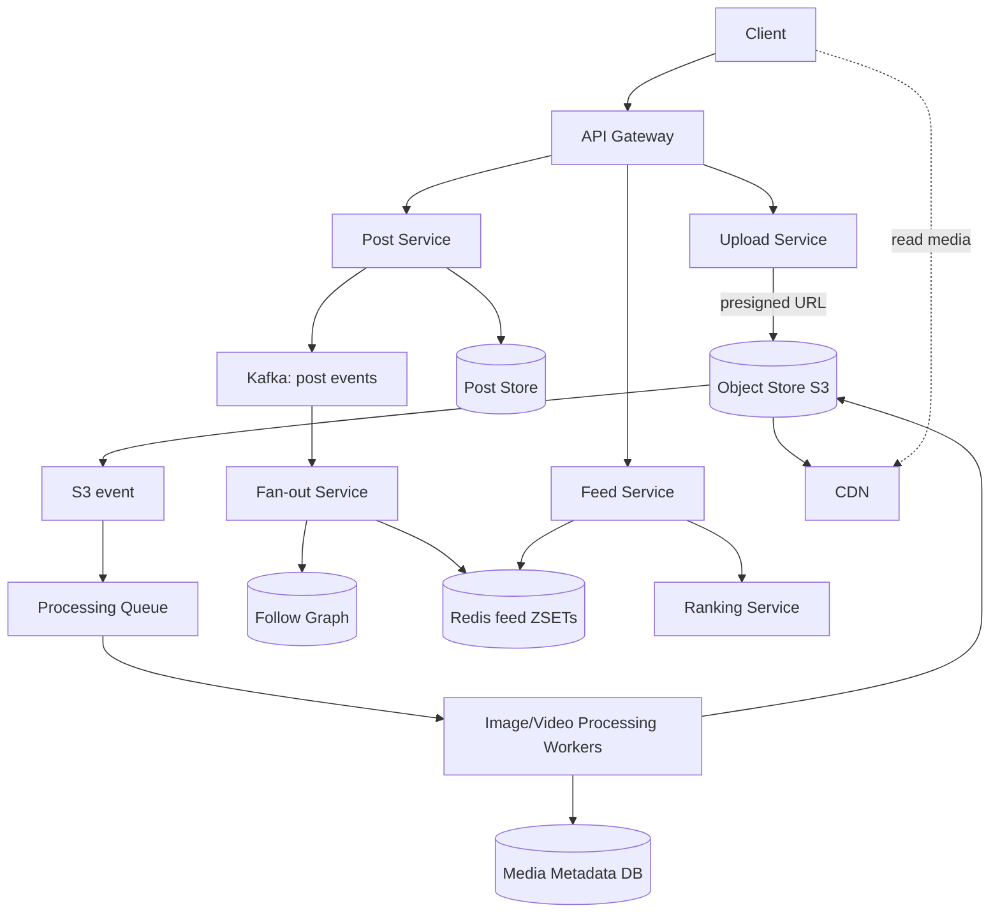

# Instagram

## Problem & Clarifications

Design a photo/video sharing social network: users upload media, follow others,
and consume a feed of posts, plus stories, likes, and comments.

**Clarifying questions (and assumed answers):**
- Photos and videos? **Both**. Videos transcoded; photos resized to variants.
- Read or write heavy? **Read heavy** (~100:1, feed scrolling dominates).
- Feed ordering? Ranked feed is the goal; we'll show a ranking hook over a
  reverse-chronological base.
- Stories (24h ephemeral)? **Yes**.
- Scale? ~500M DAU, ~100M posts/day.
- Celebrity accounts? **Yes** — same hybrid fan-out concern as Twitter.

## Functional Requirements

- Upload photo/video; auto-generate resized/transcoded variants.
- Follow/unfollow; news feed of followed users' posts.
- Likes and comments at scale.
- Stories: ephemeral 24h media.
- Serve media globally with low latency (CDN).

## Non-Functional Requirements

- **Feed latency**: p99 < 200 ms.
- **Media delivery**: low latency worldwide via CDN; high cache hit ratio.
- **Durability**: uploaded media never lost (object storage with replication).
- **Availability** over strict consistency for feed/likes.
- **Scalability**: petabytes of media, billions of feed reads/day.

## Capacity Estimation

| Metric | Value | Derivation |
|---|---|---|
| DAU | 500M | given |
| Posts/day | 100M | ~0.2 posts/user |
| Upload QPS (avg) | ~1.2K | 100M / 86400 |
| Upload QPS (peak) | ~5K | spikes |
| Feed reads/day | 50B | ~100/user |
| Feed read QPS | ~600K | 50B / 86400 |
| Avg photo (original) | 2 MB | before processing |
| Variants per photo | ~5 | thumb/sm/md/lg + webp |
| Stored bytes/photo | ~3 MB | original + variants |
| Daily media storage | ~300 TB/day | 100M × 3 MB |
| Yearly media storage | ~100 PB/yr | + replication factor 3 |

## API Design

```
# Upload uses pre-signed URLs: client uploads directly to object store.
POST /v1/media/upload-url   {type, size}  -> {upload_url, media_id}
POST /v1/posts              {media_id, caption}            -> post_id
GET  /v1/feed?cursor=&limit=20
GET  /v1/users/{id}/posts?cursor=
POST /v1/posts/{id}/like
POST /v1/posts/{id}/comments {text}
GET  /v1/stories                                           # active stories of followees
POST /v1/stories            {media_id}
```

## Data Model / Schema

```sql
CREATE TABLE posts (
  post_id     BIGINT PRIMARY KEY,    -- Snowflake (time-sortable)
  author_id   BIGINT NOT NULL,
  media_id    BIGINT NOT NULL,
  caption     TEXT,
  created_at  TIMESTAMP,
  INDEX (author_id, post_id)
);

CREATE TABLE media (
  media_id    BIGINT PRIMARY KEY,
  type        TEXT,                  -- 'photo' | 'video'
  status      TEXT,                  -- 'uploaded' | 'processing' | 'ready'
  original_key TEXT,                 -- object-store key
  variants    JSON,                  -- {thumb: key, md: key, lg: key, ...}
  cdn_base    TEXT
);

CREATE TABLE follows (
  follower_id BIGINT, followee_id BIGINT, created_at TIMESTAMP,
  PRIMARY KEY (follower_id, followee_id)
);

CREATE TABLE likes (
  post_id BIGINT, user_id BIGINT, created_at TIMESTAMP,
  PRIMARY KEY (post_id, user_id)
);
CREATE TABLE post_counters (         -- denormalized counts
  post_id BIGINT PRIMARY KEY, like_count BIGINT, comment_count BIGINT
);

CREATE TABLE comments (
  comment_id BIGINT PRIMARY KEY, post_id BIGINT, user_id BIGINT,
  text TEXT, created_at TIMESTAMP, INDEX (post_id, comment_id)
);

CREATE TABLE stories (
  story_id BIGINT PRIMARY KEY, author_id BIGINT, media_id BIGINT,
  created_at TIMESTAMP, expires_at TIMESTAMP    -- TTL = created + 24h
);
-- Feed cache (Redis): feed:{user_id} -> ZSET(score=post_id, member=post_id)
```

## High-Level Design



## Deep Dives

### Photo/video upload & storage (object store + CDN)
1. Client requests a **pre-signed URL**; uploads media **directly to S3** (bypasses
   app servers — no large payloads through the API tier).
2. S3 emits an **event** → processing queue.
3. Media row starts as `processing`; the post can be created but rendered with a
   placeholder until variants are `ready`.
4. Variants stored back in S3; served via **CDN** (`cdn_base + variant_key`).
   CDN caches at edge → high hit ratio, low global latency.

### Image processing pipeline
Workers consume the queue and produce:
- Resized variants: thumbnail (150px), small, medium, large.
- Format transcodes: WebP/AVIF for modern clients, JPEG fallback.
- Strip EXIF, generate blurhash placeholder, run moderation/NSFW classifier.
- Video → see transcoding pipeline (HLS/DASH renditions).
Idempotent and retryable; on success, update `media.status = ready` and `variants`.

### Feed generation
**Hybrid fan-out** (same reasoning as Twitter): push new `post_id`s into each
follower's `feed:{user}` Redis ZSET for normal accounts; **pull** recent posts from
celebrities at read time and merge. Feed Service reads the cached ids, hydrates post
+ media + counters, and hands the candidate set to the **Ranking Service**.

### News feed caching
- `feed:{user}` ZSET capped (~500 ids); overflow rehydrated from DB.
- Hydrated post objects cached separately (`post:{id}`) so a viral post is fetched
  once and reused across millions of feeds.
- CDN absorbs media reads entirely; the app tier never serves bytes.

### Likes/comments at scale
- Like = insert into `likes (post_id, user_id)` (idempotent via PK).
- Counts kept in `post_counters` as **sharded/approximate counters** (increment via
  Redis, periodically flush) to avoid hot-row contention on viral posts.
- Comments paginated by keyset (`post_id, comment_id`).

### Stories
Ephemeral: `stories` rows carry `expires_at = created_at + 24h`. A TTL index (or a
sweeper job) purges expired rows; media lifecycle-deleted from S3 after 24h. Active
stories of followees fetched on demand (small set, pull model).

### Follow graph
Bidirectional adjacency (followers + following) for cheap fan-out and feed reads,
sharded by user id.

## Bottlenecks & Trade-offs

| Bottleneck | Mitigation | Trade-off |
|---|---|---|
| Large media through app servers | Pre-signed direct-to-S3 upload | Client complexity |
| Celebrity fan-out | Hybrid push/pull | Read-merge complexity |
| Viral post like-counter hot row | Sharded/approx counters in Redis | Eventually consistent counts |
| Processing latency before "ready" | Placeholder + blurhash | Brief incomplete render |
| CDN cache misses (cold/new media) | Pre-warm popular variants | Extra origin load |

## Code

### Upload pipeline + feed assembly (Python)

```python
import time, uuid, queue
from collections import defaultdict

# ----------------------------------------------------------------------------
# 1) UPLOAD PIPELINE
# ----------------------------------------------------------------------------
class ObjectStore:                         # stand-in for S3
    def __init__(self): self.blobs = {}
    def presign_put(self, key): return f"https://s3/upload/{key}?sig=demo"
    def put(self, key, data): self.blobs[key] = data
    def exists(self, key): return key in self.blobs

class MediaDB:
    def __init__(self): self.rows = {}
    def create(self, media_id, mtype, key):
        self.rows[media_id] = {"type": mtype, "status": "uploaded",
                               "original_key": key, "variants": {}}
    def mark_ready(self, media_id, variants):
        self.rows[media_id].update(status="ready", variants=variants)

class UploadService:
    def __init__(self, store, db, work_q):
        self.store, self.db, self.q = store, db, work_q
    def request_upload(self, mtype):
        media_id = uuid.uuid4().hex[:12]
        key = f"orig/{media_id}"
        self.db.create(media_id, mtype, key)
        return {"media_id": media_id, "upload_url": self.store.presign_put(key),
                "key": key}
    def on_upload_complete(self, media_id, key):
        # triggered by S3 event; enqueue processing
        self.db.rows[media_id]["status"] = "processing"
        self.q.put((media_id, key, self.db.rows[media_id]["type"]))

VARIANT_SPECS = {"thumb": 150, "sm": 320, "md": 640, "lg": 1080}

class ProcessingWorker:
    """Generates resized/transcoded variants, then marks media ready."""
    def __init__(self, store, db, work_q, cdn_base="https://cdn.example.com/"):
        self.store, self.db, self.q, self.cdn = store, db, work_q, cdn_base
    def run_once(self):
        media_id, key, mtype = self.q.get()
        variants = {}
        for name, _px in VARIANT_SPECS.items():        # real: Pillow/ffmpeg
            vkey = f"var/{media_id}/{name}"
            self.store.put(vkey, f"<{mtype}:{name}>")
            variants[name] = self.cdn + vkey
        variants["webp"] = self.cdn + f"var/{media_id}/webp"
        self.db.mark_ready(media_id, variants)
        return media_id, variants

# ----------------------------------------------------------------------------
# 2) FEED ASSEMBLY (hybrid fan-out)
# ----------------------------------------------------------------------------
CELEB = 10_000

class Graph:
    def __init__(self):
        self.followers, self.following = defaultdict(set), defaultdict(set)
    def follow(self, a, b):
        self.followers[b].add(a); self.following[a].add(b)
    def is_celeb(self, u): return len(self.followers[u]) >= CELEB

class PostStore:
    def __init__(self): self.by_id, self.by_author = {}, defaultdict(list)
    def add(self, post):
        self.by_id[post["id"]] = post
        self.by_author[post["author_id"]].append(post["id"])
    def recent_by(self, author, n=10):
        return [self.by_id[i] for i in sorted(self.by_author[author],
                                              reverse=True)[:n]]

class FeedCache:
    CAP = 500
    def __init__(self): self.z = defaultdict(list)
    def push(self, user, post_id):
        self.z[user].append(post_id); self.z[user].sort(reverse=True)
        del self.z[user][self.CAP:]
    def read(self, user, n): return self.z[user][:n]

class FeedService:
    def __init__(self, posts, cache, graph):
        self.posts, self.cache, self.graph = posts, cache, graph
        self._seq = 0
    def _next_id(self):
        self._seq += 1
        return (int(time.time() * 1000) << 16) | self._seq
    def publish(self, author, media_id, caption=""):
        post = {"id": self._next_id(), "author_id": author,
                "media_id": media_id, "caption": caption}
        self.posts.add(post)
        if not self.graph.is_celeb(author):            # push for normal users
            for f in self.graph.followers[author]:
                self.cache.push(f, post["id"])
        return post
    def feed(self, user, n=20):
        cand = [self.posts.by_id[i] for i in self.cache.read(user, n)]  # pushed
        for followee in self.graph.following[user]:    # pulled celebrities
            if self.graph.is_celeb(followee):
                cand.extend(self.posts.recent_by(followee))
        seen, out = set(), []
        for p in sorted(cand, key=lambda x: x["id"], reverse=True):
            if p["id"] not in seen:
                seen.add(p["id"]); out.append(p)
            if len(out) == n: break
        return out          # -> Ranking Service would reorder this candidate set

# --- Demo -------------------------------------------------------------------
store, mdb, q = ObjectStore(), MediaDB(), queue.Queue()
up = UploadService(store, mdb, q)
worker = ProcessingWorker(store, mdb, q)

req = up.request_upload("photo")
store.put(req["key"], b"<jpeg bytes>")          # client uploaded to S3
up.on_upload_complete(req["media_id"], req["key"])
mid, variants = worker.run_once()
print("variants ready:", list(variants.keys()))

g = Graph(); posts = PostStore(); cache = FeedCache()
feed = FeedService(posts, cache, g)
g.follow("alice", "bob")
feed.publish("bob", mid, "sunset")
print("alice feed:", [p["caption"] for p in feed.feed("alice")])
```

## Summary

Instagram is a **media-heavy, read-heavy** social feed. The two defining subsystems
are (1) the **upload + processing pipeline** — clients upload directly to object
storage via pre-signed URLs, async workers generate resized/transcoded variants,
and a **CDN** serves all media bytes globally; and (2) **feed generation** using the
same **hybrid push/pull fan-out** as Twitter to handle celebrities, with aggressive
Redis caching of feeds and hydrated post objects. Likes/comments use
sharded/approximate counters to survive viral hot rows, and stories rely on TTL
expiry for ephemerality.
