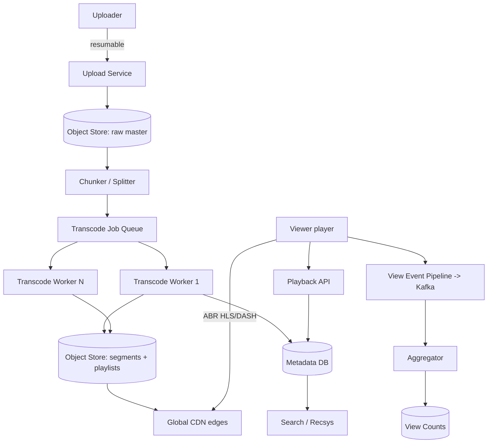

# Video Streaming (YouTube / Netflix)

## Problem & Clarifications

Design a video platform: users (or studios) upload video, the system transcodes it
into multiple renditions, stores it, and streams it to global viewers with adaptive
quality.

**Clarifying questions (and assumed answers):**
- UGC upload (YouTube) or curated catalog (Netflix)? **Cover upload + transcoding**;
  the streaming/CDN/ABR layer applies to both.
- Adaptive bitrate? **Yes** — HLS/DASH with multiple renditions.
- Live streaming? Out of scope; focus on VOD.
- View counts / recommendations / thumbnails? **Yes**, at a high level.
- Scale? ~2B users, ~500 hours uploaded per minute (YouTube-class).

## Functional Requirements

- Upload a video; transcode into multiple bitrates/resolutions.
- Stream with **adaptive bitrate** (player switches quality by bandwidth).
- Store video durably; serve globally via CDN.
- Video metadata, search, thumbnails.
- View counts and basic recommendations.

## Non-Functional Requirements

- **Startup latency**: video begins playing < 2 s (time-to-first-frame).
- **Smooth playback**: minimal rebuffering via ABR + CDN edge caching.
- **Durability**: uploaded masters never lost.
- **Scalability**: exabytes of storage, tens of millions of concurrent streams.
- **Availability**: 99.99% for playback.

## Capacity Estimation

| Metric | Value | Derivation |
|---|---|---|
| Upload rate | 500 hrs/min | YouTube-class |
| Uploaded hours/day | 720K hrs/day | 500 × 60 × 24 |
| Raw bytes/hr (1080p) | ~3 GB/hr | source |
| Daily ingest (raw) | ~2.2 PB/day | 720K × 3 GB |
| Renditions per video | ~6 | 240p,360p,480p,720p,1080p,4K |
| Storage multiplier | ~2–3× raw | all renditions + masters |
| Concurrent viewers (peak) | ~50M | global prime time |
| Avg stream bitrate | ~3 Mbps | 720p–1080p mix |
| Peak egress | ~150 Tbps | 50M × 3 Mbps |
| CDN offload | >95% | edge cache hit ratio |

## API Design

```
# Upload (resumable, direct to object store)
POST /v1/videos                 {title, desc}     -> {video_id, upload_url}
PUT  {upload_url}               (resumable chunks: Content-Range)
GET  /v1/videos/{id}                              -> metadata + status
GET  /v1/videos/{id}/manifest.m3u8                -> HLS master playlist
GET  /v1/videos/{id}/{rendition}/seg_{n}.ts       -> media segment (served by CDN)
POST /v1/videos/{id}/view                         -> record a view event
GET  /v1/search?q=
```

## Data Model / Schema

```sql
CREATE TABLE videos (
  video_id     BIGINT PRIMARY KEY,
  uploader_id  BIGINT,
  title        TEXT,
  description  TEXT,
  duration_s   INT,
  status       TEXT,        -- 'uploaded'|'transcoding'|'ready'|'failed'
  master_key   TEXT,        -- object-store key of source/mezzanine
  created_at   TIMESTAMP
);

CREATE TABLE renditions (
  video_id   BIGINT,
  resolution TEXT,          -- '1080p'
  bitrate_kbps INT,
  codec      TEXT,          -- 'h264'|'h265'|'av1'
  playlist_key TEXT,        -- HLS variant playlist key
  status     TEXT,          -- 'pending'|'ready'
  PRIMARY KEY (video_id, resolution, codec)
);

CREATE TABLE transcode_jobs (
  job_id      BIGINT PRIMARY KEY,
  video_id    BIGINT,
  segment_no  INT,          -- chunk index (parallel transcoding)
  rendition   TEXT,
  status      TEXT,         -- 'queued'|'running'|'done'|'failed'
  attempts    INT,
  updated_at  TIMESTAMP,
  INDEX (video_id, status)
);

-- View counts: append-only events, aggregated async (see deep dive)
CREATE TABLE view_events (
  video_id BIGINT, ts TIMESTAMP, user_id BIGINT, session_id TEXT
);
CREATE TABLE view_counts (
  video_id BIGINT PRIMARY KEY, total BIGINT, updated_at TIMESTAMP
);
```

## High-Level Design



## Deep Dives

### Upload (resumable)
Large files use **resumable upload** (chunked `Content-Range`); the client can
resume after network drops. The master lands in object storage. Video row status =
`uploaded` → a pipeline event kicks off transcoding.

### Transcoding pipeline (chunking + multiple bitrates) — the core
1. **Chunk** the master into independent GOP-aligned segments (e.g. 6s each). This
   enables **massive parallelism** — segments transcode independently across a fleet.
2. For each segment, fan out **one job per rendition** (240p…4K, each a target
   bitrate + codec). A 1-hour video = 600 segments × 6 renditions = 3,600 parallel
   jobs.
3. Workers run **ffmpeg** to produce each rendition segment.
4. After all segments of a rendition complete, stitch the **HLS variant playlist**
   (`.m3u8` listing segments); assemble the **master playlist** referencing all
   variants. Mark `video.status = ready`.
5. Jobs are **idempotent + retryable**; track per-segment status so a single failed
   segment retries without redoing the whole video.

```
master.m3u8
 ├─ 240p.m3u8  -> seg0.ts seg1.ts ...
 ├─ 720p.m3u8  -> seg0.ts seg1.ts ...
 └─ 1080p.m3u8 -> seg0.ts seg1.ts ...
```

### Storage
- **Masters/mezzanine**: cold/archival storage (cheap, rarely read).
- **Segments + playlists**: standard object storage, fronted by CDN.
- Tiering: popular videos kept hot at edges; long-tail evicted, re-fetched from
  origin on demand.

### CDN delivery + adaptive bitrate (HLS/DASH)
- Segments and playlists are served from **CDN edges** — >95% offload from origin.
- **ABR**: the player downloads the master playlist, measures throughput + buffer
  level, and **switches rendition per segment** — start low for fast time-to-first-
  frame, step up as bandwidth allows, step down to avoid rebuffering. The server is
  stateless about quality; the client decides. HLS (Apple) and DASH (open standard)
  are the two manifest formats.

### Metadata
Title/description/duration/status in a relational/Vitess store; search index in
Elasticsearch; thumbnails generated during transcoding (sample frames + uploader
choice) and served via CDN.

### View counts
Counting every play with a synchronous DB increment doesn't scale (viral video =
write hotspot) and invites fraud. Instead: emit **view events to Kafka**, dedupe by
session, filter bots, and **aggregate asynchronously** (stream processor) into
`view_counts`. Displayed counts are approximate/eventually consistent — acceptable.

### Recommendations
Offline: collaborative filtering / two-tower embedding models over watch history,
producing candidate lists per user, refreshed in batch and re-ranked online by a
lightweight model. (High-level only here.)

### Thumbnails
Extracted as frames at intervals during transcoding; uploader picks one or auto-
selected; multiple sizes generated and CDN-served like any other variant.

## Bottlenecks & Trade-offs

| Bottleneck | Mitigation | Trade-off |
|---|---|---|
| Transcoding compute cost | Chunked parallel jobs; spot/GPU fleets | Stitching/orchestration complexity |
| Origin egress | CDN edge caching (>95% offload) | CDN cost; cold-start misses |
| View-count hot row | Async Kafka aggregation | Approximate, delayed counts |
| Storage of all renditions | Tiering; AV1/H.265 for size; drop rare renditions | Encode cost vs storage cost |
| Time-to-first-frame | Low starting rendition + edge prefetch | Initial lower quality |

## Code

### Transcoding job pipeline + view-count aggregation (Python)

```python
import time, subprocess
from collections import defaultdict

# ----------------------------------------------------------------------------
# 1) TRANSCODING PIPELINE: chunk -> parallel rendition jobs -> stitch playlist
# ----------------------------------------------------------------------------
RENDITIONS = [   # (name, height, bitrate_kbps)
    ("240p", 240, 400), ("360p", 360, 800), ("480p", 480, 1400),
    ("720p", 720, 2800), ("1080p", 1080, 5000), ("4k", 2160, 16000),
]
SEGMENT_SECONDS = 6

class TranscodeJob:
    def __init__(self, video_id, seg_no, rendition):
        self.video_id, self.seg_no, self.rendition = video_id, seg_no, rendition
        self.status, self.attempts = "queued", 0

def chunk_video(video_id, duration_s):
    """Split master into GOP-aligned segments -> one job per (segment, rendition)."""
    n_segments = (duration_s + SEGMENT_SECONDS - 1) // SEGMENT_SECONDS
    jobs = []
    for seg in range(n_segments):
        for name, _h, _br in RENDITIONS:
            jobs.append(TranscodeJob(video_id, seg, name))
    return jobs, n_segments

def transcode_segment(job, dry_run=True):
    """Run ffmpeg for one segment+rendition. Idempotent & retryable."""
    name = job.rendition
    h, br = next((h, br) for n, h, br in RENDITIONS if n == name)
    in_key  = f"raw/{job.video_id}/seg_{job.seg_no}.mp4"
    out_key = f"hls/{job.video_id}/{name}/seg_{job.seg_no}.ts"
    cmd = [
        "ffmpeg", "-i", in_key,
        "-vf", f"scale=-2:{h}", "-b:v", f"{br}k",
        "-c:v", "libx264", "-c:a", "aac",
        "-f", "mpegts", out_key,
    ]
    job.attempts += 1
    if dry_run:                      # demo: don't actually invoke ffmpeg
        job.status = "done"
        return out_key
    try:
        subprocess.run(cmd, check=True)
        job.status = "done"
    except subprocess.CalledProcessError:
        job.status = "failed" if job.attempts >= 3 else "queued"  # retry
    return out_key

def stitch_playlists(video_id, n_segments):
    """Build HLS variant playlists + master playlist after segments are done."""
    master = ["#EXTM3U", "#EXT-X-VERSION:3"]
    for name, h, br in RENDITIONS:
        variant = ["#EXTM3U", "#EXT-X-VERSION:3",
                   f"#EXT-X-TARGETDURATION:{SEGMENT_SECONDS}"]
        for seg in range(n_segments):
            variant += [f"#EXTINF:{SEGMENT_SECONDS}.0,",
                        f"{name}/seg_{seg}.ts"]
        variant.append("#EXT-X-ENDLIST")
        # write variant playlist -> object store as {name}.m3u8 (omitted)
        master += [f"#EXT-X-STREAM-INF:BANDWIDTH={br*1000},RESOLUTION=x{h}",
                   f"{name}.m3u8"]
    return "\n".join(master)

def process_video(video_id, duration_s):
    jobs, n = chunk_video(video_id, duration_s)
    # In prod these run across a distributed worker fleet (parallel).
    for job in jobs:
        transcode_segment(job, dry_run=True)
    assert all(j.status == "done" for j in jobs)
    return stitch_playlists(video_id, n)

# ----------------------------------------------------------------------------
# 2) VIEW-COUNT AGGREGATION: events -> dedupe -> async aggregate
# ----------------------------------------------------------------------------
class ViewCounter:
    """Approximate, eventually-consistent counts from a stream of events."""
    def __init__(self):
        self.pending = defaultdict(set)   # video_id -> {session_id} in window
        self.totals = defaultdict(int)
    def record(self, video_id, session_id):
        # dedupe by session within the aggregation window (anti-fraud)
        self.pending[video_id].add(session_id)
    def flush(self):
        # called periodically (e.g. every 10s) by the stream aggregator
        for vid, sessions in self.pending.items():
            self.totals[vid] += len(sessions)   # write to view_counts table
        self.pending.clear()
    def count(self, video_id):
        return self.totals[video_id]

# --- Demo -------------------------------------------------------------------
manifest = process_video(video_id=42, duration_s=30)   # 30s -> 5 segments
print("master playlist:\n", manifest[:200], "...")

vc = ViewCounter()
for sess in ["s1", "s2", "s1", "s3"]:   # s1 counted once (deduped)
    vc.record(42, sess)
vc.flush()
print("views for video 42:", vc.count(42))   # -> 3
```

## Summary

Video streaming is dominated by two systems: the **transcoding pipeline** and **CDN
delivery**. Uploads are **chunked into GOP-aligned segments** so transcoding into
6+ renditions runs **massively in parallel** across a worker fleet, with idempotent
retryable per-segment jobs stitched into **HLS/DASH** playlists. Playback relies on
**adaptive bitrate** (the client switches rendition per segment based on
bandwidth/buffer) served almost entirely from **CDN edges** (>95% origin offload),
giving fast time-to-first-frame and minimal rebuffering. Supporting concerns —
masters in cold storage, view counts aggregated asynchronously off a Kafka event
stream, thumbnails from sampled frames, and offline recommendation models — round
out the design.
