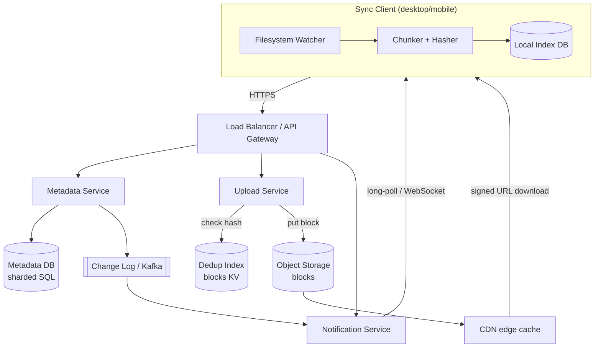

# File Storage & Sync (Google Drive / Dropbox)

## Problem & Clarifications

Design a cloud file storage and synchronization service like Google Drive or Dropbox. Users upload files from desktop/mobile clients, the files are stored durably, and changes sync across all of a user's devices. Files can be shared with other users.

**Clarifying questions (and assumed answers):**

- *What scale?* ~500M registered users, ~100M DAU. Average user stores ~50 GB. → ~exabyte-scale storage.
- *Max file size?* Up to 50 GB per file (large videos, disk images).
- *Do we need real-time collaborative editing (Google Docs OT/CRDT)?* No — out of scope. We sync **files as blobs**; the editing app sits on top.
- *Sync model?* Full bidirectional sync with a local client (like Dropbox) plus web access.
- *Consistency?* Read-after-write for the owner; eventual convergence across devices. Conflicts must be detected, never silently lost.
- *Offline support?* Yes — client works offline and reconciles on reconnect.
- *Cost matters?* Yes — storage is the dominant cost, so dedup and delta sync are first-class requirements.

## Functional Requirements

1. Upload/download files of arbitrary size (resumable, chunked).
2. Sync changes across all of a user's devices automatically and quickly.
3. Block-level **delta sync** — only changed chunks travel the wire.
4. **Deduplication** — identical chunks stored once (cross-user where allowed).
5. File/folder metadata: rename, move, delete (soft delete / trash).
6. **Versioning** — keep history; restore previous versions.
7. **Sharing & permissions** — share file/folder with users or via link (viewer/editor).
8. **Conflict detection & resolution**.
9. Notifications: push changes to online clients in near real-time.

## Non-Functional Requirements

- **Durability**: 11 nines (99.999999999%) for file content — never lose data.
- **Availability**: 99.99% for metadata & download paths.
- **Low sync latency**: a small edit should propagate to other online devices in < 5 s.
- **Scalability**: exabyte storage, billions of files, 100M concurrent sync sessions.
- **Bandwidth efficiency**: minimize bytes transferred via dedup + delta.
- **Security**: encryption at rest and in transit; strict access control.

## Capacity Estimation

| Metric | Estimate |
|---|---|
| Users / DAU | 500M / 100M |
| Avg storage per user | 50 GB |
| Total logical storage | 500M × 50 GB = **25 EB** logical |
| After dedup (~30% savings typical) + erasure-coded replication (~1.4x) | ~25 × 0.7 × 1.4 ≈ **24.5 EB** physical |
| Avg file size | ~1 MB (lots of small) but long tail to 50 GB |
| Chunk size | **4 MB** fixed (or content-defined; see deep dive) |
| Files | ~50B files |
| Daily new/changed files | 100M DAU × 20 edits = **2B edits/day** ≈ 23K edits/s avg, ~100K/s peak |
| Metadata QPS | edits + reads (sync polling, browsing) ≈ **500K QPS peak** |
| Upload bandwidth | 23K edits/s × avg 200 KB delta ≈ **4.6 GB/s** ingress |

Metadata is small (KB per file row) → fits in a sharded SQL/NoSQL store of a few hundred TB. File content goes to object storage (S3/GCS-like blob store).

## API Design

REST/gRPC. Auth via OAuth2 bearer token. Uploads are chunk-oriented.

```
# Begin a resumable upload session
POST /v1/files/{fileId}/uploadSession
  body: { totalSize, chunkHashes: [sha256...], mimeType }
  -> { sessionId, missingChunks: [hash...] }   # server tells client which chunks it lacks (dedup!)

# Upload one chunk (only if missing)
PUT /v1/blocks/{chunkHash}
  body: <raw 4MB bytes>
  -> 200 { stored: true }

# Commit: bind ordered chunk list to a new file version
POST /v1/files/{fileId}/commit
  body: { sessionId, orderedChunkHashes: [...], parentVersion }
  -> { fileId, versionId, conflict?: {...} }

# Download (server returns a manifest, client fetches missing blocks)
GET  /v1/files/{fileId}?version=  -> { manifest: [chunkHash...], metadata }
GET  /v1/blocks/{chunkHash}       -> <bytes>  (usually a CDN signed URL)

# Metadata / sync
GET  /v1/changes?cursor=<token>   -> { changes: [...], nextCursor }   # delta since cursor
POST /v1/files (create) | PATCH /v1/files/{id} (rename/move) | DELETE (trash)

# Sharing
POST /v1/files/{id}/permissions  body:{ granteeEmail|linkScope, role: viewer|editor }
```

## Data Model / Schema

Separate **metadata DB** (relational, sharded by user/workspace) from **block store** (object storage) and **dedup index** (KV).

```sql
-- Files: logical node in the namespace
CREATE TABLE files (
  file_id        BIGINT PRIMARY KEY,
  owner_id       BIGINT NOT NULL,
  parent_id      BIGINT,             -- folder; NULL = root
  name           VARCHAR(255) NOT NULL,
  is_folder      BOOLEAN NOT NULL,
  current_version BIGINT,            -- FK -> file_versions
  is_trashed     BOOLEAN DEFAULT FALSE,
  updated_at     TIMESTAMP,
  UNIQUE (parent_id, name)           -- no dup names in a folder
);

-- Immutable versions; each points to an ordered list of chunks via a manifest
CREATE TABLE file_versions (
  version_id   BIGINT PRIMARY KEY,
  file_id      BIGINT NOT NULL,
  size_bytes   BIGINT,
  manifest_id  BIGINT NOT NULL,      -- ordered chunk list
  created_by   BIGINT,
  created_at   TIMESTAMP,
  parent_version BIGINT              -- for conflict / lineage
);

CREATE TABLE manifests (             -- ordered chunk references
  manifest_id  BIGINT,
  seq          INT,
  chunk_hash   CHAR(64),             -- sha256 hex
  PRIMARY KEY (manifest_id, seq)
);

-- Global dedup index: content hash -> physical location + refcount
CREATE TABLE blocks (
  chunk_hash   CHAR(64) PRIMARY KEY, -- content-addressed
  size_bytes   INT,
  storage_url  VARCHAR(512),         -- e.g. s3://bucket/ab/cd/<hash>
  refcount     BIGINT,               -- for garbage collection
  created_at   TIMESTAMP
);

CREATE TABLE permissions (
  file_id      BIGINT,
  grantee_id   BIGINT,               -- user or group
  role         VARCHAR(16),          -- viewer | commenter | editor | owner
  inherited    BOOLEAN,              -- from parent folder
  PRIMARY KEY (file_id, grantee_id)
);
```

## High-Level Design



**Flow (upload of an edited file):** watcher detects change → chunker splits file, computes per-chunk hashes → client calls `uploadSession` with the hash list → server replies which chunks are **missing** (dedup) → client uploads only those to the Upload Service, which writes them to object storage and bumps the dedup refcount → client `commit`s the ordered manifest as a new version → Metadata Service writes the version row and appends to the **change log** → Notification Service fans the change out to the user's other online devices, which pull the new manifest and download only missing blocks (delta sync).

## Deep Dives

### 1. Chunking — fixed vs. content-defined

- **Fixed-size (4 MB)**: simple, but inserting one byte at the front shifts every chunk boundary → all hashes change → no delta benefit ("boundary-shift problem").
- **Content-Defined Chunking (CDC, e.g. Rabin fingerprint)**: boundaries chosen where a rolling hash hits a pattern, so a local edit only changes the chunk(s) around it. This is what makes delta sync effective. Production systems (Dropbox) use a hybrid; we use CDC with ~4 MB average, 1–8 MB bounds.

### 2. Resumable upload

The `sessionId` tracks which chunks have landed. If the connection drops, the client re-issues `uploadSession`, the server returns the still-missing set, and the client resumes — no re-upload of completed chunks. Each `PUT /blocks/{hash}` is **idempotent** because it is content-addressed: re-PUTing the same hash is a no-op.

### 3. Deduplication

Chunks are stored by **content hash** (SHA-256). Before uploading, the server checks the dedup index; if the hash exists, it just increments `refcount` and skips transfer. This dedups across versions, files, and (for non-sensitive tiers) across users. **Security note:** cross-user dedup enables a confirmation-of-file attack; many providers therefore dedup only within an account or use per-account convergent encryption.

### 4. Metadata service & sync cursor

Each user has a monotonically increasing **change sequence**. Clients store a `cursor`; `GET /changes?cursor=` returns everything after it. This makes sync a simple, resumable pull. The change log is also published to Kafka for notification fan-out.

### 5. Versioning & garbage collection

Versions are immutable manifests. Deleting a file decrements refcounts on its chunks; a background GC sweeps `blocks` where `refcount = 0` (with a grace period to tolerate races). Trash is soft-delete with a 30-day retention.

### 6. Sharing & permissions

Permissions are stored per-file plus inherited from parent folders. On every access the service evaluates the effective role (most-permissive of direct + inherited). Link sharing creates a capability token scoped to a role. For large orgs, an ACL cache fronts the permission table.

### 7. Conflict resolution

Each commit carries `parentVersion`. If the server's `current_version` ≠ the client's `parentVersion`, two devices edited the same base → **conflict**. Resolution: keep both — the server creates the new version but the client renames the loser to `name (conflicted copy 2026-06-23 — Device).ext`. We never silently overwrite. This is last-writer-wins for the *pointer* but loss-free for the *content*.

### 8. Notification

Online clients hold a long-poll/WebSocket to the Notification Service. When a change is published, the service signals affected devices to call `/changes`. Offline devices reconcile via the cursor on reconnect. This keeps the metadata DB read load low (push, not poll).

## Bottlenecks & Trade-offs

- **Dedup index hotspot**: a global KV with billions of hashes; shard by hash prefix. Refcount updates are write-heavy → batch them.
- **Metadata DB scaling**: shard by `owner_id` (or workspace). Cross-user shared folders complicate sharding → store shared trees in a workspace shard.
- **Small-file overhead**: 4 MB chunking wastes space for tiny files; pack small files into combined objects.
- **CDC CPU cost** on the client vs. bandwidth saved — worth it on slow links, skippable on LAN.
- **Cross-user dedup** trades cost savings against a privacy side-channel.
- **Notification fan-out** at 100M connections needs a dedicated, sticky-session push tier.

## Code

Chunking (content-defined) + content-hash dedup + sync diff against a server manifest.

```python
import hashlib
from typing import Iterator

# --- Content-Defined Chunking via a simple Rabin-style rolling hash ---
WINDOW = 48
MIN_CHUNK = 1 * 1024 * 1024          # 1 MB
MAX_CHUNK = 8 * 1024 * 1024          # 8 MB
MASK = (1 << 22) - 1                  # ~4 MB average boundary probability

def content_defined_chunks(data: bytes) -> Iterator[bytes]:
    """Yield variable-size chunks; boundaries depend on content, so a local
    edit only perturbs nearby chunks (good for delta sync)."""
    n = len(data)
    start = 0
    h = 0
    i = 0
    while i < n:
        # cheap rolling hash over a sliding window
        h = ((h << 1) + data[i]) & 0xFFFFFFFF
        size = i - start + 1
        boundary = size >= MIN_CHUNK and (h & MASK) == 0
        if boundary or size >= MAX_CHUNK:
            yield data[start:i + 1]
            start = i + 1
            h = 0
        i += 1
    if start < n:
        yield data[start:]

def chunk_hash(chunk: bytes) -> str:
    return hashlib.sha256(chunk).hexdigest()

def build_manifest(data: bytes) -> list[str]:
    """Ordered list of content hashes = the file's manifest."""
    return [chunk_hash(c) for c in content_defined_chunks(data)]


# --- Dedup: which chunks must actually be uploaded? ---
class BlockStore:
    """Stand-in for the global dedup index + object storage."""
    def __init__(self):
        self.blocks: dict[str, bytes] = {}
        self.refcount: dict[str, int] = {}

    def missing(self, hashes: list[str]) -> set[str]:
        return {h for h in hashes if h not in self.blocks}

    def put(self, chunk: bytes):
        h = chunk_hash(chunk)
        if h not in self.blocks:        # content-addressed => idempotent
            self.blocks[h] = chunk
        self.refcount[h] = self.refcount.get(h, 0) + 1

    def release(self, hashes: list[str]):
        for h in hashes:
            self.refcount[h] -= 1
            if self.refcount[h] == 0:   # GC candidate
                del self.blocks[h]
                del self.refcount[h]


def upload(data: bytes, store: BlockStore) -> list[str]:
    manifest = build_manifest(data)
    chunks = {chunk_hash(c): c for c in content_defined_chunks(data)}
    need = store.missing(list(chunks))
    for h in need:                      # only transfer missing blocks
        store.put(chunks[h])
    # bump refcount for chunks that already existed (dedup hit)
    for h in chunks:
        if h not in need:
            store.refcount[h] += 1
    return manifest


# --- Delta sync: diff a new manifest against what the peer already has ---
def sync_diff(old_manifest: list[str], new_manifest: list[str]) -> dict:
    """Return blocks the peer must fetch and the new ordering."""
    have = set(old_manifest)
    to_fetch = [h for h in new_manifest if h not in have]
    return {"fetch": to_fetch, "new_order": new_manifest}


if __name__ == "__main__":
    store = BlockStore()
    v1 = b"A" * (5 * 1024 * 1024) + b"B" * (5 * 1024 * 1024)
    m1 = upload(v1, store)
    print("v1 chunks:", len(m1), "stored:", len(store.blocks))

    # Edit a few bytes in the middle -> only nearby chunk(s) change
    v2 = bytearray(v1); v2[5_000_000:5_000_010] = b"CHANGED!!!"; v2 = bytes(v2)
    m2 = upload(v2, store)
    diff = sync_diff(m1, m2)
    print("v2 chunks:", len(m2), "blocks transferred on edit:", len(diff["fetch"]))
```

## Summary

We separate **metadata** (sharded SQL, cursor-based change log) from **content** (content-addressed blocks in object storage fronted by a CDN). Content-defined chunking plus SHA-256 dedup gives bandwidth- and storage-efficient **delta sync**; resumable, idempotent block uploads survive flaky networks; immutable versioned manifests give history and loss-free **conflict resolution** ("conflicted copy"). A Kafka-backed notification tier pushes changes to online devices for sub-5s sync, while offline devices reconcile via their sync cursor. Durability comes from erasure-coded replicated object storage; cost comes down through dedup and tiering.
