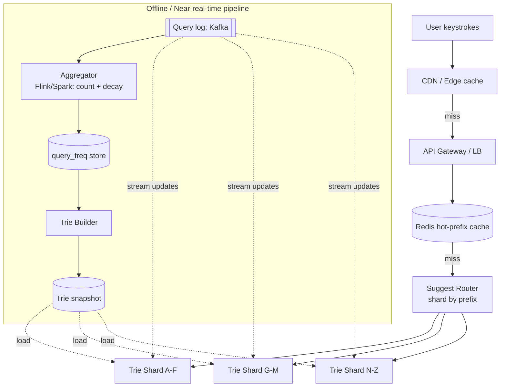

# Search Autocomplete / Typeahead

## Problem & Clarifications

Design a search autocomplete (typeahead) service: as a user types a prefix, return the top-k most relevant completions (e.g. Google search box, Amazon product search).

**Clarifying questions (and assumed answers):**

- *What ranks suggestions?* Historical **query frequency** (popularity), optionally personalized/recency-weighted. We assume frequency-based, time-decayed.
- *How many suggestions?* Top **k = 5–10** per prefix.
- *Latency budget?* Must feel instant — **< 100 ms p99** end-to-end (suggestions fire on each keystroke).
- *How fresh?* New trending queries should appear within minutes, not seconds. Near-real-time, not strictly real-time.
- *Multilingual / typo tolerance / personalization?* Out of scope for the core; we note extensions.
- *Read vs write?* Massively read-heavy. Reads (keystrokes) ≫ writes (new queries logged).
- *Scope of completions?* Completions are *whole past queries*, not just word prefixes.

## Functional Requirements

1. Given a prefix, return the top-k completions ranked by popularity.
2. Update suggestions as the global query stream evolves (trending terms).
3. Support multiple keystrokes per query with very low latency.
4. (Extension) prefix case-insensitivity, basic typo tolerance, personalization.

## Non-Functional Requirements

- **Latency**: < 100 ms p99; ideally < 50 ms server-side.
- **Availability**: 99.99% — degrade gracefully (stale suggestions OK).
- **Scalability**: billions of queries/day, millions of distinct prefixes.
- **Freshness**: trending queries surface within minutes.
- **Cost**: serve mostly from memory; reads dominate.

## Capacity Estimation

| Metric | Estimate |
|---|---|
| Search queries / day | 5B |
| Keystroke (typeahead) requests | ~6 chars avg × 5B = **30B/day** ≈ 350K QPS avg, **~1M QPS peak** |
| Distinct queries tracked | ~100M (after pruning rare/long-tail) |
| Avg query length | ~20 bytes |
| Trie nodes | ~ tens of millions of prefixes |
| Trie memory | with top-k cached per node: ~100M queries × (20B + k×(20B+8B)) ≈ tens of GB → **shard across machines** |
| Cache hit rate (hot prefixes) | > 90% (query distribution is Zipfian) |

The QPS is the hard part. Two layers handle it: a CDN/edge + in-memory cache for hot prefixes, and a sharded in-memory trie service behind it.

## API Design

```
GET /v1/suggest?q=<prefix>&k=10&lang=en
  -> 200 { "prefix": "new y",
           "suggestions": [
              {"text":"new york weather","score":98213},
              {"text":"new york times","score":74110}, ... ] }

# Logging (async, from the search backend, not the typeahead path)
POST /v1/log  body:{ query, ts, userId? }   -> 202

# Admin
POST /v1/trie/rebuild   # trigger offline rebuild
```

The `GET /suggest` response is highly cacheable: `Cache-Control: public, max-age=60` keyed on `(prefix, k, lang)`.

## Data Model / Schema

Two stores: an **offline aggregation store** (query frequencies) and the **online trie** (serving structure).

```sql
-- Offline: rolling query frequency with time decay
CREATE TABLE query_freq (
  query        VARCHAR(256) PRIMARY KEY,
  freq         BIGINT,            -- decayed count
  last_seen    TIMESTAMP
);

-- Each trie node persists its precomputed top-k (denormalized for fast read)
-- Serialized form per prefix:
--   prefix -> [ (query, score) , ... up to k ]
```

The serving trie itself is an in-memory structure (see code). It is built offline from `query_freq` and shipped to serving nodes as an immutable snapshot, with incremental updates layered on top.

## High-Level Design



Search frontends emit each executed query to Kafka. A streaming aggregator maintains decayed frequencies. A builder periodically materializes an immutable trie snapshot with **top-k precomputed at every node**; serving shards load it and apply a thin layer of streaming updates for freshness.

## Deep Dives

### 1. The trie (with top-k per prefix)

A naive trie stores one char per edge; to answer top-k you'd traverse the whole subtree under the prefix on every keystroke — too slow. The key optimization: **store the top-k completions directly at each node** (precomputed). Then a lookup is O(prefix length) to walk to the node, then O(1) to read its cached top-k. Memory cost is k entries per node, which is acceptable and shardable.

### 2. Ranking

Score = time-decayed frequency. Decay (e.g. exponential half-life of a few days) lets trending queries rise and stale ones fall. Score can be blended: `score = freq_decayed + w·recency + personalization`. The trie stores the final score so ranking at read time is trivial.

### 3. Caching

Query popularity is Zipfian — a tiny set of prefixes serves most traffic. A CDN/edge cache plus a Redis layer in front of the trie service absorbs > 90% of reads. TTL ~60 s balances freshness vs. hit rate. This is what makes 1M QPS affordable.

### 4. Updating the trie from a query stream

We do **not** mutate the big trie on every query (write amplification, lock contention). Instead:
- Offline builder produces an immutable base snapshot every N minutes/hours.
- A small, mutable **delta trie** in each shard absorbs recent counts from the Kafka stream; reads merge base + delta.
- On the next rebuild, deltas fold into the base. This is a classic LSM-style read-merge pattern applied to a trie.

### 5. Sharding by prefix

Partition the keyspace by leading characters (e.g. first 1–2 chars), or hash of the first char, so each shard owns a disjoint set of prefixes. The router sends a request to exactly one shard. Hot first-letters (like "a", "s") get split further. Replicate each shard 3× for read scaling and HA.

### 6. Distributed serving

Stateless routers, replicated trie shards behind them, Redis + CDN in front. Snapshots are immutable so replicas can be added/swapped without coordination. A new snapshot is loaded into spare capacity and traffic is flipped (blue/green) to avoid latency spikes during load.

## Bottlenecks & Trade-offs

- **Memory vs. speed**: caching top-k at every node trades memory for O(1) reads — the right trade for a read-heavy system.
- **Freshness vs. cost**: longer cache TTL and rebuild interval = cheaper but staler.
- **Hot shards**: skewed first-letter distribution; mitigate with finer sharding + replication.
- **Rebuild cost**: full trie rebuild is expensive; the base+delta scheme bounds it.
- **Write path isolation**: logging is async/best-effort so it never slows the read path.
- **Personalization** breaks cache sharing (per-user keys) — usually applied as a light re-rank on top of global suggestions.

## Code

A complete trie with precomputed top-k suggestions and a stream-update path.

```python
import heapq
from dataclasses import dataclass, field

@dataclass
class TrieNode:
    children: dict = field(default_factory=dict)
    # precomputed top-k completions reachable through this node:
    # list of (text, score), kept sorted by score desc, length <= k
    top: list = field(default_factory=list)

class Typeahead:
    def __init__(self, k: int = 10):
        self.root = TrieNode()
        self.k = k
        self.freq: dict[str, int] = {}     # query -> score

    def _merge_top(self, node: TrieNode, text: str, score: int):
        """Keep node.top as the k highest-scoring (text, score) seen below it."""
        # replace existing entry for text, if any
        node.top = [(t, s) for (t, s) in node.top if t != text]
        node.top.append((text, score))
        node.top.sort(key=lambda x: (-x[1], x[0]))
        if len(node.top) > self.k:
            node.top = node.top[: self.k]

    def insert(self, query: str, score: int):
        """Insert/update a query with a given score and refresh top-k along its path."""
        self.freq[query] = score
        node = self.root
        self._merge_top(node, query, score)          # root covers all prefixes
        for ch in query:
            node = node.children.setdefault(ch, TrieNode())
            self._merge_top(node, query, score)

    def add_query_event(self, query: str, weight: int = 1):
        """Stream update: bump frequency and re-insert (delta path)."""
        self.insert(query, self.freq.get(query, 0) + weight)

    def suggest(self, prefix: str) -> list[tuple[str, int]]:
        """O(len(prefix)) walk, then O(1) read of precomputed top-k."""
        node = self.root
        for ch in prefix:
            node = node.children.get(ch)
            if node is None:
                return []
        return node.top

    # Offline bulk build from a frequency table -> faster than many inserts
    @classmethod
    def build(cls, freq_table: dict[str, int], k: int = 10) -> "Typeahead":
        t = cls(k)
        # insert in descending score so top-k lists fill correctly & cheaply
        for q, s in sorted(freq_table.items(), key=lambda x: -x[1]):
            t.insert(q, s)
        return t


if __name__ == "__main__":
    seed = {
        "new york weather": 98213, "new york times": 74110,
        "new york knicks": 41002, "new movies 2026": 30551,
        "netflix login": 88120, "netflix": 120000,
        "news": 60000, "new balance": 22000,
    }
    t = Typeahead.build(seed, k=5)

    print("ne ->", t.suggest("ne"))
    print("new ->", t.suggest("new"))
    print("new y ->", t.suggest("new y"))

    # trending: a new query spikes in the stream
    for _ in range(5):
        t.add_query_event("new ai model", weight=50000)
    print("after trend, new ->", t.suggest("new"))
```

Output (abridged):
```
ne -> [('netflix', 120000), ('netflix login', 88120), ('news', 60000), ('new york weather', 98213)... ]
new -> [('new york weather', 98213), ('new york times', 74110), ...]
new y -> [('new york weather', 98213), ('new york times', 74110), ('new york knicks', 41002)]
after trend, new -> [('new ai model', 250000), ('new york weather', 98213), ...]
```

## Summary

The core is a **trie with top-k completions precomputed at every node**, making each keystroke an O(prefix-length) walk plus an O(1) read. The system is overwhelmingly read-heavy, so a CDN + Redis cache absorbs the Zipfian hot prefixes and a sharded, replicated, in-memory trie service handles the rest. Freshness comes from an offline aggregation pipeline (Kafka → streaming counter with time decay → immutable trie snapshot) plus a small mutable delta trie merged at read time — avoiding write amplification on the main structure. Sharding by prefix keeps each request on a single node, and immutable snapshots make scaling and blue/green swaps trivial.
