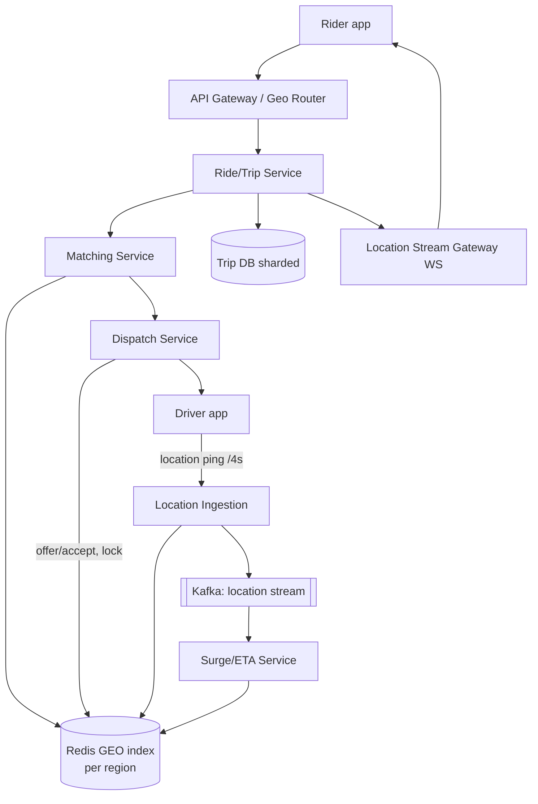

# Ride-Sharing (Uber / Lyft)

## Problem & Clarifications

Design a ride-hailing service: riders request trips, the system matches them with nearby available drivers, tracks the trip in real time, and handles pricing.

**Clarifying questions (and assumed answers):**

- *Scale?* Global; ~5M active drivers, ~20M daily riders, peak ~1M concurrent trips.
- *Matching radius?* Start ~2 km, expand if no match.
- *Pricing model?* Base + per-distance + per-time, multiplied by a **surge** factor driven by local supply/demand.
- *Real-time location?* Drivers send GPS pings every ~4 s; riders see the car move on the map.
- *Consistency?* A driver must be matched to **exactly one** rider at a time (no double-dispatch).
- *Pool/shared rides, food delivery?* Out of scope for the core.
- *Geographic distribution?* Yes — regionalized; a rider in Tokyo never queries San Francisco data.

## Functional Requirements

1. Drivers continuously publish location & availability.
2. Riders request a ride from A → B; system finds nearby eligible drivers.
3. **Match** rider ↔ driver and dispatch (offer → accept).
4. Real-time location streaming to the rider during pickup and trip.
5. ETA, fare estimate, and dynamic **surge** pricing.
6. Trip lifecycle: requested → matched → en route → started → completed → paid.
7. Ratings after the trip.

## Non-Functional Requirements

- **Low latency**: nearby-driver search & match < 1–2 s; location updates < 1 s.
- **High availability**: 99.99%; a region outage must not cascade.
- **Scalability**: 5M drivers × ping/4 s = ~1.25M location writes/s globally.
- **Consistency**: exactly-once dispatch (no two riders get the same driver).
- **Geo-locality**: route requests to the nearest region.

## Capacity Estimation

| Metric | Estimate |
|---|---|
| Active drivers | 5M |
| Location ping interval | 4 s |
| **Location write QPS** | 5M / 4 = **1.25M writes/s** |
| Ride requests / day | 20M ≈ 230/s avg, **~5K/s peak** |
| Concurrent trips (peak) | ~1M |
| Location payload | ~50 bytes (driverId, lat, lng, ts, heading) |
| Location write bandwidth | 1.25M × 50B ≈ **62 MB/s** |
| Geo index memory | 5M drivers × ~100 B ≈ 500 MB (fits in Redis per region) |

The dominant load is the **location write firehose**. It must hit an in-memory geo store, not a disk DB.

## API Design

```
# Driver
POST /v1/driver/location   body:{ driverId, lat, lng, heading, status } -> 202
POST /v1/driver/status     body:{ driverId, status: online|offline|on_trip }

# Rider
POST /v1/rides/estimate    body:{ pickup, dropoff } -> { fare, surge, etaPickup }
POST /v1/rides             body:{ riderId, pickup, dropoff }
   -> { rideId, status:"matching" }
GET  /v1/rides/{rideId}    -> { status, driver?, driverLocation?, eta }

# Dispatch (internal, to driver app)
POST /v1/dispatch/offer    body:{ driverId, rideId, expiresIn:15s }
POST /v1/dispatch/respond  body:{ driverId, rideId, accept:true }

# Streaming: rider subscribes to driver location
WS   /v1/rides/{rideId}/stream  -> location frames
```

## Data Model / Schema

Hot path uses Redis (geo + state); durable trip records in a sharded SQL/NoSQL store.

```sql
CREATE TABLE trips (
  ride_id      BIGINT PRIMARY KEY,
  rider_id     BIGINT,
  driver_id    BIGINT,
  status       VARCHAR(16),     -- requested|matched|enroute|started|completed|cancelled
  pickup_lat   DOUBLE, pickup_lng DOUBLE,
  drop_lat     DOUBLE, drop_lng  DOUBLE,
  fare_cents   BIGINT,
  surge        DECIMAL(3,2),
  requested_at TIMESTAMP,
  completed_at TIMESTAMP
);

CREATE TABLE drivers (
  driver_id    BIGINT PRIMARY KEY,
  status       VARCHAR(12),
  rating       DECIMAL(2,1),
  region_id    INT
);
```

Redis hot state:
```
GEO  drivers:{region}            -> GEOADD lng lat driverId        (geospatial index)
HASH driver:{id}                 -> { status, lastPing, currentRide }
KEY  ride:{id}:lock              -> dispatch lock (SET NX EX)
ZSET surge:{geohash6}            -> rolling demand counter
```

## High-Level Design



**Match flow:** rider requests → Ride Service creates a `requested` trip → Matching Service does a geo radius query on the Redis GEO index for the pickup region → ranks candidates by ETA → Dispatch Service offers to the best driver under a **lock** (so the driver can't be offered to two riders) → driver accepts → trip becomes `matched`, driver status → `on_trip`. Location pings stream through to the rider via the WS gateway.

## Deep Dives

### 1. Driver location ingestion

1.25M writes/s can't go to a relational DB. They go to an in-memory **geospatial index** (Redis GEO) partitioned by region, plus Kafka for downstream consumers (surge, analytics, ETA). Writes are last-write-wins per driver; we keep only the latest position. The ingestion tier is stateless and horizontally scaled.

### 2. Geospatial indexing — the core choice

We need "find drivers within radius r of (lat,lng)" fast. Options:

- **Geohash**: encode lat/lng into a base-32 string; nearby points share a prefix. A 6-char geohash ≈ 1.2 km × 0.6 km cell. To search a radius, query the rider's cell plus its 8 neighbors (a geohash near a cell edge can miss neighbors otherwise). Simple, works in any KV store. **We use this for the code.**
- **Quadtree**: recursively subdivide space; dense urban areas split deeper. Great for non-uniform density but more complex to distribute.
- **Google S2**: maps the sphere to cells via a Hilbert curve; cells are more uniform in area than geohash and give clean range queries. Uber/Lyft favor S2-like schemes.
- **Redis GEO**: built on geohash + sorted sets; `GEOADD` / `GEOSEARCH ... BYRADIUS` gives radius queries out of the box. Pragmatic and battle-tested — our production choice.

### 3. Matching rider ↔ driver

Candidate set from the geo query is ranked not by straight-line distance but by **ETA** (road network, traffic). Driver eligibility filters: online, idle, vehicle type, rating, not too far. Pick the best, offer with a ~15 s timeout; on decline/timeout, offer the next. Expand the radius if the candidate set is empty.

### 4. Exactly-once dispatch (no double-booking)

Race: two riders' matchers both pick driver X. We guard with a per-driver dispatch **lock** (`SET driver:{id}:lock rideId NX EX 20`). Only the matcher that wins the lock may offer to X; the other skips to its next candidate. On accept, we atomically transition the trip and clear the lock. This makes dispatch effectively single-assignment.

### 5. Real-time location updates

During pickup/trip, the assigned driver's pings are forwarded to the rider over a WebSocket through the Stream Gateway, keyed by `rideId`. We throttle to ~1 frame/s to the rider and interpolate client-side for smooth movement.

### 6. ETA / pricing / surge

- **ETA**: routing engine over the road graph (contraction hierarchies / OSRM-style) with live traffic.
- **Fare** = `base + perKm·distance + perMin·time` then `× surge`.
- **Surge**: per-cell (geohash6) ratio of demand (open requests) to supply (idle drivers) over a rolling window; when demand ≫ supply, multiplier rises (e.g. 1.0 → 2.3). Computed by the Surge service consuming the Kafka stream and written back to Redis for instant reads.

### 7. Trip lifecycle

A state machine persisted in the Trip DB: `requested → matched → driver_arrived → started → completed → paid`, with `cancelled` reachable from early states. Each transition is an idempotent, logged event (for billing, disputes, analytics). Payment is triggered on `completed` (see payment system design).

### 8. Dispatch system & geo-routing

The whole stack is **regionalized**: the geo router sends a request to the data center/cell owning that geography. This bounds blast radius, keeps geo indices small and in-memory, and keeps latency low. Cross-region handoff (a trip crossing a boundary) is rare and handled by the originating region.

## Bottlenecks & Trade-offs

- **Location write firehose**: in-memory + LWW + regional sharding; never durable-write the hot path.
- **Hot cells** (downtown at rush hour): finer geohash precision + replicas; surge naturally throttles demand.
- **Geohash edge problem**: must query neighbor cells — handled by `GEOSEARCH BYRADIUS` or explicit neighbor expansion.
- **Lock contention** on popular drivers: short TTLs and fast offer/decline cycles.
- **ETA accuracy vs cost**: full road-graph routing is expensive; cache common O-D pairs, use haversine as a cheap pre-filter.
- **Consistency vs latency**: dispatch is strongly consistent (locks); location is eventually consistent (LWW).

## Code

Geohash-based nearby-driver search + a matching/dispatch skeleton with single-assignment locking.

```python
import math, time
from collections import defaultdict

# ---------- Geohash encoding ----------
_B32 = "0123456789bcdefghjkmnpqrstuvwxyz"

def geohash_encode(lat: float, lng: float, precision: int = 6) -> str:
    lat_r, lng_r = (-90.0, 90.0), (-180.0, 180.0)
    bits, ch, even, out = 0, 0, True, []
    while len(out) < precision:
        if even:
            mid = (lng_r[0] + lng_r[1]) / 2
            if lng > mid: ch = (ch << 1) | 1; lng_r = (mid, lng_r[1])
            else:         ch = (ch << 1);     lng_r = (lng_r[0], mid)
        else:
            mid = (lat_r[0] + lat_r[1]) / 2
            if lat > mid: ch = (ch << 1) | 1; lat_r = (mid, lat_r[1])
            else:         ch = (ch << 1);     lat_r = (lat_r[0], mid)
        even = not even
        bits += 1
        if bits == 5:
            out.append(_B32[ch]); bits = 0; ch = 0
    return "".join(out)

def haversine_km(a, b) -> float:
    R = 6371.0
    lat1, lng1, lat2, lng2 = map(math.radians, (a[0], a[1], b[0], b[1]))
    dlat, dlng = lat2 - lat1, lng2 - lng1
    h = math.sin(dlat/2)**2 + math.cos(lat1)*math.cos(lat2)*math.sin(dlng/2)**2
    return 2 * R * math.asin(math.sqrt(h))

# ---------- Geo index (geohash bucket -> set of drivers) ----------
class GeoIndex:
    def __init__(self, precision: int = 6):
        self.precision = precision
        self.buckets: dict[str, dict] = defaultdict(dict)   # geohash -> {driverId: (lat,lng,ts)}
        self.driver_cell: dict[str, str] = {}

    def update(self, driver_id, lat, lng):
        cell = geohash_encode(lat, lng, self.precision)
        old = self.driver_cell.get(driver_id)
        if old and old != cell:
            self.buckets[old].pop(driver_id, None)
        self.buckets[cell][driver_id] = (lat, lng, time.time())
        self.driver_cell[driver_id] = cell

    def _neighbors(self, cell):
        # For brevity: search the cell itself + nearby cells by perturbing the
        # last char. Production uses true geohash neighbor math or Redis GEOSEARCH.
        idx = _B32.index(cell[-1])
        cells = {cell}
        for d in (-1, 1):
            j = idx + d
            if 0 <= j < 32:
                cells.add(cell[:-1] + _B32[j])
        return cells

    def nearby(self, lat, lng, radius_km=2.0):
        center = geohash_encode(lat, lng, self.precision)
        found = []
        for cell in self._neighbors(center):
            for did, (dlat, dlng, ts) in self.buckets.get(cell, {}).items():
                dist = haversine_km((lat, lng), (dlat, dlng))
                if dist <= radius_km:
                    found.append((did, dist))
        return sorted(found, key=lambda x: x[1])   # nearest first (proxy for ETA)

# ---------- Dispatch with single-assignment lock ----------
class Dispatcher:
    def __init__(self, geo: GeoIndex):
        self.geo = geo
        self.locked: dict[str, str] = {}    # driverId -> rideId (simulates SET NX)

    def _try_lock(self, driver_id, ride_id):
        if driver_id in self.locked:
            return False
        self.locked[driver_id] = ride_id
        return True

    def match(self, ride_id, pickup, radius_km=2.0, max_radius=8.0):
        while radius_km <= max_radius:
            for driver_id, dist in self.geo.nearby(*pickup, radius_km):
                if self._try_lock(driver_id, ride_id):   # exactly-once guard
                    # offer -> assume accept for the skeleton
                    return {"ride_id": ride_id, "driver_id": driver_id,
                            "distance_km": round(dist, 2)}
            radius_km *= 2     # expand if nobody available/eligible
        return {"ride_id": ride_id, "driver_id": None, "reason": "no_drivers"}


if __name__ == "__main__":
    geo = GeoIndex(precision=6)
    # drivers around San Francisco
    geo.update("d1", 37.7749, -122.4194)
    geo.update("d2", 37.7760, -122.4180)
    geo.update("d3", 37.8000, -122.4000)   # farther away
    disp = Dispatcher(geo)

    r1 = disp.match("ride-100", (37.7750, -122.4190))
    print("ride-100 ->", r1)
    # second rider near same drivers: d1 is locked, gets next-nearest
    r2 = disp.match("ride-101", (37.7752, -122.4188))
    print("ride-101 ->", r2)
```

## Summary

The system is **regionalized** and built around an in-memory **geospatial index** (geohash / S2 / Redis GEO) that absorbs a 1.25M writes/s location firehose and answers radius queries in milliseconds. Matching ranks nearby drivers by ETA and dispatches with a per-driver **lock** to guarantee exactly-once assignment. A Kafka location stream feeds **surge** (per-cell demand/supply ratio) and ETA services, and a WebSocket gateway streams the driver's position to the rider. The hot path (location, geo, dispatch) lives in memory for latency; durable trip state and billing live in a sharded transactional store. Trade-offs center on keeping the write firehose off disk, handling hot urban cells, and balancing strong consistency for dispatch against eventual consistency for location.
