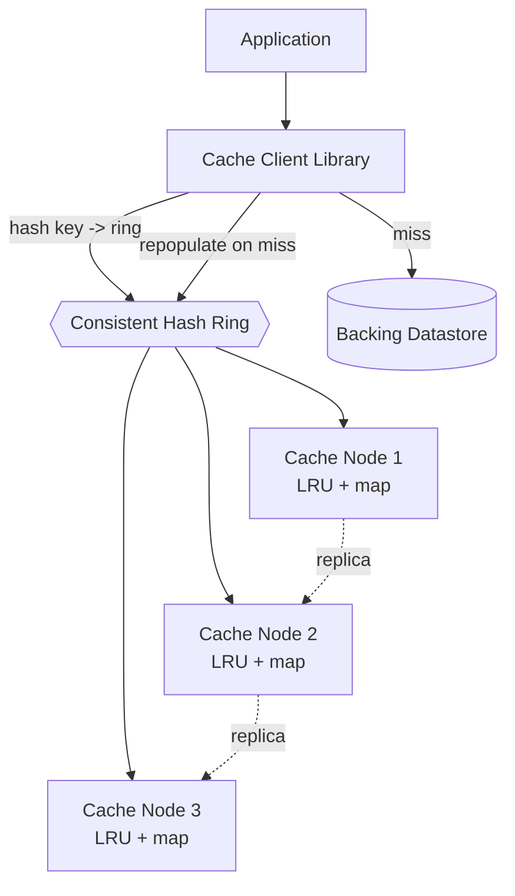

# Distributed Cache (Memcached / Redis-like)

## Problem & Clarifications

Design a distributed in-memory cache that sits in front of a slower datastore to reduce latency and load, scaling horizontally across many nodes.

**Clarifying questions (and assumed answers):**

- *Cache type?* Key–value, opaque byte values, TTL support. Like Memcached/Redis.
- *Consistency?* Cache is a performance layer; the database is source of truth. Eventual consistency / best-effort is acceptable.
- *Eviction?* **LRU** (with TTL). Memory-bounded.
- *Replication?* Optional per-key replication for availability of hot data.
- *Distribution?* Client-side **consistent hashing** to route keys to nodes; nodes are independent (shared-nothing), like Memcached.
- *Durability?* Not required — it's a cache; losing data only causes a miss. (Redis offers optional persistence; out of scope.)
- *Scale?* Cluster of ~100–1000 nodes, terabytes of RAM, millions of ops/s.

## Functional Requirements

1. `GET`, `SET key value [ttl]`, `DELETE`.
2. Bounded memory with **LRU eviction**.
3. TTL expiry.
4. Horizontal scaling: add/remove nodes with minimal key remapping (**consistent hashing**).
5. Optional replication for HA of hot keys.

## Non-Functional Requirements

- **Latency**: sub-millisecond p99 per node (in-memory).
- **Throughput**: millions of ops/s cluster-wide.
- **Scalability**: linear with node count.
- **Availability**: a node loss should drop only that node's keyspace fraction, not the cluster.
- **Elasticity**: adding a node remaps ~1/N of keys, not the whole keyspace.

## Capacity Estimation

| Metric | Estimate |
|---|---|
| Working set to cache | 10 TB |
| RAM per node | 64 GB usable | 
| Nodes | 10 TB / 64 GB ≈ **~160 nodes** |
| Target hit rate | 95%+ |
| Read QPS | 2M/s |
| With 95% hit rate | DB sees only 100K/s (20× reduction) |
| Avg value size | ~1 KB |
| Virtual nodes per physical node (consistent hashing) | ~150 (for even distribution) |

If a node dies, ~1/160 ≈ 0.6% of keys become misses that fall through to the DB — tolerable, and replication can mask it for hot keys.

## API Design

Wire protocol (RESP-like / Memcached-like); the client library handles routing.

```
GET key                 -> value | (nil)
SET key value [EX ttl]  -> OK
DEL key                 -> (count deleted)
# Cluster ops
ADD-NODE host:port
REMOVE-NODE host:port
STATS                   -> { hits, misses, evictions, mem_used }
```

Application-level usage is **cache-aside** (see deep dive), not a direct API concern.

## Data Model

Each node holds an in-memory hash map plus an LRU ordering and per-key expiry:

```
map:  key -> (value, expire_at)
lru:  doubly-linked list ordered by recency (head = MRU, tail = LRU)
```

Keys are distributed across nodes by a **consistent hash ring**:

```
ring: sorted positions on [0, 2^32) -> nodeId   (each node placed at V virtual positions)
lookup(key): hash(key) -> first ring position clockwise -> node
```

## High-Level Design



**Cache-aside read:** app asks client for key → client hashes key, routes to the owning node → hit returns value; **miss** → app reads the DB, then `SET`s the value back into the cache. **Write:** app writes the DB, then invalidates/updates the cache entry.

## Deep Dives

### 1. Cache-aside (lazy loading)

The application, not the cache, owns the read-through logic:
```
v = cache.get(k)
if v is None:
    v = db.read(k)
    cache.set(k, v, ttl)
return v
```
On write: `db.write(k, v); cache.delete(k)` (delete is safer than update — avoids stale writes racing). Pros: only requested data is cached; cache failure ≠ outage. Cons: first read is a miss; possible brief staleness.

### 2. Sharding via consistent hashing

Naive `hash(key) % N` remaps *almost every key* when N changes — catastrophic on scale events. **Consistent hashing** places nodes and keys on a ring `[0, 2^32)`; a key belongs to the first node clockwise. Adding/removing a node only remaps the keys between it and its predecessor — about **1/N of keys**. **Virtual nodes** (each physical node at ~150 ring positions) smooth out load imbalance and make rebalancing on node loss spread across many nodes.

### 3. Eviction — LRU

Each node is memory-bounded. On insert past capacity, evict the **least-recently-used** key. Implemented as a hash map + doubly-linked list: `get`/`set` move the key to the head (MRU) in O(1); eviction pops the tail in O(1). TTL expiry is layered on top (lazy expiry on access + periodic sampling sweep, as Redis does).

### 4. Replication & failover

For HA, each key's owner node also writes to the **next R nodes** on the ring (replicas). If the primary dies, the client fails over to a replica; meanwhile the ring is updated to remove the dead node. Trade-off: replication multiplies writes and memory by R but prevents a thundering herd to the DB when a node dies. Pure Memcached skips this (just takes the misses); Redis Cluster does primary/replica per shard.

### 5. Hot keys

A single extremely popular key (a celebrity's profile) overloads its one owner node. Mitigations:
- **Key splitting / replication**: store N copies (`key#0..key#N`), client picks one at random to spread reads.
- **Client-side local cache** (near cache) for ultra-hot keys with short TTL.
- Detect hotness via per-key request sampling.

### 6. Cache stampede (thundering herd)

When a hot key expires, thousands of concurrent misses hammer the DB at once. Mitigations:
- **Per-key lock / single-flight**: only one request recomputes; others wait for the result.
- **Early/probabilistic expiration**: refresh slightly before TTL with a random jitter so expirations don't align.
- **Stale-while-revalidate**: serve the stale value while one request refreshes in the background.

### 7. Write policies

- **Write-through**: write cache + DB synchronously → cache always fresh, higher write latency.
- **Write-back (write-behind)**: write cache now, flush to DB async → fast writes, risk of data loss on node crash.
- **Write-around** / cache-aside delete: write DB, invalidate cache → avoids caching write-once data; we default to this.

## Bottlenecks & Trade-offs

- **Consistency vs. speed**: cache-aside accepts brief staleness for huge latency wins.
- **Hot keys** are the classic failure mode → replication/splitting.
- **Stampede** on TTL expiry → single-flight + jitter.
- **Rebalancing**: even with consistent hashing, the remapped keys become cold (misses) right after a topology change — warmup matters.
- **Memory fragmentation**: real systems use slab allocators (Memcached) to bound it.
- **Replication factor R**: more availability vs. more memory/write cost.

## Code

An O(1) LRU cache with TTL, plus a consistent-hash routing client.

```python
import bisect, hashlib, time

# ---------------- LRU cache with TTL (one node) ----------------
class _Node:
    __slots__ = ("key", "val", "exp", "prev", "next")
    def __init__(self, key, val, exp):
        self.key, self.val, self.exp = key, val, exp
        self.prev = self.next = None

class LRUCache:
    def __init__(self, capacity: int):
        self.cap = capacity
        self.map: dict = {}
        # sentinel head (MRU side) and tail (LRU side)
        self.head, self.tail = _Node(None, None, 0), _Node(None, None, 0)
        self.head.next, self.tail.prev = self.tail, self.head
        self.hits = self.misses = self.evictions = 0

    def _remove(self, n):
        n.prev.next, n.next.prev = n.next, n.prev

    def _push_front(self, n):
        n.next, n.prev = self.head.next, self.head
        self.head.next.prev = n
        self.head.next = n

    def get(self, key):
        n = self.map.get(key)
        if n is None:
            self.misses += 1
            return None
        if n.exp and n.exp < time.time():      # lazy TTL expiry
            self._remove(n); del self.map[key]
            self.misses += 1
            return None
        self._remove(n); self._push_front(n)   # mark MRU
        self.hits += 1
        return n.val

    def set(self, key, val, ttl: float = 0):
        exp = time.time() + ttl if ttl else 0
        if key in self.map:
            n = self.map[key]
            n.val, n.exp = val, exp
            self._remove(n); self._push_front(n)
            return
        if len(self.map) >= self.cap:          # evict LRU (tail)
            lru = self.tail.prev
            self._remove(lru); del self.map[lru.key]
            self.evictions += 1
        n = _Node(key, val, exp)
        self.map[key] = n
        self._push_front(n)

    def delete(self, key):
        n = self.map.pop(key, None)
        if n: self._remove(n)


# ---------------- Consistent-hash routing client ----------------
def _hash(s: str) -> int:
    return int(hashlib.md5(s.encode()).hexdigest(), 16) % (2**32)

class ConsistentHashRouter:
    def __init__(self, nodes=None, vnodes: int = 150):
        self.vnodes = vnodes
        self.ring: dict[int, str] = {}     # ring position -> nodeId
        self.sorted_keys: list[int] = []
        for n in (nodes or []):
            self.add_node(n)

    def add_node(self, node_id: str):
        for i in range(self.vnodes):
            pos = _hash(f"{node_id}#{i}")
            self.ring[pos] = node_id
            bisect.insort(self.sorted_keys, pos)

    def remove_node(self, node_id: str):
        for i in range(self.vnodes):
            pos = _hash(f"{node_id}#{i}")
            if pos in self.ring:
                del self.ring[pos]
                self.sorted_keys.remove(pos)

    def route(self, key: str) -> str:
        if not self.ring:
            raise RuntimeError("no nodes")
        h = _hash(key)
        idx = bisect.bisect(self.sorted_keys, h) % len(self.sorted_keys)
        return self.ring[self.sorted_keys[idx]]

    def replicas(self, key: str, r: int) -> list[str]:
        """Next r distinct nodes clockwise (primary + replicas)."""
        if not self.ring: return []
        h = _hash(key)
        idx = bisect.bisect(self.sorted_keys, h) % len(self.sorted_keys)
        out, seen = [], set()
        i = idx
        while len(out) < r and len(seen) < len(set(self.ring.values())):
            node = self.ring[self.sorted_keys[i % len(self.sorted_keys)]]
            if node not in seen:
                seen.add(node); out.append(node)
            i += 1
        return out


# ---------------- Demo: distributed cache facade ----------------
class DistributedCache:
    def __init__(self, node_ids, per_node_cap=1000):
        self.router = ConsistentHashRouter(node_ids)
        self.nodes = {nid: LRUCache(per_node_cap) for nid in node_ids}

    def set(self, k, v, ttl=0): self.nodes[self.router.route(k)].set(k, v, ttl)
    def get(self, k):           return self.nodes[self.router.route(k)].get(k)


if __name__ == "__main__":
    cache = DistributedCache(["n1", "n2", "n3"], per_node_cap=2)
    for i in range(6):
        cache.set(f"user:{i}", {"id": i}, ttl=30)
    print("user:3 ->", cache.get("user:3"))
    # which node owns a key, and replica set:
    print("route user:3 ->", cache.router.route("user:3"))
    print("replicas user:3 ->", cache.router.replicas("user:3", 2))

    # adding a node remaps only ~1/N of keys
    moved = sum(1 for i in range(1000)
                if (lambda k: ConsistentHashRouter(["n1","n2","n3"]).route(k)
                            != (lambda r: (r.add_node("n4") or r.route(k)))(
                                ConsistentHashRouter(["n1","n2","n3"])))
                (f"k{i}"))
    print(f"~{moved/10:.1f}% of keys remapped after adding n4")
```

## Summary

A distributed cache is a fleet of shared-nothing, memory-bounded **LRU** nodes addressed by client-side **consistent hashing** (with virtual nodes for balance), so adding/removing a node only remaps ~1/N of keys. Applications use it **cache-aside**: read-through on miss, invalidate on write. The hard parts are operational: **hot keys** (mitigated by key splitting/replication), **cache stampedes** on TTL expiry (single-flight + jitter + stale-while-revalidate), and **failover** (optional next-R replication on the ring). The cache trades strong consistency for sub-millisecond latency and large reductions in backing-store load, with the database remaining the source of truth.
