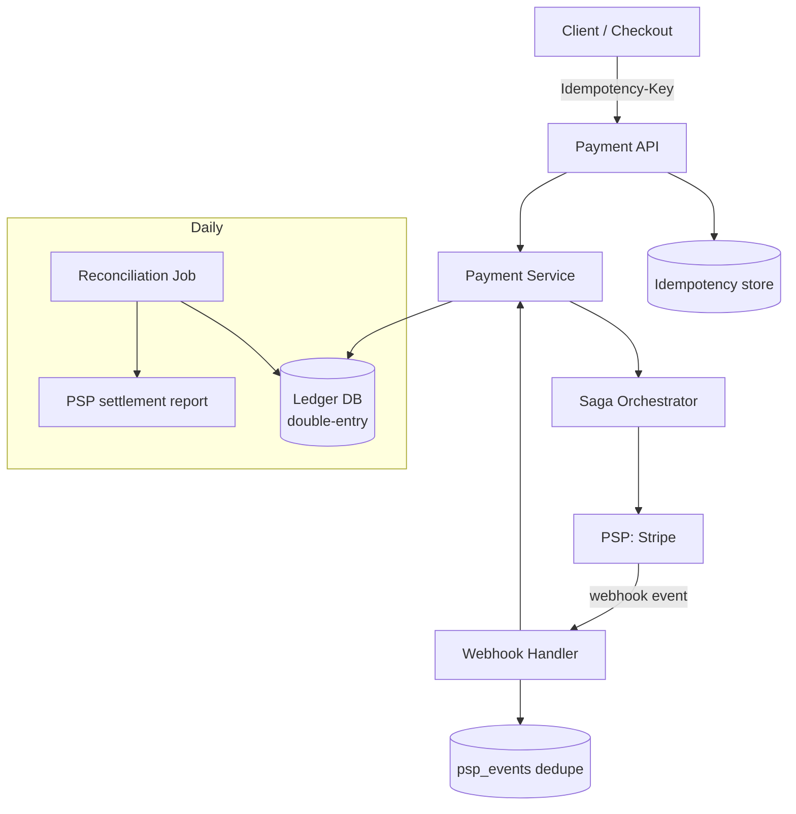

# Payment System

## Problem & Clarifications

Design a payment system that lets a platform charge customers, move money, and keep an auditable record of every cent — integrating with an external Payment Service Provider (PSP) like Stripe.

**Clarifying questions (and assumed answers):**

- *Do we store raw card data?* No. We tokenize via the PSP (Stripe) to stay **out of PCI-DSS scope**. The card never touches our servers.
- *Flow?* Charge a customer for an order (pay-in), record it in a **ledger**, support refunds and payouts.
- *Consistency?* Money must be **exactly-once** and **never lost or double-charged**. Strong correctness over latency.
- *Scale?* ~10M transactions/day, peak ~5K TPS.
- *Async?* PSP calls are slow/flaky; the system must tolerate retries, timeouts, and out-of-order **webhooks**.
- *Currencies?* Single currency core; multi-currency is an extension (ledger supports it via currency on accounts).

## Functional Requirements

1. Initiate a payment (charge a customer for an amount).
2. Integrate with a PSP for authorization & capture.
3. Maintain a **double-entry ledger** (every transaction balances to zero).
4. **Idempotency**: a retried request must not double-charge.
5. Handle PSP **webhooks** (async settlement, disputes, refunds).
6. **Reconciliation**: our records must match the PSP's.
7. Refunds and payouts.

## Non-Functional Requirements

- **Correctness/consistency**: no lost or duplicated money; auditable.
- **Durability**: every state transition persisted before acknowledging.
- **Idempotency & exactly-once** semantics on all money-moving operations.
- **Availability**: 99.99%; degrade to "pending" rather than failing hard.
- **Security/compliance**: PCI-DSS scope minimization; encryption; least privilege.
- **Auditability**: immutable ledger, full event history.

## Capacity Estimation

| Metric | Estimate |
|---|---|
| Transactions / day | 10M ≈ 115 TPS avg, **~5K TPS peak** |
| Ledger entries per txn | ≥ 2 (double-entry); often 3–4 with fees |
| Ledger rows / day | ~30M |
| Ledger rows / year | ~11B → partition by time, archive cold data |
| Webhook events / day | ~30M (auth, capture, settle, dispute) |
| Avg row size | ~200 B → ~6 GB/day ledger growth |
| Idempotency key store | keyed cache (Redis) + durable table |

Throughput is modest; the challenge is **correctness under failures**, not raw scale.

## API Design

```
# Create a payment (idempotent)
POST /v1/payments
  Header: Idempotency-Key: <client-generated UUID>
  body: { orderId, customerId, amount, currency, paymentMethodToken }
  -> 201 { paymentId, status: "pending|succeeded|failed" }

GET  /v1/payments/{paymentId}     -> { status, amount, ledgerEntries[...] }
POST /v1/payments/{paymentId}/refund  body:{ amount }  Header: Idempotency-Key

# PSP -> us (webhook); signature-verified
POST /v1/webhooks/stripe   body:{ type, data, id }  -> 200

# Internal
GET  /v1/ledger/accounts/{accountId}/balance
POST /v1/reconciliation/run?date=YYYY-MM-DD
```

## Data Model / Schema

Double-entry ledger: accounts hold balances; every transaction is a set of entries that **sum to zero**.

```sql
-- Chart of accounts (asset, liability, revenue, etc.)
CREATE TABLE accounts (
  account_id   BIGINT PRIMARY KEY,
  name         VARCHAR(64),       -- e.g. 'cash:stripe', 'liability:customer:123', 'revenue:fees'
  type         VARCHAR(16),       -- asset | liability | revenue | expense
  currency     CHAR(3),
  balance      BIGINT DEFAULT 0   -- in minor units (cents); cached, derived from entries
);

-- A money movement; groups balanced entries
CREATE TABLE transactions (
  txn_id       BIGINT PRIMARY KEY,
  payment_id   BIGINT,
  type         VARCHAR(16),       -- charge | refund | payout | fee
  status       VARCHAR(16),       -- pending | posted | reversed
  created_at   TIMESTAMP
);

-- Immutable ledger entries (the double-entry lines)
CREATE TABLE ledger_entries (
  entry_id     BIGINT PRIMARY KEY,
  txn_id       BIGINT NOT NULL REFERENCES transactions,
  account_id   BIGINT NOT NULL REFERENCES accounts,
  direction    CHAR(1) NOT NULL,  -- 'D' debit | 'C' credit
  amount       BIGINT NOT NULL CHECK (amount > 0),  -- minor units
  created_at   TIMESTAMP
  -- INVARIANT: SUM(debits) = SUM(credits) per txn_id
);

-- Idempotency: dedupe retried requests
CREATE TABLE idempotency_keys (
  idem_key     VARCHAR(64) PRIMARY KEY,
  request_hash CHAR(64),          -- detect key reuse with a different body
  payment_id   BIGINT,            -- the result to replay
  status       VARCHAR(16),       -- in_progress | completed
  created_at   TIMESTAMP
);

-- Saga / outbox for reliable async steps + webhook dedupe
CREATE TABLE psp_events (
  event_id     VARCHAR(64) PRIMARY KEY,   -- Stripe event id; dedupe webhooks
  type         VARCHAR(32),
  processed_at TIMESTAMP
);
```

## High-Level Design



**Charge flow:** client POSTs with an `Idempotency-Key` → Payment Service checks the idempotency store (replay if seen) → records a `pending` transaction in the ledger → the saga calls Stripe to authorize+capture (Stripe also gets its own idempotency key) → on success, posts the balanced ledger entries and marks `succeeded` → Stripe later sends a `charge.succeeded`/settlement **webhook**, deduped by event id, which finalizes settlement accounts. A daily **reconciliation** job compares our ledger to Stripe's payout report.

## Deep Dives

### 1. Payment flow with a PSP (Stripe)

Card data goes browser → Stripe directly (Stripe.js / Elements), returning a **token**; our backend only ever sees the token. We call Stripe with the token to create a PaymentIntent (authorize) and capture. This keeps card PANs entirely outside our systems.

### 2. Double-entry ledger

Every movement is recorded as equal **debits and credits** across accounts so the books always balance — this is the auditability and correctness backbone. Charging a customer $20 with a $0.50 fee:

| Account | Debit | Credit |
|---|---|---|
| `asset:cash:stripe` (net remitted) | $19.50 | |
| `expense:psp_fees` | $0.50 | |
| `revenue:sales` (gross) | | $20.00 |
| **Totals** | **$20.00** | **$20.00** |

We never UPDATE a balance directly; we INSERT entries and derive/cache balances. The ledger is **append-only and immutable** — a reversal is a new, opposite transaction, never a delete.

### 3. Idempotency keys

The client sends a unique `Idempotency-Key` per logical operation. The server:
1. Inserts the key as `in_progress` (unique constraint → only one wins).
2. If the key already exists `completed`, **replay** the stored result (no re-charge).
3. If `in_progress`, return 409 / tell client to retry later.
We also pass an idempotency key **to Stripe**, so even our retry of the PSP call doesn't double-charge. We hash the request body to catch a key reused with different parameters.

### 4. Exactly-once & reconciliation

True exactly-once across a network boundary is impossible; we achieve **effectively-once** = at-least-once delivery + idempotent processing. Webhooks are deduped on Stripe's `event.id`. A nightly **reconciliation** ingests Stripe's settlement report and asserts that every charge/refund/fee in our ledger matches Stripe's, flagging mismatches (missing, extra, amount drift) for an ops queue.

### 5. Saga for distributed consistency

A charge spans our DB + Stripe — no shared transaction. We use a **saga**: each step has a compensating action.
```
1. Reserve (write pending txn)        compensate: mark failed
2. Authorize at PSP                    compensate: cancel auth
3. Capture at PSP                      compensate: refund
4. Post ledger entries (commit)        compensate: post reversal
```
Steps are driven by an **outbox**: state changes and the intent to call Stripe are written in one local transaction; a relay process performs the external call and records the result, retrying safely (idempotently) on failure.

### 6. Handling failures / retries

- **PSP timeout** (we don't know if it succeeded): don't blindly retry; either retry with the *same* idempotency key (safe) or query Stripe's PaymentIntent status before acting.
- **Crash mid-saga**: on restart, the orchestrator resumes from the persisted step.
- **Webhook before our own response** (out-of-order): the ledger state machine accepts events idempotently regardless of arrival order.

### 7. PCI scope

By tokenizing via Stripe (SAQ-A eligibility), we never store/transmit/process PANs, drastically shrinking PCI-DSS scope. We still: encrypt data at rest/in transit, restrict access (least privilege), audit-log, and segregate the payment service network.

### 8. Webhooks

Stripe → our `/webhooks/stripe`. We **verify the signature** (HMAC with the endpoint secret), **dedupe on event id** (`psp_events`), process idempotently, and return 200 fast (do heavy work async). Stripe retries on non-200, so handlers must be idempotent.

## Bottlenecks & Trade-offs

- **Correctness > latency**: synchronous ledger writes + sagas add latency but guarantee no money is lost.
- **Idempotency everywhere**: the cost of safe retries; requires a durable key store.
- **Immutable ledger** grows forever → time-partition + archive; balances cached for fast reads.
- **Reconciliation lag**: mismatches surface daily, not instantly — acceptable for settlement.
- **Saga complexity**: compensations must themselves be idempotent and well-tested.
- **PSP coupling**: abstract behind an interface to allow multi-PSP failover.

## Code

Idempotent payment handler + double-entry ledger that enforces balance.

```python
import hashlib, uuid
from dataclasses import dataclass, field

# ---------------- Double-entry ledger ----------------
@dataclass
class Entry:
    account: str
    direction: str   # 'D' debit | 'C' credit
    amount: int      # minor units (cents), > 0

@dataclass
class Ledger:
    balances: dict = field(default_factory=dict)   # account -> signed cents
    txns: list = field(default_factory=list)

    def post(self, txn_id: str, entries: list[Entry]):
        debits = sum(e.amount for e in entries if e.direction == "D")
        credits = sum(e.amount for e in entries if e.direction == "C")
        if debits != credits:
            raise ValueError(f"unbalanced txn {txn_id}: D={debits} C={credits}")
        if any(e.amount <= 0 for e in entries):
            raise ValueError("entry amounts must be positive")
        for e in entries:               # debits +, credits - (asset convention)
            sign = 1 if e.direction == "D" else -1
            self.balances[e.account] = self.balances.get(e.account, 0) + sign * e.amount
        self.txns.append((txn_id, entries))

    def balance(self, account: str) -> int:
        return self.balances.get(account, 0)


# ---------------- Mock PSP (Stripe) with its own idempotency ----------------
class MockStripe:
    def __init__(self): self._seen = {}
    def charge(self, idem_key: str, amount: int, token: str) -> dict:
        if idem_key in self._seen:           # PSP-side idempotency
            return self._seen[idem_key]
        res = {"id": "ch_" + uuid.uuid4().hex[:12], "status": "succeeded",
               "amount": amount, "fee": max(30, amount * 29 // 1000)}  # ~2.9% + 30c
        self._seen[idem_key] = res
        return res


# ---------------- Idempotent payment handler ----------------
class PaymentService:
    def __init__(self, ledger: Ledger, psp: MockStripe):
        self.ledger, self.psp = ledger, psp
        self.idem: dict[str, dict] = {}      # idem_key -> stored result

    @staticmethod
    def _hash(body: dict) -> str:
        return hashlib.sha256(repr(sorted(body.items())).encode()).hexdigest()

    def create_payment(self, idem_key: str, body: dict) -> dict:
        rh = self._hash(body)
        existing = self.idem.get(idem_key)
        if existing:
            if existing["request_hash"] != rh:
                raise ValueError("idempotency key reused with different body")
            return existing["result"]        # replay -> no double charge

        # mark in-progress (in real life: INSERT ... ON CONFLICT to win the race)
        self.idem[idem_key] = {"request_hash": rh, "result": None,
                               "status": "in_progress"}

        amount = body["amount"]
        # PSP call shares the same idempotency key -> safe under retry
        charge = self.psp.charge(idem_key, amount, body["paymentMethodToken"])

        fee = charge["fee"]
        txn_id = "txn_" + uuid.uuid4().hex[:12]
        self.ledger.post(txn_id, [
            Entry("asset:cash:stripe", "D", amount - fee), # net cash Stripe will remit
            Entry("expense:psp_fees",  "D", fee),          # fee we incur
            Entry("revenue:sales",     "C", amount),       # gross revenue earned
        ])  # debits (net + fee) == credit (gross) -> balances
        result = {"paymentId": txn_id, "status": charge["status"],
                  "amount": amount, "fee": fee, "chargeId": charge["id"]}
        self.idem[idem_key].update(result=result, status="completed")
        return result


if __name__ == "__main__":
    ledger, psp = Ledger(), MockStripe()
    svc = PaymentService(ledger, psp)
    body = {"orderId": "o1", "amount": 2000, "currency": "usd",
            "paymentMethodToken": "tok_visa"}

    key = "idem-" + uuid.uuid4().hex
    r1 = svc.create_payment(key, body)
    r2 = svc.create_payment(key, body)        # retry: same key -> replay
    print("first :", r1)
    print("retry :", r2, "(same paymentId? ", r1["paymentId"] == r2["paymentId"], ")")
    print("cash:stripe balance (cents):", ledger.balance("asset:cash:stripe"))
    print("psp_fees balance (cents)   :", ledger.balance("expense:psp_fees"))
    print("# transactions posted      :", len(ledger.txns), "(should be 1)")
```

Sample SQL for posting a balanced charge transactionally:
```sql
BEGIN;
INSERT INTO transactions(txn_id, payment_id, type, status, created_at)
  VALUES (:txn, :pay, 'charge', 'posted', now());
INSERT INTO ledger_entries(entry_id, txn_id, account_id, direction, amount) VALUES
  (:e1, :txn, :acct_cash,    'D', 1942),   -- net cash Stripe remits
  (:e2, :txn, :acct_fees,    'D', 58),     -- PSP fee expense
  (:e3, :txn, :acct_revenue, 'C', 2000);   -- gross revenue
-- application asserts SUM(D)=SUM(C)=2000 before COMMIT
COMMIT;
```

## Summary

A payment system prioritizes **correctness** over throughput. Card data is tokenized through the PSP (Stripe) to keep us out of PCI scope. Every money movement is recorded in an **immutable double-entry ledger** that always balances, giving auditability and making errors detectable. **Idempotency keys** — propagated all the way to Stripe — make retries safe and prevent double-charges, giving effectively-once semantics. Cross-service consistency is managed with a **saga** (+ outbox) of compensatable steps; **webhooks** are signature-verified and deduped on event id and processed idempotently regardless of order; and a daily **reconciliation** against the PSP's settlement report catches any drift. The system degrades to "pending" rather than losing money, and never deletes — corrections are reversing entries.
