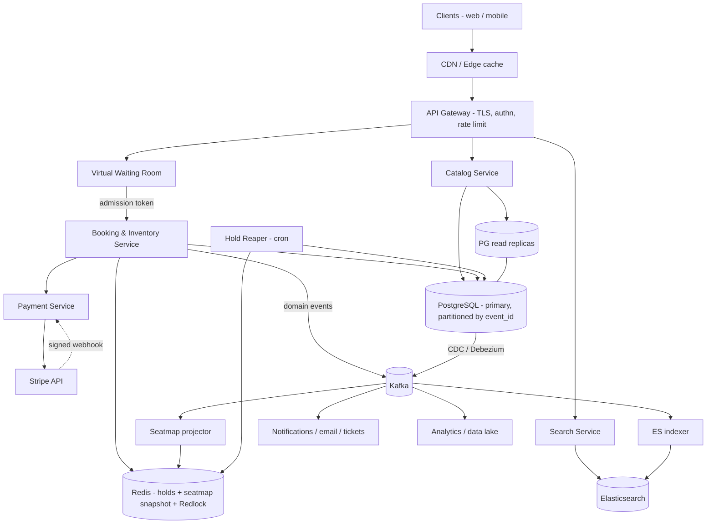

# Event Ticketing System (Ticketmaster) — System Design

## Problem & Clarifications

We are designing an online event ticketing platform similar to Ticketmaster. Users browse events (concerts, sports, theater), pick seats for a specific event, hold them while they pay, and complete a purchase. The defining challenge is **hot on-sales**: when tickets for a popular artist drop, hundreds of thousands to millions of users hit the same small inventory in the same second. The system must never **oversell** a seat, must be fair, and must stay up under a thundering herd.

Clarifying questions I would ask the interviewer (and the assumptions I will proceed with):

- **Reserved seating vs. general admission?** Both exist. I will design for **reserved (assigned) seating** since it is strictly harder (per-seat state); GA is a degenerate case modeled as a "section" with a counter.
- **One global platform or per-region?** Multi-region read, but writes for a given event are pinned to one region/primary DB to keep inventory strongly consistent. Cross-region is for browse/search latency.
- **How long is a seat held during checkout?** Configurable; assume **a 2-10 minute TTL** (use 5 min as default). After expiry the seat returns to the pool.
- **Payments?** Outsourced to **Stripe**. We never store raw card data (PCI scope minimized).
- **Resale / secondary market, dynamic pricing, transfers?** Out of scope for the core; I will note where they would hook in.
- **Fairness model for on-sales?** First-come-first-served via a **virtual waiting room** (queue + admission tokens), not a lottery.
- **Consistency requirement?** Inventory is **strongly consistent** (no oversell, ever). Browse/search can be eventually consistent.

## Functional Requirements

1. **Browse & search events** by name, artist, venue, city, date, category; view event detail and venue seat map.
2. **View seat availability** for an event (which seats are AVAILABLE / HELD / BOOKED) in near real time.
3. **Hold seats** — a user selects one or more seats and gets an exclusive reservation with a TTL while they check out.
4. **Book (purchase)** — confirm the held seats by completing payment; on success seats become BOOKED and a ticket is issued.
5. **Release** — explicit cancel, or automatic release of expired holds back to AVAILABLE.
6. **Payments** via Stripe with idempotency and webhook-driven reconciliation.
7. **Virtual waiting room** for high-demand on-sales: admit users at a controlled rate.
8. **View my tickets / order history**; issue QR/barcode tickets.

Out of scope (stated explicitly): resale/transfer, dynamic pricing, recommendations, fraud/bot detection beyond rate limiting (I will mention it), refunds workflow beyond the payment hook.

## Non-Functional Requirements

- **No overselling** — the hard invariant. A seat is sold to at most one buyer. This is a correctness, not a performance, requirement.
- **High availability** — 99.95%+ for browse; the booking path must degrade gracefully (waiting room) rather than fall over.
- **Low latency** — seat-map and search reads p99 < 200 ms; hold/booking writes p99 < 500 ms (excluding payment time).
- **Scalability / elasticity** — must absorb 10-100x baseline traffic for a few minutes during an on-sale.
- **Fairness** — FCFS ordering for the waiting room; no user starved.
- **Durability** — bookings and payments are never lost; financial records are auditable.
- **Security** — PCI-DSS scope minimized (tokenize via Stripe), authn/authz, rate limiting, idempotency.

## Capacity Estimation

Baseline vs. peak (on-sale) are wildly different, so I size for peak.

**Users & catalog**
- 100M registered users, ~5M daily active.
- ~500K events/year live at any time ~ 50K active events.
- Average large venue: 20K seats; arena 50K; stadium 80K.

**Baseline traffic**
- Browse/search reads: 5M DAU x ~20 reads/day ~ 100M reads/day ~ **~1.2K read QPS average**, ~5K peak.
- Bookings: ~2M tickets/day ~ **~25 booking writes/sec average**.

**Hot on-sale (the design driver)**
- A megastar tour on-sale: **2M people** queue for **~50K seats** across a few cities in the first minutes.
- If 2M users arrive in the first 60 seconds, raw arrival = **~33K req/sec** just to enter; with retries and polling this realistically spikes to **150K-300K req/sec** at the edge.
- **Peak concurrent users in the waiting room: ~1-2M.**
- Actual *successful* purchases are bounded by inventory (50K seats), so the real "useful" throughput is small (~a few hundred bookings/sec sustained) — the rest is queue management. This asymmetry is why a waiting room exists: convert a 300K QPS write storm into a trickle the DB can serve safely.

**Seat-inventory write contention**
- The hot path is conditional UPDATEs on the `seat_inventory` table for one event. Even with 50K rows, popular seats (front rows) get hammered. Plan for **~5K-20K seat-hold attempts/sec** to be admitted (post waiting room), most failing the conditional update (already held).

**Storage**
- seat_inventory: 50K events x 30K seats avg = **1.5B rows**, ~200 bytes/row ~ **~300 GB** (plus indexes ~ 2x ~ 600 GB). Partition by event_id.
- bookings: ~2M/day x 365 x ~5 years retained ~ **~3.6B rows**, ~300 bytes ~ **~1 TB**.
- payments: similar order ~ **~1 TB**.
- events/venues: tiny (< 50 GB).
- Search index (Elasticsearch): 50K active events x ~2 KB ~ **~100 MB hot**, plus historical ~ a few GB. Trivial; ES is for query flexibility/latency, not volume.

**Bandwidth**
- Seat-map payload (delta-encoded JSON) ~ 50-200 KB full, ~1-5 KB deltas. At 100K concurrent map viewers refreshing ~ **a few GB/sec** at peak — served from CDN + WebSocket deltas, not origin.
- Static assets (images, JS, venue maps) entirely from CDN.

## API Design

REST over HTTPS, JSON. Auth via short-lived JWT (Bearer). All mutating seat/booking endpoints require an `Idempotency-Key` header. Waiting-room-gated endpoints require an `X-Admission-Token`.

```
# --- Catalog / Search (read, cacheable, CDN/edge) ---
GET /v1/events?q=taylor&city=NYC&from=2026-07-01&to=2026-12-31&page=1
  200 { "events": [ { "event_id", "name", "venue", "city", "starts_at", "min_price" } ], "next_page" }

GET /v1/events/{event_id}
  200 { "event_id", "name", "venue_id", "starts_at", "status", "sections": [...] }

GET /v1/events/{event_id}/seatmap
  200 { "event_id", "version": 8841, "seats": [ { "seat_id","section","row","number","price","status" } ] }
  # status in AVAILABLE|HELD|BOOKED ; served from Redis snapshot, deltas via WS below.

# --- Waiting room ---
POST /v1/events/{event_id}/queue:join
  200 { "queue_token", "position", "eta_seconds" }
GET  /v1/events/{event_id}/queue:status   (X-Queue-Token)
  200 { "position", "eta_seconds", "admitted": false }
  200 { "admitted": true, "admission_token", "admission_expires_at" }

# --- Seat hold (reservation) ---  requires X-Admission-Token + Idempotency-Key
POST /v1/events/{event_id}/holds
  body: { "seat_ids": ["s_1011","s_1012"], "ttl_seconds": 300 }
  201  { "hold_id", "seat_ids", "expires_at", "amount_cents", "currency" }
  409  { "error": "SEAT_UNAVAILABLE", "conflicting_seat_ids": ["s_1012"] }

DELETE /v1/holds/{hold_id}                 # explicit release
  204

# --- Booking / payment ---
POST /v1/holds/{hold_id}/checkout          (Idempotency-Key)
  201 { "booking_id", "payment_intent_client_secret", "amount_cents" }
  # creates booking in PENDING + Stripe PaymentIntent; client confirms card with Stripe.js

POST /v1/stripe/webhook                     # Stripe -> us; signed
  200 {}

GET  /v1/bookings/{booking_id}
  200 { "booking_id","status","seats":[...],"tickets":[{ "ticket_id","qr_url" }] }

GET  /v1/me/tickets
  200 { "bookings": [...] }
```

WebSocket for live seat-map deltas:
```
WS /v1/events/{event_id}/seatmap/stream
  <- { "version": 8842, "changes": [ { "seat_id":"s_1011", "status":"HELD" } ] }
```

## Data Model / Schema

PostgreSQL as the system of record for inventory, bookings, and payments (strong consistency, transactions, conditional updates). Partition the giant tables by `event_id` (hash) so a hot event's writes localize to a few partitions.

```sql
-- Venues and their physical seats (mostly static reference data).
CREATE TABLE venues (
    venue_id      BIGINT PRIMARY KEY,
    name          TEXT NOT NULL,
    city          TEXT NOT NULL,
    country       TEXT NOT NULL,
    timezone      TEXT NOT NULL,
    capacity      INT  NOT NULL
);

CREATE TABLE seats (                       -- physical seats of a venue (template)
    seat_id       BIGINT PRIMARY KEY,
    venue_id      BIGINT NOT NULL REFERENCES venues(venue_id),
    section       TEXT NOT NULL,
    row_label     TEXT NOT NULL,
    seat_number   TEXT NOT NULL,
    UNIQUE (venue_id, section, row_label, seat_number)
);

CREATE TABLE events (
    event_id      BIGINT PRIMARY KEY,
    venue_id      BIGINT NOT NULL REFERENCES venues(venue_id),
    name          TEXT NOT NULL,
    artist        TEXT,
    category      TEXT,                    -- concert | sports | theater ...
    starts_at     TIMESTAMPTZ NOT NULL,
    onsale_at     TIMESTAMPTZ NOT NULL,
    status        TEXT NOT NULL DEFAULT 'SCHEDULED',  -- SCHEDULED|ONSALE|SOLDOUT|CANCELLED
    created_at    TIMESTAMPTZ NOT NULL DEFAULT now()
);
CREATE INDEX idx_events_onsale ON events (onsale_at);
CREATE INDEX idx_events_browse ON events (category, starts_at);

-- Per-event sellable inventory. One row per (event, seat). THE hot table.
-- 'status' + 'version' + 'expires_at' implement the AVAILABLE->HELD->BOOKED state machine
-- with optimistic concurrency control.
CREATE TABLE seat_inventory (
    event_id      BIGINT NOT NULL REFERENCES events(event_id),
    seat_id       BIGINT NOT NULL REFERENCES seats(seat_id),
    price_cents   INT    NOT NULL,
    status        TEXT   NOT NULL DEFAULT 'AVAILABLE',   -- AVAILABLE|HELD|BOOKED
    hold_id       UUID,                                  -- which hold owns it (when HELD)
    expires_at    TIMESTAMPTZ,                           -- when a HELD seat auto-releases
    version       INT    NOT NULL DEFAULT 0,             -- OCC counter
    updated_at    TIMESTAMPTZ NOT NULL DEFAULT now(),
    PRIMARY KEY (event_id, seat_id)
) PARTITION BY HASH (event_id);
-- Find expirable holds quickly (background reaper). Partial index keeps it tiny.
CREATE INDEX idx_seatinv_expiry ON seat_inventory (expires_at)
    WHERE status = 'HELD';
CREATE INDEX idx_seatinv_status ON seat_inventory (event_id, status);

-- A reservation hold groups the seats a user is currently checking out.
CREATE TABLE reservations (
    hold_id       UUID PRIMARY KEY,
    event_id      BIGINT NOT NULL,
    user_id       BIGINT NOT NULL,
    seat_ids      BIGINT[] NOT NULL,
    status        TEXT NOT NULL DEFAULT 'ACTIVE',   -- ACTIVE|EXPIRED|RELEASED|CONVERTED
    amount_cents  INT NOT NULL,
    expires_at    TIMESTAMPTZ NOT NULL,
    created_at    TIMESTAMPTZ NOT NULL DEFAULT now()
);
CREATE INDEX idx_res_user ON reservations (user_id);

-- A booking is a confirmed purchase (one per successful checkout).
CREATE TABLE bookings (
    booking_id    UUID PRIMARY KEY,
    hold_id       UUID NOT NULL REFERENCES reservations(hold_id),
    event_id      BIGINT NOT NULL,
    user_id       BIGINT NOT NULL,
    seat_ids      BIGINT[] NOT NULL,
    amount_cents  INT NOT NULL,
    currency      TEXT NOT NULL DEFAULT 'USD',
    status        TEXT NOT NULL DEFAULT 'PENDING',  -- PENDING|CONFIRMED|FAILED|REFUNDED
    created_at    TIMESTAMPTZ NOT NULL DEFAULT now(),
    confirmed_at  TIMESTAMPTZ
);
CREATE INDEX idx_bookings_user ON bookings (user_id, created_at DESC);

-- Payment records, 1:1 with Stripe PaymentIntent. Idempotency key enforces exactly-once.
CREATE TABLE payments (
    payment_id        UUID PRIMARY KEY,
    booking_id        UUID NOT NULL REFERENCES bookings(booking_id),
    stripe_intent_id  TEXT UNIQUE,                 -- pi_...
    idempotency_key   TEXT UNIQUE NOT NULL,        -- prevents double-charge on retry
    amount_cents      INT NOT NULL,
    currency          TEXT NOT NULL,
    status            TEXT NOT NULL DEFAULT 'REQUIRES_PAYMENT', -- REQUIRES_PAYMENT|SUCCEEDED|FAILED|CANCELLED
    created_at        TIMESTAMPTZ NOT NULL DEFAULT now(),
    updated_at        TIMESTAMPTZ NOT NULL DEFAULT now()
);

-- Issued tickets (one per booked seat).
CREATE TABLE tickets (
    ticket_id     UUID PRIMARY KEY,
    booking_id    UUID NOT NULL REFERENCES bookings(booking_id),
    seat_id       BIGINT NOT NULL,
    barcode       TEXT UNIQUE NOT NULL,
    issued_at     TIMESTAMPTZ NOT NULL DEFAULT now()
);
```

## High-Level Design

Clients hit a CDN/edge for static + cached reads. An API gateway terminates TLS, authenticates, and rate-limits. The **Waiting Room** sits in front of the booking path during on-sales; only admitted users reach the **Booking/Inventory service**, which owns the strongly-consistent Postgres inventory and Redis hold cache. Search is served from Elasticsearch fed by CDC from Postgres. Payments go through Stripe; webhooks reconcile asynchronously. Kafka carries domain events (hold created, seat booked, hold expired) to update search, the read-side seat-map cache, notifications, and analytics.



## Deep Dives

### 1. Seat inventory model
Each sellable seat for an event is **one row** in `seat_inventory(event_id, seat_id)`, carrying `status`, `hold_id`, `expires_at`, `version`, `price_cents`. Physical seats live in `seats` (per venue, reused across events); inventory is materialized per event when the event is created. For **general admission**, instead of N rows we keep a single counter row (or a small set of bucketed counters to reduce contention) and atomically decrement remaining capacity. Postgres is the source of truth because we need transactional, conditional, strongly-consistent mutations. Redis holds a **read-optimized snapshot** of seat statuses for the seat map and serves as the fast-path hold store (below), but Postgres always wins on conflict.

### 2. Concurrency / overselling
The invariant: a seat transitions AVAILABLE -> HELD by exactly one request. Options:

- **Pessimistic locking** (`SELECT ... FOR UPDATE`): lock the seat row, check, update, commit. Correct and simple, but under a hot on-sale thousands of transactions queue on the same hot rows, holding row locks across the round trip — connection pool exhaustion, lock convoys, and head-of-line blocking. Good for low-contention, bad for thundering herds.

- **Optimistic concurrency control (OCC)** via a conditional UPDATE on `status`/`version`: no locks held while thinking; the writer issues `UPDATE ... WHERE status='AVAILABLE' AND version=:v`. If `rowcount=0`, someone else won — the client retries with fresh state or picks another seat. This is my **primary mechanism**: writes are short, no held locks, scales horizontally. The cost is wasted retries on hot seats, but those are cheap single-row updates. Because the predicate (`status='AVAILABLE'`) is itself the guard, even without a version column it is safe; the version column additionally guards the BOOKED transition and gives clean auditing.

- **Distributed lock (Redis Redlock)**: acquire a lock keyed by `seat:{event}:{seat}` before touching Postgres. This shifts contention to Redis and can pre-filter losers cheaply, but Redlock has well-known caveats (clock skew, GC pauses, lease expiry mid-critical-section) and is **not a substitute for the DB invariant** — at best it is an optimization to reduce DB write attempts. I use a single-instance Redis `SET NX EX` lock as a *best-effort gate* in front of the authoritative Postgres conditional update; Postgres remains the final arbiter so a faulty lock can never oversell.

**Decision:** OCC conditional-UPDATE in Postgres is the correctness backstop. Redis `SET NX EX` is an optional fast pre-gate. Pessimistic `FOR UPDATE` is reserved for multi-seat atomic holds where I want all-or-nothing without retry loops (lock the small set of rows ordered by seat_id to avoid deadlock).

### 3. Booking flow / state machine
```
AVAILABLE --hold-->  HELD(expires_at=now+TTL) --checkout+payment success--> BOOKED
   ^                   |                                                       |
   |   TTL expiry /     |  explicit release / payment fail / TTL expiry        |
   +---- reaper --------+------------------------------------------------------+ (refund -> AVAILABLE rare)
```
1. **Hold**: conditional UPDATE flips AVAILABLE -> HELD, stamps `hold_id` + `expires_at = now()+TTL`, bumps `version`. A `reservations` row groups the seats. Multi-seat holds are all-or-nothing in one transaction.
2. **Checkout**: create `bookings(PENDING)` and a Stripe PaymentIntent; client confirms card.
3. **Confirm**: on payment success (webhook), flip HELD -> BOOKED, mark booking CONFIRMED, issue tickets — guarded by `WHERE status='HELD' AND hold_id=:hold_id`.
4. **Expiry**: the **hold reaper** (a frequent cron / background worker) flips stale `HELD AND expires_at < now()` rows back to AVAILABLE and marks reservations EXPIRED. Redis TTL on the mirror key auto-expires the fast-path lock; the reaper is the durable backstop in case Redis and Postgres drift. Emitting a `hold.expired` Kafka event refreshes the seat-map cache so the seat reappears live.

### 4. Payment integration (Stripe)
- At checkout we create a **PaymentIntent** with an **idempotency key** = `checkout:{hold_id}` so retries (network blips, double clicks) never double-charge. The same key is stored UNIQUE in `payments.idempotency_key`.
- The client confirms the card client-side with `client_secret` (Stripe.js / SDK), keeping card data off our servers (PCI scope minimized).
- **Webhook reconciliation**: Stripe POSTs `payment_intent.succeeded` / `payment_intent.payment_failed` to `/v1/stripe/webhook`. We **verify the signature**, dedupe on the Stripe event id, and only then transition state. Webhooks are the **source of truth** for payment outcome — never the client callback (the user may close the tab). Webhooks can arrive out of order or be retried, so handlers are idempotent.
- **Payment fails after hold**: the booking is marked FAILED; the seats are released (HELD -> AVAILABLE) immediately, or simply left to the TTL reaper. We do not pre-commit the sale until Stripe confirms `succeeded`. **Late success after expiry** (payment lands after the hold already expired and the seat was resold): we detect the conflict on confirm (`WHERE status='HELD' AND hold_id=...` returns 0 rows), and **auto-refund** via Stripe, notifying the user — the seat is never double-sold.

### 5. Virtual waiting room
For on-sales we never let the herd hit the booking service directly. Flow:
- `queue:join` issues a **queue token** and pushes the user into a per-event FCFS queue (Redis Sorted Set scored by join timestamp, or a Kafka-backed ordered queue for durability).
- An **admission controller** drains the queue at a **target admission rate** computed from real headroom: `rate = available_seats / avg_checkout_seconds`, throttled to what Postgres can safely serve (e.g., admit a few hundred users/sec). Admitted users receive a short-lived **admission token** (signed JWT, e.g., 10-min validity) required by `/holds`.
- The gateway rejects any booking request lacking a valid admission token, so the inventory service sees a controlled trickle instead of 300K QPS. Clients poll `queue:status` (cheap, edge-cached per position bucket) to see position + ETA.
- This converts an unbounded write storm into a bounded, fair stream and is the single most important availability lever for hot sales. It also throttles bots when combined with rate limiting and CAPTCHA at join.

### 6. Search (Elasticsearch)
Browse/search (by name, artist, city, date range, category, price, fuzzy matching, faceting) is served by **Elasticsearch**, not Postgres, for query flexibility and low-latency full-text + geo + facet queries. Postgres remains the system of record; an **indexer consumes CDC (Debezium) / Kafka events** to keep ES eventually consistent (seconds of lag is fine for browse). Seat-level availability is **not** in ES — only event-level metadata and a coarse `min_price`/`has_availability` flag, refreshed from inventory events. Hot event pages and search responses are CDN/edge cached with short TTLs and cache-busting on status change.

## Bottlenecks & Trade-offs

- **Hot-row write contention** on `seat_inventory` for marquee seats. Mitigations: waiting room caps admitted writers; OCC keeps each write short; partition by event_id so one event's load localizes; optional Redis pre-gate sheds doomed attempts. Trade-off: OCC wastes some retries vs. pessimistic locking's head-of-line blocking — we prefer wasted cheap retries.
- **Strong consistency vs. availability** (CAP): inventory writes are CP — pinned to a single primary per event; we accept that a primary failover briefly blocks that event's sales rather than risk oversell. Browse/search/seat-map reads are AP (replicas, cache, ES) and may show slightly stale availability — acceptable, the authoritative check happens at hold time.
- **Redis vs. Postgres truth**: Redis (holds, Redlock, snapshot) is fast but can lose data on failover. We treat it as cache/optimization; Postgres conditional UPDATE + the durable reaper guarantee correctness even if Redis is wiped.
- **TTL tuning**: long holds improve UX (more time to pay) but freeze inventory and frustrate the queue; short holds churn. 5 min is a balance; for ultra-hot sales drop to 2-3 min.
- **Webhook reliability**: Stripe webhooks can be delayed/duplicated/out-of-order. We make handlers idempotent and run a **reconciliation sweep** that polls Stripe for any PENDING bookings older than N minutes — covers missed webhooks.
- **Thundering-herd on seat-map reads**: solved by CDN + WebSocket deltas + Redis snapshot, not by hammering Postgres.
- **Fairness vs. throughput**: strict FCFS admission can underutilize headroom if admitted users abandon; we over-admit modestly (admit slightly more than seats, like airline overbooking but bounded) only when safe, since the DB invariant still prevents oversell.

## Code

### SQL — hold, confirm, and reaper with OCC

```sql
-- (1) HOLD a single seat: optimistic, conditional update. Succeeds only if still AVAILABLE.
-- rowcount = 1 -> we own it; rowcount = 0 -> lost the race, retry/pick another seat.
UPDATE seat_inventory
   SET status     = 'HELD',
       hold_id    = :hold_id,
       expires_at = now() + (:ttl_seconds || ' seconds')::interval,
       version    = version + 1,
       updated_at = now()
 WHERE event_id = :event_id
   AND seat_id  = :seat_id
   AND status   = 'AVAILABLE'
   AND version  = :expected_version;     -- OCC guard

-- (2) CONFIRM (HELD -> BOOKED) after payment success. Guards on hold ownership.
UPDATE seat_inventory
   SET status = 'BOOKED', version = version + 1, expires_at = NULL, updated_at = now()
 WHERE event_id = :event_id
   AND seat_id  = ANY(:seat_ids)
   AND status   = 'HELD'
   AND hold_id  = :hold_id;              -- returns rowcount == len(seat_ids) on success

-- (3) REAPER: release expired holds back to the pool. Run frequently (e.g. every few sec).
WITH expired AS (
    SELECT event_id, seat_id FROM seat_inventory
     WHERE status = 'HELD' AND expires_at < now()
     LIMIT 5000 FOR UPDATE SKIP LOCKED         -- batch, don't block live holds
)
UPDATE seat_inventory s
   SET status='AVAILABLE', hold_id=NULL, expires_at=NULL, version=version+1, updated_at=now()
  FROM expired e
 WHERE s.event_id=e.event_id AND s.seat_id=e.seat_id;
```

### Python — psycopg2 implementation with retry, confirm, and reaper

```python
import time
import uuid
import psycopg2
from psycopg2.extras import execute_values

HOLD_TTL_SECONDS = 300
MAX_RETRIES = 3


class SeatUnavailable(Exception):
    """Raised when a seat could not be held after retries (lost the race)."""


def _read_seat(cur, event_id, seat_id):
    cur.execute(
        "SELECT status, version FROM seat_inventory "
        "WHERE event_id=%s AND seat_id=%s",
        (event_id, seat_id),
    )
    return cur.fetchone()  # (status, version) or None


def hold_seats(conn, event_id, user_id, seat_ids, ttl=HOLD_TTL_SECONDS):
    """
    Atomically hold all requested seats using optimistic concurrency control.
    Retries on lost races; all-or-nothing within one transaction.
    """
    hold_id = uuid.uuid4()
    for attempt in range(1, MAX_RETRIES + 1):
        try:
            with conn:                       # transaction: commit on success, rollback on raise
                with conn.cursor() as cur:
                    held = []
                    for seat_id in sorted(seat_ids):   # stable order avoids deadlocks
                        row = _read_seat(cur, event_id, seat_id)
                        if row is None or row[0] != "AVAILABLE":
                            raise SeatUnavailable(seat_id)
                        _, version = row
                        cur.execute(
                            """
                            UPDATE seat_inventory
                               SET status='HELD', hold_id=%s,
                                   expires_at = now() + make_interval(secs => %s),
                                   version = version + 1, updated_at = now()
                             WHERE event_id=%s AND seat_id=%s
                               AND status='AVAILABLE' AND version=%s
                            """,
                            (str(hold_id), ttl, event_id, seat_id, version),
                        )
                        if cur.rowcount != 1:          # someone else won between read and write
                            raise _Conflict(seat_id)
                        held.append(seat_id)

                    # Record the grouping reservation.
                    cur.execute(
                        """
                        INSERT INTO reservations
                            (hold_id, event_id, user_id, seat_ids, status,
                             amount_cents, expires_at)
                        SELECT %s, %s, %s, %s, 'ACTIVE',
                               COALESCE(SUM(price_cents),0), now() + make_interval(secs => %s)
                          FROM seat_inventory
                         WHERE event_id=%s AND seat_id = ANY(%s)
                        """,
                        (str(hold_id), event_id, user_id, held, ttl, event_id, held),
                    )
            return hold_id                              # committed
        except _Conflict:
            # OCC conflict: brief backoff, then re-read fresh versions and retry.
            time.sleep(0.02 * attempt)
            continue
    raise SeatUnavailable("max retries exceeded")


class _Conflict(Exception):
    pass


def confirm_booking(conn, event_id, hold_id, seat_ids):
    """Flip HELD -> BOOKED after Stripe confirms payment. Idempotent-safe."""
    with conn:
        with conn.cursor() as cur:
            cur.execute(
                """
                UPDATE seat_inventory
                   SET status='BOOKED', version=version+1,
                       expires_at=NULL, updated_at=now()
                 WHERE event_id=%s AND seat_id = ANY(%s)
                   AND status='HELD' AND hold_id=%s
                """,
                (event_id, list(seat_ids), str(hold_id)),
            )
            if cur.rowcount != len(seat_ids):
                # Hold expired and seat was resold -> trigger refund upstream.
                raise SeatUnavailable("hold no longer valid; refund required")
            cur.execute(
                "UPDATE reservations SET status='CONVERTED' WHERE hold_id=%s",
                (str(hold_id),),
            )


def reap_expired_holds(conn, batch=5000):
    """Background job: release stale holds. Run every few seconds."""
    with conn:
        with conn.cursor() as cur:
            cur.execute(
                """
                WITH expired AS (
                    SELECT event_id, seat_id FROM seat_inventory
                     WHERE status='HELD' AND expires_at < now()
                     LIMIT %s FOR UPDATE SKIP LOCKED
                )
                UPDATE seat_inventory s
                   SET status='AVAILABLE', hold_id=NULL, expires_at=NULL,
                       version=version+1, updated_at=now()
                  FROM expired e
                 WHERE s.event_id=e.event_id AND s.seat_id=e.seat_id
                """,
                (batch,),
            )
            released = cur.rowcount
            cur.execute(
                "UPDATE reservations SET status='EXPIRED' "
                "WHERE status='ACTIVE' AND expires_at < now()"
            )
    return released
```

### Redis-based TTL hold (fast-path alternative / pre-gate)

```python
import redis

r = redis.Redis(host="redis", port=6379, decode_responses=True)
HOLD_TTL_SECONDS = 300

def try_hold_seat_redis(event_id: int, seat_id: int, hold_id: str,
                        ttl: int = HOLD_TTL_SECONDS) -> bool:
    """
    Best-effort exclusive hold via SET NX EX (atomic set-if-not-exists with TTL).
    The TTL means an abandoned hold auto-releases with no reaper needed in Redis.
    Returns True if we acquired the hold. Postgres conditional UPDATE remains the
    authoritative backstop -- Redis success does NOT bypass the DB check.
    """
    key = f"hold:{event_id}:{seat_id}"
    # NX = only set if absent; EX = expire after ttl seconds. Atomic.
    acquired = r.set(key, hold_id, nx=True, ex=ttl)
    return bool(acquired)


# Safe release: only delete the key if WE still own it (compare-and-delete via Lua),
# so a TTL-expired-then-reacquired key isn't deleted by the original holder.
_RELEASE_LUA = """
if redis.call('get', KEYS[1]) == ARGV[1] then
    return redis.call('del', KEYS[1])
else
    return 0
end
"""
_release = r.register_script(_RELEASE_LUA)

def release_hold_redis(event_id: int, seat_id: int, hold_id: str) -> bool:
    return bool(_release(keys=[f"hold:{event_id}:{seat_id}"], args=[hold_id]))
```

The Redis hold is the **fast pre-gate** during on-sales: `SET NX EX` cheaply rejects losers in sub-millisecond time before they ever touch Postgres, and its TTL auto-releases abandoned holds. The Postgres conditional UPDATE in `hold_seats()` is always executed afterward and is the **authoritative, durable** guarantee against overselling; if Redis and Postgres ever disagree, Postgres + the reaper win.

## Summary

The core of an event-ticketing system is **never overselling a seat under extreme contention**. I model each sellable seat as a Postgres row with a state machine **AVAILABLE -> HELD -> BOOKED**, and enforce the invariant with **optimistic conditional UPDATEs** (`WHERE status='AVAILABLE' AND version=:v`) — short, lock-free writes that retry on conflict — rather than pessimistic row locks that convoy under load. Holds carry a **TTL** (`expires_at`); a Redis `SET NX EX` fast-path pre-gate sheds doomed attempts, and a durable **reaper** plus Redis TTL release abandoned holds.

For hot on-sales, a **virtual waiting room** converts a 100K-300K QPS write storm and 1-2M concurrent users into a bounded, fair (FCFS) trickle the database can safely serve, gated by signed admission tokens. **Payments** run through Stripe with **idempotency keys** (no double-charge) and **signed webhook reconciliation** as the source of truth, with automatic refunds for the rare late-payment-after-expiry conflict. **Search** is offloaded to Elasticsearch fed by CDC, browse/seat-maps are CDN + Redis + WebSocket deltas, and **Kafka** propagates domain events to keep read models, search, notifications, and analytics in sync. Inventory writes are CP (single primary per event); everything else is AP — the right consistency in the right place.

File: `c:/mywork/mini-projects/system_design/interv/17_ticketmaster.md`
