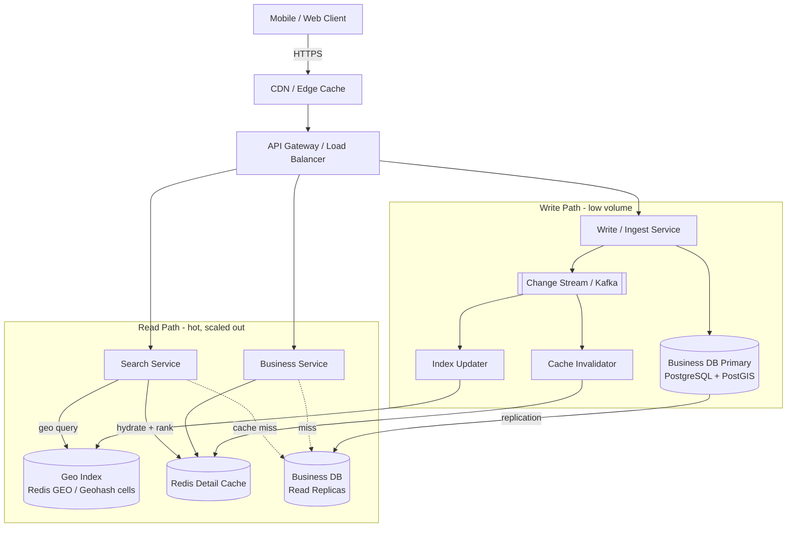

# Proximity Service ("Nearby Places", like Yelp)

## Problem & Clarifications

We are designing the backend that powers the **"search nearby"** feature of a
location-based discovery app (Yelp, Google Maps, Foursquare). A user opens the
app, the app sends the user's GPS coordinates plus a desired radius, and we
return the businesses within that radius, ranked by some combination of
distance, rating, and relevance.

Questions worth asking the interviewer up front:

- **What does "nearby" mean?** A fixed radius (500 m, 1 km, 5 km, 20 km) or a
  user-chosen one? Assume a small, bounded set of radii: 500 m, 1 km, 2 km,
  5 km, 20 km. Bounded radii let us precompute index granularity.
- **Is the business set static or dynamic?** Businesses (restaurants, shops)
  move/change rarely — hundreds of thousands of writes/day vs. hundreds of
  millions of reads. This is the single most important fact: the workload is
  **extremely read-heavy** and the data is **near-static**. That justifies
  aggressive caching and precomputed spatial indexes.
- **Do we index moving objects (drivers, scooters)?** No — that is a different
  problem (high write throughput, TTL'd locations). Here objects are fixed.
- **Global or single region?** Global, ~200M businesses, served from multiple
  regions.
- **Do we need real-time "open now", waiting time, etc.?** Out of scope for the
  core design; treat business metadata as an attribute lookup after the geo
  query.
- **Accuracy vs. recall.** We can tolerate returning a business slightly
  outside the radius and filtering it client-side; we must NOT miss a business
  inside the radius (no false negatives at the cell boundary).

## Functional Requirements

1. **Search nearby**: given `(lat, lng, radius)` and optional filters
   (category, price, open-now), return businesses within the radius.
2. **Get business detail**: given a business ID, return full metadata
   (name, address, hours, rating, photos, reviews summary).
3. **Add / update / delete a business** (owner or internal data pipeline).
4. **Re-rank** results by distance + rating + relevance.
5. Pagination of results (return top N, allow "load more").

Out of scope: reviews write path, photos storage/CDN internals, auth, payments,
recommendations/personalization beyond simple ranking.

## Non-Functional Requirements

- **Low latency**: p99 search latency < 200 ms (geo query is the hot path).
- **High availability**: 99.99% for reads; reads must never be blocked by
  writes.
- **Scalability**: 200M businesses, hundreds of millions of searches/day, must
  scale horizontally.
- **Eventual consistency is acceptable** for business data: a newly added
  business appearing in search after a few seconds/minutes is fine.
- **Read-heavy**: optimize the entire stack for reads (replicas, cache, CDN,
  precomputed cells).
- **Correctness at boundaries**: no false negatives — every business inside the
  requested radius must be returned.

## Capacity Estimation

Assumptions (state them — interviewer cares about the method, not exact figures):

- **Businesses**: 200M total, growing slowly. ~1 KB of indexable/core metadata
  each (full detail blob ~5-10 KB including denormalized review summary).
- **Daily Active Users (DAU)**: 100M.
- **Searches per user per day**: ~5 → **500M searches/day**.

Search QPS:

```
500M / 86,400 s ≈ 5,800 QPS average
peak ≈ 5x average ≈ 29,000 QPS  (call it ~30k QPS)
```

Read/write ratio:

- Writes (new businesses + edits + the data pipeline refresh): ~1M/day ≈
  **~12 writes/s**.
- Read:write ratio ≈ 500M : 1M = **500:1** — overwhelmingly read-heavy.
- Each search also fans out to fetch detail for ~20 results → detail-read QPS is
  ~20x the search QPS ≈ 600k reads/s against the cache layer (almost all cache
  hits).

Storage:

```
Core/index data:   200M * 1 KB  = 200 GB
Full detail blobs: 200M * 8 KB  = 1.6 TB
Geo index:         200M * (id + cell key, ~50 B) ≈ 10 GB  (fits in RAM/Redis)
```

The **geo index is small enough to live in memory** (a single Redis cluster
shard can hold tens of GB; the full index shards comfortably). This is the key
sizing insight: spatial index in RAM, detail blobs on disk/object store + CDN.

Bandwidth:

```
30k searches/s * ~20 KB response ≈ 600 MB/s outbound at peak (pre-CDN).
```

## API Design

REST over HTTPS/JSON. All search responses are cacheable (short TTL) and
quantized (see Deep Dives) so the CDN can serve repeats.

### Search nearby

```
GET /v1/search/nearby
    ?lat=37.78212
    &lng=-122.40694
    &radius=2000            # meters
    &category=restaurant    # optional
    &price=1,2              # optional, $ levels
    &open_now=true          # optional
    &sort=relevance         # relevance | distance | rating
    &limit=20
    &cursor=eyJvZmZzZXQiOjIwfQ==   # opaque pagination cursor

200 OK
{
  "results": [
    {
      "business_id": "b_8f31a2",
      "name": "Blue Bottle Coffee",
      "lat": 37.7765, "lng": -122.4233,
      "distance_m": 612,
      "rating": 4.6,
      "review_count": 1840,
      "category": "coffee",
      "price": 2,
      "score": 0.873
    }
  ],
  "next_cursor": "eyJvZmZzZXQiOjQwfQ==",
  "search_id": "s_2f9c"   // for ranking feedback / logging
}
```

### Get business

```
GET /v1/businesses/{business_id}

200 OK
{
  "business_id": "b_8f31a2",
  "name": "Blue Bottle Coffee",
  "address": "66 Mint St, San Francisco, CA",
  "lat": 37.7765, "lng": -122.4233,
  "phone": "+1-415-555-0100",
  "hours": { "mon": "06:00-19:00", ... },
  "rating": 4.6,
  "review_count": 1840,
  "category": "coffee",
  "price": 2,
  "photos": ["https://cdn.example.com/..."]
}
```

### Add / update / delete a business

```
POST /v1/businesses
{ "name": "...", "lat": 37.77, "lng": -122.41, "category": "...", ... }
201 Created  -> { "business_id": "b_9a02f1" }

PUT  /v1/businesses/{business_id}
{ "name": "...", "lat": ..., "lng": ..., ... }
200 OK

DELETE /v1/businesses/{business_id}
204 No Content
```

Writes go through the write API → update the SoT DB → emit a change event that
updates the geo index and invalidates caches.

## Data Model / Schema

The system-of-record is a relational DB (PostgreSQL). The geo index is
maintained separately — either inside Postgres via **PostGIS**, or in **Redis
GEO** / a precomputed cell table, depending on the chosen strategy. Both are
shown.

### Business (system of record)

```sql
CREATE TABLE business (
    business_id   BIGINT PRIMARY KEY,        -- snowflake / sequence
    name          VARCHAR(255)   NOT NULL,
    address       VARCHAR(512),
    city          VARCHAR(128),
    country       CHAR(2),
    lat           DOUBLE PRECISION NOT NULL,
    lng           DOUBLE PRECISION NOT NULL,
    category      VARCHAR(64),
    price_level   SMALLINT,                  -- 1..4 ($ .. $$$$)
    rating        NUMERIC(2,1)   DEFAULT 0,  -- 0.0 .. 5.0
    review_count  INTEGER        DEFAULT 0,
    is_active     BOOLEAN        DEFAULT TRUE,
    created_at    TIMESTAMPTZ    DEFAULT now(),
    updated_at    TIMESTAMPTZ    DEFAULT now()
);

CREATE INDEX idx_business_category ON business (category);
```

### Option A — precomputed geohash cell index (relational, shardable)

Each business is assigned a geohash at a fixed precision (e.g. length 6 ≈
1.2 km × 0.6 km cell). Searching = compute the query cell + its 8 neighbors,
look up rows whose `geohash` has one of those prefixes.

```sql
CREATE TABLE business_geohash (
    geohash       VARCHAR(12)  NOT NULL,   -- precision 6..12
    business_id   BIGINT       NOT NULL,
    lat           DOUBLE PRECISION NOT NULL,
    lng           DOUBLE PRECISION NOT NULL,
    PRIMARY KEY (geohash, business_id)
);

-- Prefix range scan: WHERE geohash >= '9q8yyz' AND geohash < '9q8yz0'
CREATE INDEX idx_geohash_prefix ON business_geohash (geohash);
```

To support multiple radii we can store **several precisions** (one row per
business per precision, e.g. 4/5/6/7) so the query picks the precision whose
cell size best matches the requested radius — fewer neighbor scans.

### Option B — PostGIS (geometry column + GiST)

```sql
CREATE EXTENSION IF NOT EXISTS postgis;

ALTER TABLE business ADD COLUMN geom geography(Point, 4326);
UPDATE business SET geom = ST_SetSRID(ST_MakePoint(lng, lat), 4326)::geography;

CREATE INDEX idx_business_geom ON business USING GIST (geom);

-- Radius query (R-tree / GiST, true spherical distance):
SELECT business_id, name,
       ST_Distance(geom, ST_MakePoint(:lng, :lat)::geography) AS dist_m
FROM   business
WHERE  ST_DWithin(geom, ST_MakePoint(:lng, :lat)::geography, :radius_m)
ORDER  BY dist_m
LIMIT  20;
```

### Option C — Redis GEO (in-memory, uses geohash internally)

Redis stores geo members in a sorted set keyed by a 52-bit geohash score.

```
GEOADD biz:geo -122.4233 37.7765 b_8f31a2
GEOSEARCH biz:geo FROMLONLAT -122.40694 37.78212 \
          BYRADIUS 2000 m ASC COUNT 50 WITHDIST WITHCOORD
```

`GEOSEARCH` internally computes the geohash cell(s) covering the radius and
their neighbors, then range-scans the sorted set — exactly the neighbor-cell
algorithm described in the Deep Dives, but built in.

## High-Level Design



Flow:

1. **Search**: client → CDN → gateway → Search Service. Search Service queries
   the geo index (Redis GEO / geohash cells) to get candidate IDs + distances,
   hydrates them from the detail cache (fallback to read replicas), ranks, and
   returns the top N.
2. **Detail**: Business Service serves from the detail cache; miss → read
   replica → backfill cache.
3. **Write**: Write Service writes to the primary, emits a change event on
   Kafka; the Index Updater refreshes the geo index and the Cache Invalidator
   evicts stale detail entries.

## Deep Dives

### 1. Geospatial indexing: geohash vs. quadtree vs. Google S2

The core problem: a B-tree on `(lat, lng)` is useless for 2-D range queries —
you can index one dimension efficiently but not "both within a box". We need a
**space-filling / hierarchical** scheme that maps 2-D points to a 1-D, sortable,
prefix-shareable key so nearby points cluster together.

#### Geohash

- **Encoding**: interleave the bits of the latitude and longitude after
  recursively bisecting their ranges (`lat ∈ [-90, 90]`, `lng ∈ [-180, 180]`).
  Group the resulting bits into 5-bit chunks and base-32 encode → a string like
  `9q8yyk8ztpxr`. Each character refines the cell.
- **Precision levels** (rough cell sizes at the equator):

  | length | width × height        |
  |--------|-----------------------|
  | 4      | ~39 km × 19.5 km      |
  | 5      | ~4.9 km × 4.9 km      |
  | 6      | ~1.2 km × 0.6 km      |
  | 7      | ~153 m × 153 m        |
  | 8      | ~38 m × 19 m          |

- **Prefix property**: two points sharing a prefix are in the same (nested)
  cell, so a prefix range scan (`>= '9q8yy', < '9q8yz'`) returns a cell's
  contents. This is why geohash works in plain SQL and in Redis sorted sets.
- **Neighbor cells**: a point near a cell edge has nearby points in the 8
  adjacent cells, so radius search must compute the **9 cells** (center + 8
  neighbors) and union them — handled by the `geohash_neighbors` helper in the
  Code section. Edge case: the "boundary problem" — two points 1 m apart can
  have completely different geohashes across a cell boundary, so neighbor
  expansion is mandatory, never optional.
- **Non-uniform density**: geohash uses **fixed-size cells**. In dense
  Manhattan one cell may contain 50k businesses; in rural Nevada one cell has 3.
  Geohash does not adapt — you either over-fetch in dense areas or scan many
  empty cells in sparse ones. Workaround: store multiple precisions and choose
  per query.
- **Redis GEO** uses a 52-bit geohash as the sorted-set score and does the
  neighbor-cell math for you in `GEOSEARCH`.

#### Quadtree

- **Structure**: an in-memory tree. The world is one square; whenever a node
  exceeds a capacity (e.g. 100 points) it **splits into 4 quadrants** (NW, NE,
  SW, SE), recursively. Points live in leaves.
- **Adapts to density**: dense regions split deep (small leaves), sparse regions
  stay shallow (large leaves) → roughly **balanced number of points per leaf**.
  This is its big advantage over geohash for skewed data like real businesses.
- **Query**: descend the tree, intersecting the query bounding box with node
  boundaries; only recurse into overlapping children → logarithmic-ish.
- **Trade-offs**: it is a stateful in-memory structure, harder to shard and
  persist than a string key; rebuilding/rebalancing on heavy writes is work.
  Excellent for a near-static dataset that fits per-shard in RAM (exactly our
  200M businesses → ~10 GB index). The Code section implements one.

#### Google S2

- Projects the sphere onto the **6 faces of a cube**, then applies a **Hilbert
  space-filling curve** on each face, producing 64-bit `S2CellId`s at 31 levels
  (level 0 = whole face, level 30 ≈ 1 cm²).
- **Why better than geohash**: (a) cells are far more **uniform in area**
  across the globe — geohash cells distort badly near the poles, S2 barely; (b)
  the Hilbert curve has **better locality** (consecutive IDs are spatially
  closer, fewer "jumps") than geohash's Z-order interleave; (c) it can cover an
  arbitrary region with a **mix of cell levels** (a "cell covering") so a circle
  is approximated tightly with a handful of variable-size cells — neighbor
  handling and density adaptation are built into the covering algorithm.
- Used by Google Maps, Foursquare, MongoDB's geo, Uber's H3 is a conceptual
  cousin (hexagons instead of squares — avoids the "neighbors at different
  distances" issue of square cells).

**Summary**: geohash = simplest, works in any KV/SQL store, fixed cells;
quadtree = density-adaptive, in-memory; S2 = production-grade, uniform cells +
multi-level coverings. **PostGIS** sidesteps the choice by using a **GiST
R-tree** on real geometry with true spherical distance (`ST_DWithin`) — simplest
to operate if you are already on Postgres, at the cost of in-DB compute.

### 2. Search radius handling

Given `(lat, lng, radius)`:

1. **Pick the index granularity** so the cell size ≳ radius. Example: for a
   2 km radius use geohash precision 5 (~4.9 km cells) — the query point's cell
   plus its 8 neighbors are guaranteed to cover any 2 km circle.
2. **Compute the 9 cells** (center + 8 neighbors) — `geohash_neighbors`.
3. **Union the candidates** from all 9 cell prefix scans (or in quadtree:
   query the bounding box that circumscribes the circle).
4. **Filter precisely** with **Haversine distance** (`distance_m <= radius`) to
   drop the corners — cells are squares, the query is a circle, and neighbor
   cells over-cover.
5. **Multi-prefix in SQL**: 9 range scans
   `WHERE geohash BETWEEN '9q8y' AND '9q8z' OR ...` (one per cell), or `IN` on
   the precomputed cell column.

Picking precision per radius avoids scanning too few cells (missed results) or
too many (slow). For very large radii (20 km) drop to precision 4 and accept
larger candidate sets; for 500 m use precision 6.

### 3. Business data storage and updates

- **System of record**: PostgreSQL primary (`business` table), sharded by
  `business_id` (or by region/country for locality). Writes are low volume
  (~12/s) so a single primary + read replicas suffices for a long time.
- **Detail blobs** (denormalized name/rating/photos) cached in Redis and on a
  CDN for the `GET /businesses/{id}` path.
- **Update path**: write to primary → emit a change event to Kafka →
  - **Index Updater** recomputes the geohash/S2 cell (or `GEOADD` in Redis,
    `ST_MakePoint` update in PostGIS) and updates the geo index. If lat/lng
    changed, remove the old cell entry and add the new one.
  - **Cache Invalidator** evicts the detail-cache key and purges the CDN object.
- **Ratings/review_count** change frequently but don't affect geo placement;
  they update the detail blob and influence ranking — refreshed
  asynchronously (every few minutes is fine; eventual consistency).

### 4. Ranking results

After the geo filter we have, say, 200 candidates. Rank with a weighted score:

```
score = w_d * proximity(distance)        # closer is better, normalized 0..1
      + w_r * (rating / 5.0)              # quality
      + w_p * popularity(review_count)    # log-scaled review count
      + w_x * relevance(query, business)  # category/text match, open_now boost
```

- `proximity = 1 - (distance / radius)` (or an exponential decay
  `exp(-distance / scale)` so very-near businesses dominate).
- `popularity = log10(1 + review_count) / log10(1 + max_reviews)` to damp
  whales.
- Weights tuned offline (CTR / conversion). Allow the client to override with
  `sort=distance` (pure distance) or `sort=rating`.
- Ranking is cheap and done in the Search Service on the candidate set; only the
  geo retrieval needs the index.

### 5. Read-heavy scaling

The whole point of the design. With a 500:1 read:write ratio:

- **Read replicas**: route all reads to Postgres replicas; the primary only
  takes the ~12 writes/s. Add replicas to scale read QPS linearly.
- **Geo index in RAM**: Redis GEO cluster (sharded) or per-shard in-memory
  quadtrees serve the geo query in sub-millisecond time, off the DB entirely.
- **Detail cache**: Redis in front of the DB for `GET /businesses/{id}`. ~99%+
  hit rate because the data is near-static. Cache-aside with event-driven
  invalidation.
- **CDN + quantization**: search requests are made cacheable by **quantizing
  the input** — snap `(lat, lng)` to a coarse grid (e.g. round to the enclosing
  geohash-7 cell center) and the radius to the allowed set. Two users 10 m apart
  asking for "restaurants within 2 km" get the **same cache key** → CDN/edge
  serves the second from cache with a short TTL (30-60 s). This collapses
  millions of near-identical queries.
- **Precomputed cells**: for popular cells, precompute and cache the ranked
  result list periodically. The hottest 1% of cells absorb most traffic.
- **Stateless services**: Search/Business services are stateless → autoscale
  behind the load balancer.

## Bottlenecks & Trade-offs

- **Hot cells / dense areas** (Times Square): a single geohash cell can hold
  tens of thousands of businesses → huge candidate sets and a hot shard.
  Mitigations: quadtree/S2 density adaptation, finer precision in dense regions,
  per-cell precomputed top-N, and capping COUNT in `GEOSEARCH`.
- **Boundary correctness vs. cost**: neighbor-cell expansion (9 cells) is
  required to avoid false negatives but increases candidate volume; the
  Haversine post-filter is the price of using square cells for a circular query.
- **Fixed vs. adaptive index**: geohash/Redis is operationally trivial but
  doesn't adapt to density; quadtree/S2 adapt but are stateful and harder to
  shard/persist. Choose based on data skew and ops appetite.
- **Consistency**: eventual consistency between the SoT DB and the geo
  index/caches means a freshly added business may not appear for seconds — an
  acceptable trade for read throughput.
- **CDN quantization**: coarser grid = higher cache hit rate but slightly
  "off-center" results; tune grid resolution to balance hit rate vs. accuracy.
- **PostGIS simplicity vs. dedicated index scale**: PostGIS keeps everything in
  one place but puts geo compute on the DB; at extreme QPS a dedicated in-memory
  geo tier scales better.

## Code

A self-contained, runnable Python module: a **quadtree** (insert points, query
by bounding box and by radius), a **geohash** encoder + **neighbor-cell**
computation for radius search, and **Haversine** distance. No third-party deps.

```python
"""
Proximity service core: quadtree + geohash + haversine.
Pure standard library. Run:  python proximity.py
"""
from __future__ import annotations
import math
from dataclasses import dataclass, field
from typing import List, Optional, Tuple

# --------------------------------------------------------------------------- #
# Haversine distance (great-circle distance in meters)
# --------------------------------------------------------------------------- #
EARTH_RADIUS_M = 6_371_000.0


def haversine(lat1: float, lng1: float, lat2: float, lng2: float) -> float:
    """Great-circle distance between two lat/lng points, in meters."""
    p1, p2 = math.radians(lat1), math.radians(lat2)
    dphi = math.radians(lat2 - lat1)
    dlmb = math.radians(lng2 - lng1)
    a = (math.sin(dphi / 2) ** 2
         + math.cos(p1) * math.cos(p2) * math.sin(dlmb / 2) ** 2)
    return 2 * EARTH_RADIUS_M * math.asin(math.sqrt(a))


# --------------------------------------------------------------------------- #
# Point
# --------------------------------------------------------------------------- #
@dataclass
class Point:
    lat: float
    lng: float
    payload: object = None      # e.g. business_id / name


# --------------------------------------------------------------------------- #
# Quadtree  (density-adaptive spatial index)
# --------------------------------------------------------------------------- #
@dataclass
class BBox:
    """Axis-aligned box in lat/lng degrees. min_* inclusive, max_* exclusive-ish."""
    min_lat: float
    min_lng: float
    max_lat: float
    max_lng: float

    def contains(self, lat: float, lng: float) -> bool:
        return (self.min_lat <= lat <= self.max_lat
                and self.min_lng <= lng <= self.max_lng)

    def intersects(self, other: "BBox") -> bool:
        return not (other.min_lat > self.max_lat or other.max_lat < self.min_lat
                    or other.min_lng > self.max_lng or other.max_lng < self.min_lng)


class QuadTree:
    """
    Region quadtree. A node holds up to `capacity` points; on overflow it
    subdivides into NW, NE, SW, SE. Dense regions subdivide deeply, sparse
    regions stay shallow -> roughly balanced points-per-leaf.
    """

    def __init__(self, boundary: BBox, capacity: int = 8, depth: int = 0,
                 max_depth: int = 24):
        self.boundary = boundary
        self.capacity = capacity
        self.depth = depth
        self.max_depth = max_depth
        self.points: List[Point] = []
        self.divided = False
        self.nw: Optional[QuadTree] = None
        self.ne: Optional[QuadTree] = None
        self.sw: Optional[QuadTree] = None
        self.se: Optional[QuadTree] = None

    def _subdivide(self) -> None:
        b = self.boundary
        mid_lat = (b.min_lat + b.max_lat) / 2
        mid_lng = (b.min_lng + b.max_lng) / 2
        d, md = self.depth + 1, self.max_depth
        c = self.capacity
        self.nw = QuadTree(BBox(mid_lat, b.min_lng, b.max_lat, mid_lng), c, d, md)
        self.ne = QuadTree(BBox(mid_lat, mid_lng, b.max_lat, b.max_lng), c, d, md)
        self.sw = QuadTree(BBox(b.min_lat, b.min_lng, mid_lat, mid_lng), c, d, md)
        self.se = QuadTree(BBox(b.min_lat, mid_lng, mid_lat, b.max_lng), c, d, md)
        self.divided = True
        # push existing points down into children
        existing, self.points = self.points, []
        for p in existing:
            self._insert_into_children(p)

    def _insert_into_children(self, p: Point) -> bool:
        for child in (self.nw, self.ne, self.sw, self.se):
            if child.insert(p):
                return True
        return False

    def insert(self, p: Point) -> bool:
        if not self.boundary.contains(p.lat, p.lng):
            return False
        if not self.divided:
            if len(self.points) < self.capacity or self.depth >= self.max_depth:
                self.points.append(p)
                return True
            self._subdivide()
        return self._insert_into_children(p)

    def query_bbox(self, box: BBox, found: Optional[List[Point]] = None) -> List[Point]:
        """All points inside the given bounding box."""
        if found is None:
            found = []
        if not self.boundary.intersects(box):
            return found
        for p in self.points:
            if box.contains(p.lat, p.lng):
                found.append(p)
        if self.divided:
            self.nw.query_bbox(box, found)
            self.ne.query_bbox(box, found)
            self.sw.query_bbox(box, found)
            self.se.query_bbox(box, found)
        return found

    def query_radius(self, lat: float, lng: float,
                     radius_m: float) -> List[Tuple[Point, float]]:
        """
        Points within radius_m of (lat,lng). Uses the circumscribing bbox to
        prune, then exact Haversine to filter. Returns (point, distance) sorted.
        """
        dlat = radius_m / 111_320.0                       # meters per degree lat
        dlng = radius_m / (111_320.0 * max(math.cos(math.radians(lat)), 1e-6))
        box = BBox(lat - dlat, lng - dlng, lat + dlat, lng + dlng)
        out: List[Tuple[Point, float]] = []
        for p in self.query_bbox(box):
            d = haversine(lat, lng, p.lat, p.lng)
            if d <= radius_m:
                out.append((p, d))
        out.sort(key=lambda t: t[1])
        return out


# --------------------------------------------------------------------------- #
# Geohash encode + neighbor cells (for prefix-based radius search)
# --------------------------------------------------------------------------- #
_BASE32 = "0123456789bcdefghjkmnpqrstuvwxyz"   # geohash alphabet (no a,i,l,o)


def geohash_encode(lat: float, lng: float, precision: int = 9) -> str:
    lat_range = [-90.0, 90.0]
    lng_range = [-180.0, 180.0]
    geohash: List[str] = []
    bit = 0
    ch = 0
    even = True            # start by bisecting longitude
    while len(geohash) < precision:
        if even:
            mid = (lng_range[0] + lng_range[1]) / 2
            if lng >= mid:
                ch = (ch << 1) | 1
                lng_range[0] = mid
            else:
                ch = ch << 1
                lng_range[1] = mid
        else:
            mid = (lat_range[0] + lat_range[1]) / 2
            if lat >= mid:
                ch = (ch << 1) | 1
                lat_range[0] = mid
            else:
                ch = ch << 1
                lat_range[1] = mid
        even = not even
        bit += 1
        if bit == 5:
            geohash.append(_BASE32[ch])
            bit = 0
            ch = 0
    return "".join(geohash)


def geohash_decode_bbox(geohash: str) -> BBox:
    """Return the lat/lng bounding box of a geohash cell."""
    lat_range = [-90.0, 90.0]
    lng_range = [-180.0, 180.0]
    even = True
    for c in geohash:
        idx = _BASE32.index(c)
        for i in range(4, -1, -1):
            bit = (idx >> i) & 1
            if even:
                mid = (lng_range[0] + lng_range[1]) / 2
                if bit:
                    lng_range[0] = mid
                else:
                    lng_range[1] = mid
            else:
                mid = (lat_range[0] + lat_range[1]) / 2
                if bit:
                    lat_range[0] = mid
                else:
                    lat_range[1] = mid
            even = not even
    return BBox(lat_range[0], lng_range[0], lat_range[1], lng_range[1])


def geohash_neighbors(geohash: str) -> List[str]:
    """
    The center cell plus its 8 neighbors (N, NE, E, SE, S, SW, W, NW).
    Computed by re-encoding points just outside each edge of the cell at the
    same precision -- simple and correct for radius search expansion.
    """
    precision = len(geohash)
    box = geohash_decode_bbox(geohash)
    clat = (box.min_lat + box.max_lat) / 2
    clng = (box.min_lng + box.max_lng) / 2
    h = (box.max_lat - box.min_lat)     # cell height in degrees
    w = (box.max_lng - box.min_lng)     # cell width in degrees

    offsets = [
        (0, 0),      # center
        (h, 0),      # N
        (h, w),      # NE
        (0, w),      # E
        (-h, w),     # SE
        (-h, 0),     # S
        (-h, -w),    # SW
        (0, -w),     # W
        (h, -w),     # NW
    ]
    cells = []
    seen = set()
    for dlat, dlng in offsets:
        gh = geohash_encode(clat + dlat, clng + dlng, precision)
        if gh not in seen:
            seen.add(gh)
            cells.append(gh)
    return cells


def precision_for_radius(radius_m: float) -> int:
    """Pick a geohash precision whose cell is at least as large as the radius."""
    # approximate cell width (m) by precision at the equator
    cell_width = {4: 39_000, 5: 4_900, 6: 1_200, 7: 153, 8: 38}
    for p in (8, 7, 6, 5, 4):
        if cell_width[p] >= radius_m:
            return p
    return 4


# --------------------------------------------------------------------------- #
# Demo
# --------------------------------------------------------------------------- #
def _demo() -> None:
    # Businesses around downtown San Francisco
    businesses = [
        Point(37.7765, -122.4233, "Blue Bottle Coffee"),
        Point(37.7825, -122.4087, "Union Square Diner"),
        Point(37.7849, -122.4094, "Tartine Bakery"),
        Point(37.7599, -122.4148, "Mission Taqueria"),
        Point(37.8088, -122.4098, "Fishermans Wharf Grill"),  # ~3 km north
        Point(37.7045, -122.4500, "Daly City Cafe"),          # ~9 km south
    ]

    # World-spanning quadtree
    world = BBox(-90.0, -180.0, 90.0, 180.0)
    qt = QuadTree(world, capacity=2)
    for b in businesses:
        qt.insert(b)

    user_lat, user_lng, radius = 37.7821, -122.4069, 2000.0   # 2 km

    print("=== Quadtree radius search (user @ Union Square, 2 km) ===")
    for p, dist in qt.query_radius(user_lat, user_lng, radius):
        print(f"  {p.payload:<26} {dist:7.0f} m")

    print("\n=== Geohash of each business (precision 7) ===")
    for b in businesses:
        print(f"  {b.payload:<26} {geohash_encode(b.lat, b.lng, 7)}")

    p = precision_for_radius(radius)
    user_gh = geohash_encode(user_lat, user_lng, p)
    cells = geohash_neighbors(user_gh)
    print(f"\n=== Geohash cell search ===")
    print(f"  radius={radius:.0f} m -> precision {p}, center cell '{user_gh}'")
    print(f"  search cells (center + 8 neighbors): {cells}")

    # Which businesses fall into any of the 9 cells? (prefix membership)
    prefixes = tuple(cells)
    print("  candidates by cell prefix, then Haversine-filtered:")
    for b in businesses:
        gh = geohash_encode(b.lat, b.lng, p)
        if gh in prefixes:
            d = haversine(user_lat, user_lng, b.lat, b.lng)
            inside = "INSIDE " if d <= radius else "outside"
            print(f"    {b.payload:<26} cell={gh} dist={d:7.0f} m [{inside}]")


if __name__ == "__main__":
    _demo()
```

Expected output (abridged): the quadtree radius search returns Blue Bottle,
Union Square Diner, Tartine, and Mission Taqueria within 2 km (Fisherman's
Wharf and Daly City are filtered out by Haversine), and the geohash cell search
identifies the same candidate cells and confirms membership with the exact
distance filter.

## Summary

- The workload is the design: **500:1 read:write**, ~30k search QPS at peak,
  200M near-static businesses, ~10 GB geo index that fits in RAM.
- A plain B-tree can't do 2-D proximity; we map points to a **1-D
  sortable/hierarchical key**: **geohash** (simple, fixed cells, works in
  SQL/Redis), **quadtree** (density-adaptive, in-memory), or **S2** (uniform
  cells + Hilbert-curve locality + multi-level coverings). **Redis GEO** uses
  geohash under the hood; **PostGIS** offers a GiST R-tree with true spherical
  distance.
- Radius search = pick a precision matching the radius, expand to the **center +
  8 neighbor cells** (no false negatives), union candidates, then **Haversine
  post-filter** to the exact circle.
- Rank candidates by a weighted **distance + rating + popularity + relevance**
  score in the stateless Search Service.
- Scale reads with **read replicas, an in-memory geo tier, a detail cache, CDN
  with quantized cache keys, and precomputed hot cells**; keep the write path
  (primary DB + Kafka change stream → index updater + cache invalidator) small
  and eventually consistent.
- Watch for **hot/dense cells**, the **square-cell vs. circle** boundary cost,
  and the **fixed-vs-adaptive index** trade-off.
