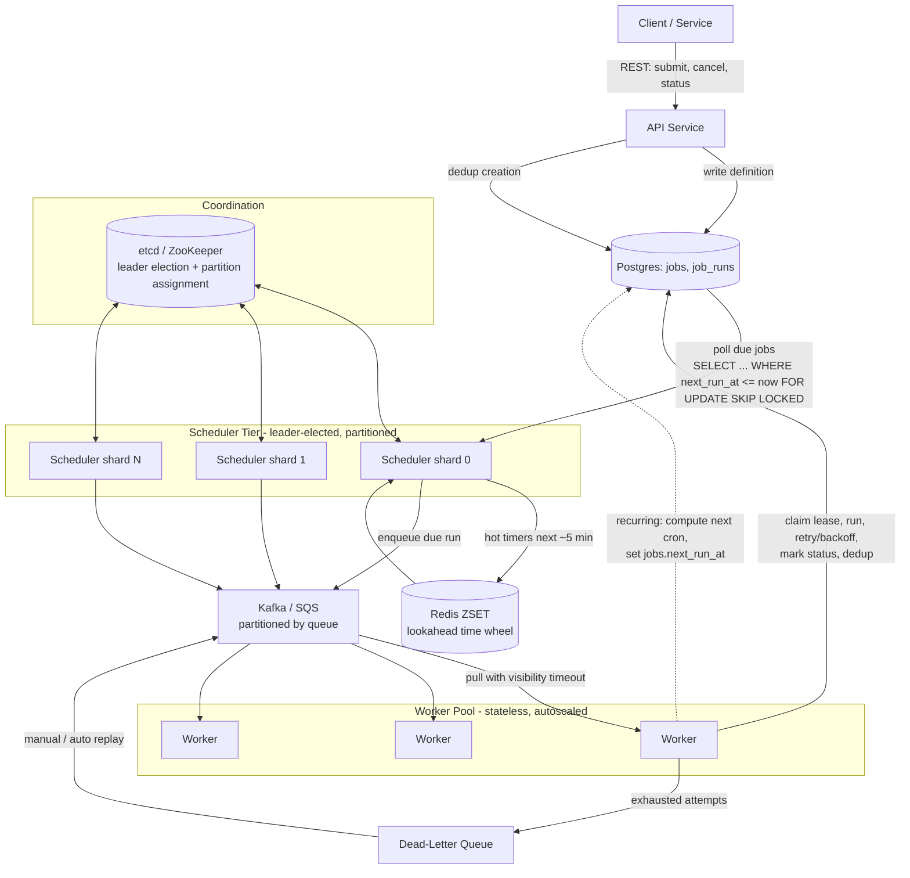

# Distributed Job / Task Scheduler (Cron at Scale)

## Problem & Clarifications

We want to design a **distributed job scheduler** — the engine behind things like cron, Airflow's scheduler, Quartz, Sidekiq/Celery beat, AWS EventBridge Scheduler, or Google Cloud Scheduler — but operating at scale across a fleet of machines.

A user (or service) submits a piece of work to be run either **once at a future time**, **immediately but asynchronously**, or **repeatedly on a cron schedule** (e.g. `0 */6 * * *` = every 6 hours). The system must reliably fire the job at (or shortly after) its due time, hand it to a worker, run it, retry on failure, and surface its status.

Clarifying questions I'd ask an interviewer (and the assumptions I'll proceed with):

- **Scale?** → Assume ~50M registered job definitions, ~10k jobs dispatched/sec at peak.
- **Timing precision?** → Soft real-time. A few seconds of dispatch latency is fine; we are not building a hardware RTOS. SLA: 99% of jobs dispatched within 2s of their due time.
- **Delivery semantics?** → **At-least-once** by default, with **idempotency keys** so handlers can dedup and approximate exactly-once *effects*. True exactly-once is out of scope (and arguably impossible end-to-end).
- **Job payload size?** → Small. The scheduler stores a reference / small JSON args blob (≤ 64 KB). Large data lives in S3/blob storage; we store the pointer.
- **Who executes the work?** → Generic workers pulling typed tasks. The actual business logic is the user's; we own scheduling, dispatch, retry, and bookkeeping.
- **Tenancy?** → Multi-tenant; need per-tenant quotas and isolation.
- **Ordering?** → No global ordering guarantee. Per-job, a given run completes (or is abandoned) before the next recurring run is scheduled.

Out of scope: workflow DAGs / dependencies between jobs (that's an orchestration layer like Airflow/Temporal that can sit *on top* of this), the actual task business logic, and authn/z internals.

## Functional Requirements

1. **Submit a one-shot job** to run immediately or at a specific future timestamp.
2. **Schedule a recurring job** via cron expression (and optional timezone).
3. **Cancel / pause / resume** a job or a specific scheduled run.
4. **Query status** of a job and its individual executions (runs).
5. **Reliable dispatch**: a due job is delivered to exactly one worker (best-effort; duplicates possible but rare and deduped).
6. **Retries with backoff** on transient failure, up to a max attempt count.
7. **Dead-letter** jobs that exhaust retries for later inspection / replay.
8. **Delayed jobs**: enqueue now, run after a delay.
9. **Idempotency**: dedup duplicate dispatches via an idempotency key.

## Non-Functional Requirements

- **Reliability / durability**: never silently lose a job. Persisted before acknowledged. Survives node crashes.
- **High availability**: no single point of failure. Scheduler is leader-elected with fast failover (< 10s).
- **Scalability**: horizontal scaling of schedulers (by partition) and workers (stateless pull).
- **Low dispatch latency**: p99 < 2s past due time.
- **Throughput**: 10k+ dispatches/sec sustained, burst 50k/sec.
- **Correctness under failure**: at-least-once delivery; no job fires *before* its time; recurring jobs don't drift or double-fire.
- **Observability**: per-job/run metrics, lag (now − next_run_at for overdue), DLQ depth, retry rates.

## Capacity Estimation

**Job definitions (stored state)**
- 50M job definitions. Row ~ 500 bytes (id, cron_expr, payload pointer, status, timestamps, etc.).
- 50M × 500 B ≈ **25 GB** for the `jobs` table. Easily fits a single Postgres primary (with read replicas), but we'll partition for write throughput.

**Dispatch rate**
- 10k jobs/sec average, 50k/sec burst.
- Of 50M definitions, suppose recurring jobs average one run / hour → 50M / 3600 ≈ **14k runs/sec** baseline. Consistent with the 10k figure; design for ~50k/sec headroom.

**Executions (job_runs) — the high-volume table**
- 14k runs/sec × 86,400 s/day ≈ **1.2B runs/day**.
- Run row ~ 300 bytes (ids, status, timestamps, attempt, worker_id, error). 1.2B × 300 B ≈ **360 GB/day**.
- Retain 30 days hot → ~11 TB. Use time-partitioned tables + roll older partitions to cheap object storage (Parquet on S3). This table is **partitioned by day** and the dominant storage/IO cost.

**Queue (Kafka)**
- 50k msg/sec peak × ~1 KB envelope = 50 MB/sec ≈ 4 TB/day of queue traffic. With 7-day retention + RF=3 → ~84 TB raw on Kafka brokers. Partition count: target ~5k msg/sec per partition → ~16 partitions for steady state, provision 64+ for burst and parallelism.

**Hot timer set (Redis / in-memory)**
- Only jobs due in the **near future** (next ~5 min window) need to be in the hot priority structure. 50k/sec × 300s ≈ **15M entries** in the lookahead window. At ~100 B/entry in Redis ZSET ≈ 1.5 GB. Comfortably fits memory; everything beyond the window stays in Postgres and is paged in.

**Workers**
- If a task averages 200 ms CPU and a worker handles ~5 concurrent → 25 tasks/sec/worker → 10k/sec needs ~400 workers; provision 600–800 for burst + retries.

## API Design

REST, JSON. All write endpoints accept an `Idempotency-Key` header.

```
POST /v1/jobs                      # submit a one-shot or recurring job
GET  /v1/jobs/{job_id}             # job definition + latest status
DELETE /v1/jobs/{job_id}           # cancel (and stop future recurrences)
POST /v1/jobs/{job_id}/pause
POST /v1/jobs/{job_id}/resume
GET  /v1/jobs/{job_id}/runs        # list executions (paginated)
GET  /v1/runs/{run_id}             # single execution status
```

**Submit one-shot (run at a future time):**
```http
POST /v1/jobs
Idempotency-Key: 7f3a-...-9c1
Content-Type: application/json

{
  "type": "send_email",
  "payload": {"to": "a@b.com", "template": "welcome"},
  "run_at": "2026-06-22T18:00:00Z",        // omit => run now
  "max_attempts": 5,
  "backoff": {"strategy": "exponential", "base_ms": 1000, "max_ms": 300000, "jitter": true},
  "queue": "default"
}
```
Response `201`:
```json
{ "job_id": "job_01H...", "status": "SCHEDULED", "next_run_at": "2026-06-22T18:00:00Z" }
```

**Schedule recurring (cron):**
```http
POST /v1/jobs
Idempotency-Key: c9aa-...-21b

{
  "type": "nightly_report",
  "payload": {"report": "daily_sales"},
  "cron_expr": "0 2 * * *",
  "timezone": "America/New_York",
  "max_attempts": 3,
  "queue": "reports"
}
```
Response `201`:
```json
{ "job_id": "job_01J...", "status": "SCHEDULED", "next_run_at": "2026-06-23T06:00:00Z" }
```

**Cancel:** `DELETE /v1/jobs/{job_id}` → `200 {"status": "CANCELLED"}`. Sets state so no future runs are enqueued; an in-flight run is allowed to finish (or can be force-killed via `?force=true`).

**Get run status:** `GET /v1/runs/{run_id}` →
```json
{
  "run_id": "run_01K...", "job_id": "job_01J...",
  "status": "FAILED", "attempt": 3, "max_attempts": 3,
  "scheduled_for": "2026-06-23T06:00:00Z",
  "started_at": "2026-06-23T06:00:01Z", "finished_at": "2026-06-23T06:00:09Z",
  "worker_id": "worker-42", "error": "ConnectTimeout", "dead_lettered": true
}
```

## Data Model / Schema

Postgres. `jobs` holds the definition + the *next* scheduled fire time; `job_runs` is the append-mostly execution log; `idempotency_keys` dedups both API submissions and dispatches.

```sql
-- Definition of a job (one-shot or recurring). One row per logical job.
CREATE TABLE jobs (
    id               BIGINT GENERATED ALWAYS AS IDENTITY PRIMARY KEY,
    tenant_id        BIGINT       NOT NULL,
    type             TEXT         NOT NULL,                 -- task type / handler name
    payload          JSONB        NOT NULL DEFAULT '{}',    -- small args or S3 pointer
    queue            TEXT         NOT NULL DEFAULT 'default',

    cron_expr        TEXT,                                  -- NULL => one-shot
    timezone         TEXT         NOT NULL DEFAULT 'UTC',
    next_run_at      TIMESTAMPTZ,                           -- NULL when terminal/paused
    last_run_at      TIMESTAMPTZ,

    status           TEXT         NOT NULL DEFAULT 'SCHEDULED'
                       CHECK (status IN ('SCHEDULED','PAUSED','RUNNING','COMPLETED','CANCELLED')),

    max_attempts     INT          NOT NULL DEFAULT 3,
    backoff_base_ms  INT          NOT NULL DEFAULT 1000,
    backoff_max_ms   INT          NOT NULL DEFAULT 300000,

    idempotency_key  TEXT,                                  -- from submit; dedups creation
    version          INT          NOT NULL DEFAULT 0,       -- optimistic concurrency
    created_at       TIMESTAMPTZ  NOT NULL DEFAULT now(),
    updated_at       TIMESTAMPTZ  NOT NULL DEFAULT now()
);

-- THE hot index: pull due jobs cheaply. Partial index ignores paused/terminal rows.
CREATE INDEX idx_jobs_due
    ON jobs (next_run_at)
    WHERE status = 'SCHEDULED' AND next_run_at IS NOT NULL;

CREATE UNIQUE INDEX idx_jobs_idem
    ON jobs (tenant_id, idempotency_key)
    WHERE idempotency_key IS NOT NULL;

-- One row per execution attempt-group of a job. Partitioned by scheduled day.
CREATE TABLE job_runs (
    id               BIGINT GENERATED ALWAYS AS IDENTITY,
    job_id           BIGINT       NOT NULL,
    tenant_id        BIGINT       NOT NULL,

    scheduled_for    TIMESTAMPTZ  NOT NULL,                 -- the due time this run represents
    status           TEXT         NOT NULL DEFAULT 'PENDING'
                       CHECK (status IN ('PENDING','DISPATCHED','RUNNING',
                                         'SUCCEEDED','FAILED','DEAD','CANCELLED')),
    attempt          INT          NOT NULL DEFAULT 0,
    max_attempts     INT          NOT NULL,
    next_attempt_at  TIMESTAMPTZ,                           -- when to retry (backoff)
    dead_lettered    BOOLEAN      NOT NULL DEFAULT FALSE,

    -- idempotency / dedup of dispatch: one logical run == one key
    idempotency_key  TEXT         NOT NULL,                 -- e.g. "{job_id}:{scheduled_for}"

    worker_id        TEXT,
    lease_expires_at TIMESTAMPTZ,                           -- visibility timeout
    started_at       TIMESTAMPTZ,
    finished_at      TIMESTAMPTZ,
    error            TEXT,
    created_at       TIMESTAMPTZ  NOT NULL DEFAULT now(),
    PRIMARY KEY (id, scheduled_for)
) PARTITION BY RANGE (scheduled_for);

-- daily partitions, created ahead of time by a maintenance job
CREATE TABLE job_runs_2026_06_22 PARTITION OF job_runs
    FOR VALUES FROM ('2026-06-22') TO ('2026-06-23');

-- enforce one run per (job, scheduled_for) => prevents double-firing a recurrence
CREATE UNIQUE INDEX idx_runs_idem ON job_runs (idempotency_key, scheduled_for);
CREATE INDEX idx_runs_retry ON job_runs (next_attempt_at)
    WHERE status = 'FAILED' AND dead_lettered = FALSE;
CREATE INDEX idx_runs_lease ON job_runs (lease_expires_at)
    WHERE status IN ('DISPATCHED','RUNNING');

-- Dedup table for at-least-once -> idempotent effects, written by the worker side.
CREATE TABLE idempotency_keys (
    key         TEXT        PRIMARY KEY,
    result      JSONB,                          -- cached response for replays
    created_at  TIMESTAMPTZ NOT NULL DEFAULT now()
);
-- TTL/cleanup via partitioning or a periodic DELETE WHERE created_at < now()-interval '7 days'
```

## High-Level Design



**Flow:** API persists the job (durable) before responding. Schedulers (one leader per partition of the schedule space) poll Postgres for rows whose `next_run_at <= now()`, load near-term ones into a Redis ZSET acting as a hot priority structure, and when a job is due, create a `job_runs` row and push an envelope to Kafka. Workers pull, claim a lease (visibility timeout), execute, and write the result. Recurring jobs get their `next_run_at` advanced to the next cron time. Failures retry with backoff; exhausted ones land in the DLQ.

## Deep Dives

### Scheduling mechanism: time wheel vs priority queue (min-heap)

Two canonical in-memory structures for "fire the earliest-due thing next":

- **Min-heap (priority queue) keyed by `next_run_at`.** `pop()` gives the soonest job in O(log n); `push()` is O(log n). The scheduler sleeps until `heap[0].next_run_at`, then pops all due entries. **Best when** the time-to-fire spans a wide, unbounded, irregular range (jobs scheduled seconds to months out) and you need exact ordering. Downside: O(log n) per op and per-entry overhead; rescheduling/canceling an arbitrary entry is awkward (lazy deletion via tombstones).

- **Hashed/hierarchical timing wheel.** A circular array of buckets, each bucket = one tick (say 1s). Inserting a timer that fires in `d` ticks is **O(1)** (mod arithmetic into a bucket); advancing the wheel one tick processes a bucket in O(k). **Best when** timers are short-lived, high-churn, and clustered within a bounded horizon — exactly our hot 5-minute lookahead with 15M timers. Hierarchical wheels (seconds → minutes → hours, like Linux kernel timers and Kafka's `DelayedOperationPurgatory`) handle long delays by cascading. Downside: coarse resolution = bucket granularity; harder to get exact ordering within a bucket.

**Our choice:** *hybrid*. Postgres (the `idx_jobs_due` partial index) is the durable, unbounded "cold" priority queue — effectively a B-tree sorted by `next_run_at`, queried with `SELECT ... WHERE next_run_at <= now() ORDER BY next_run_at FOR UPDATE SKIP LOCKED LIMIT N`. The scheduler pages the next ~5 minutes into a **Redis ZSET** (score = epoch ms), which behaves like a min-heap with O(log n) `ZADD`/`ZPOPMIN` and supports cancel by key (`ZREM`). For ultra-high-churn short timers we'd use an in-process timing wheel. The code section below implements the **min-heap** variant for clarity.

### At-least-once vs exactly-once

- **At-least-once**: the message is redelivered until acknowledged. A crash between "ran the job" and "wrote SUCCEEDED" causes a re-run. This is what queues (Kafka, SQS) and our lease/visibility-timeout model naturally provide. Simple, robust, and the industry default.
- **At-most-once**: ack first, then run. Losing work on crash. Unacceptable here.
- **Exactly-once delivery is effectively impossible** across process + network + datastore boundaries: any ack can be lost in flight, forcing a choice between possibly-redeliver (at-least-once) or possibly-drop (at-most-once) — the Two Generals problem. Kafka's "exactly-once" only holds *within* Kafka (idempotent producer + transactional consume-process-produce on Kafka topics); the moment your side effect hits an external API or DB outside that transaction, the guarantee breaks.
- **What we actually deliver: exactly-once *effects*** via at-least-once delivery + **idempotency**. The handler (or the framework on its behalf) dedups on an idempotency key so re-delivery is a no-op.

### Idempotency (keys + dedup table)

Every logical run has a stable key: `idempotency_key = "{job_id}:{scheduled_for_epoch}"`. This guarantees a single recurrence (job X at time T) maps to exactly one key no matter how many schedulers/messages race.

Two enforcement points:
1. **Dispatch dedup** — the unique index `idx_runs_idem` on `job_runs(idempotency_key, scheduled_for)`. Two schedulers both trying to create the run for (job, T) → one `INSERT` wins, the other hits a unique-violation and backs off. No duplicate run row, no double enqueue.
2. **Effect dedup** — the worker, inside the same DB transaction as its side effect, does `INSERT INTO idempotency_keys(key, result) VALUES (...) ON CONFLICT DO NOTHING`. If the row already exists, the side effect already happened; return the cached `result`. This makes the *effect* idempotent even when delivery is at-least-once.

### Distributed coordination & leader election

Multiple scheduler instances must not all dispatch the same due job. Options:

- **etcd / ZooKeeper**: a lease-backed key (`/scheduler/leader`) won via compare-and-swap; the holder renews its lease (TTL ~5s). On crash, the lease expires and a standby wins — sub-10s failover. Strongly consistent (Raft/ZAB), so exactly one leader per partition. This is what Airflow (via DB row lock) / Nomad / Kubernetes controllers do conceptually.
- **Redis lock (Redlock / `SET key val NX PX ttl`)**: cheaper, eventually-consistent; acceptable because the unique index is the *real* safety net — a brief split-brain just means two schedulers race to `INSERT` the same run, and the DB rejects the loser. Belt-and-suspenders.

**Partitioning the schedule space** (so we scale past one leader): hash `job_id` into N partitions (e.g. `job_id % 64`). etcd assigns each partition to exactly one scheduler shard; that shard owns polling `WHERE job_id % 64 = p AND next_run_at <= now()`. Rebalancing on node join/leave is coordinated through etcd. Workers stay stateless and pull from Kafka partitions independently. The combination of (a) one owner per partition and (b) the dispatch unique index gives **avoiding duplicate dispatch** even during rebalances.

Also use `FOR UPDATE SKIP LOCKED` when polling so concurrent pollers grab disjoint rows without blocking — the standard Postgres queue pattern.

### Retries & backoff

On a transient failure the run is marked `FAILED` with `attempt += 1` and `next_attempt_at` computed by **exponential backoff with full jitter**:

```
delay = min(backoff_max_ms, backoff_base_ms * 2^(attempt-1))
sleep  = random_between(0, delay)          # full jitter — avoids thundering herd
```
Full jitter (per AWS's "Exponential Backoff and Jitter") spreads retries so a downstream outage doesn't get hammered by synchronized retries. A retry sweeper polls `idx_runs_retry` (`status='FAILED' AND next_attempt_at <= now()`) and re-enqueues. When `attempt >= max_attempts`, stop retrying and dead-letter.

### Dead jobs / dead-letter queue

When a run exhausts `max_attempts`, set `status='DEAD'`, `dead_lettered=TRUE`, and publish to a **dead-letter queue** (separate Kafka topic / SQS DLQ). DLQ entries are retained for inspection, alerting (page when DLQ depth crosses a threshold), and **replay** — an operator (or auto-policy) can re-enqueue after the root cause is fixed. SQS supports this natively via a redrive policy (`maxReceiveCount` → DLQ).

### Worker pools & visibility timeout

Workers are stateless and **pull** (long-poll). On claim, the run gets a **lease**: `status='DISPATCHED'`, `worker_id`, `lease_expires_at = now() + visibility_timeout`. In SQS/Kafka terms the message is invisible to other consumers until the timeout. The worker **heartbeats** to extend the lease for long tasks. If the worker dies, the lease expires; a reaper finds `status IN ('DISPATCHED','RUNNING') AND lease_expires_at < now()` (index `idx_runs_lease`), resets the run to retryable, and it's redelivered — this is the source of at-least-once and exactly why idempotency is mandatory. Set the visibility timeout > p99 task duration to avoid premature redelivery (false "stuck" detection).

### Delayed jobs (delay queues)

A "run after 30s" job is just a one-shot with `next_run_at = now() + 30s`; it naturally flows through the heap/ZSET. For very high-volume short delays, dedicated **delay queues** are better: SQS message timers (≤15 min), Redis ZSET with score=fire-time (poll `ZRANGEBYSCORE 0 now`), or Kafka + a timing-wheel-backed delay topic. The hierarchical timing wheel cascades long delays so we don't keep millions of far-future timers hot — only the current horizon is in memory; everything else stays in Postgres until paged in.

## Bottlenecks & Trade-offs

- **Postgres as the queue / hot index.** The `jobs` write rate and the `job_runs` insert rate are the throughput ceiling. Mitigations: partition `job_runs` by day; partition the schedule space and shard Postgres by tenant/job hash; `SKIP LOCKED` for contention-free polling; offload hot timers to Redis. Trade-off: more moving parts vs a single source of truth.
- **Thundering herd at round times.** Cron jobs love `0 0 * * *` — millions fire at midnight simultaneously. Mitigate with **jittered scheduling** (spread `next_run_at` over a window) and worker autoscaling; otherwise dispatch latency SLA blows up at the top of the hour.
- **At-least-once tax.** Every handler must be idempotent. That's real engineering burden pushed onto users, but it's the only honest contract — the alternative (claimed exactly-once) lies.
- **Leader election vs throughput.** A single leader is simple but caps throughput and is a failover risk; partitioning adds rebalancing complexity but scales. We accept the complexity.
- **Clock skew.** Schedulers compare `next_run_at` to local `now()`. Skewed clocks fire early/late. Require NTP/chrony; treat times as advisory within a few seconds; never rely on wall clocks for *ordering* correctness (use the DB's `now()` as the authority where possible).
- **Visibility timeout tuning.** Too short → premature redelivery + duplicate work; too long → slow recovery from dead workers. Heartbeating mitigates but adds load.
- **Redis as hot store is volatile.** It's a cache/accelerator, not the source of truth — Postgres is. On Redis loss we repopulate from Postgres. Trade latency for durability correctly.

## Code

A complete, runnable single-file simulation: a min-heap scheduler core, worker dispatch with retry/backoff + jitter, cron-based requeue of recurring jobs, and idempotency handling. No external dependencies beyond the stdlib.

```python
"""
Distributed job scheduler — single-process simulation.

Models the core mechanics:
  * min-heap (heapq) priority queue keyed by next_run_at
  * scheduler pops DUE jobs and dispatches them onto a queue
  * workers pull, execute with exponential backoff + full jitter, retry
  * recurring jobs are requeued by computing the next cron fire time
  * idempotency: a dedup set guarantees exactly-once *effects*
  * dead-letter handling when attempts are exhausted

Run:  python job_scheduler_sim.py
"""

from __future__ import annotations
import heapq
import itertools
import random
import threading
import time
from dataclasses import dataclass, field
from queue import Queue, Empty
from typing import Callable, Optional


# --------------------------------------------------------------------------
# Minimal cron support: parse "min hour dom mon dow" with '*' and '*/n' and
# comma lists. Enough to demonstrate recurring-job requeue. (In production use
# the `croniter` library.)
# --------------------------------------------------------------------------
class Cron:
    FIELDS = [
        ("minute", 0, 59),
        ("hour", 0, 23),
        ("day", 1, 31),
        ("month", 1, 12),
        ("weekday", 0, 6),
    ]

    def __init__(self, expr: str):
        parts = expr.split()
        if len(parts) != 5:
            raise ValueError(f"bad cron: {expr!r}")
        self.sets = [
            self._parse(p, lo, hi) for p, (_, lo, hi) in zip(parts, self.FIELDS)
        ]

    @staticmethod
    def _parse(token: str, lo: int, hi: int) -> set[int]:
        out: set[int] = set()
        for piece in token.split(","):
            if piece == "*":
                out.update(range(lo, hi + 1))
            elif piece.startswith("*/"):
                step = int(piece[2:])
                out.update(range(lo, hi + 1, step))
            elif "-" in piece:
                a, b = map(int, piece.split("-"))
                out.update(range(a, b + 1))
            else:
                out.add(int(piece))
        return out

    def next_after(self, after_epoch: float) -> float:
        """Smallest epoch > after_epoch that matches, scanning minute by minute."""
        t = int(after_epoch) - (int(after_epoch) % 60) + 60  # next minute boundary
        for _ in range(0, 366 * 24 * 60):  # bounded scan, up to ~1 year
            tm = time.gmtime(t)
            if (
                tm.tm_min in self.sets[0]
                and tm.tm_hour in self.sets[1]
                and tm.tm_mday in self.sets[2]
                and tm.tm_mon in self.sets[3]
                and (tm.tm_wday + 1) % 7 in self.sets[4]  # cron: 0=Sun
            ):
                return float(t)
            t += 60
        raise RuntimeError("no cron match within horizon")


# --------------------------------------------------------------------------
# Domain objects
# --------------------------------------------------------------------------
@dataclass
class Job:
    id: str
    type: str
    payload: dict
    cron: Optional[Cron] = None          # None => one-shot
    cron_expr: Optional[str] = None
    max_attempts: int = 3
    backoff_base_ms: int = 200
    backoff_max_ms: int = 5000


@dataclass(order=True)
class ScheduledRun:
    """Heap entry. Ordered by next_run_at, then a tiebreaker sequence."""
    next_run_at: float
    seq: int = field(compare=True)
    job: Job = field(compare=False)
    scheduled_for: float = field(compare=False)   # the logical fire time (stable)
    attempt: int = field(compare=False, default=0)

    @property
    def idempotency_key(self) -> str:
        # stable per (job, logical fire time) => one logical run, ever
        return f"{self.job.id}:{int(self.scheduled_for)}"


# --------------------------------------------------------------------------
# Idempotency / dedup store (stands in for the idempotency_keys table)
# --------------------------------------------------------------------------
class DedupStore:
    def __init__(self):
        self._seen: dict[str, object] = {}
        self._lock = threading.Lock()

    def claim(self, key: str) -> bool:
        """Atomically claim a key. Returns True if newly claimed (first time)."""
        with self._lock:
            if key in self._seen:
                return False
            self._seen[key] = None
            return True

    def record_result(self, key: str, result: object) -> None:
        with self._lock:
            self._seen[key] = result

    def cached(self, key: str):
        with self._lock:
            return self._seen.get(key)


# --------------------------------------------------------------------------
# Scheduler core: a min-heap keyed by next_run_at. Pops due runs, dispatches.
# --------------------------------------------------------------------------
class Scheduler:
    def __init__(self, dispatch_queue: "Queue[ScheduledRun]"):
        self._heap: list[ScheduledRun] = []
        self._counter = itertools.count()
        self._lock = threading.Lock()
        self._queue = dispatch_queue
        self._stop = threading.Event()
        self._dispatched_keys: set[str] = set()  # dispatch-side dedup (idx_runs_idem)

    def schedule(self, job: Job, run_at: float, scheduled_for: Optional[float] = None,
                 attempt: int = 0) -> None:
        with self._lock:
            run = ScheduledRun(
                next_run_at=run_at,
                seq=next(self._counter),
                job=job,
                scheduled_for=scheduled_for if scheduled_for is not None else run_at,
                attempt=attempt,
            )
            heapq.heappush(self._heap, run)

    def _pop_due(self, now: float) -> list[ScheduledRun]:
        due = []
        with self._lock:
            while self._heap and self._heap[0].next_run_at <= now:
                due.append(heapq.heappop(self._heap))
        return due

    def run_loop(self, tick: float = 0.05) -> None:
        while not self._stop.is_set():
            now = time.time()
            for run in self._pop_due(now):
                # Dispatch-side idempotency: never enqueue the same logical
                # run twice (this is what the DB unique index enforces).
                if run.attempt == 0 and run.idempotency_key in self._dispatched_keys:
                    continue
                self._dispatched_keys.add(run.idempotency_key)
                self._queue.put(run)
            time.sleep(tick)

    def stop(self):
        self._stop.set()


# --------------------------------------------------------------------------
# Worker: pulls runs, executes with retry/backoff, requeues recurring jobs.
# --------------------------------------------------------------------------
class Worker:
    def __init__(self, wid: str, queue: "Queue[ScheduledRun]",
                 scheduler: Scheduler, dedup: DedupStore,
                 handlers: dict[str, Callable[[dict], object]],
                 dlq: "Queue[ScheduledRun]"):
        self.wid = wid
        self.queue = queue
        self.scheduler = scheduler
        self.dedup = dedup
        self.handlers = handlers
        self.dlq = dlq
        self._stop = threading.Event()

    def _backoff_ms(self, job: Job, attempt: int) -> float:
        cap = min(job.backoff_max_ms, job.backoff_base_ms * (2 ** (attempt - 1)))
        return random.uniform(0, cap)  # full jitter

    def _execute(self, run: ScheduledRun) -> None:
        key = run.idempotency_key
        # Effect-side idempotency: if already done, this delivery is a no-op.
        if not self.dedup.claim(key):
            print(f"[{self.wid}] DEDUP skip {key} (effect already applied)")
            return

        handler = self.handlers[run.job.type]
        try:
            result = handler(run.payload_with_meta())
            self.dedup.record_result(key, result)
            print(f"[{self.wid}] OK   {key} attempt={run.attempt + 1} -> {result}")
            self._maybe_requeue_recurring(run)
        except Exception as exc:  # transient failure path
            # we failed to apply the effect, so release the dedup claim for retry
            attempt = run.attempt + 1
            if attempt >= run.job.max_attempts:
                print(f"[{self.wid}] DEAD {key} after {attempt} attempts: {exc}")
                self.dlq.put(run)
                self._maybe_requeue_recurring(run)  # recurring jobs keep going
            else:
                delay_ms = self._backoff_ms(run.job, attempt)
                print(f"[{self.wid}] FAIL {key} attempt={attempt} "
                      f"retry in {delay_ms:.0f}ms: {exc}")
                # un-claim so the retry can apply the effect
                self.dedup._seen.pop(key, None)
                self.scheduler.schedule(
                    run.job,
                    run_at=time.time() + delay_ms / 1000.0,
                    scheduled_for=run.scheduled_for,  # SAME logical run/key
                    attempt=attempt,
                )

    def _maybe_requeue_recurring(self, run: ScheduledRun) -> None:
        if run.job.cron is None:
            return
        next_fire = run.job.cron.next_after(run.scheduled_for)
        # In the sim, clamp far-future cron times so the demo fires promptly.
        next_fire = min(next_fire, time.time() + 1.5)
        self.scheduler.schedule(run.job, run_at=next_fire, scheduled_for=next_fire)

    def run_loop(self) -> None:
        while not self._stop.is_set():
            try:
                run = self.queue.get(timeout=0.1)
            except Empty:
                continue
            self._execute(run)
            self.queue.task_done()

    def stop(self):
        self._stop.set()


# small helper so handlers can see meta
def _payload_with_meta(self: ScheduledRun) -> dict:
    return {**self.job.payload, "_attempt": self.attempt, "_key": self.idempotency_key}
ScheduledRun.payload_with_meta = _payload_with_meta


# --------------------------------------------------------------------------
# Demo
# --------------------------------------------------------------------------
def demo() -> None:
    random.seed(7)
    dispatch_q: "Queue[ScheduledRun]" = Queue()
    dlq: "Queue[ScheduledRun]" = Queue()
    dedup = DedupStore()
    sched = Scheduler(dispatch_q)

    # ---- task handlers ----
    flaky_state = {"send_email": 0}

    def send_email(p: dict) -> str:
        # fails the first 2 attempts to exercise retry/backoff, then succeeds
        flaky_state["send_email"] += 1
        if flaky_state["send_email"] <= 2:
            raise RuntimeError("SMTP timeout")
        return f"emailed {p.get('to')}"

    def always_fails(p: dict) -> str:
        raise RuntimeError("downstream 500")

    def heartbeat(p: dict) -> str:
        return f"tick #{p['_attempt']}"

    handlers = {
        "send_email": send_email,
        "always_fails": always_fails,
        "heartbeat": heartbeat,
    }

    workers = [Worker(f"w{i}", dispatch_q, sched, dedup, handlers, dlq)
               for i in range(2)]

    # ---- schedule jobs ----
    now = time.time()
    # one-shot, flaky -> demonstrates retry + backoff + eventual success
    sched.schedule(Job("j-email", "send_email", {"to": "a@b.com"}, max_attempts=5),
                   run_at=now + 0.2)
    # one-shot that always fails -> demonstrates dead-letter
    sched.schedule(Job("j-dead", "always_fails", {}, max_attempts=3,
                       backoff_base_ms=50, backoff_max_ms=200),
                   run_at=now + 0.2)
    # recurring cron job (every minute) -> demonstrates requeue via next cron time
    hb = Job("j-hb", "heartbeat", {}, cron=Cron("* * * * *"), cron_expr="* * * * *")
    sched.schedule(hb, run_at=now + 0.3, scheduled_for=now + 0.3)
    # delayed job: just a one-shot with a future run_at
    sched.schedule(Job("j-delay", "heartbeat", {}), run_at=now + 0.8)

    # ---- run threads ----
    threads = [threading.Thread(target=sched.run_loop, daemon=True)]
    for w in workers:
        threads.append(threading.Thread(target=w.run_loop, daemon=True))
    for t in threads:
        t.start()

    time.sleep(4.0)  # let the simulation play out

    sched.stop()
    for w in workers:
        w.stop()
    time.sleep(0.3)

    print("\n--- Dead-letter queue contents ---")
    while not dlq.empty():
        r = dlq.get()
        print(f"  DLQ: {r.idempotency_key} (job={r.job.id})")


if __name__ == "__main__":
    demo()
```

Expected behaviour when run: `j-email` fails twice with jittered exponential backoff then succeeds; `j-dead` exhausts 3 attempts and lands in the DLQ; `j-hb` fires repeatedly as the cron recurrence is recomputed and requeued; `j-delay` fires once after its delay; duplicate deliveries of any key are skipped by the dedup store.

## Summary

We built a distributed cron-at-scale scheduler around a clean split of responsibilities: **Postgres is the durable source of truth** (an unbounded, B-tree-sorted "cold" priority queue via the `next_run_at` partial index), **Redis/in-memory min-heap or timing wheel** is the hot near-term accelerator, **Kafka/SQS** is the durable dispatch buffer with visibility timeouts, and a **leader-elected, partitioned scheduler tier** (etcd/ZooKeeper) owns disjoint slices of the schedule space to avoid duplicate dispatch. Stateless workers pull, lease, execute, retry with exponential backoff + full jitter, and dead-letter exhausted runs.

The central correctness story is **at-least-once delivery + idempotency = exactly-once effects**, because true exactly-once delivery across process/network/DB boundaries is impossible. A stable idempotency key per `(job, scheduled_for)` enforces single dispatch (DB unique index) and single effect (dedup table). Key scaling levers are partitioning both `job_runs` (by day) and the schedule space (by job hash), jittering round-number cron times to defeat thundering herds, and keeping only the current time horizon hot in memory. The trade-offs we consciously accept: pushing idempotency onto handlers, leader-election/partition-rebalance complexity for throughput, and treating wall clocks as advisory under skew.
