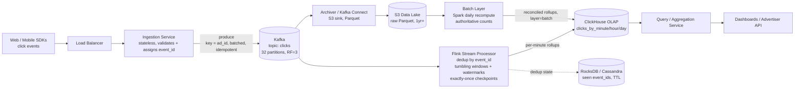

# Real-Time Ad Click Aggregator

## Problem & Clarifications

We are designing the backend that powers an advertising analytics platform. When a
user clicks an ad served on a publisher site or app, an event is generated. Advertisers
and internal dashboards need to see aggregated click metrics (clicks per ad, per
campaign, per region) sliced by time, ideally in near real time, so that campaign
managers can pause budgets, detect fraud, and bill correctly.

Clarifying questions I would ask the interviewer, with the assumptions I'll proceed on:

- **What is the read pattern?** Mostly dashboards querying aggregates over time ranges
  (last hour, last day, last 30 days) grouped by `ad_id` / `campaign_id` / `region`.
  Ad-hoc drill-downs happen but raw per-event lookups are rare. → Optimize for OLAP
  aggregate queries.
- **How fresh must the data be?** "Near real time" — sub-minute end-to-end latency for
  the speed layer is acceptable. Billing-grade exact numbers can lag by hours (batch
  reconciliation).
- **Do we need exact counts or are approximations OK?** Both. Dashboards tolerate
  approximate (HyperLogLog for uniques, slightly stale counts). **Billing requires
  exact, deduplicated, reconciled counts.** This drives a Lambda-style design.
- **What is the volume?** Assume a large network: ~1B click events/day, peaking at
  ~10K–50K events/sec. (Impressions would be 100–1000x larger; here we scope to clicks.)
- **Retention?** Raw events kept 30 days hot + archived to object storage for ≥1 year
  (audit/billing disputes). Aggregates kept 13 months for year-over-year.
- **Late / out-of-order events?** Mobile SDKs buffer offline; events can arrive minutes
  to hours late. We must support windowed aggregation with watermarks and allowed
  lateness, plus a batch backfill.
- **Idempotency / duplicates?** Clients retry on network failure; the same click can be
  delivered multiple times. Each event carries a globally unique `event_id`; we must
  dedup.
- **Fraud / abuse?** Out of scope for the core design, but the raw event store and the
  enrichment stage are the natural hooks for it.

## Functional Requirements

1. **Ingest** click events at high volume with low latency and high availability; never
   silently drop events.
2. **Deduplicate** events by `event_id` so a click is counted at most once.
3. **Aggregate** counts over time windows (per-minute, per-hour, per-day) grouped by
   `ad_id`, `campaign_id`, `advertiser_id`, `region`, `device_type`.
4. **Query** aggregates by arbitrary time range with a `group_by` and filters, returning
   results in well under a second for dashboards.
5. **Handle late events** correctly (attribute them to the window they actually belong
   to, within an allowed-lateness bound).
6. **Reconcile** the real-time (approximate) numbers against an authoritative batch
   recomputation for billing-grade accuracy.
7. **Retain** raw events for replay/audit and aggregates for historical reporting.

## Non-Functional Requirements

- **Scalability:** horizontally scalable ingestion and processing to 50K+ events/sec and
  beyond; no single bottleneck.
- **Availability:** ingestion target 99.99%. Losing the query path degrades dashboards
  but must not lose data. Writes prioritized over reads.
- **Durability:** an accepted event is never lost (replicated log + object-storage
  archive).
- **Latency:** ingestion ack < 50 ms p99; speed-layer aggregates visible < 1 min;
  dashboard queries < 500 ms p95.
- **Correctness:** exactly-once *counting* semantics (at-least-once delivery + dedup);
  billing numbers exact after reconciliation.
- **Cost:** ingestion is the expensive path; batch producer-side and use columnar
  compression in the OLAP store.

## Capacity Estimation

**Event volume**

| Metric | Value |
|---|---|
| Clicks per day | 1 × 10⁹ (1B) |
| Average clicks/sec | 1e9 / 86,400 ≈ **11,600/sec** |
| Peak (≈4× average) | **~46,000/sec** (round to 50K peak) |

**Event size on the wire**

A click event (JSON, before compression): `event_id`(36B uuid) + `ad_id` + `campaign_id`
+ `advertiser_id` + `user_id` + `timestamp` + `region` + `device` + ip/user-agent ≈
**~400 bytes** raw, ~120 bytes compressed (Snappy/LZ4 in Kafka & columnar in OLAP).

**Ingestion throughput**

- Average: 11.6K × 400 B ≈ **4.6 MB/s**; peak 50K × 400 B ≈ **20 MB/s**.
- Tiny by network standards — the cost is *message rate / CPU / partition count*, not
  bandwidth.

**Kafka sizing**

- Target ~5K msgs/sec per partition headroom → **at least 16–24 partitions** on the
  clicks topic (use 32 for growth + parallelism = consumer count).
- Replication factor 3.
- Retention 3 days on the log (replay buffer) = 1e9 × 3 × 400 B × 3 replicas ≈
  **3.6 TB** of broker disk (compressed ~1 TB).

**Raw events store (hot, 30 days)**

- 1e9/day × 120 B compressed ≈ **120 GB/day** → **~3.6 TB / 30 days** before
  replication. Archived to S3 thereafter as Parquet (~1 year ≈ 40 TB compressed,
  cheap object storage).

**Aggregates store (OLAP)**

Rollups are dramatically smaller. Per-minute rollup keyed by
(minute, ad_id, region, device): suppose ~50K active ads × ~20 region/device combos =
1M rows/minute worst case, but realistically ~100K non-empty cells/minute.

- Per-minute: 100K × 1440 min × ~60 B ≈ **8.6 GB/day**.
- Hourly/daily rollups are ~60×/1440× smaller. Total OLAP footprint with 13-month
  retention on rolled-up tables: low single-digit TB → trivial for ClickHouse/Druid.

**Query load**

- ~2,000 dashboard users, refresh every 10 s → ~200 QPS, each hitting pre-aggregated
  rollups (millions of rows scanned, not billions). Comfortable for a small ClickHouse
  cluster.

## API Design

### Ingestion (write path)

```
POST /v1/clicks
Content-Type: application/json
Authorization: Bearer <sdk-key>

{
  "event_id":   "5f2b...uuid",      // client-generated, globally unique -> dedup key
  "ad_id":      "ad_98213",
  "campaign_id":"cmp_55",
  "advertiser_id":"adv_7",
  "user_id":    "u_44910",
  "ts":         "2026-06-22T14:03:11.482Z", // client event time
  "region":     "US-CA",
  "device":     "ios"
}

202 Accepted
{ "status": "queued", "event_id": "5f2b..." }
```

- Returns **202** as soon as the event is durably written to Kafka (not after
  aggregation). Idempotent on `event_id` — re-POSTing the same id is a safe no-op.
- Supports batch: `POST /v1/clicks:batch` with an array (mobile SDKs flush buffers).

### Query (read path)

```
GET /v1/aggregates
  ?metric=clicks
  &group_by=ad_id,region
  &filter=campaign_id:cmp_55
  &granularity=hour            // minute | hour | day
  &from=2026-06-21T00:00:00Z
  &to=2026-06-22T00:00:00Z
  &source=merged               // speed | batch | merged (default)

200 OK
{
  "granularity": "hour",
  "series": [
    { "bucket":"2026-06-21T00:00:00Z", "ad_id":"ad_98213","region":"US-CA","clicks":4021 },
    { "bucket":"2026-06-21T01:00:00Z", "ad_id":"ad_98213","region":"US-CA","clicks":3887 },
    ...
  ],
  "as_of": "2026-06-22T14:04:00Z",   // freshness watermark
  "is_final": false                   // false until batch reconciliation has run
}
```

- `source=merged` returns batch numbers where reconciled and speed-layer numbers for the
  recent unreconciled tail (Lambda serving merge).
- `is_final=false` signals the dashboard the most recent buckets may still change.

## Data Model / Schema

Two stores: an append-only **raw event store** (source of truth, used for replay/batch),
and **pre-aggregated rollup tables** in a columnar OLAP engine (ClickHouse here) for
fast queries.

### Raw events — landed in S3 as Parquet, queryable copy in ClickHouse `MergeTree`

```sql
-- Raw events (source of truth). Partitioned by day, ordered for dedup/locality.
CREATE TABLE click_events_raw
(
    event_id      String,                 -- dedup key (UUID)
    ad_id         LowCardinality(String),
    campaign_id   LowCardinality(String),
    advertiser_id LowCardinality(String),
    user_id       String,
    event_ts      DateTime64(3, 'UTC'),   -- client event time
    ingest_ts     DateTime64(3, 'UTC'),   -- when we received it (for lateness analysis)
    region        LowCardinality(String),
    device        LowCardinality(String),
    ip            IPv4
)
ENGINE = ReplicatedReplacingMergeTree(ingest_ts)  -- ReplacingMergeTree dedups by ORDER BY key
PARTITION BY toYYYYMMDD(event_ts)
ORDER BY (event_id)                                -- collapse duplicate event_ids on merge
TTL toDateTime(event_ts) + INTERVAL 30 DAY;        -- hot for 30d, S3 keeps the archive
```

### Speed-layer rollup (written by Flink, per-minute granularity)

```sql
CREATE TABLE clicks_by_minute
(
    window_start  DateTime('UTC'),
    ad_id         LowCardinality(String),
    campaign_id   LowCardinality(String),
    advertiser_id LowCardinality(String),
    region        LowCardinality(String),
    device        LowCardinality(String),
    clicks        UInt64,
    unique_users  AggregateFunction(uniq, String),  -- HLL state for approx distinct
    layer         Enum8('speed'=1, 'batch'=2) DEFAULT 'speed'
)
ENGINE = ReplicatedSummingMergeTree
PARTITION BY toYYYYMM(window_start)
ORDER BY (window_start, ad_id, region, device);
```

### Pre-aggregated hourly / daily rollups (materialized from the minute table)

```sql
CREATE MATERIALIZED VIEW clicks_by_hour_mv
TO clicks_by_hour AS
SELECT
    toStartOfHour(window_start) AS window_start,
    ad_id, campaign_id, advertiser_id, region, device,
    sum(clicks)            AS clicks,
    uniqMergeState(unique_users) AS unique_users
FROM clicks_by_minute
GROUP BY window_start, ad_id, campaign_id, advertiser_id, region, device;

CREATE TABLE clicks_by_day
(
    day Date, ad_id LowCardinality(String), campaign_id LowCardinality(String),
    advertiser_id LowCardinality(String), region LowCardinality(String),
    device LowCardinality(String), clicks UInt64,
    unique_users AggregateFunction(uniq, String)
)
ENGINE = ReplicatedSummingMergeTree
PARTITION BY toYYYYMM(day)
ORDER BY (day, advertiser_id, campaign_id, ad_id, region, device)
TTL day + INTERVAL 13 MONTH;
```

### Dedup / idempotency state (for the stream processor)

```sql
-- Backed by RocksDB inside Flink state in production; logical shape shown here.
-- Optionally externalized to Cassandra for cross-job dedup with a TTL.
CREATE TABLE seen_event_ids (
    event_id   text,
    window_day date,           -- bucket so we can expire old keys
    PRIMARY KEY ((window_day), event_id)
) WITH default_time_to_live = 172800;  -- 48h TTL (covers allowed lateness)
```

## High-Level Design



The **speed layer** (Kafka → Flink → ClickHouse) gives sub-minute approximate numbers.
The **batch layer** (S3 → Spark → ClickHouse) recomputes exact numbers daily from the
immutable raw log. The query service merges them: batch where available, speed for the
recent tail. This is the **Lambda architecture**.

## Deep Dives

### 1. High-volume event ingestion (Kafka, partitioning, producer batching)

- The ingestion service is **stateless** behind a load balancer so it scales by adding
  instances. Its only job: authenticate, validate, ensure an `event_id` exists, and
  produce to Kafka. It acks **202** after Kafka confirms the write — durability without
  waiting for aggregation.
- **Partitioning:** key the topic by `ad_id` (or `hash(ad_id)`) so all events for an ad
  land on one partition → per-ad ordering and locality for windowed aggregation. Use 32
  partitions for parallelism = max consumer count.
- **Producer batching:** set `linger.ms=20`, `batch.size=64KB`, `compression=lz4`,
  `acks=all`, `enable.idempotence=true`. Batching turns 50K tiny messages/sec into a few
  hundred batched requests/sec — the difference between a struggling and an idle broker.
- **Backpressure & overload:** if Kafka is slow, the ingestion service returns 429 /
  buffers locally rather than blocking the client SDK. Kafka itself is the buffer for
  downstream slowness — Flink can lag and catch up because the log retains 3 days.

### 2. Stream vs batch — Lambda vs Kappa

- **Stream (Flink/Spark Structured Streaming):** continuous, low-latency, windowed. Great
  for the dashboard "now" view but approximate at the edges (late events, dedup state
  TTLs, at-least-once corner cases on failure).
- **Batch (Spark over S3 Parquet):** reprocesses the entire immutable raw log. Slow
  (hours) but **deterministic and exact** — perfect for billing.
- **Lambda architecture** (chosen): run *both*. Speed layer answers "what's happening
  now," batch layer produces the authoritative ledger; the serving layer merges them.
  Downside: two codebases implementing the same aggregation logic → drift risk and double
  the maintenance.
- **Kappa architecture** (the alternative): one stream engine; to "reprocess" you simply
  replay the Kafka log (or S3-tiered log) through a new version of the streaming job.
  Simpler (one codebase) but requires the log to be replayable far enough back and the
  streaming job to be powerful/correct enough to be the *only* source of truth.
- **Trade-off / my recommendation:** start Kappa if exactly-once + replay gives you
  billing-grade numbers (modern Flink can). Adopt Lambda's batch layer specifically when
  finance/audit demands an independent, deterministic recomputation that does not trust
  the streaming path. Here we keep Lambda because billing accuracy is a hard requirement.

### 3. Windowed aggregation (tumbling/sliding windows, watermarks)

- **Tumbling windows** (e.g. 1-minute, non-overlapping) are the natural rollup grain;
  per-minute rows roll up into hour/day. **Sliding windows** (e.g. 5-min window every
  1 min) power "moving average / trending ad" panels.
- Aggregation uses **event time** (`event_ts` from the client), not processing time, so a
  click is counted in the minute it actually happened.
- **Watermarks:** Flink emits a watermark = `max(event_ts seen) - allowedLateness`. A
  window closes and emits when the watermark passes the window end. This bounds how long
  we wait for stragglers vs. how fresh results are.
- **Allowed lateness:** keep a window's state for, say, 2 minutes after it "closes" so a
  slightly-late event updates the already-emitted result (downstream `SummingMergeTree`
  makes the update additive). Events later than that go to a **side output** and are
  picked up by the batch layer instead — we never lose them, they just don't update the
  real-time number.

### 4. Exactly-once counting & dedup

True exactly-once *delivery* is impossible across a network; we achieve exactly-once
*effect* (counting) via at-least-once delivery + idempotent dedup + checkpointing:

- **`event_id` dedup:** each event carries a client-generated UUID. The stream processor
  keeps a set of seen ids (in Flink keyed state / RocksDB, TTL'd to the allowed-lateness
  horizon). A duplicate id is dropped before it increments any counter.
- **Flink checkpointing:** Flink snapshots operator state + Kafka offsets atomically. On
  failure it restores both, so reprocessed records reproduce the same state — no double
  count.
- **Kafka transactions / two-phase commit sink:** the Flink→sink write and the offset
  commit are transactional, so a partial failure does not commit half a window.
- **ClickHouse side:** `ReplacingMergeTree`/`SummingMergeTree` collapse duplicates by the
  ORDER BY key on background merge, a final safety net for the raw store.

### 5. Idempotency

- **Ingestion:** producing the same `event_id` twice is harmless because dedup happens
  downstream; the API contract is explicitly idempotent on `event_id`.
- **Sink writes:** rollup writes are expressed as additive deltas into
  `SummingMergeTree`; combined with checkpoint-aligned transactional commits, a replayed
  batch doesn't double-apply.
- **Batch layer:** a daily recompute is naturally idempotent — it overwrites a whole
  day's partition (`layer='batch'`) computed deterministically from immutable raw data.
  Re-running yesterday's job produces identical output.

### 6. Hot partitions (celebrity advertiser / viral ad)

Keying by `ad_id` means one viral ad concentrates all its traffic on a single Kafka
partition and one Flink subtask → a hotspot.

- **Key salting:** for known-hot keys, produce to `ad_id#<salt 0..N>` to fan out across N
  partitions, then **two-stage aggregation**: partial aggregates per salted key, then a
  final reduce merges the N partials back per `ad_id`. Spreads load while preserving the
  logical key.
- **Local pre-aggregation (combiner):** the Flink subtask aggregates within a window in
  memory and emits one row per (key,window) instead of per event — slashing the volume
  that reaches the hot reducer.
- **Repartitioning / autoscaling:** detect skew via per-partition lag metrics and
  rebalance (add partitions for future, reassign consumers, Flink reactive scaling).
- **Adaptive salting:** only salt keys whose rate crosses a threshold so normal keys keep
  perfect locality and only the genuinely hot ones pay the merge cost.

### 7. Serving aggregates (pre-aggregated rollups, OLAP)

- Queries never scan raw events. They hit **pre-aggregated rollups** (`clicks_by_minute`
  → `_hour` → `_day`) so a "last 30 days by campaign" query scans thousands of rows, not
  billions.
- **ClickHouse** (chosen): columnar, `LowCardinality` dictionary encoding, `SummingMergeTree`
  for additive rollups, materialized views to maintain hour/day tables automatically.
  **Druid** is the equally valid alternative — purpose-built for time-series rollups with
  approximate sketches and great real-time ingestion from Kafka.
- The query service picks the coarsest granularity table that satisfies the requested
  range (day table for month ranges, minute table for "last hour") to keep scans tiny.

### 8. Reconciliation between speed and batch layers

- Both layers write to ClickHouse tagged with `layer` (`speed` vs `batch`).
- The **serving merge rule:** for any (window, key) where a `batch` row exists, the batch
  value wins (authoritative); for the recent tail not yet covered by batch, use `speed`.
  The query result's `is_final` flag reflects whether the range is fully batch-covered.
- A nightly **reconciliation job** compares speed vs batch totals per day; deltas above a
  threshold raise an alert (indicates dedup-state expiry, dropped late events, or a bug).
  Because batch is computed from the immutable raw log, it is the tiebreaker and the
  number finance bills against.

## Bottlenecks & Trade-offs

- **Ingestion message rate, not bandwidth,** is the limit → producer batching and
  partition count are the key knobs.
- **Hot keys** are the classic failure mode → salting + two-stage aggregation, at the
  cost of a merge step and more complex query logic.
- **Watermark tuning** is a freshness-vs-completeness trade: tighter lateness = fresher
  but more events spill to the batch layer; looser = more complete but more state and
  latency.
- **Lambda's dual codebase** is the biggest operational cost — speed and batch logic can
  drift. Mitigate by sharing the aggregation logic as a library, or move to Kappa if
  replay-based reprocessing is sufficient.
- **Dedup state size:** a global `event_id` set is unbounded; we bound it with a TTL
  equal to allowed lateness. Events later than the TTL can be double-counted in the speed
  layer — the batch layer corrects this, which is exactly why we keep it.
- **Exactly-once cost:** checkpointing + transactional sinks add latency and throughput
  overhead vs at-least-once; justified by billing correctness.
- **Approximation trade-off:** HyperLogLog for unique users is ~1–2% error for huge
  memory savings — fine for dashboards, recomputed exactly in batch for billing.

## Code

A self-contained, runnable simulation of the speed layer's core: consume a stream of
click events, **dedup by `event_id`** (with a bounded, TTL-style scalable Bloom-ish
sketch as an option), **aggregate into tumbling windows by event time**, advance a
**watermark with allowed lateness**, and **emit window results**, routing too-late events
to a side output for the batch layer.

```python
"""
Real-time ad click aggregator -- speed-layer core (single-process simulation).

Run:  python ad_click_aggregator.py
"""
from __future__ import annotations
from collections import defaultdict
from dataclasses import dataclass, field
from typing import Iterable, Iterator
import hashlib


# --------------------------------------------------------------------------- #
# Event model
# --------------------------------------------------------------------------- #
@dataclass(frozen=True)
class ClickEvent:
    event_id: str       # globally unique -> dedup key
    ad_id: str
    event_ts: int       # client event time, epoch SECONDS
    region: str = "US"


# --------------------------------------------------------------------------- #
# Dedup: exact set for correctness, plus a Bloom-filter sketch option for scale.
# --------------------------------------------------------------------------- #
class BloomFilter:
    """Tiny fixed-size Bloom filter (probabilistic, no false negatives)."""
    def __init__(self, n_bits: int = 1 << 20, n_hashes: int = 5):
        self.n_bits, self.n_hashes = n_bits, n_hashes
        self.bits = bytearray(n_bits // 8)

    def _positions(self, key: str) -> Iterator[int]:
        h = hashlib.sha256(key.encode()).digest()
        # derive n_hashes independent positions from the digest
        for i in range(self.n_hashes):
            chunk = h[i * 4:(i + 1) * 4]
            yield int.from_bytes(chunk, "big") % self.n_bits

    def add(self, key: str) -> None:
        for p in self._positions(key):
            self.bits[p // 8] |= (1 << (p % 8))

    def __contains__(self, key: str) -> bool:
        return all(self.bits[p // 8] & (1 << (p % 8)) for p in self._positions(key))


class Deduper:
    """
    Bloom pre-filter (cheap negative) backed by an exact set (correctness).
    In Flink this is keyed RocksDB state with a TTL == allowed_lateness horizon.
    """
    def __init__(self) -> None:
        self._bloom = BloomFilter()
        self._exact: set[str] = set()

    def seen_before(self, event_id: str) -> bool:
        if event_id not in self._bloom:        # definitely new
            self._bloom.add(event_id)
            self._exact.add(event_id)
            return False
        if event_id in self._exact:            # confirmed duplicate
            return True
        self._exact.add(event_id)              # bloom false-positive; record exact
        return False


# --------------------------------------------------------------------------- #
# Tumbling-window aggregator with event-time watermark + allowed lateness.
# --------------------------------------------------------------------------- #
@dataclass
class WindowResult:
    window_start: int
    ad_id: str
    region: str
    clicks: int
    revised: bool = False   # True if a late event updated an already-emitted window


class TumblingAggregator:
    def __init__(self, window_secs: int, allowed_lateness: int) -> None:
        self.window_secs = window_secs
        self.allowed_lateness = allowed_lateness
        # state[(window_start, ad_id, region)] = count
        self.state: dict[tuple[int, str, str], int] = defaultdict(int)
        self.emitted: set[tuple[int, str, str]] = set()
        self.watermark = float("-inf")
        self.deduper = Deduper()
        self.too_late: list[ClickEvent] = []   # side output -> batch layer

    def _window_start(self, ts: int) -> int:
        return ts - (ts % self.window_secs)

    def process(self, ev: ClickEvent) -> list[WindowResult]:
        """Feed one event; return any windows that finalize as a result."""
        emitted: list[WindowResult] = []

        # 1) Dedup: exactly-once *counting*.
        if self.deduper.seen_before(ev.event_id):
            return emitted

        w_start = self._window_start(ev.event_ts)
        w_end = w_start + self.window_secs

        # 2) Too late? (older than watermark - allowed lateness) -> batch side output.
        if w_end + self.allowed_lateness <= self.watermark:
            self.too_late.append(ev)
            return emitted

        key = (w_start, ev.ad_id, ev.region)
        self.state[key] += 1
        if key in self.emitted:
            # late-but-within-lateness: emit a revision (additive downstream).
            emitted.append(WindowResult(w_start, ev.ad_id, ev.region,
                                        self.state[key], revised=True))

        # 3) Advance watermark on event time (here: max ts seen, monotonic).
        self.watermark = max(self.watermark, ev.event_ts)

        # 4) Fire any windows whose end has passed watermark - allowed_lateness.
        emitted.extend(self._fire_ready())
        return emitted

    def _fire_ready(self) -> list[WindowResult]:
        out: list[WindowResult] = []
        for key, count in list(self.state.items()):
            w_start, ad_id, region = key
            w_end = w_start + self.window_secs
            if key not in self.emitted and w_end + self.allowed_lateness <= self.watermark:
                self.emitted.add(key)
                out.append(WindowResult(w_start, ad_id, region, count))
        return out

    def flush(self) -> list[WindowResult]:
        """End of stream: emit every window not yet emitted."""
        out: list[WindowResult] = []
        for key, count in self.state.items():
            if key not in self.emitted:
                self.emitted.add(key)
                out.append(WindowResult(*key, count))
        return out


# --------------------------------------------------------------------------- #
# Demo
# --------------------------------------------------------------------------- #
def demo() -> None:
    # 60-second tumbling windows, allow events up to 30s late.
    agg = TumblingAggregator(window_secs=60, allowed_lateness=30)

    # ts in seconds. Note: e2 is a DUPLICATE of e1; e_late arrives after watermark
    # has moved well past its window -> dedup drops dup, late event handled correctly.
    base = 1_000_000  # arbitrary epoch base, window boundaries at multiples of 60
    stream: Iterable[ClickEvent] = [
        ClickEvent("e1", "ad_A", base + 5,  "US"),   # window [..0, ..60)
        ClickEvent("e2", "ad_A", base + 5,  "US"),   # DUPLICATE of e1 -> dropped
        ClickEvent("e3", "ad_B", base + 7,  "EU"),
        ClickEvent("e4", "ad_A", base + 58, "US"),   # same window as e1
        ClickEvent("e5", "ad_A", base + 61, "US"),   # next window [..60, ..120)
        ClickEvent("e6", "ad_A", base + 95, "US"),
        # advances watermark to ~ +95; window1 (end +60) +30 lateness = +90 <= 95 -> fires
        ClickEvent("e7", "ad_A", base + 40, "US"),   # LATE but +40 in window1, already fired
                                                     # window1_end+lateness=90 <= wm 95 -> TOO LATE
        ClickEvent("e8", "ad_B", base + 130, "EU"),  # window3, pushes watermark to +130
    ]

    print("=== streaming ===")
    for ev in stream:
        for r in agg.process(ev):
            tag = "REVISED" if r.revised else "FINAL"
            print(f"[{tag}] window={r.window_start - base:>3}s ad={r.ad_id} "
                  f"region={r.region} clicks={r.clicks}")

    print("=== flush (end of stream) ===")
    for r in agg.flush():
        print(f"[FINAL] window={r.window_start - base:>3}s ad={r.ad_id} "
              f"region={r.region} clicks={r.clicks}")

    print("=== side output -> batch layer (too-late events) ===")
    for ev in agg.too_late:
        print(f"  too-late: {ev.event_id} ad={ev.ad_id} ts={ev.event_ts - base}s")


if __name__ == "__main__":
    demo()
```

Expected output (illustrative): the duplicate `e2` is silently dropped; window `[0,60)`
for `ad_A` finalizes with **2** clicks (e1 + e4); the late `e7` (event time +40s, whose
window already closed past the lateness bound) is routed to the **too-late side output**
for the batch layer instead of corrupting the real-time count; remaining windows flush at
end of stream.

### PyFlink-style sketch of the real implementation

```python
# Pseudocode — the production speed layer in PyFlink.
from pyflink.datastream import StreamExecutionEnvironment
from pyflink.datastream.connectors.kafka import KafkaSource
from pyflink.common.watermark_strategy import WatermarkStrategy
from pyflink.common import Duration, Time
from pyflink.datastream.window import TumblingEventTimeWindows
from pyflink.datastream.state import ValueStateDescriptor

env = StreamExecutionEnvironment.get_execution_environment()
env.enable_checkpointing(30_000)                       # exactly-once snapshots every 30s

source = (KafkaSource.builder()
          .set_bootstrap_servers("kafka:9092")
          .set_topics("clicks")
          .set_group_id("click-agg")
          .build())

wm = (WatermarkStrategy
      .for_bounded_out_of_orderness(Duration.of_seconds(30))   # allowed lateness
      .with_timestamp_assigner(lambda e, _: e["event_ts"]))

clicks = env.from_source(source, wm, "clicks")

def dedup(value, ctx):                                  # KeyedProcessFunction on event_id
    seen = ctx.get_state(ValueStateDescriptor("seen", bool))
    if seen.value():            # duplicate -> drop
        return
    seen.update(True)           # TTL configured == allowed lateness horizon
    yield value

(clicks
    .key_by(lambda e: e["event_id"]).process(dedup)     # exactly-once counting via dedup
    .key_by(lambda e: (e["ad_id"], e["region"]))
    .window(TumblingEventTimeWindows.of(Time.minutes(1)))
    .allowed_lateness(Time.seconds(30))
    .side_output_late_data(late_tag)                    # too-late -> batch layer topic
    .aggregate(CountAggregate())                         # combiner-style partial agg
    .sink_to(clickhouse_sink))                           # SummingMergeTree, additive
env.execute("ad-click-speed-layer")
```

## Summary

We built a **Lambda-architecture ad click aggregator**. Stateless ingestion services ack
events at 202 once durably written to a **partitioned, batched, idempotent Kafka** topic
keyed by `ad_id`. A **Flink speed layer** dedups by `event_id` (keyed/RocksDB state with
TTL), aggregates **event-time tumbling windows with watermarks and allowed lateness**,
achieves **exactly-once counting** via checkpointing + transactional sinks, and writes
per-minute rollups into a **ClickHouse** OLAP store that materializes hour/day rollups for
sub-second dashboard queries. In parallel, a **Spark batch layer** recomputes
authoritative, deterministic counts from the immutable **S3 raw log**, and a serving merge
reconciles the two (`batch` wins where present; `speed` for the fresh tail). Hot keys are
tamed with **salting + two-stage aggregation**, late stragglers spill to a **batch side
output** rather than being lost, and idempotency holds end to end. The design scales to
1B+ events/day and ~50K/sec peak while serving billing-grade accuracy after reconciliation
and near-real-time approximations for live dashboards.
```
