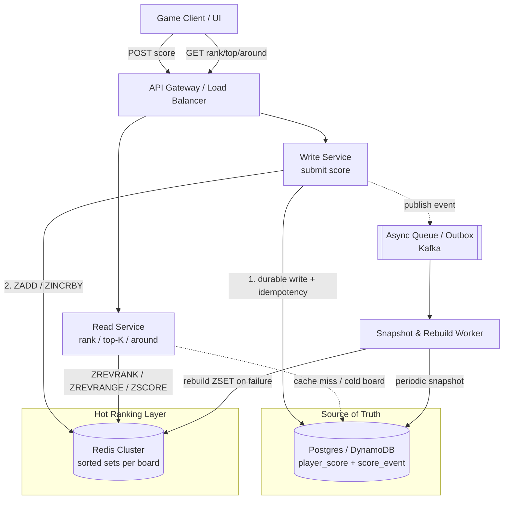

# Real-Time Gaming Leaderboard — System Design

## Problem & Clarifications

We are designing the backend for a **real-time global leaderboard** for a popular online game. Players accumulate scores, and the system must answer ranking queries quickly: "Who are the top 100 players?", "What is my rank?", and "Show me the players just above and below me."

Clarifying questions an interviewer expects you to ask:

- **What does "score" mean?** Cumulative lifetime points, or a single best-game score? *Assume cumulative points; a score update is monotonically increasing per player but we support arbitrary increments.*
- **Global only, or also segmented?** *Global plus time-windowed (daily/weekly/all-time). Country/region leaderboards are a stretch goal handled by the same primitives keyed differently.*
- **How fresh must ranks be?** *Top-K and a user's own rank should reflect a score update within ~1 second. Exact global rank for the long tail (rank 50,000,001) can be approximate.*
- **Ties?** *Break ties by earliest-achieved timestamp so ordering is deterministic.*
- **Read/write ratio?** *Heavily read-skewed. Most players check their own rank far more often than they submit scores, and top-K is polled by the client UI.*
- **Consistency vs availability?** *Availability and low latency win. A stale rank for a few hundred ms is acceptable; losing a score permanently is not.*

## Functional Requirements

1. **Submit/Update score** — `add_score(user_id, delta)` (or set absolute). Idempotency is desirable for retries.
2. **Get Top-K** — return the top K players (id, score, rank), typically K = 10..100.
3. **Get a user's rank** — return a single player's current global rank and score.
4. **Get players around a user** — return a window of N players above and below a given user (the "leaderboard centered on me" view).
5. **Time-windowed leaderboards** — daily, weekly, monthly, all-time.
6. **Durability** — scores survive cache/node failure; the leaderboard can be rebuilt.

## Non-Functional Requirements

- **Low latency:** p99 < 50 ms for rank/top-K reads, < 100 ms for score writes (including durable write).
- **Freshness:** rank updates visible within ~1 s.
- **Scalability:** 50M+ players, 100M+ updates/day, with headroom for 5x spikes during events.
- **High availability:** target 99.95%. Reads should degrade gracefully (serve slightly stale data) rather than error.
- **Durability:** no acknowledged score update is ever lost (the durable store is the source of truth).
- **Cost-aware:** keep the hot ranking structure in memory (Redis) but do not keep 50M entries replicated needlessly.

## Capacity Estimation

Assumptions:

- **Players (DAU-ish active set):** 50,000,000.
- **Score updates/day:** 100,000,000.
  - Average write QPS = 100M / 86,400 s ≈ **1,160 writes/s**.
  - Peak (event spike, ~5x average and bursty) ≈ **6,000 writes/s**.
- **Read traffic:** assume each active player polls their rank/around view ~10x/day and top-K is fetched ~5x/session.
  - Reads/day ≈ 50M × 15 ≈ 750M → avg ≈ **8,700 reads/s**, peak ≈ **40,000 reads/s**.
  - **Read:write ≈ 7:1.**

**Storage (Redis sorted set):**

- Per member in a ZSET: member string (user_id, ~16 B) + score (8 B double) + skip-list/hash overhead (~64 B realistic). Call it ~**90–100 B per member**.
- 50M members × ~100 B ≈ **5 GB** for the all-time global ZSET.
- Add daily + weekly windows (active subset, say 20M each) → another ~4 GB. Plan for a Redis cluster with **~16–32 GB usable RAM** including replication and fragmentation headroom.

**Storage (durable store):**

- Player score row: user_id (16 B) + score (8 B) + updated_at (8 B) + window keys + indexes ≈ ~200 B effective.
- 50M players ≈ **10 GB** of primary data, trivially handled by Postgres or DynamoDB.
- An append-only score-event log (for audit/idempotency/rebuild) at 100M/day × ~64 B ≈ **6.4 GB/day** → retain ~30 days hot (~200 GB) then archive to S3.

**Bandwidth:** top-K of 100 entries × ~40 B ≈ 4 KB/response; at 40k reads/s a meaningful fraction are around/top-K → tens of MB/s, well within a load-balanced fleet.

## API Design

REST/HTTP (could equally be gRPC). All write paths are authenticated; user identity comes from the auth token, not the body, except for server-authoritative game services.

```
POST /v1/leaderboards/{board}/scores
  Body: { "user_id": "u123", "delta": 250, "idempotency_key": "match-998877" }
  -> 200 { "user_id": "u123", "score": 13250, "rank": 41187 }
  board ∈ { global, daily, weekly, monthly }

GET /v1/leaderboards/{board}/top?k=100
  -> 200 { "entries": [ {"rank":1,"user_id":"u9","score":998240}, ... ] }

GET /v1/leaderboards/{board}/users/{user_id}/rank
  -> 200 { "user_id":"u123", "score":13250, "rank":41187 }

GET /v1/leaderboards/{board}/users/{user_id}/around?window=5
  -> 200 { "entries": [ ...5 above..., {user_id:u123,...}, ...5 below... ] }
```

Notes:
- `idempotency_key` lets the durable layer dedupe retried writes (e.g., a match result submitted twice).
- Ranks are **1-based** in the API even though Redis returns 0-based.
- `around` returns `2*window + 1` rows centered on the user.

## Data Model / Schema

### Redis sorted set (hot ranking structure)

One ZSET per leaderboard/window. The **member** is `user_id`; the **score** is the ranking score.

```
Key:    lb:global            ZSET  member=user_id  score=points
Key:    lb:daily:2026-06-22  ZSET  member=user_id  score=points   (TTL ~48h)
Key:    lb:weekly:2026-W25   ZSET  member=user_id  score=points   (TTL ~16d)
```

**Tie-breaking with a single float score.** Redis orders equal scores lexicographically by member, which is not what we want. To break ties by "earliest achieved wins," encode the score as a single double:

```
encoded = points * 2^21 - (seconds_since_epoch_offset & 0x1FFFFF... )
```

In practice, doubles have 52 bits of mantissa. A clean approach: `encoded = points - timestamp/1e13` so a higher score always dominates and, among equal points, an earlier timestamp yields a (very slightly) larger encoded value. We keep the *display* score separately (in the durable store) and only use the encoded value for ordering. This keeps `ZADD`/`ZREVRANGE` ordering deterministic.

### Durable source of truth (Postgres)

```sql
-- Current authoritative score per player per board.
CREATE TABLE player_score (
    board        TEXT        NOT NULL,           -- 'global','daily:2026-06-22',...
    user_id      TEXT        NOT NULL,
    score        BIGINT      NOT NULL DEFAULT 0,
    achieved_at  TIMESTAMPTZ NOT NULL DEFAULT now(),  -- last time score changed
    updated_at   TIMESTAMPTZ NOT NULL DEFAULT now(),
    PRIMARY KEY (board, user_id)
);

-- Index to support snapshot/rebuild ordered scans and offline top-K.
CREATE INDEX idx_player_score_board_rank
    ON player_score (board, score DESC, achieved_at ASC);

-- Append-only event log: durability, idempotency, audit, and rebuild source.
CREATE TABLE score_event (
    event_id        BIGSERIAL   PRIMARY KEY,
    idempotency_key TEXT        NOT NULL,
    board           TEXT        NOT NULL,
    user_id         TEXT        NOT NULL,
    delta           BIGINT      NOT NULL,
    created_at      TIMESTAMPTZ NOT NULL DEFAULT now()
);

-- Dedupe retried submissions.
CREATE UNIQUE INDEX uq_score_event_idem
    ON score_event (board, idempotency_key);

-- Periodic snapshot bookmark, so a Redis rebuild knows the last applied event.
CREATE TABLE leaderboard_snapshot (
    board            TEXT        PRIMARY KEY,
    last_event_id    BIGINT      NOT NULL,
    snapshot_taken_at TIMESTAMPTZ NOT NULL DEFAULT now()
);
```

**DynamoDB alternative** (for global multi-region, serverless ops):

```
Table PlayerScore
  PK = BOARD#<board>     (partition key)
  SK = USER#<user_id>    (sort key)
  attrs: score (N), achieved_at (N)
  -- single-player lookups: GetItem on PK+SK
  -- score writes: UpdateItem with ADD for atomic increment + condition for idempotency
GSI ScoreByBoard
  PK = BOARD#<board>, SK = score (N)   -- enables ordered scans for rebuild
```

DynamoDB does **not** give you O(log N) rank natively — that is exactly why Redis sits in front of it. DynamoDB/Postgres is the source of truth; Redis is the ranking index.

## High-Level Design



Write path: durable write first (so nothing is lost), then update Redis, then publish an event for async consumers (snapshots, analytics). Read path: serve entirely from Redis; fall back to Postgres only for a cold/missing board (then warm Redis).

## Deep Dives

### Redis sorted sets: exact commands & complexity

A sorted set stores members ordered by score using a skip list + hash map, giving logarithmic rank/range operations.

```
# Submit / update a score (atomic increment keeps concurrent writers correct)
ZINCRBY lb:global 250 u123          # O(log N) — add 250 to u123's score
# or set absolute encoded score
ZADD    lb:global 13250 u123         # O(log N)

# Get a user's score
ZSCORE  lb:global u123               # O(1)

# Get a user's rank (0-based). ZRANK = ascending, ZREVRANK = descending.
ZREVRANK lb:global u123              # O(log N)  -> e.g. 41186 (so display rank 41187)

# Top-K (highest scores first) with scores
ZREVRANGE lb:global 0 99 WITHSCORES  # O(log N + K)  -> top 100

# Players around a user: get rank, then range a window around it
ZREVRANK  lb:global u123             # -> r = 41186  (O(log N))
ZREVRANGE lb:global (r-5) (r+5) WITHSCORES   # O(log N + W)
```

Complexity summary: `ZADD/ZINCRBY/ZREVRANK/ZSCORE` are O(log N) (ZSCORE O(1)); `ZREVRANGE` is O(log N + M) where M is the number of returned elements. With N = 50M, log₂N ≈ 26 — a single rank lookup touches ~26 skip-list nodes, microseconds of CPU.

### Top-K queries

`ZREVRANGE key 0 K-1 WITHSCORES` returns the K highest-scoring members already in order. Because K is tiny (≤100) relative to N, this is effectively O(log N). The top-K is also the most-read object, so we additionally cache the rendered top-100 JSON in Redis (`GET lb:global:top100`) with a ~1 s TTL or invalidate-on-write-throttled refresh, collapsing thousands of identical reads into one ZREVRANGE per second.

### A user's rank and the players around them

This is two commands:

1. `ZREVRANK key user` → 0-based rank `r` (O(log N)).
2. `ZREVRANGE key max(0, r-W) r+W WITHSCORES` → the surrounding window (O(log N + 2W)).

Display rank = `r + 1`. If `ZREVRANK` returns `nil`, the user is not on the board (return rank = null / "unranked"). To avoid two round trips, wrap both in a Lua script (`EVAL`) so the rank and window are computed atomically server-side — important because between the two calls another write could shift the user's rank, producing a window that does not actually contain the user.

### Scaling: sharding, global rank, approximate ranks

A single Redis sorted set with 50M members (~5 GB) fits comfortably on one large node, and the *write* throughput (~6k/s peak) is far below a single Redis instance's capacity (100k+ ops/s). So the first answer is: **you often do not need to shard the ranking ZSET — vertically scale one master with read replicas.** Shard only when memory or write QPS truly exceeds a node.

When you must shard:

- **Shard by score range** (e.g., shard A = scores 0–10k, B = 10k–100k, C = 100k+). Top-K then reads only the highest shard; a user's rank within their own shard is exact.
- **The global-rank problem:** a player's *global* rank = (their rank within their shard) + (count of all players in higher shards). You can keep a small, frequently updated counter per shard (`ZCARD` per shard) so global rank = local `ZREVRANK` + Σ(sizes of higher shards). This is exact if shard boundaries are fixed and you sum live `ZCARD`s. The cost: a fan-out read across shards for global rank, though only to fetch cheap cardinalities.
- **Approximate ranks for the long tail:** for rank-50-millionth queries, exactness is pointless. Maintain a **score histogram / percentile buckets** (e.g., a Redis ZSET or a count-min-style structure mapping score buckets → cumulative counts). A user's approximate rank = sum of counts of all buckets with a higher score + position within their bucket. This is O(number of buckets), independent of N, and good enough for "you're in the top 12%." This is the standard trick (used by large games): exact ranks for the top thousands, **count-based estimated ranks** below.

### Time-windowed leaderboards (daily / weekly / all-time)

Two viable designs:

1. **Separate sorted set per window with TTL** (recommended). Key carries the window: `lb:daily:2026-06-22`, `lb:weekly:2026-W25`. On each score event, the write service does one `ZINCRBY` per active window. Daily key gets a TTL of ~48 h, weekly ~16 d, so expired windows self-evict and reclaim RAM automatically. Roll-over is implicit — new date string ⇒ new key, no cron needed.
2. **Score encoding into a single ZSET** (avoid unless RAM-bound). Pack window+score into the score field. Hard to query and to expire; generally not worth it. Separate keys win on simplicity and on free TTL-based cleanup.

All-time `lb:global` has no TTL and is snapshotted to the durable store. Closed windows (e.g., last week's final standings) are frozen by copying the final ZSET into a durable table before its TTL expires.

### Durability: Redis as cache, snapshot, rebuild

Redis is a cache/index, **not** the source of truth. Guarantees:

- **Write ordering:** durable write to `score_event` + `player_score` (atomic, idempotent on `idempotency_key`) **before** acking the client; then `ZINCRBY` Redis. If Redis is briefly down, the score is still durable and Redis is reconciled from the event log.
- **Redis AOF/RDB** is enabled as a second line of defense, but we never rely on it alone.
- **Periodic snapshot:** a worker records `last_event_id` per board and ensures `player_score` reflects all applied events.
- **Rebuild on failure:** if a Redis node/board is lost, a rebuild worker scans `player_score` ordered by `(board, score DESC, achieved_at ASC)` and pipelines `ZADD`s back into a fresh ZSET (50M `ZADD`s pipelined in batches of ~10k take seconds-to-minutes). The snapshot bookmark + event log let it then apply any events that arrived during rebuild, so no update is lost. During rebuild, reads can fall back to an offline top-K computed from the indexed Postgres scan.

## Bottlenecks & Trade-offs

- **Hot key / single master.** All writes for one board hit one Redis master. Mitigation: `ZINCRBY` is cheap; use replicas for reads; shard only when proven necessary. Trade-off: sharding buys throughput but makes global rank a fan-out.
- **Two-write atomicity (Postgres then Redis).** They can diverge if the process dies between them. Mitigation: durable-first ordering means Redis is the *recoverable* side; an outbox/event consumer reconciles Redis from the log (eventual consistency). Trade-off: brief staleness vs. strong cross-store consistency (which would cost latency via 2PC — not worth it here).
- **Approximate vs exact rank.** Exact global rank under sharding requires fan-out; approximate (histogram) ranks are O(buckets) and scale, at the cost of precision for the long tail. Top-K and own-rank near the top stay exact.
- **Read amplification on top-K.** Solved with a short-TTL cached rendered top-K; trade freshness (~1 s) for massively fewer ZREVRANGE calls.
- **Memory pressure from many windows.** Each window is a full ZSET. TTLs bound this; segmented (per-country) boards multiply RAM — push rarely-queried segments to on-demand rebuild from Postgres rather than keeping them all hot.
- **Ties / determinism.** Encoding timestamp into the score keeps ordering stable but consumes mantissa bits; for scores needing > ~30 bits of range plus a timestamp tiebreak you may exceed double precision — then use a composite member or a secondary tiebreak ZSET.

## Code

Two interchangeable implementations behind the same interface: a Redis-backed one (production shape, needs a Redis server) and a pure-Python in-memory one (self-contained, runnable, uses `bisect`). A demo at the bottom runs the in-memory version with no dependencies.

```python
"""
Real-time leaderboard reference implementations.

- RedisLeaderboard:    production shape, backed by Redis sorted sets (redis-py).
                       Requires a running Redis server. Degrades gracefully if
                       redis is unavailable.
- InMemoryLeaderboard: self-contained pure-Python version using bisect on a
                       sorted list. Same interface, fully runnable.

Run directly:  python leaderboard.py   -> runs the in-memory demo.
"""

from __future__ import annotations

import bisect
import time
from typing import List, Optional, Tuple

# An entry returned to callers: (user_id, score, rank) where rank is 1-based.
Entry = Tuple[str, int, int]


# --------------------------------------------------------------------------- #
# Redis-backed leaderboard (production shape).                                #
# --------------------------------------------------------------------------- #
class RedisLeaderboard:
    """
    Leaderboard backed by a Redis sorted set (ZSET).

    Member  = user_id
    Score   = points (higher is better)

    NOTE: Requires a reachable Redis server. Construct with a redis.Redis
    client. All methods catch connection errors and degrade gracefully
    (returning None/empty) rather than raising, so the read path stays
    available even if Redis hiccups.
    """

    def __init__(self, client, key: str = "lb:global") -> None:
        self.r = client
        self.key = key

    def add_score(self, user_id: str, delta: int) -> Optional[int]:
        """Atomically add `delta` to a user's score. Returns the new score."""
        try:
            # ZINCRBY key increment member  -> O(log N), atomic
            return int(self.r.zincrby(self.key, delta, user_id))
        except Exception as exc:  # redis.exceptions.RedisError in practice
            print(f"[RedisLeaderboard] add_score degraded: {exc}")
            return None

    def top_k(self, k: int = 10) -> List[Entry]:
        """Return the top K players, highest first. O(log N + K)."""
        try:
            # ZREVRANGE key 0 k-1 WITHSCORES
            rows = self.r.zrevrange(self.key, 0, k - 1, withscores=True)
            return [
                (_as_str(uid), int(score), rank + 1)
                for rank, (uid, score) in enumerate(rows)
            ]
        except Exception as exc:
            print(f"[RedisLeaderboard] top_k degraded: {exc}")
            return []

    def get_rank(self, user_id: str) -> Optional[Entry]:
        """Return (user_id, score, rank) for one user, or None if unranked."""
        try:
            # ZREVRANK is O(log N); ZSCORE is O(1).
            r = self.r.zrevrank(self.key, user_id)
            if r is None:
                return None
            score = self.r.zscore(self.key, user_id)
            return (user_id, int(score), r + 1)
        except Exception as exc:
            print(f"[RedisLeaderboard] get_rank degraded: {exc}")
            return None

    def get_around(self, user_id: str, window: int = 5) -> List[Entry]:
        """
        Return the user plus `window` players above and below them.
        Uses ZREVRANK then a windowed ZREVRANGE. In production wrap both in a
        Lua EVAL so the rank and window are computed atomically.
        """
        try:
            r = self.r.zrevrank(self.key, user_id)
            if r is None:
                return []
            lo = max(0, r - window)
            hi = r + window
            rows = self.r.zrevrange(self.key, lo, hi, withscores=True)
            return [
                (_as_str(uid), int(score), lo + i + 1)
                for i, (uid, score) in enumerate(rows)
            ]
        except Exception as exc:
            print(f"[RedisLeaderboard] get_around degraded: {exc}")
            return []


def _as_str(v) -> str:
    """redis-py may return bytes depending on decode_responses; normalize."""
    return v.decode() if isinstance(v, (bytes, bytearray)) else str(v)


# --------------------------------------------------------------------------- #
# In-memory leaderboard (self-contained, no dependencies).                    #
# --------------------------------------------------------------------------- #
class InMemoryLeaderboard:
    """
    Pure-Python leaderboard with the same interface as RedisLeaderboard.

    Ordering is by (score DESC, achieved_at ASC) so higher scores rank first and
    ties are broken by who reached the score earliest (deterministic, matching
    the Redis score-encoding strategy).

    Internally keeps a list sorted by an ordering key and uses bisect for
    O(log N) rank lookups. Inserts/removals are O(N) due to list shifting; this
    mirrors Redis semantics for demo purposes (a real skip-list/sorted-dict
    would make mutation O(log N) too).
    """

    def __init__(self) -> None:
        # _order: sorted list of ordering keys (one per ranked user).
        # _users: ordering key -> user_id.   _score: user_id -> score.
        # _okey:  user_id -> current ordering key (for removal on update).
        self._order: List[Tuple[float, float, str]] = []
        self._users = {}            # okey -> user_id
        self._score = {}            # user_id -> int score
        self._okey = {}             # user_id -> current okey
        self._seq = 0               # tiebreak: earlier insert = smaller

    def _make_key(self, score: int, ts: float) -> Tuple[float, float, str]:
        # We sort ascending then read in reverse for top-K, so invert score.
        # Tie: earlier achieved_at should rank higher -> when inverted, smaller
        # ts must come *after* in ascending order, i.e. use +ts so that for
        # equal -score, smaller ts sorts first; we then reverse. To keep it
        # simple and correct we store ascending and reverse at read time.
        return (-float(score), float(ts), "")

    def add_score(self, user_id: str, delta: int) -> int:
        now = time.time()
        new_score = self._score.get(user_id, 0) + delta
        # Remove old position if present.
        old_key = self._okey.get(user_id)
        if old_key is not None:
            idx = bisect.bisect_left(self._order, old_key)
            # find exact match (keys carry a unique tail via user mapping)
            if 0 <= idx < len(self._order) and self._users.get(self._order[idx]) == user_id:
                self._order.pop(idx)
            else:
                # linear fallback (equal-score collisions): locate by user
                for i, k in enumerate(self._order):
                    if self._users.get(k) == user_id:
                        self._order.pop(i)
                        break
            self._users.pop(old_key, None)

        # Build a unique ordering key: (-score, achieved_ts, seq-tag).
        self._seq += 1
        key = (-float(new_score), now, f"{self._seq:012d}")
        bisect.insort(self._order, key)
        self._users[key] = user_id
        self._okey[user_id] = key
        self._score[user_id] = new_score
        return new_score

    def top_k(self, k: int = 10) -> List[Entry]:
        out: List[Entry] = []
        for rank, key in enumerate(self._order[:k], start=1):
            uid = self._users[key]
            out.append((uid, self._score[uid], rank))
        return out

    def get_rank(self, user_id: str) -> Optional[Entry]:
        key = self._okey.get(user_id)
        if key is None:
            return None
        idx = bisect.bisect_left(self._order, key)
        return (user_id, self._score[user_id], idx + 1)

    def get_around(self, user_id: str, window: int = 5) -> List[Entry]:
        key = self._okey.get(user_id)
        if key is None:
            return []
        idx = bisect.bisect_left(self._order, key)
        lo = max(0, idx - window)
        hi = min(len(self._order), idx + window + 1)
        out: List[Entry] = []
        for rank, k in enumerate(self._order[lo:hi], start=lo + 1):
            uid = self._users[k]
            out.append((uid, self._score[uid], rank))
        return out


# --------------------------------------------------------------------------- #
# Demo (runs with no external services).                                       #
# --------------------------------------------------------------------------- #
def _demo() -> None:
    lb = InMemoryLeaderboard()

    seed = {
        "alice": 1500, "bob": 2300, "carol": 900, "dave": 2300,
        "erin": 4100, "frank": 770, "grace": 3050, "heidi": 1850,
        "ivan": 2900, "judy": 600, "mallory": 2305, "niaj": 1200,
    }
    for user, pts in seed.items():
        lb.add_score(user, pts)

    print("== Top 5 ==")
    for uid, score, rank in lb.top_k(5):
        print(f"  #{rank:>2}  {uid:<8} {score}")

    print("\n== heidi's rank ==")
    print("  ", lb.get_rank("heidi"))

    print("\n== Around heidi (window=2) ==")
    for uid, score, rank in lb.get_around("heidi", window=2):
        mark = " <-- you" if uid == "heidi" else ""
        print(f"  #{rank:>2}  {uid:<8} {score}{mark}")

    print("\n== heidi scores +1000, recheck ==")
    lb.add_score("heidi", 1000)
    print("  new rank:", lb.get_rank("heidi"))
    for uid, score, rank in lb.top_k(5):
        print(f"  #{rank:>2}  {uid:<8} {score}")

    print("\n== unranked user ==")
    print("  ", lb.get_rank("nobody"))


if __name__ == "__main__":
    _demo()
```

Expected demo output (abridged): erin (4100) is #1, then grace (3050), ivan (2900), mallory (2305), and a deterministic tie order between bob/dave (both 2300). After heidi gains +1000 (1850 -> 2850) she jumps to #4, demonstrating O(log N)-style re-ranking.

## Summary

A real-time leaderboard is fundamentally a **ranking-index-over-a-source-of-truth** problem. The durable store (Postgres or DynamoDB) owns the scores and guarantees nothing is lost; a Redis **sorted set** provides the O(log N) ranking primitives that relational/NoSQL stores cannot. The four core operations map directly onto Redis commands: `ZINCRBY` (submit), `ZREVRANGE 0 K-1` (top-K), `ZREVRANK` + `ZSCORE` (own rank), and `ZREVRANK` + windowed `ZREVRANGE` (players around me). Time windows are just separate ZSETs with TTLs. The system scales vertically first; when forced to shard, it shards by score range and keeps global rank cheap via per-shard cardinalities and **approximate, histogram-based ranks** for the long tail. Durability and recovery come from a durable-first write order plus an event log that lets Redis be rebuilt from scratch with zero score loss. The design favors availability and low latency (sub-50 ms reads, ~1 s freshness) while keeping the source of truth strongly durable.
