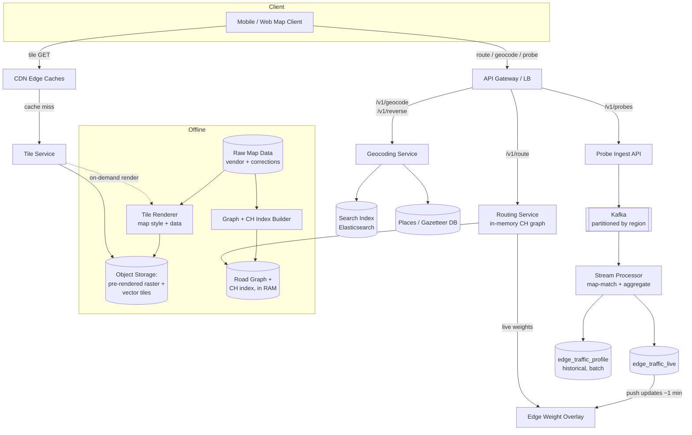

# Maps & Navigation System Design (Google Maps)

## Problem & Clarifications

We are designing a maps and navigation platform comparable to Google Maps / Apple Maps. The
product lets users pan and zoom an interactive map, search for a place by address, get a pin's
address from coordinates, and compute driving routes with traffic-aware ETAs.

Clarifying questions I would ask the interviewer before locking scope:

- **Geographic scope?** Global. We must handle a continent-scale (and ultimately planet-scale)
  road graph, not a single city.
- **Travel modes?** Start with driving. Walking / cycling / transit share most of the
  architecture (different graph, different edge weights) and are noted as extensions.
- **Real-time traffic?** Yes — ETAs must reflect live conditions, and routing should prefer
  faster roads when congestion appears. This is the hardest functional requirement.
- **Turn-by-turn navigation / rerouting?** Yes for the client experience, but the server-side
  primitive is "given origin, destination, departure time, return an optimal route + ETA."
  Rerouting is just re-issuing that query from the current position.
- **Who edits the map?** Assume map data (road geometry, names, restrictions) arrives from an
  offline data pipeline (vendor data + satellite + user corrections). The map is effectively
  read-mostly; we rebuild routing indexes periodically, not per-request.
- **Consistency expectations?** Map tiles and the road graph can be eventually consistent (a new
  road appearing a few hours late is fine). Traffic must be near-real-time (seconds to a couple
  of minutes stale at most).

## Functional Requirements

1. **Map rendering** — serve map imagery for any `(lat, lng, zoom)` viewport so a client can pan
   and zoom smoothly.
2. **Routing** — given an origin, a destination, and a departure time, return one or more routes
   (geometry + turn instructions) and an ETA.
3. **ETA with traffic** — route cost reflects live and historical traffic, and supports
   time-dependent routing (leaving at 5pm differs from 5am).
4. **Geocoding** — convert a free-text address to coordinates.
5. **Reverse geocoding** — convert coordinates to the nearest human-readable address.
6. **Traffic ingestion** — accept anonymized location/speed probes from devices and fold them
   into per-road-segment speed estimates.

## Non-Functional Requirements

- **Latency:** tile fetch p99 < 50 ms (CDN edge); route computation p99 < 500 ms continent-scale;
  geocoding p99 < 100 ms.
- **Availability:** 99.99% for read paths (tiles, routing, geocoding). Traffic ingestion can
  tolerate brief unavailability (buffer at the edge).
- **Scale:** billions of tile requests/day, ~hundreds of thousands of route requests/sec at peak.
- **Freshness:** traffic-driven edge weights updated within ~1–2 minutes.
- **Durability:** raw map data and the road graph source are durably stored; derived artifacts
  (tiles, routing indexes) are rebuildable.
- **Cost efficiency:** tiles dominate bandwidth; aggressive CDN caching is mandatory.

## Capacity Estimation

**Map tiles.**
Assume 2 billion monthly active users, with ~500 million daily. A single map interaction (open
app, pan/zoom) loads on the order of 20–40 tiles. Say 1 billion map sessions/day × 30 tiles =
**30 billion tile requests/day ≈ 350K tiles/sec average, ~1M/sec peak**. The CDN absorbs the vast
majority; only cache misses (well under 1%) hit origin, so origin sees ~3–10K tile renders/sec.

Tile storage: a quadtree from zoom 0 to zoom 21 has `sum(4^z) for z=0..21 ≈ 5.6 trillion` possible
tiles, but the overwhelming majority (oceans, empty land at high zoom) are never requested or are
blank and deduplicated. In practice the rendered/stored set for raster is on the order of a few
hundred billion populated tiles. A 256×256 PNG tile averages ~15 KB.
`100B tiles × 15 KB ≈ 1.5 PB` per full raster set; vector tiles are smaller (geometry, not pixels),
roughly 5–10 KB, and re-renderable client-side, so increasingly preferred.

**Road graph.**
~50M road segments (edges). Intersections (nodes) are roughly comparable in order, say ~25M nodes
(many segments share endpoints). Per edge we store endpoints, length, road class, speed limit,
turn restrictions, and geometry polyline.

- Node row: id(8) + lat(8) + lng(8) + flags(8) ≈ 32 B → `25M × 32 B = 800 MB`.
- Edge row (without geometry): from(8)+to(8)+length(4)+class(1)+speed(2)+flags(4)+base_time(4)
  ≈ 32 B → `50M × 32 B = 1.6 GB`.
- Edge geometry polylines: average ~5 points × 8 B (encoded) ≈ 40 B/edge → ~2 GB.

So the **topological graph fits in ~5 GB of RAM**, which is the key insight: a continent's routable
graph can be held in memory on a single beefy machine, making in-memory shortest-path practical.
Contraction Hierarchies add shortcut edges — typically a 1.5–2× edge blowup, so plan for ~10–15 GB
resident per region replica.

**Routing requests.**
Say 200K route requests/sec at peak. A plain bidirectional Dijkstra over a continent settles
millions of nodes per query (tens of ms to seconds) — far too expensive at this rate. With
Contraction Hierarchies a query settles only a few hundred nodes → sub-millisecond core compute,
making 200K/sec feasible across a fleet of stateless routing servers each holding the graph.

**Traffic ingestion.**
Say 500M devices emitting a probe (location + speed) every ~5 s while moving, but only a fraction
move at once. Assume 50M concurrent movers → `50M / 5 s = 10M probes/sec`. Each probe ~100 B →
`~1 GB/sec` ingest. Kafka partitioned by geographic region (e.g., S2 cell / tile id) handles this;
stream processors aggregate to per-segment speeds and only the aggregates (50M segments, updated
every ~1 min) are pushed to routing servers — vastly smaller than the raw firehose.

## API Design

All endpoints are HTTPS/JSON behind an API gateway; tiles are served as binary over the CDN.

**Get a map tile** (served by CDN, origin on miss):
```
GET /tiles/{layer}/{z}/{x}/{y}.{fmt}
  layer = base | satellite | traffic
  z = zoom (0..21), x,y = quadtree tile coords at that zoom
  fmt = png (raster) | mvt (Mapbox Vector Tile / protobuf)
Response: 200, binary, Cache-Control: public, max-age=86400, ETag
```

**Compute a route:**
```
POST /v1/route
{
  "origin":      { "lat": 47.6097, "lng": -122.3331 },
  "destination": { "lat": 47.6205, "lng": -122.3493 },
  "mode": "driving",
  "departure_time": "2026-06-22T17:00:00Z",   // enables time-dependent routing
  "alternatives": true,
  "traffic": "live"                              // live | typical | none
}
=> 200
{
  "routes": [{
    "distance_m": 2150,
    "duration_s": 540,            // base
    "duration_in_traffic_s": 720, // with live traffic
    "polyline": "iqxaH...",       // encoded polyline of the geometry
    "steps": [ { "instruction": "Head north on 4th Ave", "distance_m": 300 }, ... ]
  }]
}
```

**Geocode (address -> coordinates):**
```
GET /v1/geocode?address=1600+Amphitheatre+Pkwy,+Mountain+View,+CA
=> 200 { "results": [ { "lat": 37.4221, "lng": -122.0841, "match_score": 0.98,
                         "formatted": "1600 Amphitheatre Pkwy, Mountain View, CA 94043" } ] }
```

**Reverse geocode (coordinates -> address):**
```
GET /v1/reverse?lat=37.4221&lng=-122.0841
=> 200 { "results": [ { "formatted": "1600 Amphitheatre Pkwy, Mountain View, CA 94043",
                        "distance_m": 12 } ] }
```

**Post a location update (traffic probe):** clients batch and POST; the gateway forwards to Kafka.
```
POST /v1/probes
{
  "device_token": "anon-rotating-id",
  "probes": [
    { "ts": "2026-06-22T17:00:01Z", "lat": 47.61, "lng": -122.33, "speed_mps": 8.3, "heading": 12 },
    ...
  ]
}
=> 202 Accepted
```

## Data Model / Schema

The **tiles** live in object storage (S3/GCS), not a database. The key *is* the path
`{layer}/{z}/{x}/{y}.{fmt}`; the CDN caches by URL. No row exists per tile — object storage and the
quadtree key scheme are the index.

The **road graph** is the part that benefits from a schema. It is loaded into memory for routing,
but the durable source of truth is a relational store (and exported to a columnar build format for
index construction).

```sql
-- Intersections / decision points
CREATE TABLE nodes (
    node_id      BIGINT PRIMARY KEY,
    lat          DOUBLE PRECISION NOT NULL,
    lng          DOUBLE PRECISION NOT NULL,
    -- Contraction Hierarchies rank: higher = contracted later = more "important"
    ch_rank      INTEGER,
    s2_cell      BIGINT NOT NULL    -- spatial index cell for nearest-node lookup
);
CREATE INDEX idx_nodes_s2 ON nodes (s2_cell);

-- Directed road segments. A two-way road is two rows (one per direction).
CREATE TABLE edges (
    edge_id      BIGINT PRIMARY KEY,
    from_node    BIGINT NOT NULL REFERENCES nodes(node_id),
    to_node      BIGINT NOT NULL REFERENCES nodes(node_id),
    length_m     INTEGER NOT NULL,
    road_class   SMALLINT NOT NULL,     -- 0=motorway ... 7=residential
    speed_kph    SMALLINT NOT NULL,     -- free-flow / posted speed
    -- base traversal time at free-flow speed, in seconds (denormalized weight)
    base_time_s  REAL NOT NULL,
    oneway       BOOLEAN NOT NULL DEFAULT TRUE,
    -- encoded polyline of the segment geometry for rendering the route line
    geometry     BYTEA,
    -- CH shortcut bookkeeping: if this edge is a shortcut, the two edges it replaces
    is_shortcut  BOOLEAN NOT NULL DEFAULT FALSE,
    via_node     BIGINT,                -- middle node a shortcut bypasses
    UNIQUE (from_node, to_node)
);
CREATE INDEX idx_edges_from ON edges (from_node);
CREATE INDEX idx_edges_to   ON edges (to_node);

-- Turn restrictions (e.g., no left turn from edge A onto edge B)
CREATE TABLE turn_restrictions (
    from_edge    BIGINT NOT NULL REFERENCES edges(edge_id),
    to_edge      BIGINT NOT NULL REFERENCES edges(edge_id),
    via_node     BIGINT NOT NULL REFERENCES nodes(node_id),
    PRIMARY KEY (from_edge, to_edge)
);

-- Live + historical traffic, keyed by segment. Live row is hot, overwritten ~every minute.
CREATE TABLE edge_traffic_live (
    edge_id        BIGINT PRIMARY KEY REFERENCES edges(edge_id),
    speed_kph      SMALLINT NOT NULL,    -- observed speed now
    travel_time_s  REAL NOT NULL,        -- length_m / observed speed
    confidence     REAL NOT NULL,        -- f(number of probes)
    updated_at     TIMESTAMPTZ NOT NULL
);

-- Historical / typical speed by time bucket (day-of-week x 15-min slot)
CREATE TABLE edge_traffic_profile (
    edge_id      BIGINT NOT NULL REFERENCES edges(edge_id),
    dow          SMALLINT NOT NULL,   -- 0=Mon .. 6=Sun
    slot         SMALLINT NOT NULL,   -- 0..95  (15-min buckets across the day)
    speed_kph    SMALLINT NOT NULL,
    PRIMARY KEY (edge_id, dow, slot)
);

-- Geocoding gazetteer (also fronted by a search index, e.g. Elasticsearch)
CREATE TABLE places (
    place_id     BIGINT PRIMARY KEY,
    formatted    TEXT NOT NULL,
    lat          DOUBLE PRECISION NOT NULL,
    lng          DOUBLE PRECISION NOT NULL,
    s2_cell      BIGINT NOT NULL,      -- for reverse geocode nearest lookup
    house_number TEXT, street TEXT, city TEXT, region TEXT, postcode TEXT, country TEXT
);
CREATE INDEX idx_places_s2 ON places (s2_cell);
```

In memory, the routing servers hold a compact structure: a CSR (compressed sparse row) adjacency
array of edges per node, with the live `travel_time_s` overlaid from a side array updated by the
traffic stream. The relational schema above is the export/build source, not the query-time store.

## High-Level Design



## Deep Dives

### 1. Map tiles: quadtree, raster vs vector, CDN

The world (Web Mercator projection) is recursively subdivided into a **quadtree**: zoom 0 is one
256×256 tile covering the globe; each zoom level splits every tile into 4, so zoom `z` has
`2^z × 2^z` tiles. A viewport at `(lat, lng, z)` maps deterministically to a set of `(x, y)` tile
ids, which become object-storage keys and CDN URLs. This deterministic, hierarchical key scheme is
what makes tiles trivially cacheable.

- **Pre-rendered raster (PNG):** images rendered offline at every zoom. Pros: zero client CPU,
  consistent look. Cons: huge storage (a style change re-renders everything), no client-side
  rotation/restyling, blurry on high-DPI without 2× tiles.
- **Vector tiles (MVT, protobuf):** ship geometry + attributes; the client GPU renders them. Pros:
  far smaller, crisp at any DPI, runtime restyling/rotation/3D, dark mode without re-rendering.
  Cons: client compute, more complex renderer. Modern maps favor vector tiles for the base layer.

Caching: tiles are immutable per data version, so `Cache-Control: max-age` is long and the CDN
hit rate is >99%. Cache key includes a data-version prefix so a map update is a cache-busting deploy
rather than an invalidation storm. Only the cold/long-tail and freshly versioned tiles reach origin.

### 2. The road graph

Model the network as a **directed weighted graph**: nodes are intersections/decision points, edges
are road segments. A two-way street is two directed edges. The edge weight is **travel time**
(`length / speed`), not distance — minimizing time is what users want, and it lets traffic plug in
naturally by changing the speed term. Turn restrictions and turn penalties are modeled either via an
expanded edge-based graph or a side table consulted during relaxation.

### 3. Shortest path: Dijkstra, A*, and Contraction Hierarchies / ALT

**Dijkstra** finds the optimal path but explores outward uniformly from the source. On a continent
graph it can settle millions of nodes per query — hundreds of milliseconds to seconds. At 200K
queries/sec that is hopeless; **plain Dijkstra does not scale** because its work is proportional to
the area of the explored region, which is enormous for long routes.

**A\*** adds an admissible heuristic `h(n)` = a lower bound on remaining cost (for time-weighted
graphs, straight-line distance ÷ max road speed). It biases exploration toward the goal, settling
far fewer nodes while still returning the optimal path (because `h` never overestimates). It helps,
but on continent-scale long routes the savings aren't enough on their own.

The production answer is **preprocessing-based speedups**:

- **Contraction Hierarchies (CH):** offline, rank nodes by importance and "contract" them one by
  one, adding *shortcut* edges that preserve shortest-path distances when a node is removed. At
  query time, run a **bidirectional** search that only ever relaxes edges going to *higher-ranked*
  nodes (upward search) from both ends, meeting in the middle. This settles only a few hundred
  nodes — sub-millisecond queries — at the cost of an offline build (minutes to hours per
  continent) and ~1.5–2× more edges. CH is the workhorse for static (free-flow) routing.
- **ALT (A*, Landmarks, Triangle inequality):** pick a few landmark nodes, precompute distances to
  all nodes, and use the triangle inequality to derive a much tighter admissible heuristic than
  straight-line distance. ALT handles *changing* edge weights better than CH (no full rebuild on
  weight change), which matters for traffic.

In practice systems combine these: CH (or its dynamic variant **Customizable CH**, where a quick
"customization" step re-weights the prebuilt shortcut structure) for the static topology, plus an
ALT/A*-style overlay so that live traffic weight changes don't force a full multi-hour rebuild.

### 4. ETA with traffic and time-dependent routing

The edge weight is `length / effective_speed`. Effective speed comes from a cascade:

1. **Live speed** (from probe aggregation) when confidence is high — the freshest signal.
2. **Historical/typical speed** for this `(day-of-week, 15-min slot)` from `edge_traffic_profile`
   when live data is sparse.
3. **Free-flow / posted speed** as the floor when neither is available.

**Time-dependent routing:** for a future or long trip, the speed on an edge depends on *when you
arrive at it*, not on departure time. A 2-hour drive that starts at 4pm will hit rush hour in the
middle. So during relaxation, the cost of an edge is evaluated using the predicted speed profile at
the *projected arrival time* at that edge. This makes weights time-varying; CH must be augmented
(time-dependent CH / corridor techniques) or the search falls back to A*/ALT over a time-dependent
cost function. Live traffic is folded in as a delta on the near-term horizon.

### 5. Geocoding and reverse geocoding

**Geocoding** (address → coordinates) is fundamentally text search + parsing. We normalize and
parse the query into components (house number, street, city, postcode), then resolve against a
gazetteer. A search index such as Elasticsearch handles fuzzy matching, typo tolerance, ranking by
prominence and proximity, and address interpolation (estimating a house number's position along a
street's range when the exact point isn't stored). The result carries a match confidence.

**Reverse geocoding** (coordinates → address) is a spatial nearest-neighbor problem. We index every
place/road by an **S2 cell** (or geohash / quadkey). Given a point, compute its cell, search that
cell and neighbors, and return the closest matching feature — snapping to the nearest addressable
road segment and interpolating the house number from the segment's address range. The S2 index keeps
this an O(1)-cell lookup rather than a global scan.

### 6. Location-update ingestion for traffic

Devices emit anonymized probes (location, speed, heading). The pipeline:

1. **Ingest API → Kafka**, partitioned by geographic region (S2 cell or tile id) so a given road's
   probes land on the same partition and can be aggregated in order, and so load shards by geography.
2. **Stream processor** (Flink / Kafka Streams) **map-matches** each probe — snaps a raw GPS point
   to the road segment it most likely lies on (HMM/Viterbi over candidate edges, using heading and
   road geometry to disambiguate parallel roads).
3. **Aggregate per segment** over a sliding window (e.g., last 1–5 min): compute median speed and a
   confidence from probe count. Median (not mean) resists outliers (a stopped delivery van).
4. **Publish** the per-segment live speed to `edge_traffic_live` and push deltas to the routing
   servers' weight overlay (~once per minute). Separately, batch jobs roll observations into
   `edge_traffic_profile` to learn typical patterns for time-dependent routing.

Privacy: ids are rotating/anonymized, probes are aggregated (never served per-device), and segments
with too few probes are suppressed to prevent de-anonymization.

## Bottlenecks & Trade-offs

- **Tiles dominate bandwidth, routing dominates compute.** They scale independently: tiles via CDN
  + object storage; routing via a stateless fleet each holding the in-memory graph.
- **CH preprocessing vs. dynamic weights.** CH gives sub-ms queries but assumes static weights;
  live traffic breaks that assumption. Customizable CH / ALT trade some query speed for the ability
  to re-weight quickly. Choice depends on how aggressively traffic must affect routes.
- **Raster vs vector tiles** trades server render cost + storage (raster) against client CPU and
  renderer complexity (vector). Vector wins on storage, flexibility, and high-DPI.
- **Traffic freshness vs. stability.** Updating weights too aggressively causes route flapping and
  herd effects (everyone rerouted onto the same "clear" side street, congesting it). Smoothing,
  hysteresis, and confidence thresholds dampen this.
- **Memory vs. coverage.** Holding a full continent + CH shortcuts in RAM is ~10–15 GB; planet-scale
  is partitioned into overlapping regions with a higher-level overlay graph stitching cross-region
  routes.
- **Map-matching accuracy** is the silent linchpin: bad matching corrupts traffic estimates for the
  wrong segment. It costs CPU but is non-negotiable.

## Code

A working, self-contained A* shortest-path implementation on a road graph. Nodes carry
`(lat, lng)`; the heuristic is the Haversine great-circle distance divided by a maximum plausible
speed, which is an admissible (never-overestimating) lower bound on remaining travel time, so A*
returns the optimal time path. Edge weights are travel times in seconds.

```python
import heapq
import math
from dataclasses import dataclass, field

EARTH_RADIUS_M = 6_371_000.0
# Fastest plausible road speed; used to turn a distance lower-bound into a
# travel-time lower-bound. Must be >= the fastest edge speed for admissibility.
MAX_SPEED_MPS = 33.3  # ~120 km/h


def haversine_m(lat1, lng1, lat2, lng2):
    """Great-circle distance in meters between two lat/lng points."""
    p1, p2 = math.radians(lat1), math.radians(lat2)
    dphi = math.radians(lat2 - lat1)
    dlmb = math.radians(lng2 - lng1)
    a = (math.sin(dphi / 2) ** 2
         + math.cos(p1) * math.cos(p2) * math.sin(dlmb / 2) ** 2)
    return 2 * EARTH_RADIUS_M * math.asin(math.sqrt(a))


@dataclass
class Node:
    id: str
    lat: float
    lng: float
    # adjacency: list of (neighbor_id, travel_time_seconds)
    edges: list = field(default_factory=list)


class RoadGraph:
    def __init__(self):
        self.nodes = {}

    def add_node(self, node_id, lat, lng):
        self.nodes[node_id] = Node(node_id, lat, lng)

    def add_edge(self, a, b, travel_time_s, bidirectional=True):
        self.nodes[a].edges.append((b, travel_time_s))
        if bidirectional:
            self.nodes[b].edges.append((a, travel_time_s))

    def heuristic(self, node_id, goal_id):
        """Admissible lower bound on remaining travel time (seconds):
        straight-line distance divided by the max possible speed."""
        n, g = self.nodes[node_id], self.nodes[goal_id]
        return haversine_m(n.lat, n.lng, g.lat, g.lng) / MAX_SPEED_MPS

    def a_star(self, start_id, goal_id):
        """Return (path_as_node_ids, total_travel_time_s) or (None, inf)."""
        open_heap = [(self.heuristic(start_id, goal_id), 0.0, start_id)]
        g_score = {start_id: 0.0}      # best known cost from start to node
        came_from = {}                 # node -> predecessor on best path
        closed = set()

        while open_heap:
            f, g, current = heapq.heappop(open_heap)
            if current == goal_id:
                return self._reconstruct(came_from, current), g
            if current in closed:
                continue               # stale heap entry; skip
            closed.add(current)

            for neighbor, edge_time in self.nodes[current].edges:
                if neighbor in closed:
                    continue
                tentative_g = g + edge_time
                if tentative_g < g_score.get(neighbor, math.inf):
                    g_score[neighbor] = tentative_g
                    came_from[neighbor] = current
                    f_score = tentative_g + self.heuristic(neighbor, goal_id)
                    heapq.heappush(open_heap, (f_score, tentative_g, neighbor))

        return None, math.inf

    @staticmethod
    def _reconstruct(came_from, current):
        path = [current]
        while current in came_from:
            current = came_from[current]
            path.append(current)
        path.reverse()
        return path


def build_sample_graph():
    """A small downtown-Seattle-ish grid. Coordinates are real-ish lat/lng;
    edge weights are travel times in seconds."""
    g = RoadGraph()
    # node_id, lat, lng
    coords = {
        "A": (47.6097, -122.3331),
        "B": (47.6131, -122.3331),
        "C": (47.6165, -122.3331),
        "D": (47.6097, -122.3380),
        "E": (47.6131, -122.3380),
        "F": (47.6165, -122.3380),
        "G": (47.6205, -122.3380),
    }
    for nid, (lat, lng) in coords.items():
        g.add_node(nid, lat, lng)

    # Travel times (seconds). Note A->B->C is a slow congested avenue,
    # while the A->D->E->F->G detour is longer in distance but faster.
    g.add_edge("A", "B", 90)   # congested
    g.add_edge("B", "C", 95)   # congested
    g.add_edge("A", "D", 25)
    g.add_edge("D", "E", 30)
    g.add_edge("E", "F", 30)
    g.add_edge("F", "C", 28)
    g.add_edge("F", "G", 35)
    g.add_edge("C", "G", 40)
    g.add_edge("B", "E", 22)
    return g


def demo():
    g = build_sample_graph()
    path, cost = g.a_star("A", "G")
    print("Route from A to G")
    print("  path:", " -> ".join(path) if path else "NO ROUTE")
    print(f"  total travel time: {cost:.0f} s ({cost / 60:.1f} min)")

    path2, cost2 = g.a_star("A", "C")
    print("Route from A to C")
    print("  path:", " -> ".join(path2) if path2 else "NO ROUTE")
    print(f"  total travel time: {cost2:.0f} s ({cost2 / 60:.1f} min)")


if __name__ == "__main__":
    demo()
```

Expected output:

```
Route from A to G
  path: A -> D -> E -> F -> G
  total travel time: 120 s (2.0 min)
Route from A to C
  path: A -> D -> E -> F -> C
  total travel time: 113 s (1.9 min)
```

Note how A* picks the longer-in-distance `A->D->E->F` detour because the direct `A->B->C` avenue is
congested (90 + 95 = 185 s vs. 113 s) — exactly the traffic-aware behavior we want once edge weights
reflect live speeds.

## Summary

We render the world as a **quadtree of tiles** served from **object storage behind a CDN** (vector
tiles preferred for size and flexibility), making the read-heavy map experience cheap and fast.
**Routing** treats the road network as a **directed, time-weighted graph** held in memory; plain
Dijkstra cannot scale, so we preprocess with **Contraction Hierarchies** for sub-millisecond queries
and use **A*/ALT-style heuristics** to accommodate dynamic, traffic-driven weights and
**time-dependent routing**. **Traffic** flows from anonymized device probes through **Kafka** into a
**map-matching + aggregation stream**, producing per-segment live speeds (with a historical profile
fallback) that continuously re-weight the graph. **Geocoding** is text search over a gazetteer
(Elasticsearch + interpolation); **reverse geocoding** is a spatial S2-cell nearest-neighbor lookup.
The dominant trade-offs are tile bandwidth vs. compute (decoupled), CH's static-weight assumption
vs. live-traffic dynamism (mitigated by Customizable CH / ALT), and traffic freshness vs. route
stability (smoothed to avoid reroute herding).
