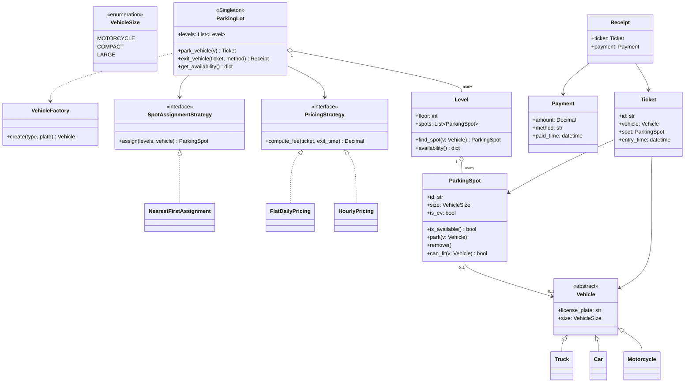

# Parking Lot System — Object-Oriented Design

## Problem & Clarifications

Design a parking lot system. This is an **object-oriented design (OOD)** problem,
so the emphasis is on the *domain model*, *class responsibilities*, and *design
patterns* rather than distributed-systems scaling.

**Clarifying questions to ask the interviewer (and the assumptions I'll make):**

| Question | Assumption for this design |
|---|---|
| Multiple levels/floors? | Yes — the lot has N levels, each with its own set of spots. |
| What vehicle types? | Motorcycle, Car, Truck (extensible). |
| What spot types? | Small, Compact, Large (mapped to vehicle sizes). Plus optional EV spots. |
| Can a vehicle use a larger spot if its own size is full? | Yes — a smaller vehicle may fit a larger spot, never the reverse. |
| Is there payment? | Yes — pay on exit, hourly pricing (pluggable). |
| Multiple entry/exit gates? | Yes — design must support multiple gates (one shared manager). |
| Do we need persistence? | Out of scope for the in-memory model, but I'll sketch a SQL schema. |
| Reservations / monthly passes? | Out of scope (mention as extension). |

**Scope:** in-memory single-process system with a clear path to persistence.
Concurrency is discussed but the reference code uses a single lock for clarity.

---

## Functional Requirements

- Park a vehicle: assign an appropriate available spot and issue a **Ticket**.
- Unpark / exit a vehicle: free the spot, compute the fee, take **Payment**.
- A vehicle occupies the smallest spot that fits it; fall back to a larger spot.
- Track availability per level and per spot type in real time.
- Support multiple vehicle types and multiple spot types.
- Support multiple entry/exit gates sharing one lot.
- Reject parking when the lot (for the required spot size) is full.

## Non-Functional Requirements

- **Extensibility** — add new vehicle types, spot types (EV), or pricing models
  without modifying existing classes (Open/Closed Principle).
- **Correctness/consistency** — no double-allocation of a spot; spot freed exactly
  once on exit.
- **Low latency** — park/exit are O(1)–O(levels) lookups.
- **Thread-safety** — gates operate concurrently; allocation must be atomic.
- **Testability** — strategies and factories are injectable / mockable.

---

## Capacity Estimation (light, for OOD)

A medium commercial garage:

- **Levels:** 5
- **Spots per level:** ~200 → **~1,000 total spots**
  - Mix per level: 20 motorcycle (small), 140 compact, 40 large.
- **Throughput:** peak ~600 entries/hour and ~600 exits/hour across all gates
  → ~10 events/sec. Trivial for an in-memory model; the design choice that
  matters is **atomic allocation** under that concurrency, not raw scale.
- **Memory:** ~1,000 spot objects + a few hundred active tickets. Negligible
  (kilobytes). State fits comfortably in one process.

Conclusion: scale is not the challenge. The challenge is a **clean, extensible
object model** and **safe concurrent allocation**.

---

## API Design

Public methods exposed by the `ParkingLot` manager (the system facade):

```text
park_vehicle(vehicle: Vehicle) -> Ticket
    Finds the best available spot across levels, parks the vehicle,
    returns a Ticket. Raises ParkingFullError if none available.

exit_vehicle(ticket: Ticket, payment_method) -> Receipt
    Frees the spot, computes the fee via the pricing strategy,
    processes payment, returns a Receipt. (a.k.a. unpark)

get_availability() -> dict[VehicleSize, int]
    Returns count of free spots per size across the whole lot.

pay(ticket: Ticket, payment_method) -> Receipt
    (Used internally by exit_vehicle; can also be called at a pay station.)
```

REST mapping (if exposed as a service):

| Action | HTTP |
|---|---|
| park_vehicle | `POST /lots/{id}/tickets` (body: vehicle) → 201 Ticket |
| get_availability | `GET /lots/{id}/availability` |
| pay | `POST /tickets/{ticketId}/payment` |
| exit_vehicle | `POST /tickets/{ticketId}/exit` |

---

## Data Model / Schema

**Domain model (in-memory):**

- `Vehicle` (abstract) → `Motorcycle`, `Car`, `Truck`; each has a `VehicleSize`.
- `ParkingSpot` — has a `VehicleSize` capacity, `is_available`, current vehicle.
- `Level` — owns a list of `ParkingSpot`; finds/frees spots for a size.
- `Ticket` — id, vehicle, spot reference, entry timestamp.
- `Payment` / `Receipt` — fee, method, paid timestamp.
- `ParkingLot` — singleton manager holding levels, pricing & assignment strategies.

**Optional SQL persistence schema** (for tickets/spots durability):

```sql
CREATE TABLE spot (
    id          BIGINT PRIMARY KEY,
    level_id    INT NOT NULL,
    size        VARCHAR(16) NOT NULL,      -- MOTORCYCLE | COMPACT | LARGE
    is_ev       BOOLEAN NOT NULL DEFAULT FALSE,
    occupied    BOOLEAN NOT NULL DEFAULT FALSE
);

CREATE TABLE ticket (
    id           UUID PRIMARY KEY,
    spot_id      BIGINT NOT NULL REFERENCES spot(id),
    license      VARCHAR(16) NOT NULL,
    vehicle_size VARCHAR(16) NOT NULL,
    entry_time   TIMESTAMP NOT NULL,
    exit_time    TIMESTAMP,                -- NULL while parked
    status       VARCHAR(12) NOT NULL      -- ACTIVE | PAID | CLOSED
);

CREATE TABLE payment (
    id          UUID PRIMARY KEY,
    ticket_id   UUID NOT NULL REFERENCES ticket(id),
    amount      NUMERIC(10,2) NOT NULL,
    method      VARCHAR(16) NOT NULL,
    paid_time   TIMESTAMP NOT NULL
);

CREATE INDEX idx_spot_avail ON spot(level_id, size, occupied);
```

---

## High-Level Design



---

## Deep Dives

### 1. Requirements gathering / assumptions for an OOD problem
In OOD interviews the first job is to **bound the problem**. Parking lots can
balloon (reservations, valet, license-plate recognition, dynamic surge pricing).
I lock scope to: multi-level lot, three vehicle/spot sizes, smaller-fits-larger
allocation, pay-on-exit hourly pricing, multiple gates. Everything else
(reservations, monthly passes, ANPR) is explicitly listed as a future extension
so the model is built to *accommodate* them without being *cluttered* by them.

### 2. Class identification (nouns → classes, responsibilities)
Extract nouns from requirements and assign single responsibilities:

- **Vehicle** (and subtypes) — knows its own `size`. Nothing else.
- **ParkingSpot** — knows its size/EV capability and whether it's occupied;
  owns `park`/`remove` and the `can_fit` rule.
- **Level** — a collection of spots; responsible for *searching* its own spots.
- **ParkingLot** — coordinator/facade across levels; owns global operations and
  strategies. (Singleton — one lot manager per process.)
- **Ticket** — immutable record of an active parking session.
- **PricingStrategy** — computes fee (a *policy*, not data).
- **SpotAssignmentStrategy** — decides *which* spot to pick (another *policy*).
- **Payment / Receipt** — value objects for the financial transaction.

Verbs become methods (`park`, `exit`, `find_spot`, `compute_fee`). Policies that
vary independently become **strategy objects**, not `if/else` ladders.

### 3. The class diagram explanation
- `ParkingLot` **aggregates** `Level`s (composition: levels live and die with the
  lot). Each `Level` **aggregates** `ParkingSpot`s.
- A `ParkingSpot` has a 0..1 association to a `Vehicle` (occupied or not).
- `Ticket` references both the `Vehicle` and its `ParkingSpot` so exit is O(1).
- `ParkingLot` *depends on* two **interfaces** — `PricingStrategy` and
  `SpotAssignmentStrategy` — injected at construction. This decouples the manager
  from any specific pricing or allocation algorithm.
- `VehicleFactory` is a dependency used to build `Vehicle` instances from input
  (e.g., a gate scanner sending `"car"` + a plate).

### 4. Design patterns used (where and why)

- **Strategy** — used in *two* places:
  - `PricingStrategy` (`HourlyPricing`, `FlatDailyPricing`): the fee algorithm
    varies by business rule. The lot holds a reference and calls `compute_fee`;
    swapping pricing models is a one-line injection change. **Why:** pricing is
    the most volatile requirement — isolate it behind an interface (Open/Closed).
  - `SpotAssignmentStrategy` (`NearestFirstAssignment`): *which* free spot to give
    (nearest, most-distant, balance-load, prefer-EV-last). **Why:** allocation
    policy changes without touching `Level`/`ParkingLot`.

- **Factory** — `VehicleFactory.create(type, plate)` centralizes object creation
  so callers (gates) don't `import` or branch on concrete vehicle classes.
  **Why:** adding `Bus` means editing only the factory + adding a class; gate code
  is untouched. (A `SpotFactory` could similarly build spots from config.)

- **Singleton** — `ParkingLot` is a singleton: there is exactly **one** physical
  lot manager, and all gates must share the *same* availability state. **Why:**
  multiple gate threads must allocate against one source of truth; two
  `ParkingLot` instances would double-book spots. Implemented via `__new__` guard
  + a `get_instance` classmethod. (In practice, dependency-injecting a single
  instance is often cleaner than a hard Singleton; both are noted in trade-offs.)

### 5. Extensibility
- **New vehicle type** (e.g., Bus = LARGE): add a `Bus(Vehicle)` subclass and a
  factory entry. No changes to spots, levels, or pricing.
- **EV charging spots:** `ParkingSpot.is_ev` already exists; add an
  `EVPricingStrategy` or extend assignment to prefer/avoid EV spots — Strategy
  absorbs it.
- **Multiple pricing models:** implement a new `PricingStrategy` (surge, validated
  parking, free-first-hour). Inject at construction.
- **Multiple gates:** each gate is just a caller of the single `ParkingLot`
  instance; the Singleton + lock guarantee consistency.
- **Reservations / monthly passes:** a future `ReservationStrategy` or a `Pass`
  entity layered on top — the existing classes don't need rewrites.

---

## Bottlenecks & Trade-offs

- **Single global lock vs. fine-grained locking.** The reference code uses one
  `RLock` for atomic allocation — simple and correct, but serializes all park/exit
  calls. At real scale you'd lock per-level or use a concurrent free-list / atomic
  CAS per spot. For ~10 events/sec the global lock is fine.
- **Singleton vs. dependency injection.** Singleton guarantees one source of truth
  but hurts testability (global state) and makes parallel tests awkward. DI of a
  single shared instance achieves the same consistency with better testability.
- **Linear spot search.** `find_spot` scans a level's spots (O(spots)). With
  per-size free queues (a `deque` per `VehicleSize`) it becomes O(1) at the cost of
  more bookkeeping. Shown linear here for clarity.
- **In-memory state.** Fast but volatile — a crash loses active tickets. The SQL
  schema above is the durability path; you'd write-through on park/exit.
- **Smaller-fits-larger fallback** can starve trucks if cars consume large spots.
  Mitigate with a reservation/threshold policy in the assignment strategy.

---

## Code

```python
"""
Parking Lot — runnable OOD reference implementation.
Python 3.10+ . Standard library only.
"""
from __future__ import annotations

import threading
import uuid
from abc import ABC, abstractmethod
from dataclasses import dataclass, field
from datetime import datetime, timedelta
from decimal import Decimal, ROUND_HALF_UP
from enum import IntEnum
from typing import Dict, List, Optional


# --------------------------------------------------------------------------- #
# Enums
# --------------------------------------------------------------------------- #
class VehicleSize(IntEnum):
    """Ordered so that a vehicle fits any spot whose size >= its own."""
    MOTORCYCLE = 1
    COMPACT = 2
    LARGE = 3


# --------------------------------------------------------------------------- #
# Vehicle hierarchy
# --------------------------------------------------------------------------- #
class Vehicle(ABC):
    def __init__(self, license_plate: str) -> None:
        self.license_plate = license_plate

    @property
    @abstractmethod
    def size(self) -> VehicleSize:
        ...

    def __repr__(self) -> str:
        return f"{type(self).__name__}({self.license_plate})"


class Motorcycle(Vehicle):
    @property
    def size(self) -> VehicleSize:
        return VehicleSize.MOTORCYCLE


class Car(Vehicle):
    @property
    def size(self) -> VehicleSize:
        return VehicleSize.COMPACT


class Truck(Vehicle):
    @property
    def size(self) -> VehicleSize:
        return VehicleSize.LARGE


# --------------------------------------------------------------------------- #
# Factory pattern: create vehicles without callers branching on concrete types
# --------------------------------------------------------------------------- #
class VehicleFactory:
    _registry = {
        "motorcycle": Motorcycle,
        "car": Car,
        "truck": Truck,
    }

    @classmethod
    def create(cls, vehicle_type: str, license_plate: str) -> Vehicle:
        key = vehicle_type.lower()
        if key not in cls._registry:
            raise ValueError(f"Unknown vehicle type: {vehicle_type}")
        return cls._registry[key](license_plate)


# --------------------------------------------------------------------------- #
# ParkingSpot
# --------------------------------------------------------------------------- #
class ParkingSpot:
    def __init__(self, spot_id: str, size: VehicleSize, is_ev: bool = False) -> None:
        self.id = spot_id
        self.size = size
        self.is_ev = is_ev
        self._vehicle: Optional[Vehicle] = None

    def is_available(self) -> bool:
        return self._vehicle is None

    def can_fit(self, vehicle: Vehicle) -> bool:
        # A smaller vehicle may use a larger spot, never the reverse.
        return self.is_available() and vehicle.size <= self.size

    def park(self, vehicle: Vehicle) -> None:
        if not self.is_available():
            raise RuntimeError(f"Spot {self.id} already occupied")
        self._vehicle = vehicle

    def remove(self) -> Optional[Vehicle]:
        vehicle, self._vehicle = self._vehicle, None
        return vehicle

    def __repr__(self) -> str:
        state = "free" if self.is_available() else f"used by {self._vehicle}"
        return f"Spot({self.id}, {self.size.name}, {state})"


# --------------------------------------------------------------------------- #
# Level
# --------------------------------------------------------------------------- #
class Level:
    def __init__(self, floor: int, spots: List[ParkingSpot]) -> None:
        self.floor = floor
        self.spots = spots

    def find_spot(self, vehicle: Vehicle) -> Optional[ParkingSpot]:
        """Smallest fitting available spot (best fit) on this level."""
        candidates = [s for s in self.spots if s.can_fit(vehicle)]
        if not candidates:
            return None
        return min(candidates, key=lambda s: s.size)

    def availability(self) -> Dict[VehicleSize, int]:
        counts = {sz: 0 for sz in VehicleSize}
        for spot in self.spots:
            if spot.is_available():
                counts[spot.size] += 1
        return counts


# --------------------------------------------------------------------------- #
# Ticket / Payment / Receipt
# --------------------------------------------------------------------------- #
@dataclass
class Ticket:
    vehicle: Vehicle
    spot: ParkingSpot
    floor: int
    entry_time: datetime
    id: str = field(default_factory=lambda: uuid.uuid4().hex[:8])


@dataclass
class Payment:
    amount: Decimal
    method: str
    paid_time: datetime


@dataclass
class Receipt:
    ticket: Ticket
    payment: Payment
    exit_time: datetime


# --------------------------------------------------------------------------- #
# Strategy pattern: pricing
# --------------------------------------------------------------------------- #
class PricingStrategy(ABC):
    @abstractmethod
    def compute_fee(self, ticket: Ticket, exit_time: datetime) -> Decimal:
        ...


class HourlyPricing(PricingStrategy):
    """Per-size hourly rate, rounding any partial hour up."""

    def __init__(self, rates: Optional[Dict[VehicleSize, Decimal]] = None) -> None:
        self.rates = rates or {
            VehicleSize.MOTORCYCLE: Decimal("1.00"),
            VehicleSize.COMPACT: Decimal("2.50"),
            VehicleSize.LARGE: Decimal("4.00"),
        }

    def compute_fee(self, ticket: Ticket, exit_time: datetime) -> Decimal:
        duration = exit_time - ticket.entry_time
        hours = max(1, -(-int(duration.total_seconds()) // 3600))  # ceil, min 1
        rate = self.rates[ticket.vehicle.size]
        return (rate * hours).quantize(Decimal("0.01"), rounding=ROUND_HALF_UP)


class FlatDailyPricing(PricingStrategy):
    """Flat fee per started 24h period — demonstrates a swappable strategy."""

    def __init__(self, flat: Decimal = Decimal("20.00")) -> None:
        self.flat = flat

    def compute_fee(self, ticket: Ticket, exit_time: datetime) -> Decimal:
        duration = exit_time - ticket.entry_time
        days = max(1, -(-int(duration.total_seconds()) // 86400))
        return (self.flat * days).quantize(Decimal("0.01"), rounding=ROUND_HALF_UP)


# --------------------------------------------------------------------------- #
# Strategy pattern: spot assignment across levels
# --------------------------------------------------------------------------- #
class SpotAssignmentStrategy(ABC):
    @abstractmethod
    def assign(self, levels: List[Level], vehicle: Vehicle):
        ...


class NearestFirstAssignment(SpotAssignmentStrategy):
    """Pick the first (lowest-floor) level with a fitting spot."""

    def assign(self, levels: List[Level], vehicle: Vehicle):
        for level in levels:
            spot = level.find_spot(vehicle)
            if spot is not None:
                return level, spot
        return None, None


# --------------------------------------------------------------------------- #
# Payment processing
# --------------------------------------------------------------------------- #
class PaymentProcessor:
    def charge(self, amount: Decimal, method: str) -> Payment:
        # Real impl would call a payment gateway; here we just succeed.
        return Payment(amount=amount, method=method, paid_time=datetime.now())


# --------------------------------------------------------------------------- #
# Exceptions
# --------------------------------------------------------------------------- #
class ParkingFullError(Exception):
    pass


# --------------------------------------------------------------------------- #
# ParkingLot manager (Singleton + Facade)
# --------------------------------------------------------------------------- #
class ParkingLot:
    _instance: Optional["ParkingLot"] = None
    _singleton_lock = threading.Lock()

    def __new__(cls, *args, **kwargs):
        with cls._singleton_lock:
            if cls._instance is None:
                cls._instance = super().__new__(cls)
        return cls._instance

    def __init__(
        self,
        levels: List[Level],
        pricing: Optional[PricingStrategy] = None,
        assignment: Optional[SpotAssignmentStrategy] = None,
        processor: Optional[PaymentProcessor] = None,
    ) -> None:
        if getattr(self, "_initialized", False):
            return
        self.levels = levels
        self.pricing = pricing or HourlyPricing()
        self.assignment = assignment or NearestFirstAssignment()
        self.processor = processor or PaymentProcessor()
        self._active: Dict[str, Ticket] = {}
        self._lock = threading.RLock()
        self._initialized = True

    @classmethod
    def get_instance(cls) -> "ParkingLot":
        if cls._instance is None:
            raise RuntimeError("ParkingLot not initialized")
        return cls._instance

    @classmethod
    def reset(cls) -> None:
        """Test helper to clear the singleton."""
        cls._instance = None

    # -- public API -------------------------------------------------------- #
    def park_vehicle(self, vehicle: Vehicle) -> Ticket:
        with self._lock:
            level, spot = self.assignment.assign(self.levels, vehicle)
            if spot is None:
                raise ParkingFullError(
                    f"No spot available for {vehicle} ({vehicle.size.name})"
                )
            spot.park(vehicle)
            ticket = Ticket(vehicle=vehicle, spot=spot,
                            floor=level.floor, entry_time=datetime.now())
            self._active[ticket.id] = ticket
            return ticket

    def pay(self, ticket: Ticket, method: str, exit_time: datetime) -> Payment:
        fee = self.pricing.compute_fee(ticket, exit_time)
        return self.processor.charge(fee, method)

    def exit_vehicle(self, ticket: Ticket, method: str = "card") -> Receipt:
        with self._lock:
            if ticket.id not in self._active:
                raise RuntimeError("Unknown or already-closed ticket")
            exit_time = datetime.now()
            payment = self.pay(ticket, method, exit_time)
            ticket.spot.remove()
            del self._active[ticket.id]
            return Receipt(ticket=ticket, payment=payment, exit_time=exit_time)

    def get_availability(self) -> Dict[VehicleSize, int]:
        totals = {sz: 0 for sz in VehicleSize}
        with self._lock:
            for level in self.levels:
                for sz, n in level.availability().items():
                    totals[sz] += n
        return totals


# --------------------------------------------------------------------------- #
# Helpers to build a lot
# --------------------------------------------------------------------------- #
def build_level(floor: int, n_moto: int, n_compact: int, n_large: int) -> Level:
    spots: List[ParkingSpot] = []
    for i in range(n_moto):
        spots.append(ParkingSpot(f"L{floor}-M{i}", VehicleSize.MOTORCYCLE))
    for i in range(n_compact):
        spots.append(ParkingSpot(f"L{floor}-C{i}", VehicleSize.COMPACT))
    for i in range(n_large):
        spots.append(ParkingSpot(f"L{floor}-L{i}", VehicleSize.LARGE,
                                 is_ev=(i == 0)))
    return Level(floor, spots)


# --------------------------------------------------------------------------- #
# Demo
# --------------------------------------------------------------------------- #
def demo() -> None:
    ParkingLot.reset()
    levels = [
        build_level(1, n_moto=1, n_compact=2, n_large=1),
        build_level(2, n_moto=1, n_compact=2, n_large=1),
    ]
    lot = ParkingLot(levels, pricing=HourlyPricing())

    print("Initial availability:", {k.name: v for k, v in lot.get_availability().items()})

    # Park several vehicles via the factory.
    bike = VehicleFactory.create("motorcycle", "MOTO-1")
    car1 = VehicleFactory.create("car", "CAR-1")
    car2 = VehicleFactory.create("car", "CAR-2")
    truck = VehicleFactory.create("truck", "TRUCK-1")

    t_bike = lot.park_vehicle(bike)
    t_car1 = lot.park_vehicle(car1)
    t_car2 = lot.park_vehicle(car2)
    t_truck = lot.park_vehicle(truck)

    for t in (t_bike, t_car1, t_car2, t_truck):
        print(f"Parked {t.vehicle} -> spot {t.spot.id} (floor {t.floor}), ticket {t.id}")

    print("After parking:", {k.name: v for k, v in lot.get_availability().items()})

    # Simulate that car1 entered 2h15m ago, then exit + pay.
    t_car1.entry_time = datetime.now() - timedelta(hours=2, minutes=15)
    receipt = lot.exit_vehicle(t_car1, method="card")
    print(
        f"Exit {receipt.ticket.vehicle}: parked ~2h15m -> "
        f"fee ${receipt.payment.amount} via {receipt.payment.method}"
    )

    print("After one exit:", {k.name: v for k, v in lot.get_availability().items()})

    # Singleton check: the same instance is shared.
    assert ParkingLot.get_instance() is lot
    print("Singleton verified: gates share one ParkingLot instance.")


if __name__ == "__main__":
    demo()
```

**Sample output (timestamps vary):**

```text
Initial availability: {'MOTORCYCLE': 2, 'COMPACT': 4, 'LARGE': 2}
Parked Motorcycle(MOTO-1) -> spot L1-M0 (floor 1), ticket ...
Parked Car(CAR-1) -> spot L1-C0 (floor 1), ticket ...
Parked Car(CAR-2) -> spot L1-C1 (floor 1), ticket ...
Parked Truck(TRUCK-1) -> spot L1-L0 (floor 1), ticket ...
After parking: {'MOTORCYCLE': 1, 'COMPACT': 2, 'LARGE': 1}
Exit Car(CAR-1): parked ~2h15m -> fee $7.50 via card
After one exit: {'MOTORCYCLE': 1, 'COMPACT': 3, 'LARGE': 1}
Singleton verified: gates share one ParkingLot instance.
```

---

## Summary

- The design models the domain with **single-responsibility classes**: `Vehicle`
  hierarchy, `ParkingSpot`, `Level`, `Ticket`, `Payment`/`Receipt`, and a
  `ParkingLot` facade.
- **Three patterns** keep it extensible: **Strategy** for pricing *and* spot
  assignment (the volatile policies), **Factory** for vehicle creation, and
  **Singleton** for the one shared lot manager that all gates allocate against.
- **Smaller-fits-larger** allocation, **best-fit** spot search, and **atomic**
  park/exit under a lock give correct concurrent behavior.
- Adding a vehicle type, an EV/pricing model, or another gate requires *new*
  classes/strategies, not edits to existing ones — Open/Closed in practice.
- Scale is trivial (~1k spots, ~10 events/sec); the real engineering value is the
  clean, testable object model with a clear persistence path (SQL schema provided).
```
